# Capítulo II: Requirements Elicitation & Analysis

En el presente capítulo, el equipo se dedica a investigar y comprender a fondo el contexto operativo y las carencias del sector agroalimentario antes de iniciar el desarrollo tecnológico. Más allá de definir un listado de características del software, aplicamos un riguroso proceso de educción y análisis de requisitos. Esta fase es fundamental para comprobar empíricamente que las problemáticas que SumaqAgro pretende solucionar tienen un impacto genuino en la rentabilidad y gestión diaria de los agricultores y cooperativas peruanas.

## 2.1. Competidores
### 2.1.1. Análisis competitivo

Para asegurar una captura de datos estructurada y de alto valor, se han elaborado guías de indagación personalizadas para cada uno de nuestros segmentos de mercado. Estos instrumentos de investigación están diseñados para descubrir no solo el perfil demográfico, sino también el nivel de madurez digital y los cuellos de botella que enfrentan los usuarios en la actualidad. Previo a la presentación de estas entrevistas, detallamos el panorama competitivo (Landscape) que valida la viabilidad y diferenciación estratégica de SumaqAgro en el ecosistema AgTech.

<table border="1" cellpadding="10" cellspacing="0" style="margin-left: auto; margin-right: auto; font-family: sans-serif; width: 100%;">
  <tr>
    <th colspan="6" style="text-align: center; font-size: 1.2em;">Competitive Analysis Landscape</th>
  </tr>
  <tr>
    <td colspan="2" rowspan="2" style="width: 20%;"><b>¿Por qué llevar a cabo este análisis?</b></td>
    <td colspan="4">¿Cómo se posiciona SumaqAgro frente a sus competidores en cuanto a propuesta de valor, marketing, producto y estrategia?</td>
  </tr>
  <tr>
    <td colspan="4">Es un análisis comparativo que permite identificar fortalezas, debilidades, oportunidades y amenazas, así como entender mejor la posición del producto frente a otros actores relevantes del mercado agrotecnológico.</td>
  </tr>
  <tr>
    <td colspan="2" style="text-align: center;"><b>Competidores</b></td>
    <td style="text-align: center; vertical-align: middle; width: 20%;">
      <b style="display: block; margin-bottom: 6px;">SumaqAgro</b>
      
    </td>
    <td style="text-align: center; vertical-align: middle; width: 20%;">
      <b style="display: block; margin-bottom: 6px;">SpaceAG</b>
      
    </td>
    <td style="text-align: center; vertical-align: middle; width: 20%;">
      <b style="display: block; margin-bottom: 6px;">Kilimo</b>
      
    </td>
    <td style="text-align: center; vertical-align: middle; width: 20%;">
      <b style="display: block; margin-bottom: 6px;">Auravant</b>
      
    </td>
  </tr>
  <tr>
    <td rowspan="2" style="writing-mode: vertical-lr; transform: rotate(180deg); text-align: center; font-weight: bold;">Perfil</td>
    <td><b>Overview</b></td>
    <td>Plataforma Web (Software-only Precision Ag) enfocada en gestión agrícola, monitoreo y calidad digital.</td>
    <td>Solución de Drone & Satellite Analytics centrada en el análisis avanzado de rendimiento.</td>
    <td>Plataforma SaaS de Water Management especializada en la gestión y ahorro de agua.</td>
    <td>Digital Agronomy Ecosystem altamente modular y configurable para agricultura de precisión.</td>
  </tr>
  <tr>
    <td><b>Ventaja competitiva</b></td>
    <td>Monitoreo satelital (NDVI/humedad) libre de sensores físicos en campo, integrando cálculo de costos unitarios y certificación digital de calidad.</td>
    <td>Monitoreo premium de ultra alta resolución (imágenes satelitales + ortofotos por drones) con inteligencia artificial.</td>
    <td>Algoritmos propietarios de balance hídrico que calculan evapotranspiración y monetizan el ahorro de agua.</td>
    <td>Ecosistema abierto con soporte para múltiples capas de información, maquinaria e integraciones de terceros.</td>
  </tr>
  <tr>
    <td rowspan="2" style="writing-mode: vertical-lr; transform: rotate(180deg); text-align: center; font-weight: bold;">Perfil de Marketing</td>
    <td><b>Mercado objetivo</b></td>
    <td>Pequeños/medianos agricultores (papa/café), cooperativas y asesores técnicos independientes en Perú.</td>
    <td>Medianas y grandes corporaciones agroexportadoras de alto valor (arándanos, uva) en la costa peruana.</td>
    <td>Productores medianos/grandes con sistemas de riego tecnificado en regiones con estrés hídrico.</td>
    <td>Empresas agropecuarias de escala extensiva, asesores agronómicos y distribuidores de agroquímicos.</td>
  </tr>
  <tr>
    <td><b>Estrategias de marketing</b></td>
    <td>Penetración B2B2C mediante cooperativas, modelo freemium accesible y alianzas con ONGs de desarrollo rural.</td>
    <td>Ventas B2B corporativas, demostraciones piloto en fundos industriales y presencia en congresos exportadores.</td>
    <td>Programas ESG, marketing de contenidos sobre huella hídrica y alianzas con corporaciones globales.</td>
    <td>Autoservicio SaaS, seminarios web técnicos, certificaciones gratuitas y convenios con marcas de maquinaria.</td>
  </tr>
  <tr>
    <td rowspan="3" style="writing-mode: vertical-lr; transform: rotate(180deg); text-align: center; font-weight: bold;">Perfil de Producto</td>
    <td><b>Productos & Servicios</b></td>
    <td>
      <ul style="margin: 0; padding-left: 15px;">
        <li>Índices NDVI/humedad satelital</li>
        <li>Motor de costos por lote</li>
        <li>Certificados de calidad digital</li>
      </ul>
    </td>
    <td>
      <ul style="margin: 0; padding-left: 15px;">
        <li>Vuelos programados con drones</li>
        <li>Conteo de plantas con IA</li>
        <li>Gestión de personal de cosecha</li>
      </ul>
    </td>
    <td>
      <ul style="margin: 0; padding-left: 15px;">
        <li>Recomendaciones de riego</li>
        <li>Auditoría de ahorro de agua</li>
        <li>Reporte de huella hídrica</li>
      </ul>
    </td>
    <td>
      <ul style="margin: 0; padding-left: 15px;">
        <li>Prescripción variable</li>
        <li>Integración con maquinaria</li>
        <li>Monitoreo satelital multibanda</li>
      </ul>
    </td>
  </tr>
  <tr>
    <td><b>Precios & Costos</b></td>
    <td>Modelo Freemium: Nivel gratuito para pequeños productores y planes escalonados para cooperativas.</td>
    <td>Contratos Enterprise de alto costo (miles de dólares), inaccesibles para el pequeño productor familiar.</td>
    <td>SaaS por hectárea. Requiere riego tecnificado para justificar el retorno de inversión.</td>
    <td>Planes Freemium limitados con saltos agresivos a tiers Premium corporativos por volumen.</td>
  </tr>
  <tr>
    <td><b>Canales de distribución</b></td>
    <td>Plataforma Web responsiva (Angular) optimizada para conexiones móviles 3G/4G rurales.</td>
    <td>App Web de escritorio y Aplicación Móvil nativa para hardware de gama alta.</td>
    <td>App Web y App Móvil de consulta rápida en campo para operarios de riego.</td>
    <td>Plataforma Web integral y Aplicación Móvil multiplataforma para registro de muestras.</td>
  </tr>
  <tr>
    <td rowspan="5" style="writing-mode: vertical-lr; transform: rotate(180deg); text-align: center; font-weight: bold;">Análisis SWOT</td>
  </tr>
  <tr>
    <td><b>Fortalezas</b></td>
    <td>
      <ul style="margin: 0; padding-left: 15px;">
        <li>Sin hardware (100% software).</li>
        <li>Integra analítica, costos y calidad.</li>
        <li>Especialización en papa andina y café.</li>
      </ul>
    </td>
    <td>
      <ul style="margin: 0; padding-left: 15px;">
        <li>Alta resolución con drones.</li>
        <li>Liderazgo en sector exportador costero.</li>
        <li>Fuerza de ventas B2B corporativa.</li>
      </ul>
    </td>
    <td>
      <ul style="margin: 0; padding-left: 15px;">
        <li>Monetización por bonos de carbono.</li>
        <li>Plataforma técnica muy madura.</li>
        <li>Especialización total en recurso hídrico.</li>
      </ul>
    </td>
    <td>
      <ul style="margin: 0; padding-left: 15px;">
        <li>Alta escalabilidad internacional.</li>
        <li>Ecosistema modular mediante Add-ons.</li>
        <li>Robusta integración con hardware/tractores.</li>
      </ul>
    </td>
  </tr>
  <tr>
    <td><b>Debilidades</b></td>
    <td>
      <ul style="margin: 0; padding-left: 15px;">
        <li>Startup nueva en el mercado.</li>
        <li>Dependencia de APIs satelitales externas.</li>
        <li>Ausencia de app móvil nativa (Sprint 1).</li>
      </ul>
    </td>
    <td>
      <ul style="margin: 0; padding-left: 15px;">
        <li>Costos insostenibles para la pequeña escala.</li>
        <li>Ausencia de control financiero/costos.</li>
        <li>Rigidez operativa en sierra/selva.</li>
      </ul>
    </td>
    <td>
      <ul style="margin: 0; padding-left: 15px;">
        <li>Inútil en agricultura de secano (sin riego).</li>
        <li>Ignora el factor fitosanitario/plagas.</li>
        <li>Precios prohibitivos para minifundios.</li>
      </ul>
    </td>
    <td>
      <ul style="margin: 0; padding-left: 15px;">
        <li>Curva de aprendizaje compleja/técnica.</li>
        <li>Baja adecuación a micro-parcelas.</li>
        <li>Sin contabilidad financiera de costos.</li>
      </ul>
    </td>
  </tr>
  <tr>
    <td><b>Oportunidades</b></td>
    <td>
      <ul style="margin: 0; padding-left: 15px;">
        <li>96% de productores sin asistencia formal.</li>
        <li>Normativa de trazabilidad de la UE.</li>
        <li>Creciente conectividad rural.</li>
      </ul>
    </td>
    <td>
      <ul style="margin: 0; padding-left: 15px;">
        <li>Venta de big data a aseguradoras.</li>
        <li>Expansión a corporaciones regionales.</li>
        <li>Integración con robótica agrícola.</li>
      </ul>
    </td>
    <td>
      <ul style="margin: 0; padding-left: 15px;">
        <li>Crisis climática y escasez de agua.</li>
        <li>Financiamiento ESG corporativo.</li>
        <li>Nuevos bonos de sostenibilidad global.</li>
      </ul>
    </td>
    <td>
      <ul style="margin: 0; padding-left: 15px;">
        <li>Socio técnico de marcas de tractores.</li>
        <li>Alineamiento con catastro público.</li>
        <li>Modelo "marca blanca" para agrónomos.</li>
      </ul>
    </td>
  </tr>
  <tr>
    <td><b>Amenazas</b></td>
    <td>
      <ul style="margin: 0; padding-left: 15px;">
        <li>Fuerte resistencia al cambio digital.</li>
        <li>Extrema nubosidad en la sierra que limite visión de satélites.</li>
        <li>Clonación de modelo por empresas grandes.</li>
      </ul>
    </td>
    <td>
      <ul style="margin: 0; padding-left: 15px;">
        <li>Crisis de precios en la agroexportación.</li>
        <li>Regulaciones estrictas de vuelo de drones.</li>
        <li>Saturación del mercado corporativo.</li>
      </ul>
    </td>
    <td>
      <ul style="margin: 0; padding-left: 15px;">
        <li>Precipitaciones excesivas temporales.</li>
        <li>Sensores físicos IoT a precios de dumping.</li>
        <li>Caída en cotización de bonos hídricos.</li>
      </ul>
    </td>
    <td>
      <ul style="margin: 0; padding-left: 15px;">
        <li>Competencia de gigantes (Bayer FieldView).</li>
        <li>Interrupciones en constelaciones satelitales gratuitas.</li>
      </ul>
    </td>
  </tr>
</table>

### 2.1.2. Estrategias y tácticas frente a competidores

Una vez identificados los actores del mercado, el siguiente paso es definir cómo SumaqAgro se abrirá paso entre ellos. No basta con conocer a la competencia; necesitamos un plan de acción que aproveche nuestras ventajas y blinde nuestras debilidades. Para lograrlo, utilizamos la Matriz CAME, una herramienta que nos permite "traducir" el análisis FODA previo en decisiones estratégicas reales.

A través de este análisis, establecemos tácticas ofensivas para explotar nuestra especialización en el mercado peruano agro-exportador (papa y café), y acciones de supervivencia para mitigar los riesgos de ser una startup emergente. Este enfoque asegura que cada funcionalidad que codifiquemos cumpla un propósito estratégico en el mercado.

**Matriz CAME para el desarrollo de estrategias basándonos en el análisis FODA**

<table border="1" cellpadding="8" cellspacing="0" style="width: 100%; border-collapse: collapse; font-family: sans-serif;">
  <tr>
    <th style="text-align: left; width: 30%;">Análisis FODA cruzado</th>
    <th style="text-align: left; width: 35%;">Oportunidades (O)</th>
    <th style="text-align: left; width: 35%;">Amenazas (A)</th>
  </tr>
  <tr>
    <td>
      <b>Fortalezas (F)</b>  
      1. Independencia total de hardware en campo (software-only). 
      2. Plataforma unificada: analítica satelital, costos por lote y certificación en una sola herramienta. 
      3. Arquitectura web ligera optimizada para zonas de baja conectividad (3G). 
      4. Localización absoluta orientada al productor andino (papa) y de selva alta (café).
    </td>
    <td>
      <b>Estrategia (FO) — Estrategias Ofensivas</b>  
      1. Promover el generador de certificados digitales de calidad como la solución accesible para cumplir con las nuevas normativas de trazabilidad exportadora de la UE (F2, O2). 
      2. Afianzar el modelo de distribución B2B2C vendiendo el motor de costos a directivos de cooperativas, capturando masivamente a agricultores desatendidos técnicamente (F1, O4). 
      3. Ejecutar campañas de marketing resaltando la ligereza de la web app frente a las plataformas de la competencia, que requieren descargas pesadas o computadoras de gama alta (F3, O3).
    </td>
    <td>
      <b>Estrategia (FA) — Estrategias Defensivas</b>  
      1. Desplegar agresivamente el plan Freemium, permitiendo usar el satélite sin costo para 1 lote, derribando la barrera de desconfianza y resistencia al cambio rural (F1, A1). 
      2. Reforzar la propuesta de valor centrada en parámetros ultra-locales (alertas de gorgojo/roya, calibres del MIDAGRI) para blindar el mercado frente a la llegada de plataformas internacionales genéricas (F4, A3). 
      3. Implementar un módulo educativo offline en la app para capacitar sobre el valor real de digitalizar los cuadernos de campo (F2, A1).
    </td>
  </tr>
  <tr>
    <td>
      <b>Debilidades (D)</b>  
      1. Marca emergente con presupuesto comercial limitado frente a transnacionales. 
      2. Dependencia tecnológica de APIs satelitales externas. 
      3. Ausencia de aplicación móvil nativa (solo web responsiva en etapas iniciales). 
      4. Brecha inicial de datos históricos del cultivo.
    </td>
    <td>
      <b>Estrategia (DO) — Reorientación</b>  
      1. Aprovechar a las cooperativas agrícolas como un "caballo de Troya" comercial para diluir el costo de adquisición de usuarios individuales, compensando el bajo presupuesto de marketing (D1, O4). 
      2. Mitigar la falta de aplicación nativa implementando tecnologías de almacenamiento en caché en la Web App (Angular), permitiendo registro de jornales offline en la sierra (D3, O3). 
      3. Utilizar las pruebas Lean UX tempranas para generar casos de éxito y testimonios publicables que doten de autoridad y validen la herramienta frente a nuevos socios (D1, O1).
    </td>
    <td>
      <b>Estrategia (DA) — Supervivencia</b>  
      1. Diseñar el backend (Spring Boot) con un patrón de adaptador (Adapter Pattern) que soporte a múltiples proveedores de imágenes satelitales como respaldo (fallback) en caso de que una API externa falle o cambie su política gratuita (D2, A4). 
      2. Proteger agresivamente el núcleo financiero (motor de costos) como propuesta irreemplazable, ya que incluso si hay nubosidad severa que bloquee satélites, el productor siga dependiendo de la contabilidad (D2, A2). 
      3. Evitar entrar a una guerra de precios directos. Posicionar la plataforma exclusivamente por su valor integrado hasta ganar madurez de datos e ingresos (D1, A3).
    </td>
  </tr>
</table>

## 2.2. Entrevistas
### 2.2.1. Diseño de entrevistas
Para garantizar un proceso de investigación de usuarios (*User Research*) riguroso y estructurado, hemos diseñado guías de entrevista semiestructuradas divididas en dos grandes bloques. El primero recopila datos demográficos y de contexto digital aplicables a cualquier entrevistado; el segundo aborda preguntas específicas y profundas adaptadas a los dolores, responsabilidades y dinámicas operativas de cada segmento objetivo.

#### Bloque 1: Preguntas Generales 

Este cuestionario inicial estandariza la recolección de metadatos demográficos clave y evalúa la madurez digital base de los usuarios en su entorno habitual:
1. **Identificación básica:** ¿Cuál es su nombre completo, su edad y a qué se dedica principalmente en el día a día?
2. **Contexto geográfico:** ¿En qué distrito o localidad vive actualmente, y en qué zonas específicas se encuentran sus campos de cultivo u oficinas administrativas?
3. **Trayectoria:** ¿Cuántos años de experiencia tiene trabajando en el sector agrícola (ya sea en campo, gestión o asesoría)?
4. **Acceso tecnológico:** ¿Qué tipo de teléfono celular utiliza diariamente (marca/gama) y qué aplicaciones (como WhatsApp, Facebook, banca móvil) abre con mayor frecuencia?
5. **Conectividad en campo:** ¿Cómo describiría la señal de internet o datos móviles cuando se encuentra trabajando en sus parcelas o rutas habituales?

#### Bloque 2: Preguntas Específicas por Segmento Objetivo

#### 1. Pequeños y medianos agricultores independientes de papa y café:
- ¿Cómo decide qué precio inicial pedir por su cosecha antes de negociar con el acopiador o intermediario?
- ¿Alguna vez ha perdido gran parte de su cultivo por una helada o sequía, y cómo calculó la cantidad exacta de dinero que perdió?
- ¿Qué tan seguido tiene señal estable de internet o datos en su teléfono móvil mientras se encuentra trabajando dentro de su parcela?
- Si una herramienta en su celular le enviara alertas sobre su cultivo, ¿la utilizaría usted mismo o dependería de un familiar más joven para revisarla?
- ¿De dónde obtiene normalmente el financiamiento o los préstamos para comprar los fertilizantes al inicio de la campaña?

#### 2. Productores organizados y directivos de cooperativas agrícolas:
- ¿Qué canales o métodos utilizan actualmente para advertir de forma masiva y rápida a todos sus socios cuando hay una amenaza climática regional?
- ¿Cómo incentivan o penalizan económicamente a los productores basándose en la evaluación de calidad (calibre o perfil de taza) al momento del acopio?
- ¿Cuál consideran que es la mayor barrera (cultural, económica o de infraestructura) para que sus socios dejen de usar papel y adopten registros digitales?
- ¿Qué porcentaje de sus exportaciones o ventas mayoristas ha sido rechazado o castigado en precio en el último año debido a problemas de trazabilidad?
- ¿Estaría la cooperativa dispuesta a asumir el costo de una plataforma tecnológica si esta garantiza reducir el tiempo de las auditorías de certificación?

#### 3. Ingenieros agrónomos y asesores técnicos de campo:
- ¿Cuál es el límite máximo de hectáreas o productores que un solo asesor puede supervisar eficientemente con los métodos tradicionales actuales?
- ¿Qué aplicaciones genéricas (WhatsApp, Excel, Google Maps) o herramientas digitales utiliza hoy en día para intentar organizar y documentar su trabajo diario?
- ¿Cómo reporta o demuestra a la gerencia de la cooperativa que sus visitas preventivas realmente salvaron parte del rendimiento de un lote?
- ¿Qué recomendación técnica o de manejo de plagas le resulta más difícil que el agricultor empírico aplique correctamente?
- Cuando visita un campo después de un evento climático extremo, ¿cómo estima visualmente el porcentaje de daño o estrés hídrico para emitir un informe?

### 2.2.2. Registro de entrevistas

**Segmento 1: Pequeños y medianos agricultores independientes de papa y café**

<table border="1" cellpadding="8" cellspacing="0" style="width: 100%; border-collapse: collapse;">
  <tr><th colspan="2" style="text-align: left;">Entrevista #1</th></tr>
  <tr><td>Nombre</td><td> Mateo Sebastián </td></tr>
  <tr><td>Apellidos</td><td> Flores Huamán </td></tr>
  <tr><td>Edad</td><td> 26 </td></tr>
  <tr><td>Distrito</td><td> Huancayo - Junín </td></tr>
  <tr><td>Evidencia</td><td></td></tr>
  <tr><td>Link</td><td> link </td></tr>
  <tr><td>Timing donde inicia la entrevista</td><td> 0:50 min </td></tr>
  <tr><td>Duración de la entrevista</td><td> 7:22min </td></tr>
  <tr><td>Resumen</td><td>El entrevistado es Mateo Sebastián Flores Huamán, un joven agricultor y técnico agrícola de 26 años residente en la ciudad de Huancayo, Junín, que coadministra junto a su padre parcelas familiares de papa ubicadas en Chupaca y de café en Satipo. A lo largo de la entrevista, manifiesta que enfrentan pérdidas agrícolas severas causadas principalmente por heladas en la papa y plagas en el café, las cuales calcula registrando insumos, semillas y jornales en herramientas digitales básicas para determinar sus costos exactos de producción y pérdidas financieras. Revela además que los precios de venta suelen ser influenciados por acopiadores e intermediarios, por lo que busca respaldar el valor de su cosecha con información precisa y canales de comercialización más directos, evitando créditos desfavorables mediante el uso de Agrobanco, Cajas Municipales y reinversión propia.  
<b>Comportamiento y necesidades:</b>
  <ul>
    <li><b>Gestión y control de costos:</b> Coadministra las parcelas familiares llevando un registro digital de fertilizantes, semillas y horas de trabajo para calcular el costo real de producción por kilo/quintal y evitar vender a pérdida.</li>
    <li><b>Negociación y financiamiento:</b> Consulta precios de referencia en el Mercado Mayorista de Lima por internet y grupos de WhatsApp, financiándose mediante crédito agrícola formal (Agrobanco, cajas municipales) o reinversión propia para no depender de tiendas comerciales.</li>
    <li><b>Soporte técnico y prevención:</b> Requiere monitorear tempranamente amenazas climáticas (heladas en papa y plagas en café) mediante alertas satelitales sin inversión en hardware costoso, además de herramientas que validen la calidad de su producción.</li>
    <li><b>Registro fuera de línea:</b> Necesita registrar insumos, labores y datos de campo sin depender de una conexión a internet activa o continua debido a la señal inestable o nula en las parcelas, sincronizando la información al retornar a la ciudad.</li>
  </ul> 
  <b>Tecnología, marcas y canales:</b>
  <ul>
    <li><b>Dispositivos habituales:</b> Teléfono inteligente de gama media (Xiaomi Redmi Note) valorando el rendimiento y la utilidad de las herramientas para la gestión diaria.</li>
    <li><b>Canales actuales:</b> WhatsApp para coordinaciones comerciales con fletes y compradores, aplicaciones bancarias y de pago (Yape, BCP), redes sociales (Facebook, Instagram) y aplicaciones meteorológicas (AccuWeather).</li>
    <li><b>Conectividad:</b> Cobertura móvil inestable e intermitente en las parcelas de Chupaca y Satipo (con caída a 3G/Edge o pérdida total de señal), dependiendo de la sincronización nocturna al retornar a Huancayo.</li>
    <li><b>Disposición tecnológica:</b> Alta apertura para adoptar plataformas móviles agrícolas y actuar como puente tecnológico generacional para capacitar y apoyar a sus familiares mayores.</li>
  </ul>
  </td></tr>
</table>

<table border="1" cellpadding="8" cellspacing="0" style="width: 100%; border-collapse: collapse;">
  <tr><th colspan="2" style="text-align: left;">Entrevista #2</th></tr>
  <tr><td>Nombre</td><td> Joaquin Armando </td></tr>
  <tr><td>Apellidos</td><td> Gutierrez Quispe </td></tr>
  <tr><td>Edad</td><td> 21 </td></tr>
  <tr><td>Distrito</td><td> Quillabamba - Cusco </td></tr>
  <tr><td>Evidencia</td><td>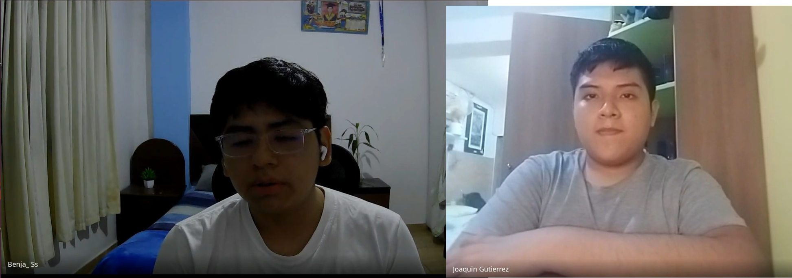</td></tr>
  <tr><td>Link</td><td> link </td></tr>
  <tr><td>Timing donde inicia la entrevista</td><td> 00:00 min</td></tr>
  <tr><td>Duración de la entrevista</td><td> 08:30 min</td></tr>
  <tr><td>Resumen</td><td> El entrevistado es un joven agricultor de café de 21 años residente en Quillabamba, Cusco, que trabaja conjuntamente con su padre en una parcela familiar ubicada en Maranura y complementa sus ingresos haciendo servicio de mototaxi. A lo largo de la entrevista, manifiesta que enfrentan pérdidas agrícolas severas debido a sequías y plagas como la roya, las cuales calculan de forma empírica y volumétrica sin un registro detallado de costos operativos o de inversión en insumos. Revela además que los precios de venta son fijados arbitrariamente por acopiadores e intermediarios al carecer de certificaciones formales de calidad en origen, y que la obtención de créditos resulta lenta o condicionante. Frente a este panorama, muestra una alta receptividad para adoptar la plataforma Dymbia como un puente tecnológico generacional en apoyo a su padre, remarcando que la inestabilidad de la señal celular en el campo hace indispensable que la herramienta permita el registro de datos en modo fuera de línea para su posterior sincronización.   
  <b>Comportamiento y necesidades:</b>
  <ul>
    <li><b>Gestión empírica y tradicional:</b> Coadministra la parcela con su padre estimando pérdidas únicamente por volumen de sacos cosechados, omitiendo costos operativos hundidos.</li>
    <li><b>Negociación y financiamiento:</b> Consulta precios en radio local o WhatsApp, dependiendo de créditos bancarios lentos o adelantos de intermediarios que imponen precios de venta desfavorables.</li>
    <li><b>Soporte técnico y calidad:</b> Requiere monitorear tempranamente sequías y enfermedades (roya) sin hardware costoso, además de un certificado digital de calidad para defender un precio justo ante el comprador.</li>
    <li><b>Registro fuera de línea:</b> Necesita registrar datos de campo sin depender de una conexión a internet activa o continua debido a la señal inestable.</li>
  </ul> 
  <b>Tecnología, marcas y canales:</b>
  <ul>
    <li><b>Dispositivos habituales:</b> Teléfono inteligente (Samsung Galaxy A14) valorando la autonomía de la batería para jornadas en campo.</li>
    <li><b>Canales actuales:</b> WhatsApp para coordinaciones comerciales con fletes y compradores, Yape para pagos/cobros rápidos y redes sociales (Facebook e Instagram).</li>
    <li><b>Conectividad:</b> Cobertura móvil inestable e intermitente en la parcela (Claro y Bitel), con pérdida total de señal en quebradas, dependiendo de la sincronización nocturna al retornar a Quillabamba.</li>
    <li><b>Disposición tecnológica:</b> Alta apertura para adoptar la plataforma móvil y actuar como puente tecnológico generacional para su padre.</li>
  </ul>
  </td></tr>
</table>

<table border="1" cellpadding="8" cellspacing="0" style="width: 100%; border-collapse: collapse;">
  <tr><th colspan="2" style="text-align: left;">Entrevista #3</th></tr>
  <tr><td>Nombre</td><td> name </td></tr>
  <tr><td>Apellidos</td><td> apellido </td></tr>
  <tr><td>Edad</td><td>  </td></tr>
  <tr><td>Distrito</td><td> distrito </td></tr>
  <tr><td>Evidencia</td><td></td></tr>
  <tr><td>Link</td><td> link </td></tr>
  <tr><td>Timing donde inicia la entrevista</td><td> min</td></tr>
  <tr><td>Duración de la entrevista</td><td> min</td></tr>
  <tr><td>Resumen</td><td>  .  
  <b>Comportamiento y necesidades:</b>
  .  
  <b>Tecnología, marcas y canales:</b>
  .</td></tr>
</table>

**Segmento 2:  Productores organizados y directivos de cooperativas agrícolas**

<table border="1" cellpadding="8" cellspacing="0" style="width: 100%; border-collapse: collapse;">
  <tr><th colspan="2" style="text-align: left;">Entrevista #1</th></tr>
  <tr><td>Nombre</td><td> Alex </td></tr>
  <tr><td>Apellidos</td><td> Nina Condori </td></tr>
  <tr><td>Edad</td><td> 28 </td></tr>
  <tr><td>Distrito</td><td> Ocongate - Cusco </td></tr>
  <tr><td>Evidencia</td><td>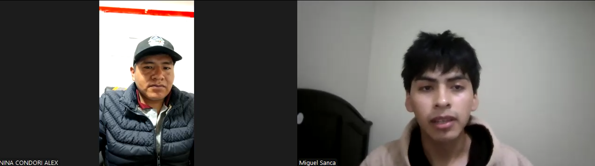</td></tr>
  <tr><td>Link</td><td> link </td></tr>
  <tr><td>Timing donde inicia la entrevista</td><td> 00:30 min</td></tr>
  <tr><td>Duración de la entrevista</td><td> 06:19 min</td></tr>
  <tr><td>Resumen</td><td> El entrevistado se desempeña como gerente de operaciones de productos agrícolas en un distrito de Cusco. Señaló que actualmente coordinan avisos y alertas mediante grupos de WhatsApp y radioemisoras provinciales, pero estas vías se ven severamente afectadas por factores climáticos, por lo que requieren canales más directos y estables. En la fase de acopio, aplican muestreos aleatorios y catación en laboratorio; bonifican económicamente los lotes que cumplen con altos estándares de calidad y penalizan castigando el precio a los lotes deficientes. Respecto a la adopción digital, indicó que la principal barrera es cultural y etaria, ya que la mayoría de los socios son adultos mayores habituados a registros en papel físico. En materia comercial y de exportación, afirmó no haber tenido rechazos físicos ni devoluciones de carga, aunque sí enfrentan trabas y observaciones administrativas con SUNAT y normativas internacionales de destino. Finalmente, expresó una alta disposición y necesidad de adoptar una plataforma digital móvil para agilizar los controles de calidad y reemplazar las libretas físicas, haciendo énfasis en brindar capacitación a los socios para garantizar su adopción.   
  <b>Comportamiento y necesidades:</b>
  <ul>
    <li><b>Alertas climáticas directas:</b> Requiere un canal confiable para recibir avisos de heladas y sequías que no dependa de radioemisoras locales vulnerables al clima.</li>
    <li><b>Transparencia en el acopio:</b> Necesita digitalizar los muestreos de calidad (calibre y catación) para justificar de forma objetiva las bonificaciones o penalizaciones de pago.</li>
    <li><b>Facilidad de uso y capacitación:</b> Demanda una interfaz intuitiva con acompañamiento técnico para reducir la resistencia al cambio en productores habituados al papel.</li>
  </ul> 
  <b>Tecnología, marcas y canales:</b>
  <ul>
    <li><b>Canales actuales:</b> WhatsApp para coordinación virtual y radioemisoras provinciales para avisos masivos.</li>
    <li><b>Dispositivos habituales:</b> Teléfono inteligente (smartphone).</li>
    <li><b>Registro actual:</b> Notas y libretas físicas de campo por parte de los socios.</li>
    <li><b>Disposición tecnológica:</b> Alta apertura hacia una plataforma móvil que agilice los controles de calidad y simplifique las auditorías.</li>
  </ul>
  </td></tr>
</table>

<table border="1" cellpadding="8" cellspacing="0" style="width: 100%; border-collapse: collapse;">
  <tr><th colspan="2" style="text-align: left;">Entrevista #2</th></tr>
  <tr><td>Nombre</td><td> Caleb </td></tr>
  <tr><td>Apellidos</td><td> Quispe </td></tr>
  <tr><td>Edad</td><td> 27 </td></tr>
  <tr><td>Distrito</td><td> Arequipa - San Martin </td></tr>
  <tr><td>Evidencia</td><td>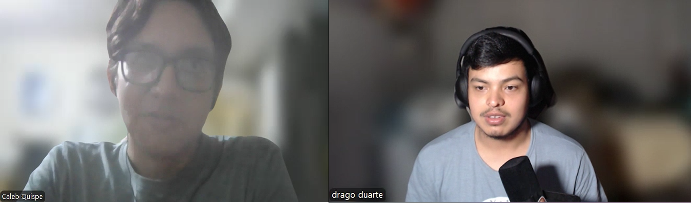</td></tr>
  <tr><td>Link</td><td> link </td></tr>
  <tr><td>Timing donde inicia la entrevista</td><td> min</td></tr>
  <tr><td>Duración de la entrevista</td><td> min</td></tr>
  <tr><td>Resumen</td><td> El entrevistado, se desempeña como gerente de una cooperativa agrícola en el distrito de San Martín de las Cumbres, Arequipa. Representa a 300 socios y tiene como prioridad asegurar su rentabilidad. Señaló que actualmente advierten sobre amenazas climáticas mediante grupos de WhatsApp, recurriendo a SMS, radio local y técnicos de campo para las zonas altas sin internet, aunque con el riesgo de que la alerta llegue tarde. Durante el acopio, bonifican económicamente por quintal a quienes superan estándares de calidad y penalizan a los deficientes pagándoles el precio mínimo del mercado convencional, lo que les hace perder los beneficios cooperativos. Respecto a la digitalización, indicó que la principal barrera es cultural, dado que la mayoría de los socios superan los 50 años, temen equivocarse en el celular y prefieren su cuaderno físico; a esto se suma la falta de conectividad en las chacras. En el ámbito comercial, cerca del 10% de sus ventas sufre castigos en el precio debido a cuadernos de campo incompletos, lo que ocasiona la pérdida de sellos de certificación (como el Orgánico). Finalmente, expresó una total disposición para que la cooperativa asuma económicamente una plataforma tecnológica como gasto operativo, siempre que esta reduzca las semanas de papeleo previas a las auditorías y garantice la conservación de las primas económicas.   
  <b>Comportamiento y necesidades:</b>
   
- Alertas climáticas oportunas: Requiere un sistema de comunicación que evite los retrasos actuales al notificar a las zonas más altas y desconectadas de internet.
- Protección de certificaciones: Necesita asegurar que los datos de trazabilidad estén completos para mantener sellos orgánicos y evitar el castigo en el precio de sus lotes.
- Eficiencia administrativa: Demanda reducir drásticamente las semanas de papeleo manual que actualmente exigen las auditorías.
- Accesibilidad e inclusión digital: Necesita herramientas muy intuitivas que superen la desconfianza tecnológica de los productores mayores de 50 años y que puedan operar en fincas sin cobertura..  
<b>Tecnología, marcas y canales:</b>

- Canales actuales: WhatsApp, mensajes de texto (SMS), radio local en las madrugadas y visitas presenciales de técnicos de campo.
- Dispositivos habituales: Teléfonos inteligentes (smartphones) en zonas conectadas y celulares básicos o radios en zonas remotas.
- Registro actual: Cuadernos físicos de campo y papeleo manual.
- Disposición tecnológica: Muy alta y con respaldo de inversión; perciben la adopción de una plataforma como un gasto operativo justificable que "se paga solo" al salvar las primas de certificación y agilizar el trabajo.</td></tr>
</table>

<table border="1" cellpadding="8" cellspacing="0" style="width: 100%; border-collapse: collapse;">
  <tr><th colspan="2" style="text-align: left;">Entrevista #3</th></tr>
  <tr><td>Nombre</td><td> Cristo Valentino </td></tr>
  <tr><td>Apellidos</td><td> Aquise Chauca </td></tr>
  <tr><td>Edad</td><td> 27 </td></tr>
  <tr><td>Distrito</td><td> San Antonio - Cañete </td></tr>
  <tr><td>Evidencia</td><td></td></tr>
  <tr><td>Link</td><td> link </td></tr>
  <tr><td>Timing donde inicia la entrevista</td><td> </td></tr>
  <tr><td>Duración de la entrevista</td><td> </td></tr>
  <tr><td>Resumen</td><td> El participante es un socio de 27 años radicado en el distrito de San Antonio (Cañete) e integrado en una organización cooperativa. Indicó que la transmisión de advertencias por eventos climáticos adversos se efectúa a través de chats zonales en WhatsApp y contacto directo telefónico a representantes de sector, contrarrestando la deficiente cobertura en parcelas. Durante la etapa de recepción del grano, ejecutan pruebas técnicas para ajustar tarifas con castigos económicos ante excesos de humedad o fallas, e incentivos financieros respaldados por clientes internacionales para perfiles de taza destacados. Sobre el seguimiento del producto, reveló que un 10% de las cargas destinadas al mercado exterior experimentó demoras por vacíos de datos de origen. Catalogó el apego a cuadernos físicos como el obstáculo determinante para la migración digital, agravado por la edad avanzada de varios miembros. Por último, ratificó el compromiso financiero del gremio para costear un sistema digital siempre que simplifique los procesos de fiscalización y auditoría anual.   
  <b>Comportamiento y necesidades:</b>
  <ul>
    <li><b>Flujo contingente de avisos:</b> Precisa un mecanismo ágil para distribuir alertas por inclemencias o plagas vía WhatsApp y contactos clave de zona, sorteando la falta de conectividad continua en los campos.</li>
    <li><b>Criterios objetivos en liquidaciones:</b> Busca respaldar las deducciones de precio por imperfecciones y los premios económicos mediante análisis de laboratorio al momento del pesaje.</li>
    <li><b>Agilización de certificaciones:</b> Requiere migrar los registros manuscritos a un formato digital para asegurar la trazabilidad comercial y aminorar la carga operativa durante las auditorías formales.</li>
  </ul> 
  <b>Tecnología, marcas y canales:</b>
  <ul>
    <li><b>Canales actuales:</b> Comunidades temáticas en WhatsApp divididas regionalmente y comunicaciones móviles directas con enlaces sectoriales.</li>
    <li><b>Registro actual y barreras:</b> Inclinación hacia libretas de papel por arraigo cultural, sensación de resguardo físico y dificultades de adaptabilidad tecnológica en afiliados mayores.</li>
    <li><b>Disposición tecnológica:</b> Disposición favorable del grupo para asumir la suscripción de un software portátil si mitiga la inversión de tiempo en trámites de certificación.</li>
  </ul>
  </td></tr>
</table>

**Segmento 3: Ingenieros agrónomos y asesores técnicos de campo**

<table border="1" cellpadding="8" cellspacing="0" style="width: 100%; border-collapse: collapse;">
  <tr><th colspan="2" style="text-align: left;">Entrevista #1</th></tr>
  <tr><td>Nombre</td><td> Erly </td></tr>
  <tr><td>Apellidos</td><td> Mapelli </td></tr>
  <tr><td>Edad</td><td> 50 </td></tr>
  <tr><td>Distrito</td><td> Pasco - Oxapampa </td></tr>
  <tr><td>Evidencia</td><td>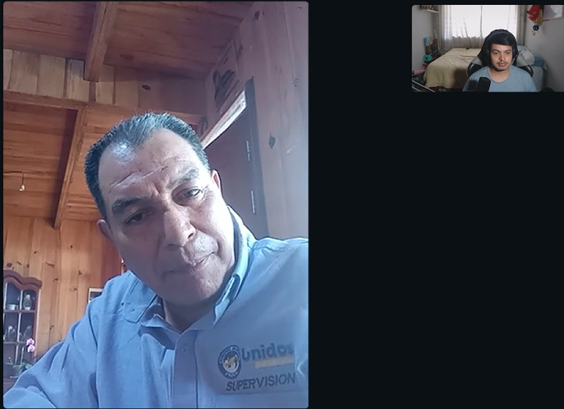</td></tr>
  <tr><td>Link</td><td> link </td></tr>
  <tr><td>Timing donde inicia la entrevista</td><td> min</td></tr>
  <tr><td>Duración de la entrevista</td><td> min</td></tr>
  <tr><td>Resumen</td><td>El entrevistado es un ingeniero agrónomo de Oxapampa (egresado de la UNDAC) con experiencia en asistencia técnica para cultivos perennes como café, palto y granadilla en zonas de selva central como Pozuzo. Destaca que la topografía abrupta, las quebradas y el clima lluvioso reducen la capacidad operativa real de un asesor a un rango de entre 15 y 25 productores mensuales para mantener visitas continuas (mínimo cada 30 días). Enfatiza la dificultad de erradicar el hábito empírico de fumigar por calendario sin presencia real de plagas, y señala que la evaluación de daños climáticos se realiza de forma manual y visual mediante recorridos en patrones (X, M, Z). Valora el uso de herramientas digitales básicas para coordinar y dosificar, destacando la georreferenciación vinculada al Padrón de Productores Agrarios (PPA).  
  <b>Comportamiento y necesidades:</b>
 
- Capacidad operativa condicionada: La cobertura técnica efectiva cae a 15–25 productores al mes debido a caminatas de hasta 3 horas por quebradas y demoras por lluvias intensas.
- Justificación de impacto por contraste: Demuestra el valor de su asesoría comparando visualmente parcelas de productores que acataron las pautas técnicas frente a los que no las aplicaron.
- Resistencia al cambio en fitosanidad: Enfrenta la costumbre del productor de aplicar agroquímicos de forma fija por calendario (cada 8–10 días) sin leer etiquetas ni verificar síntomas previos.
- Evaluación visual de siniestros: Requiere recorrer físicamente toda el área en patrones (X, M, Z) para estimar daños por heladas, lluvias o sequías según la etapa fenológica del cultivo.  
  <b>Tecnología, marcas y canales:</b>

- Dispositivos y apps genéricas: Emplea WhatsApp como canal primario de contacto directo con los agricultores que cuentan con señal o wifi en sus localidades.
- Herramientas de cálculo: Utiliza hojas de cálculo en Excel para estructurar y entregar tablas de dosificación nutricional foliar y edáfica.
- Sistemas de información geográfica: Se apoya en Google Maps y resalta la georreferenciación de parcelas ligada al Padrón de Productores Agrarios (PPA).
- Entorno de conectividad: Cobertura de red presente en caseríos, pero nula o restringida en quebradas y áreas de tránsito a pie.</td></tr>
</table>

<table border="1" cellpadding="8" cellspacing="0" style="width: 100%; border-collapse: collapse;">
  <tr><th colspan="2" style="text-align: left;">Entrevista #2</th></tr>
  <tr><td>Nombre</td><td> Eddy Alberto </td></tr>
  <tr><td>Apellidos</td><td> Torres Martinez </td></tr>
  <tr><td>Edad</td><td> 30 </td></tr>
  <tr><td>Distrito</td><td> Mala - Cañete </td></tr>
  <tr><td>Evidencia</td><td>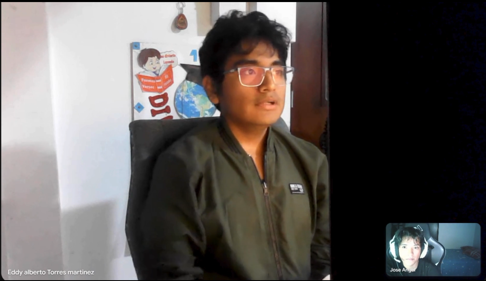</td></tr>
  <tr><td>Link</td><td> link </td></tr>
  <tr><td>Timing donde inicia la entrevista</td><td> </td></tr>
  <tr><td>Duración de la entrevista</td><td> </td></tr>
  <tr><td>Resumen</td><td> El entrevistado es un asesor técnico de 30 años radicado en el distrito de Mala (Cañete), perteneciente al segmento de ingenieros agrónomos y especialistas de campo. Explicó que el tope máximo de atención personalizada se sitúa entre 35 y 40 agricultores por mes debido a la dispersión geográfica y al diligenciamiento manual de informes. En su rutina diaria emplea herramientas genéricas desarticuladas como WhatsApp, planillas de Excel y marcaciones en Google Maps para rastrear predios. Manifestó que sustentar el retorno de inversión de la asistencia presencial ante las directivas resulta complejo, dependiendo de comparativas de rendimiento o evidencias fotográficas postratamiento. Destacó que el principal reto en campo radica en erradicar la sobreaplicación de insumos agroquímicos por parte del productor empírico. Finalmente, advirtió que las evaluaciones de siniestros climáticos se efectúan mediante inspecciones en zigzag totalmente subjetivas, lo que deriva en diagnósticos tardíos o imprecisos del daño radicular e hídrico.   
  <b>Comportamiento y necesidades:</b>
  <ul>
    <li><b>Escalabilidad en asistencia de campo:</b> Requiere optimizar los tiempos de traslado y el llenado de fichas físicas para superar el umbral restrictivo de 35 a 40 productores monitoreados al mes.</li>
    <li><b>Justificación del impacto técnico:</b> Necesita reportar con métricas objetivas ante la gerencia que las asistencias preventivas protegen la productividad y no representan un gasto superfluo.</li>
    <li><b>Estandarización de diagnósticos de daño:</b> Demanda herramientas de medición precisa para erradicar la inspección visual en zigzag y detectar oportunamente el estrés hídrico subsuperficial.</li>
  </ul> 
  <b>Tecnología, marcas y canales:</b>
  <ul>
    <li><b>Canales actuales:</b> Intercambio de fotografías por WhatsApp para consultas fitosanitarias y geolocalización puntual con Google Maps.</li>
    <li><b>Registro actual y barreras:</b> Hojas de cálculo en Excel para consolidación administrativa y fichas manuscritas durante las inspecciones presenciales.</li>
    <li><b>Disposición tecnológica:</b> Elevado interés en adoptar soluciones de agricultura de precisión que unifiquen la gestión de datos y mitiguen la dosificación empírica de agroquímicos.</li>
  </ul>
  </td></tr>
</table>

<table border="1" cellpadding="8" cellspacing="0" style="width: 100%; border-collapse: collapse;">
  <tr><th colspan="2" style="text-align: left;">Entrevista #3</th></tr>
  <tr><td>Nombre</td><td> Jorge </td></tr>
  <tr><td>Apellidos</td><td> Rodríguez Espinoza </td></tr>
  <tr><td>Edad</td><td> 30 </td></tr>
  <tr><td>Distrito</td><td> Piura </td></tr>
  <tr><td>Evidencia</td><td>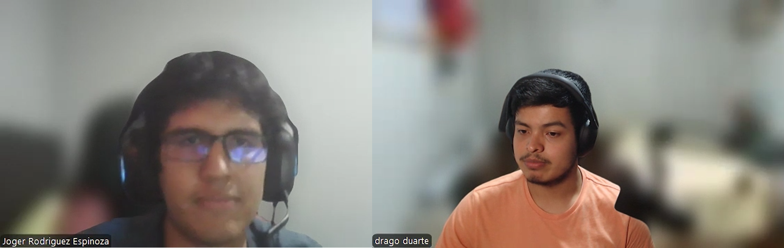</td></tr>
  <tr><td>Link</td><td> link </td></tr>
  <tr><td>Timing donde inicia la entrevista</td><td> min</td></tr>
  <tr><td>Duración de la entrevista</td><td> min</td></tr>
  <tr><td>Resumen</td><td>El entrevistado es un ingeniero agrónomo residente en Piura, de 30 años. A lo largo de la entrevista, manifiesta que mediante métodos tradicionales (libreta y camioneta) puede supervisar eficientemente a un máximo de 30 a 40 productores o 300 hectáreas, límite a partir del cual la prevención decae y el trabajo se vuelve reactivo. Para organizar su día a día y documentar sus visitas, utiliza herramientas genéricas como WhatsApp, Excel y Google Maps, aunque reconoce que la información resulta muy fragmentada. Revela además que cuantificar el rendimiento salvado tras una intervención es un reto constante que aborda mediante fotografías de "antes y después" y comparaciones con "lotes testigo" o históricos, asumiendo un margen de subjetividad. Destaca que la mayor dificultad con el agricultor empírico es erradicar la sobredosificación de agroquímicos y lograr el cumplimiento de los tiempos de carencia y uso de protección. Finalmente, evalúa los daños climáticos mediante muestreos físicos en zigzag, dependiendo fuertemente de su experiencia visual para estimar porcentajes de pérdida.  
  <b>Comportamiento y necesidades:</b>

- Gestión y control de cobertura: Administra y limita su alcance a un máximo de 40 productores o 300 hectáreas para mantener la calidad preventiva de su asesoría, evitando que la saturación lo obligue a simplemente "apagar incendios".
- Demostración de resultados: Necesita elaborar reportes visuales y comparativos (lote tratado vs. lote testigo o histórico) para sustentar ante la gerencia de la cooperativa el impacto real de sus visitas, buscando minimizar la subjetividad de sus estimaciones.
- Capacitación y corrección de hábitos: Enfrenta el desafío constante de educar al agricultor empírico en la calibración precisa de equipos de fumigación, el respeto estricto de los periodos de carencia pre-cosecha y el uso de equipos de protección personal (EPP).
- Evaluación de campo y muestreo: Requiere realizar recorridos presenciales estandarizados (en "X" o zigzag) para tomar muestras aleatorias y diagnosticar visualmente el estrés hídrico o daño foliar, dependiendo de su "ojo" y experiencia agronómica.  

<b> Tecnología, marcas y canales:</b>

- Dispositivos y software habituales: Uso intensivo de teléfono inteligente y computadora para combinar hojas de cálculo (Excel) en la gestión de cronogramas y software de mapeo (Google Maps/Earth) para ubicar los predios.
- Canales de comunicación: WhatsApp es la herramienta central y más ágil de su día a día, utilizada para recibir alertas tempranas, fotos de hojas dañadas y audios con consultas directas de los productores.
- Gestión de datos fragmentada: La dependencia de un ecosistema de aplicaciones genéricas no conectadas entre sí genera una necesidad subyacente de centralizar y estructurar la información técnica que actualmente se dispersa.
- Diagnóstico visual sin sensores: A pesar del uso de herramientas digitales para la organización, la toma de datos biométricos en campo (grado de marchitamiento, caída de flores, cuajado) sigue siendo un proceso 100% analógico, visual y basado en la experiencia personal.</td></tr>
</table>

## 2.2.3. Análisis de entrevistas

### Segmento 1: Pequeños y medianos agricultores independientes de papa y café
Se analizó la información cualitativa obtenida de productores agrícolas independientes para identificar las características operativas, financieras y de adopción digital clave que configuran el arquetipo de este segmento.

### Características

| Característica                                    | Mención    | %     | Evidencia                                                                                     |
| ------------------------------------------------- | ---------- | ----- | --------------------------------------------------------------------------------------------- |
| Coadministración familiar de la parcela           |   1/1      | 100%  | Trabaja conjuntamente con su padre en predio familiar                                         |
| Pérdidas severas por clima y plagas               |   1/1      | 100%  | Manifiesta pérdidas críticas por sequías recurrentes y roya amarilla                          |
| Estimación empírica y volumétrica                 |   1/1      | 100%  | Cuantifica mermas solo por sacos cosechados, omitiendo costos operativos hundidos             |
| Fijación arbitraria de precios por intermediarios |   1/1      | 100%  | Los acopiadores imponen tarifas al carecer de certificados de calidad en origen               | 
| Dependencia de financiamiento informal o lento    |   1/1      | 100%  | Enfrenta créditos bancarios tardíos o adelantos condicionados de compradores                  |
| Conectividad móvil deficiente en campo            |   1/1      | 100%  | Pérdida total de cobertura (Claro/Bitel) en quebradas y zonas de cultivo                      |
| Rol de puente tecnológico generacional            |   1/1      | 100%  | Disposición del productor joven para guiar e implementar la herramienta con su padre          |
| Canales y medios utilizados                       |   1/1      | 100%  | Uso diario de WhatsApp, Yape, radioemisoras locales y redes sociales                          |
| Tecnología usada                                  |   1/1      | 100%  | Teléfono inteligente con sistema operativo Android (Samsung Galaxy A14)                       |

##### Insights

1) Vulnerabilidad comercial por ausencia de registros formales: El agricultor calcula su rendimiento de manera memorística y volumétrica (conteo de sacos), desconociendo su inversión real en jornales e insumos. Esta carencia de datos y de certificaciones objetivas de calidad deja la fijación del precio final en manos de acopiadores locales, reduciendo drásticamente su margen de ganancia.
2) La conectividad nula exige arquitectura 100% offline: Las parcelas ubicadas en quebradas carecen de señal de internet continua. Toda solución digital orientada al campo debe permitir el registro completo de actividades agrícolas fuera de línea y ejecutar sincronizaciones automáticas únicamente cuando el usuario retorna a zonas urbanas.
3) Relevo generacional como acelerador de digitalización: Aunque los agricultores mayores mantienen un arraigo estricto a las prácticas tradicionales, los miembros jóvenes de la familia cuentan con habilidades digitales y alta disposición para actuar como intermediarios tecnológicos, facilitando la adopción de nuevas plataformas.

### Segmento 2: Productores organizados y directivos de cooperativas agrícolas

Se analizaron 3 entrevistas aplicadas a líderes, gerentes de operaciones y socios cooperativistas (Cusco, Arequipa y Cañete) para consolidar los factores críticos de gestión de acopio, fiscalización y requerimientos tecnológicos del sector organizado.

### Características

| Característica                                    | Mención    | %     | Evidencia                                                                                     |
| ------------------------------------------------- | ---------- | ----- | --------------------------------------------------------------------------------------------- |
| Gestión de acopio con premios y castigos          |   3/3      | 100%  | Bonifican lotes de alta calidad y penalizan o pagan precio mínimo a los deficientes           |
| Uso de canales tradicionales de comunicación      |   3/3      | 100%  | Envío de alertas mediante WhatsApp, SMS, radio local matutina y técnicos presenciales         |
| Alertas climáticas desfasadas o vulnerables       |   3/3      | 100%  | Los avisos se cortan por mal clima o llegan tarde a las zonas altas desconectadas             |
| Castigo económico por cuadernos incompletos       |   3/3      | 100%  | Reportan pérdidas de cerca del 10% en ventas/cargas por vacíos en trazabilidad y sellos       | 
| Barrera etaria y resistencia cultural al cambio   |   3/3      | 100%  | Socios mayores de 50 años habituados al papel que temen equivocarse en el celular             |
| Sobrecarga de trabajo por auditorías anuales      |   3/3      | 100%  | Señalan semanas de trabajo manual y trámites lentos para sostener certificaciones             |
| Disposición a financiar la plataforma digital     |   3/3      | 100%  | Las cooperativas asumen el software como gasto operativo que "se paga solo" al salvar primas  |
| Canales y medios utilizados                       |   3/3      | 100%  | Grupos de WhatsApp regionales, radio provincial y llamadas directas                           |
| Tecnología usada                                  |   3/3      | 100%  | Teléfonos inteligentes (Android), computadoras de oficina con Excel y radios portátiles       |

##### Insights

1) Riesgo financiero directo por trazabilidad deficiente: El uso continuado de libretas de papel genera omisiones de datos que conllevan el castigo de hasta un 10% del valor de exportación y la pérdida de sobreprecios por sellos orgánicos. La digitalización es vista por la gerencia como una salvaguarda de ingresos antes que como un simple gasto administrativo.
2) Modelo de financiamiento B2B viable y justificado: A diferencia del productor individual, la cooperativa cuenta con solvencia y disposición formal de presupuesto para financiar la suscripción tecnológica, siempre que el sistema reduzca semanas de consolidación manual previas a las fiscalizaciones y auditorías.
3) Inclusión de la base social mediante usabilidad simplificada: Dado que el promedio etario de los socios supera los 50 años, la interfaz de captura debe erradicar la complejidad técnica, emplear flujos intuitivos y estar respaldada por capacitaciones presenciales que venzan la desconfianza hacia los entornos móviles.

### Segmento 3: Ingenieros agrónomos y asesores técnicos de campo

Se analizaron 3 entrevistas a ingenieros agrónomos y extensionistas rurales (Oxapampa/Pozuzo, Cañete/Mala y Piura) para caracterizar su desempeño operativo, limitantes de cobertura geográfica y herramientas de diagnóstico.
### Características

| Característica                                     |   Mención  |   %   | Evidencia                                                                                     |
| -------------------------------------------------- | ---------- | ----- | --------------------------------------------------------------------------------------------- |
| Límite de cobertura condicionado por topografía    |   3/3      | 100%  | Supervisan 15–25 productores/mes en selva alta, 35–40 en valles costeros o un tope de 300 ha antes de volverse reactivos          |
| Caminatas prolongadas y demoras climáticas         |   3/3      | 100%  | Marchas a pie de 2 a 3 horas en quebradas bajo lluvia en selva y extensos traslados en camioneta en costa/norte        |
| Uso de herramientas digitales genéricas y dispersas|   3/3      | 100%  | Emplean de forma desarticulada WhatsApp, hojas de cálculo en Excel y Google Maps / Earth              |
| Dificultad para demostrar impacto ante gerencia    |   3/3      | 100%  | Justifican su labor con fotos de "antes y después", lotes testigo o comparaciones empíricas con sesgo de subjetividad          | 
| Lucha contra la sobredosis y malas prácticas fitosanitarias |   3/3      | 100%  | Productores aplican agroquímicos fijos (cada 8–10 días) sin signos reales de plagas           |
| Evaluación visual subjetiva de siniestros          |   3/3      | 100%  | Muestreos pedestres en patrones (zigzag, X, M, Z) dependiendo del "ojo" técnico para estimar mermas y estrés hídrico            |
| Adopción de georreferenciación y cartografía digital  |   3/3      | 100%  | Valoran la georreferenciación vinculada al PPA y usan mapas digitales para rastrear predios dispersos                    |
| Canales y medios utilizados                        |   3/3      | 100%  | WhatsApp para consultas fitosanitarias y coordinación en caseríos con cobertura               |
| Tecnología usada                                   |   3/3      | 100%  | Teléfonos inteligentes con GPS integrado, computadoras portátiles y Excel                     |

##### Insights

1) Saturación operativa y transición de labor preventiva a reactiva: Los métodos tradicionales de supervisión presencial (libreta, recorridos a pie o camioneta) tienen un techo infranqueable: entre 15 y 25 productores en selva abrupta y un máximo de 30 a 40 productores (o 300 ha) en zonas planas. Superar este umbral degrada el acompañamiento técnico preventivo y convierte al extensionista en un gestor que solo "apaga incendios" fitosanitarios de forma reactiva.
2) Subjetividad metodológica en la evaluación de daños y cálculo de retorno: Tanto el diagnóstico de siniestros climáticos como la justificación del impacto de las visitas técnicas se realizan mediante inspecciones pedestres en zigzag, fotografías de "antes y después" y comparación empírica con lotes testigo. Esta dependencia del "ojo" técnico genera reportes con alto margen de sesgo humano, haciendo indispensable el uso de índices de vegetación satelitales (como NDVI o estrés hídrico) para cuantificar mermas con respaldo numérico ante la gerencia.
3) Fragmentación crítica del ecosistema digital de campo: El agrónomo depende de un flujo de trabajo desarticulado: resuelve consultas urgentes por WhatsApp, calcula dosis y calendarios en Excel y geolocaliza parcelas en Google Maps o Google Earth. Esta dispersión no solo provoca retrabajo administrativo y pérdida de trazabilidad, sino que mantiene la toma de datos agronómicos (calibración de mochilas, periodos de carencia y fenología) en un plano analógico y desestructurado.

### 2.3. Needfinding

#### 2.3.1. User Personas

A continuación, se presentan los tres arquetipos de usuario elaborados en UXPressia a partir del análisis cualitativo y cuantitativo de las entrevistas de campo, representando formalmente a cada uno de los segmentos objetivo de la plataforma Dymbia:

##### Segmento 1: Pequeños y medianos agricultores independientes
El arquetipo "Guillermo Cortés" representa al agricultor familiar tradicional que conduce parcelas de café y papa bajo métodos empíricos y sin conectividad continua, demandando una arquitectura móvil fuera de línea y monitoreo satelital sin inversión en sensores costosos en tierra para defender precios justos frente a intermediarios.

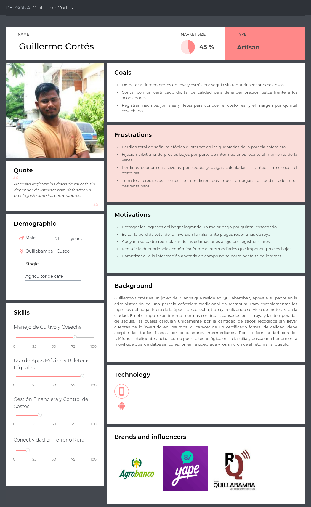

##### Segmento 2: Productores organizados y directivos de cooperativas/asociaciones
El arquetipo "Cristian Santana" sintetiza las necesidades de los administradores y directivos de acopio cooperativo, quienes requieren digitalizar los análisis de calidad en almacén, asegurar la trazabilidad de origen y agilizar los expedientes de auditoría para proteger las primas comerciales y de exportación.

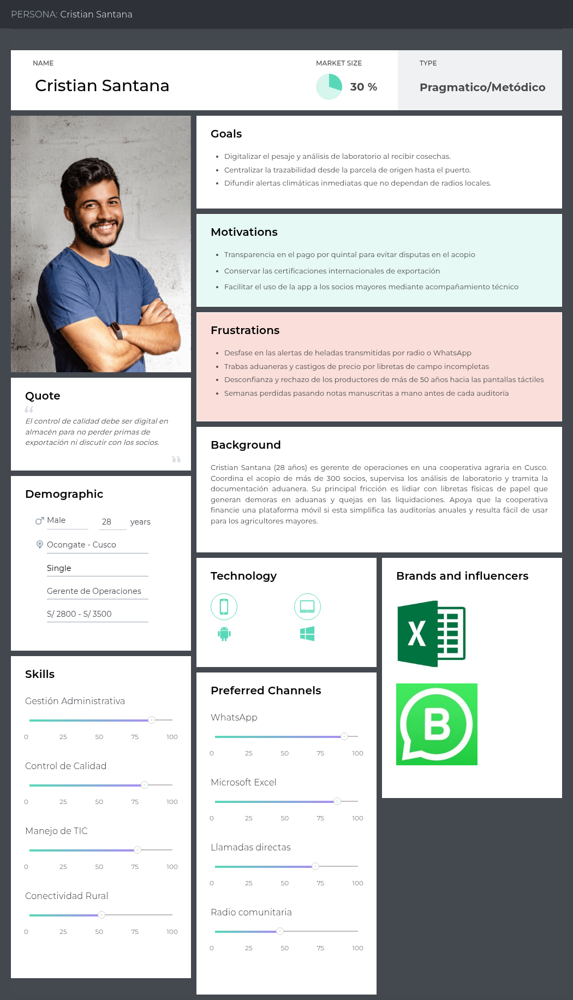

##### Segmento 3: Ingenieros agrónomos y asesores técnicos de campo
El arquetipo "Juan Antonio Morales" consolida al consultor fitosanitario cuya cobertura se ve restringida por la dispersión geográfica en quebradas y por métodos visuales subjetivos, requiriendo teledetección multiespectral para priorizar predios y sustentar prescripciones técnicas ante la gerencia.

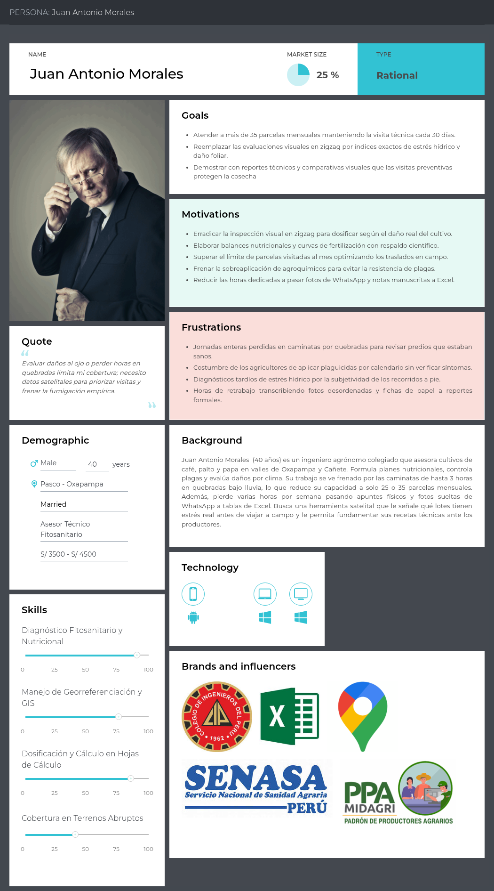

### 2.3.2. User Task Matrix

Se presenta el User Task Matrix, que reúne las tareas que los tres arquetipos de usuario identificados en la cadena de valor agrícola realizan para cumplir sus objetivos. Estas tareas comprenden funciones operativas, diagnósticas y comerciales que los usuarios llevan a cabo de forma habitual en su día a día, independientemente de la existencia de una solución tecnológica.

Los segmentos considerados para este análisis corresponden a los perfiles definidos en la investigación cualitativa:

1) Segmento 1: Pequeños y medianos agricultores independientes de papa y café (representado por el arquetipo de Agricultor Independiente).
2) Segmento 2: Productores organizados y directivos de cooperativas agrícolas (representado por el arquetipo de Directivo de Cooperativa).
3) Segmento 3: Ingenieros agrónomos y asesores técnicos de campo (representado por el arquetipo de Asesor Técnico).

##### Task Matrix

| Tarea | Guillermo Cortés | | Cristian Santana | | Juan Antonio Morales | |
| :--- | :--- | :--- | :--- | :--- | :--- | :--- |
| | Frecuencia | Importancia | Frecuencia | Importancia | Frecuencia | Importancia |
| Inspeccionar visualmente el estado fitosanitario del cultivo | often | high | rarely | low | often | high |
| Registrar costos de insumos, jornales y labores culturales | sometimes | high | sometimes | high | rarely | low |
| Monitorear alertas climáticas y eventos extremos | often | high | often | high | sometimes | high |
| Ejecutar aplicaciones de agroquímicos y fertilizantes | often | high | never | low | sometimes | high |
| Evaluar daños físicos y estrés en el campo post-siniestro | sometimes | high | rarely | medium | sometimes | high |
| Negociar volúmenes y precios de venta de la cosecha | sometimes | high | often | high | never | low |
| Auditar y consolidar cuadernos de campo de trazabilidad | never | low | often | high | sometimes | high |
| Realizar control de calidad, muestreo y catación en acopio | rarely | medium | often | high | rarely | medium |
| Georreferenciar y mapear polígonos de parcelas | never | low | sometimes | high | often | high |
| Elaborar planes de dosificación nutricional y recetas técnicas | rarely | low | rarely | low | often | high |
| Rendir informes de visitas técnicas y justificar impacto | never | low | sometimes | high | often | high |
| Gestionar certificaciones orgánicas, de origen o comercio justo | never | low | often | high | rarely | medium |

### 2.3.3. User Journey Mapping

Con el User Journey Map reconstruimos paso a paso lo que viven y sienten el administrador y la familia durante el proceso. Al hacer visibles sus principales dificultades y puntos de dolor, podemos dirigir nuestra solución tecnológica justo donde más se necesita, convirtiendo una mala experiencia en un proceso simple y eficiente.

### Segmento 1: Pequeño agricultor independiente de café (Guillermo Cortés)

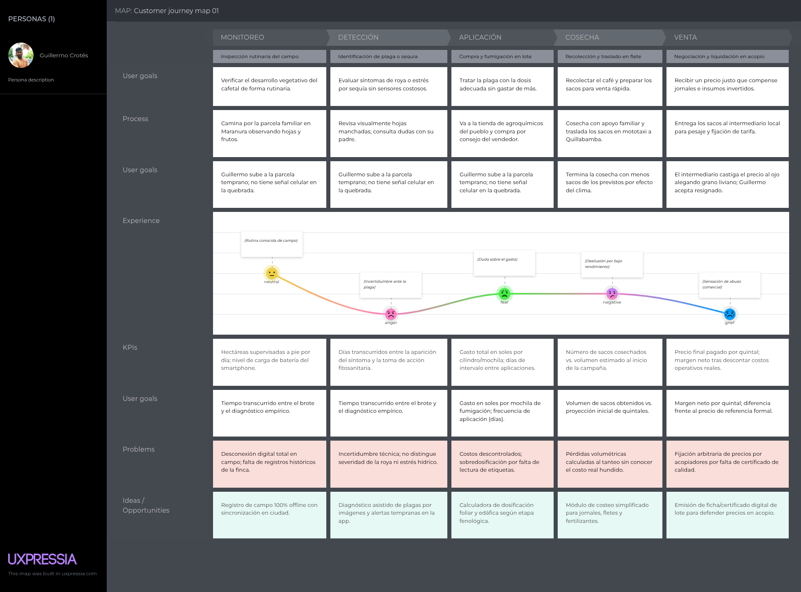

### Segmento 2: Gerente de operaciones de cooperativa agraria (Cristian Santana)

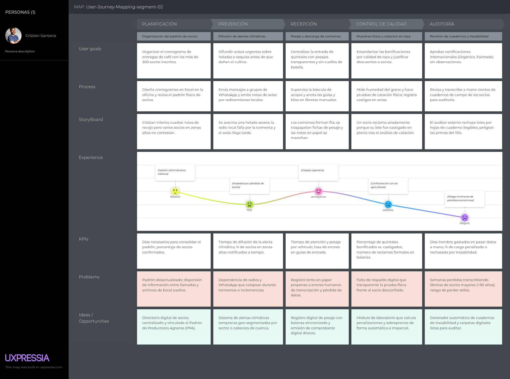

### Segmento 3: Asesor técnico de campo (Juan Antonio Morales)

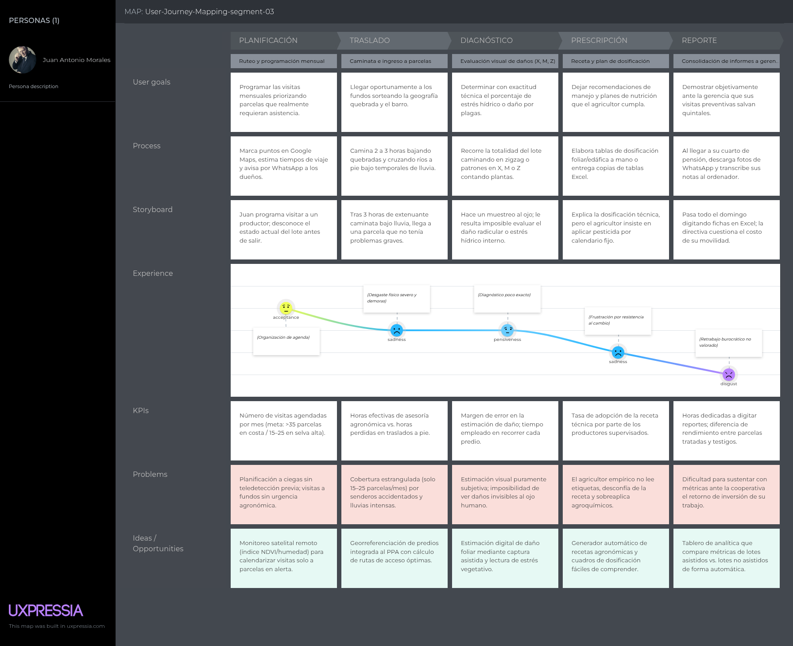

### 2.3.4. Empathy Mapping

Crear un producto con impacto real exige mirar más allá de las conductas visibles y conectar con el aspecto emocional del usuario. Mediante el mapa de empatía, superamos la simple segmentación demográfica para comprender su contexto interno. Desglosar lo que administradores y familias perciben, expresan y experimentan en su día a día nos permite descubrir tanto sus temores como sus expectativas clave. 

### Segmento 1: Pequeño agricultor independiente de café (Guillermo Cortés)

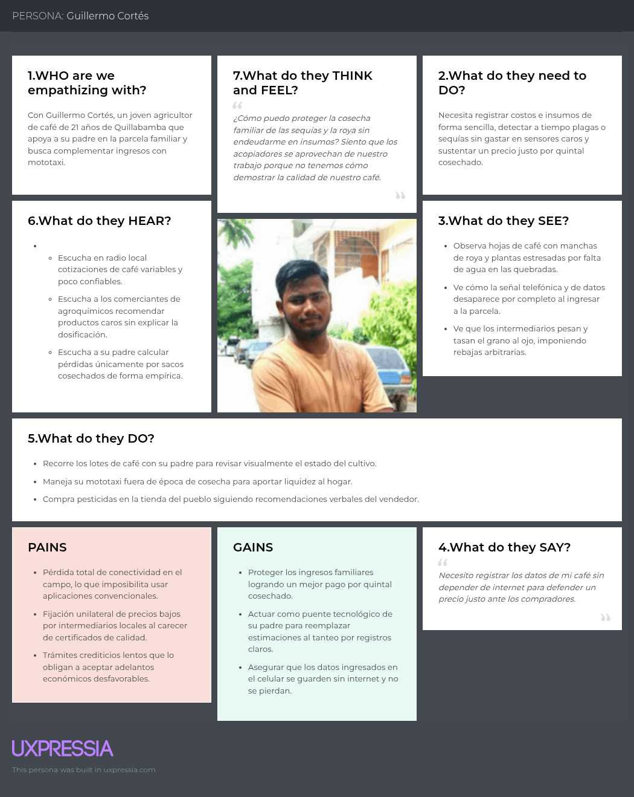

### Segmento 2: Gerente de operaciones de cooperativa agraria (Cristian Santana)

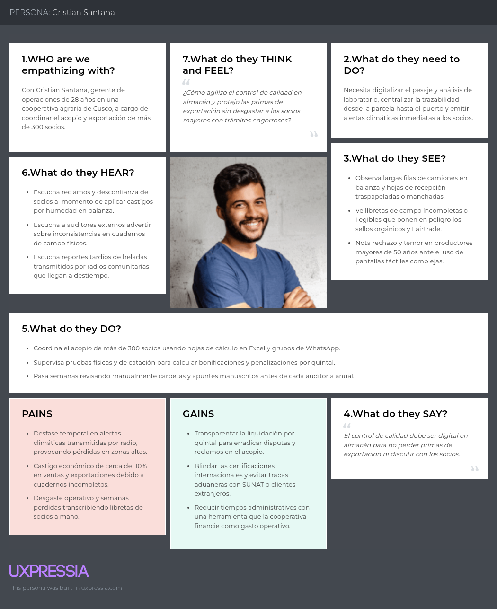

### Segmento 3: Asesor técnico de campo (Juan Antonio Morales)

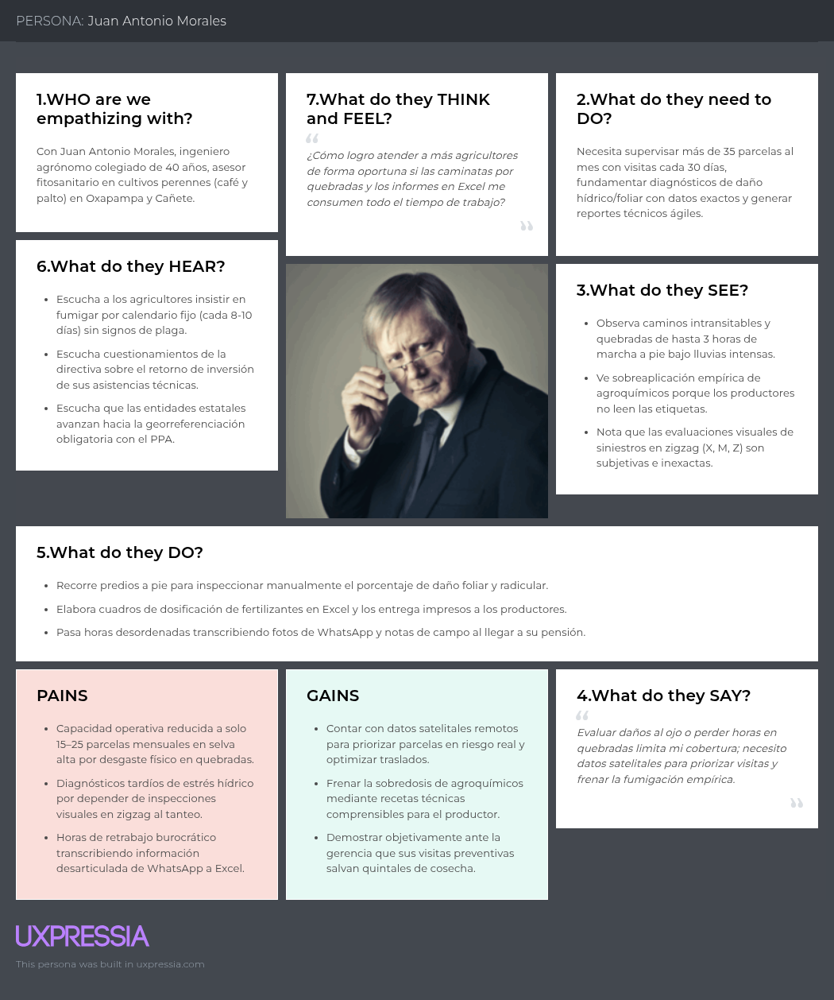

## 2.4. Big Picture Event Storming

En una sesión colaborativa sincrónica mediante la herramienta Miro, el equipo llevó a cabo el modelado del dominio de negocio a través de la técnica de Big Picture Event Storming, tomando como referencia las pautas de la guía metodológica (<https://bit.ly/bpes-guide>). Esta dinámica permitió explorar de forma visual e intuitiva el ciclo de vida productivo y comercial en las cadenas de papa andina y café de especialidad, identificando los eventos trascendentales del negocio, los cuellos de botella operativos y los hitos comerciales sin sesgos tempranos de desarrollo técnico.

### Exploración No Estructurada de Eventos (Domain Events)
El taller inició con una lluvia de ideas abierta en la que cada integrante aportó hechos consumados de relevancia agronómica, financiera y de certificación. Estos eventos se formularon estrictamente en tiempo pasado participio mediante notas adhesivas de color naranja, abarcando desde la delimitación del predio y el cálculo de índices satelitales, hasta la anotación diaria de jornales y la emisión de certificados de calidad:

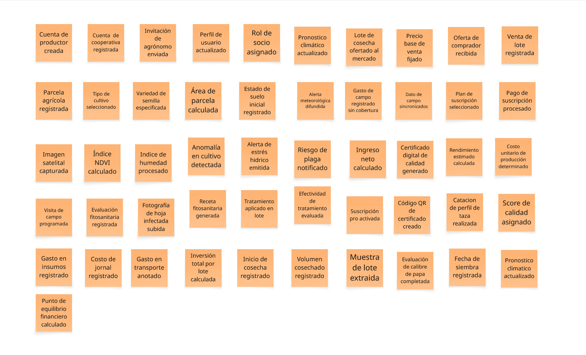

### Línea de Tiempo, Puntos de Dolor e Hitos del Negocio
Posteriormente, los eventos se organizaron en una secuencia cronológica de izquierda a derecha sobre una línea de tiempo continua. A partir de este ordenamiento, se superpusieron los puntos de dolor (*pain points*) identificados durante el Needfinding mediante notas moradas en rombo (resistencia cultural al celular, desconexión móvil en quebradas, registros en papel extraviados y castigos arbitrarios de precio). Asimismo, se establecieron líneas divisorias verticales para demarcar los eventos fundamentales (*pivotal points*) que delimitan las fases operativas de SumaqAgro:

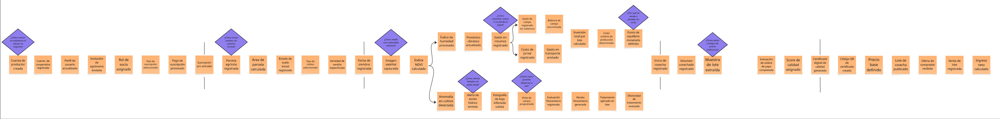

* **Enlace al tablero interactivo:** [Acceso al espacio de trabajo de Event Storming en Miro]([https://miro.com/app/board/uXjVHPEmUbl=/](https://miro.com/welcomeonboard/WG5aQ1R0dmR5b0xQWTI5TEZvaXplRmpPTUxmT2pmR1NNVXBVakcxRFI5Yk16dVY3TXpRc0RwbHVKNWFndGJvZDZkZXJrbkN4VFZQdzhHTjV6MWdBNUJtQnhYMVFmcjNLbkxyOWQwZlVuWHZ6UXVkOHlsNXRlcVBQd24wVS92ZWN3VHhHVHd5UWtSM1BidUtUYmxycDRnPT0hdjE=?share_link_id=946708686416))

## 2.5. Ubiquitous Language

Con el fin de garantizar una comunicación fluida, consistente y libre de ambigüedades entre los desarrolladores, los directivos de cooperativas, los ingenieros agrónomos y los productores agrícolas, se ha elaborado el siguiente glosario de términos del dominio del negocio. Estos conceptos definen la semántica compartida de SumaqAgro y deben utilizarse de manera coherente en las reuniones de trabajo, el diseño de interfaces de usuario y la lógica interna del sistema:

* **Field Plot (Parcela Agrícola):** Unidad territorial delimitada geográficamente mediante coordenadas perimetrales, destinada a la producción agraria y gestionada por un productor o socio cooperativo.
* **Agricultural Cooperative (Cooperativa Agraria):** Organización asociativa formal que agrupa a productores de café y papa para centralizar el acopio, la asistencia técnica y la comercialización mayorista.
* **Cooperative Member (Socio Cooperativo):** Productor empadronado formalmente en la cooperativa que accede a servicios de pesaje, secado, asistencia y liquidación comercial.
* **Technical Advisor (Asesor Técnico):** Profesional agrónomo responsable de diagnosticar el estado sanitario de las parcelas, formular recetas de fertilización y asistir en campo.
* **Sowing Date (Fecha de Siembra):** Momento temporal en el que se instala la semilla o plantón en el suelo, marcando el inicio del ciclo fenológico y el monitoreo satelital continuo.
* **Crop Variety (Variedad de Cultivo):** Clasificación botánica de la semilla (p. ej., variedades de papa como Canchán o Yungay; variedades de café como Caturra o Geisha) que define los requerimientos de manejo.
* **Vegetation Index - NDVI (Índice de Vegetación):** Indicador derivado de reflectancia satelital que evalúa el vigor fotosintético y la biomasa foliar del cultivo sin requerir sensores en tierra.
* **Water Index - NDWI (Índice de Humedad):** Parámetro satelital que mide el contenido hídrico foliar para advertir estrés por sequía antes de que existan daños visibles en el lote.
* **Agronomic Early Warning (Alerta Agroclimática):** Aviso prioritario emitido ante riesgos climáticos severos (heladas meteorológicas o sequías) o caídas anómalas en el vigor de la vegetación.
* **Technical Prescription (Receta Fitosanitaria):** Formulación técnica emitida por el asesor que prescribe el insumo, la dosis exacta y las pautas para controlar una deficiencia o plaga.
* **Daily Farm Labor - Jornal (Jornal Agrícola):** Unidad de remuneración correspondiente a una jornada diaria de trabajo manual en campo para labores de preparación, aporque o cosecha.
* **Agricultural Inputs (Insumos Agropecuarios):** Materiales directos (abonos, fertilizantes y protectores de cultivo) aplicados en la parcela para garantizar su desarrollo productivo.
* **Field Freight (Flete Rural):** Costo de transporte devengado por el traslado de insumos al fundo o el flete de la cosecha hacia el almacén o centro de acopio.
* **Unit Production Cost (Costo Unitario de Producción):** Resultado monetario de dividir los gastos operativos acumulados de campaña entre el volumen cosechado o proyectado (soles por quintal o tonelada).
* **Financial Breakeven Price (Punto de Equilibrio Financiero):** Precio mínimo de venta por unidad de comercialización necesario para cubrir la inversión del lote, evitando operar a pérdida.
* **Harvest Batch (Lote de Cosecha):** Volumen consolidado de producto recolectado en una misma parcela y campaña, acondicionado para pesaje y muestreo de calidad.
* **Potato Caliber (Calibre de Papa):** Clasificación por tamaño y diámetro del tubérculo según norma técnica oficial (Primera, Segunda y Tercera) para su destino comercial.
* **Cup Profile Scoring - SCA (Puntaje de Perfil de Taza):** Calificación sensorial sobre 100 puntos asignada en laboratorio de catación para medir la calidad de cafés de especialidad.
* **Digital Quality Certificate (Certificado Digital de Calidad):** Acreditación técnica no repudiable que valida los parámetros físicos, sensoriales y de procedencia del lote cosechado.
* **Cryptographic Traceability QR (Código QR de Trazabilidad):** Identificador visual impreso o adherido al lote que enlaza públicamente a la ficha técnica de origen, calidad y no deforestación.
* **Quality Premium Bonus (Bonificación por Calidad):** Sobreprecio o compensación económica adicional liquidada al agricultor por entregar cosechas que superan los estándares básicos de mercado.