# Capítulo II: Requirements Elicitation & Analysis

En el presente capítulo, el equipo se dedica a investigar y comprender a fondo el contexto operativo y las carencias del sector agroalimentario antes de iniciar el desarrollo tecnológico. Más allá de definir un listado de características del software, aplicamos un riguroso proceso de educción y análisis de requisitos. Esta fase es fundamental para comprobar empíricamente que las problemáticas que SumaqAgro pretende solucionar tienen un impacto genuino en la rentabilidad y gestión diaria de los agricultores y cooperativas peruanas.

## 2.1. Competidores
### 2.1.1. Análisis competitivo

Para asegurar una captura de datos estructurada y de alto valor, se han elaborado guías de indagación personalizadas para cada uno de nuestros segmentos de mercado. Estos instrumentos de investigación están diseñados para descubrir no solo el perfil demográfico, sino también el nivel de madurez digital y los cuellos de botella que enfrentan los usuarios en la actualidad. Previo a la presentación de estas entrevistas, detallamos el panorama competitivo (Landscape) que valida la viabilidad y diferenciación estratégica de SumaqAgro en el ecosistema AgTech.

<table border="1" cellpadding="10" cellspacing="0" style="margin-left: auto; margin-right: auto; font-family: sans-serif; width: 100%;">
  <tr>
    <th colspan="6" style="text-align: center; font-size: 1.2em;">Competitive Analysis Landscape</th>
  </tr>
  <tr>
    <td colspan="2" rowspan="2" style="width: 20%;"><b>¿Por qué llevar a cabo este análisis?</b></td>
    <td colspan="4">¿Cómo se posiciona SumaqAgro frente a sus competidores en cuanto a propuesta de valor, marketing, producto y estrategia?</td>
  </tr>
  <tr>
    <td colspan="4">Es un análisis comparativo que permite identificar fortalezas, debilidades, oportunidades y amenazas, así como entender mejor la posición del producto frente a otros actores relevantes del mercado agrotecnológico.</td>
  </tr>
  <tr>
    <td colspan="2" style="text-align: center;"><b>Competidores</b></td>
    <td style="text-align: center; vertical-align: middle; width: 20%;">
      <b style="display: block; margin-bottom: 6px;">SumaqAgro</b>
      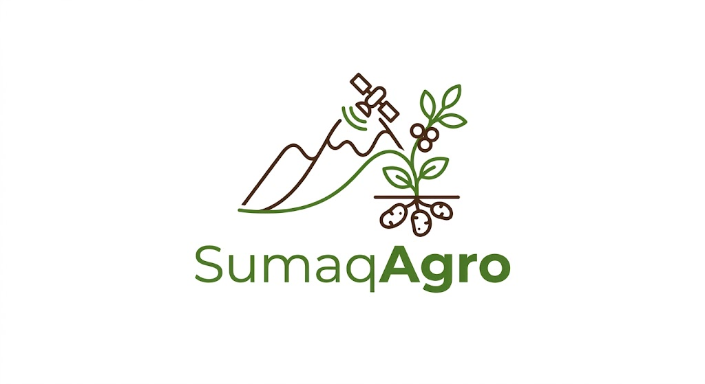
    </td>
    <td style="text-align: center; vertical-align: middle; width: 20%;">
      <b style="display: block; margin-bottom: 6px;">SpaceAG</b>
      
    </td>
    <td style="text-align: center; vertical-align: middle; width: 20%;">
      <b style="display: block; margin-bottom: 6px;">Kilimo</b>
      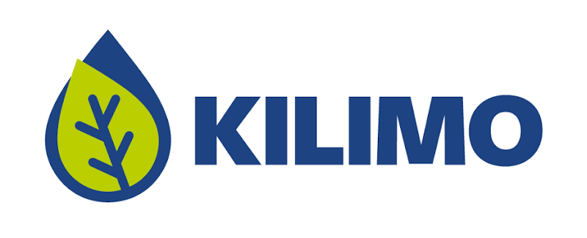
    </td>
    <td style="text-align: center; vertical-align: middle; width: 20%;">
      <b style="display: block; margin-bottom: 6px;">Auravant</b>
      
    </td>
  </tr>
  <tr>
    <td rowspan="2" style="writing-mode: vertical-lr; transform: rotate(180deg); text-align: center; font-weight: bold;">Perfil</td>
    <td><b>Overview</b></td>
    <td>Plataforma Web (Software-only Precision Ag) enfocada en gestión agrícola, monitoreo y calidad digital.</td>
    <td>Solución de Drone & Satellite Analytics centrada en el análisis avanzado de rendimiento.</td>
    <td>Plataforma SaaS de Water Management especializada en la gestión y ahorro de agua.</td>
    <td>Digital Agronomy Ecosystem altamente modular y configurable para agricultura de precisión.</td>
  </tr>
  <tr>
    <td><b>Ventaja competitiva</b></td>
    <td>Monitoreo satelital (NDVI/humedad) libre de sensores físicos en campo, integrando cálculo de costos unitarios y certificación digital de calidad.</td>
    <td>Monitoreo premium de ultra alta resolución (imágenes satelitales + ortofotos por drones) con inteligencia artificial.</td>
    <td>Algoritmos propietarios de balance hídrico que calculan evapotranspiración y monetizan el ahorro de agua.</td>
    <td>Ecosistema abierto con soporte para múltiples capas de información, maquinaria e integraciones de terceros.</td>
  </tr>
  <tr>
    <td rowspan="2" style="writing-mode: vertical-lr; transform: rotate(180deg); text-align: center; font-weight: bold;">Perfil de Marketing</td>
    <td><b>Mercado objetivo</b></td>
    <td>Pequeños/medianos agricultores (papa/café), cooperativas y asesores técnicos independientes en Perú.</td>
    <td>Medianas y grandes corporaciones agroexportadoras de alto valor (arándanos, uva) en la costa peruana.</td>
    <td>Productores medianos/grandes con sistemas de riego tecnificado en regiones con estrés hídrico.</td>
    <td>Empresas agropecuarias de escala extensiva, asesores agronómicos y distribuidores de agroquímicos.</td>
  </tr>
  <tr>
    <td><b>Estrategias de marketing</b></td>
    <td>Penetración B2B2C mediante cooperativas, modelo freemium accesible y alianzas con ONGs de desarrollo rural.</td>
    <td>Ventas B2B corporativas, demostraciones piloto en fundos industriales y presencia en congresos exportadores.</td>
    <td>Programas ESG, marketing de contenidos sobre huella hídrica y alianzas con corporaciones globales.</td>
    <td>Autoservicio SaaS, seminarios web técnicos, certificaciones gratuitas y convenios con marcas de maquinaria.</td>
  </tr>
  <tr>
    <td rowspan="3" style="writing-mode: vertical-lr; transform: rotate(180deg); text-align: center; font-weight: bold;">Perfil de Producto</td>
    <td><b>Productos & Servicios</b></td>
    <td>
      <ul style="margin: 0; padding-left: 15px;">
        <li>Índices NDVI/humedad satelital</li>
        <li>Motor de costos por lote</li>
        <li>Certificados de calidad digital</li>
      </ul>
    </td>
    <td>
      <ul style="margin: 0; padding-left: 15px;">
        <li>Vuelos programados con drones</li>
        <li>Conteo de plantas con IA</li>
        <li>Gestión de personal de cosecha</li>
      </ul>
    </td>
    <td>
      <ul style="margin: 0; padding-left: 15px;">
        <li>Recomendaciones de riego</li>
        <li>Auditoría de ahorro de agua</li>
        <li>Reporte de huella hídrica</li>
      </ul>
    </td>
    <td>
      <ul style="margin: 0; padding-left: 15px;">
        <li>Prescripción variable</li>
        <li>Integración con maquinaria</li>
        <li>Monitoreo satelital multibanda</li>
      </ul>
    </td>
  </tr>
  <tr>
    <td><b>Precios & Costos</b></td>
    <td>Modelo Freemium: Nivel gratuito para pequeños productores y planes escalonados para cooperativas.</td>
    <td>Contratos Enterprise de alto costo (miles de dólares), inaccesibles para el pequeño productor familiar.</td>
    <td>SaaS por hectárea. Requiere riego tecnificado para justificar el retorno de inversión.</td>
    <td>Planes Freemium limitados con saltos agresivos a tiers Premium corporativos por volumen.</td>
  </tr>
  <tr>
    <td><b>Canales de distribución</b></td>
    <td>Plataforma Web responsiva (Angular) optimizada para conexiones móviles 3G/4G rurales.</td>
    <td>App Web de escritorio y Aplicación Móvil nativa para hardware de gama alta.</td>
    <td>App Web y App Móvil de consulta rápida en campo para operarios de riego.</td>
    <td>Plataforma Web integral y Aplicación Móvil multiplataforma para registro de muestras.</td>
  </tr>
  <tr>
    <td rowspan="5" style="writing-mode: vertical-lr; transform: rotate(180deg); text-align: center; font-weight: bold;">Análisis SWOT</td>
  </tr>
  <tr>
    <td><b>Fortalezas</b></td>
    <td>
      <ul style="margin: 0; padding-left: 15px;">
        <li>Sin hardware (100% software).</li>
        <li>Integra analítica, costos y calidad.</li>
        <li>Especialización en papa andina y café.</li>
      </ul>
    </td>
    <td>
      <ul style="margin: 0; padding-left: 15px;">
        <li>Alta resolución con drones.</li>
        <li>Liderazgo en sector exportador costero.</li>
        <li>Fuerza de ventas B2B corporativa.</li>
      </ul>
    </td>
    <td>
      <ul style="margin: 0; padding-left: 15px;">
        <li>Monetización por bonos de carbono.</li>
        <li>Plataforma técnica muy madura.</li>
        <li>Especialización total en recurso hídrico.</li>
      </ul>
    </td>
    <td>
      <ul style="margin: 0; padding-left: 15px;">
        <li>Alta escalabilidad internacional.</li>
        <li>Ecosistema modular mediante Add-ons.</li>
        <li>Robusta integración con hardware/tractores.</li>
      </ul>
    </td>
  </tr>
  <tr>
    <td><b>Debilidades</b></td>
    <td>
      <ul style="margin: 0; padding-left: 15px;">
        <li>Startup nueva en el mercado.</li>
        <li>Dependencia de APIs satelitales externas.</li>
        <li>Ausencia de app móvil nativa (Sprint 1).</li>
      </ul>
    </td>
    <td>
      <ul style="margin: 0; padding-left: 15px;">
        <li>Costos insostenibles para la pequeña escala.</li>
        <li>Ausencia de control financiero/costos.</li>
        <li>Rigidez operativa en sierra/selva.</li>
      </ul>
    </td>
    <td>
      <ul style="margin: 0; padding-left: 15px;">
        <li>Inútil en agricultura de secano (sin riego).</li>
        <li>Ignora el factor fitosanitario/plagas.</li>
        <li>Precios prohibitivos para minifundios.</li>
      </ul>
    </td>
    <td>
      <ul style="margin: 0; padding-left: 15px;">
        <li>Curva de aprendizaje compleja/técnica.</li>
        <li>Baja adecuación a micro-parcelas.</li>
        <li>Sin contabilidad financiera de costos.</li>
      </ul>
    </td>
  </tr>
  <tr>
    <td><b>Oportunidades</b></td>
    <td>
      <ul style="margin: 0; padding-left: 15px;">
        <li>96% de productores sin asistencia formal.</li>
        <li>Normativa de trazabilidad de la UE.</li>
        <li>Creciente conectividad rural.</li>
      </ul>
    </td>
    <td>
      <ul style="margin: 0; padding-left: 15px;">
        <li>Venta de big data a aseguradoras.</li>
        <li>Expansión a corporaciones regionales.</li>
        <li>Integración con robótica agrícola.</li>
      </ul>
    </td>
    <td>
      <ul style="margin: 0; padding-left: 15px;">
        <li>Crisis climática y escasez de agua.</li>
        <li>Financiamiento ESG corporativo.</li>
        <li>Nuevos bonos de sostenibilidad global.</li>
      </ul>
    </td>
    <td>
      <ul style="margin: 0; padding-left: 15px;">
        <li>Socio técnico de marcas de tractores.</li>
        <li>Alineamiento con catastro público.</li>
        <li>Modelo "marca blanca" para agrónomos.</li>
      </ul>
    </td>
  </tr>
  <tr>
    <td><b>Amenazas</b></td>
    <td>
      <ul style="margin: 0; padding-left: 15px;">
        <li>Fuerte resistencia al cambio digital.</li>
        <li>Extrema nubosidad en la sierra que limite visión de satélites.</li>
        <li>Clonación de modelo por empresas grandes.</li>
      </ul>
    </td>
    <td>
      <ul style="margin: 0; padding-left: 15px;">
        <li>Crisis de precios en la agroexportación.</li>
        <li>Regulaciones estrictas de vuelo de drones.</li>
        <li>Saturación del mercado corporativo.</li>
      </ul>
    </td>
    <td>
      <ul style="margin: 0; padding-left: 15px;">
        <li>Precipitaciones excesivas temporales.</li>
        <li>Sensores físicos IoT a precios de dumping.</li>
        <li>Caída en cotización de bonos hídricos.</li>
      </ul>
    </td>
    <td>
      <ul style="margin: 0; padding-left: 15px;">
        <li>Competencia de gigantes (Bayer FieldView).</li>
        <li>Interrupciones en constelaciones satelitales gratuitas.</li>
      </ul>
    </td>
  </tr>
</table>

### 2.1.2. Estrategias y tácticas frente a competidores

Una vez identificados los actores del mercado, el siguiente paso es definir cómo SumaqAgro se abrirá paso entre ellos. No basta con conocer a la competencia; necesitamos un plan de acción que aproveche nuestras ventajas y blinde nuestras debilidades. Para lograrlo, utilizamos la Matriz CAME, una herramienta que nos permite "traducir" el análisis FODA previo en decisiones estratégicas reales.

A través de este análisis, establecemos tácticas ofensivas para explotar nuestra especialización en el mercado peruano agro-exportador (papa y café), y acciones de supervivencia para mitigar los riesgos de ser una startup emergente. Este enfoque asegura que cada funcionalidad que codifiquemos cumpla un propósito estratégico en el mercado.

**Matriz CAME para el desarrollo de estrategias basándonos en el análisis FODA**

<table border="1" cellpadding="8" cellspacing="0" style="width: 100%; border-collapse: collapse; font-family: sans-serif;">
  <tr>
    <th style="text-align: left; width: 30%;">Análisis FODA cruzado</th>
    <th style="text-align: left; width: 35%;">Oportunidades (O)</th>
    <th style="text-align: left; width: 35%;">Amenazas (A)</th>
  </tr>
  <tr>
    <td>
      <b>Fortalezas (F)</b>  
      1. Independencia total de hardware en campo (software-only). 
      2. Plataforma unificada: analítica satelital, costos por lote y certificación en una sola herramienta. 
      3. Arquitectura web ligera optimizada para zonas de baja conectividad (3G). 
      4. Localización absoluta orientada al productor andino (papa) y de selva alta (café).
    </td>
    <td>
      <b>Estrategia (FO) — Estrategias Ofensivas</b>  
      1. Promover el generador de certificados digitales de calidad como la solución accesible para cumplir con las nuevas normativas de trazabilidad exportadora de la UE (F2, O2). 
      2. Afianzar el modelo de distribución B2B2C vendiendo el motor de costos a directivos de cooperativas, capturando masivamente a agricultores desatendidos técnicamente (F1, O4). 
      3. Ejecutar campañas de marketing resaltando la ligereza de la web app frente a las plataformas de la competencia, que requieren descargas pesadas o computadoras de gama alta (F3, O3).
    </td>
    <td>
      <b>Estrategia (FA) — Estrategias Defensivas</b>  
      1. Desplegar agresivamente el plan Freemium, permitiendo usar el satélite sin costo para 1 lote, derribando la barrera de desconfianza y resistencia al cambio rural (F1, A1). 
      2. Reforzar la propuesta de valor centrada en parámetros ultra-locales (alertas de gorgojo/roya, calibres del MIDAGRI) para blindar el mercado frente a la llegada de plataformas internacionales genéricas (F4, A3). 
      3. Implementar un módulo educativo offline en la app para capacitar sobre el valor real de digitalizar los cuadernos de campo (F2, A1).
    </td>
  </tr>
  <tr>
    <td>
      <b>Debilidades (D)</b>  
      1. Marca emergente con presupuesto comercial limitado frente a transnacionales. 
      2. Dependencia tecnológica de APIs satelitales externas. 
      3. Ausencia de aplicación móvil nativa (solo web responsiva en etapas iniciales). 
      4. Brecha inicial de datos históricos del cultivo.
    </td>
    <td>
      <b>Estrategia (DO) — Reorientación</b>  
      1. Aprovechar a las cooperativas agrícolas como un "caballo de Troya" comercial para diluir el costo de adquisición de usuarios individuales, compensando el bajo presupuesto de marketing (D1, O4). 
      2. Mitigar la falta de aplicación nativa implementando tecnologías de almacenamiento en caché en la Web App (Angular), permitiendo registro de jornales offline en la sierra (D3, O3). 
      3. Utilizar las pruebas Lean UX tempranas para generar casos de éxito y testimonios publicables que doten de autoridad y validen la herramienta frente a nuevos socios (D1, O1).
    </td>
    <td>
      <b>Estrategia (DA) — Supervivencia</b>  
      1. Diseñar el backend (Spring Boot) con un patrón de adaptador (Adapter Pattern) que soporte a múltiples proveedores de imágenes satelitales como respaldo (fallback) en caso de que una API externa falle o cambie su política gratuita (D2, A4). 
      2. Proteger agresivamente el núcleo financiero (motor de costos) como propuesta irreemplazable, ya que incluso si hay nubosidad severa que bloquee satélites, el productor siga dependiendo de la contabilidad (D2, A2). 
      3. Evitar entrar a una guerra de precios directos. Posicionar la plataforma exclusivamente por su valor integrado hasta ganar madurez de datos e ingresos (D1, A3).
    </td>
  </tr>
</table>

## 2.2. Entrevistas
### 2.2.1. Diseño de entrevistas
Para garantizar un proceso de investigación de usuarios (*User Research*) riguroso y estructurado, hemos diseñado guías de entrevista semiestructuradas divididas en dos grandes bloques. El primero recopila datos demográficos y de contexto digital aplicables a cualquier entrevistado; el segundo aborda preguntas específicas y profundas adaptadas a los dolores, responsabilidades y dinámicas operativas de cada segmento objetivo.

#### Bloque 1: Preguntas Generales

Este cuestionario inicial estandariza la recolección de metadatos demográficos clave y evalúa la madurez digital base de los usuarios en su entorno habitual:
1. **Identificación básica:** ¿Cuál es su nombre completo, su edad y a qué se dedica principalmente en el día a día?
2. **Contexto geográfico:** ¿En qué distrito o localidad vive actualmente, y en qué zonas específicas se encuentran sus campos de cultivo u oficinas administrativas?
3. **Trayectoria:** ¿Cuántos años de experiencia tiene trabajando en el sector agrícola (ya sea en campo, gestión o asesoría)?
4. **Acceso tecnológico:** ¿Qué tipo de teléfono celular utiliza diariamente (marca/gama) y qué aplicaciones (como WhatsApp, Facebook, banca móvil) abre con mayor frecuencia?
5. **Conectividad en campo:** ¿Cómo describiría la señal de internet o datos móviles cuando se encuentra trabajando en sus parcelas o rutas habituales?

#### Bloque 2: Preguntas Específicas por Segmento Objetivo

#### 1. Pequeños y medianos agricultores independientes de papa y café:
- ¿Cómo decide qué precio inicial pedir por su cosecha antes de negociar con el acopiador o intermediario?
- ¿Alguna vez ha perdido gran parte de su cultivo por una helada o sequía, y cómo calculó la cantidad exacta de dinero que perdió?
- ¿Qué tan seguido tiene señal estable de internet o datos en su teléfono móvil mientras se encuentra trabajando dentro de su parcela?
- Si una herramienta en su celular le enviara alertas sobre su cultivo, ¿la utilizaría usted mismo o dependería de un familiar más joven para revisarla?
- ¿De dónde obtiene normalmente el financiamiento o los préstamos para comprar los fertilizantes al inicio de la campaña?

#### 2. Productores organizados y directivos de cooperativas agrícolas:
- ¿Qué canales o métodos utilizan actualmente para advertir de forma masiva y rápida a todos sus socios cuando hay una amenaza climática regional?
- ¿Cómo incentivan o penalizan económicamente a los productores basándose en la evaluación de calidad (calibre o perfil de taza) al momento del acopio?
- ¿Cuál consideran que es la mayor barrera (cultural, económica o de infraestructura) para que sus socios dejen de usar papel y adopten registros digitales?
- ¿Qué porcentaje de sus exportaciones o ventas mayoristas ha sido rechazado o castigado en precio en el último año debido a problemas de trazabilidad?
- ¿Estaría la cooperativa dispuesta a asumir el costo de una plataforma tecnológica si esta garantiza reducir el tiempo de las auditorías de certificación?

#### 3. Ingenieros agrónomos y asesores técnicos de campo:
- ¿Cuál es el límite máximo de hectáreas o productores que un solo asesor puede supervisar eficientemente con los métodos tradicionales actuales?
- ¿Qué aplicaciones genéricas (WhatsApp, Excel, Google Maps) o herramientas digitales utiliza hoy en día para intentar organizar y documentar su trabajo diario?
- ¿Cómo reporta o demuestra a la gerencia de la cooperativa que sus visitas preventivas realmente salvaron parte del rendimiento de un lote?
- ¿Qué recomendación técnica o de manejo de plagas le resulta más difícil que el agricultor empírico aplique correctamente?
- Cuando visita un campo después de un evento climático extremo, ¿cómo estima visualmente el porcentaje de daño o estrés hídrico para emitir un informe?

### 2.2.2. Registro de entrevistas

**Segmento 1: Pequeños y medianos agricultores independientes de papa y café**

| Entrevista #1 |  |
| :--- | :--- |
| Nombre | Mateo Sebastián |
| Apellidos | Flores Huamán |
| Edad | 26 |
| Distrito | Huancayo - Junín |
| Evidencia |  |
| Link | https://lix.li/l3F5 |
| Timing donde inicia la entrevista | 0:00 min |
| Duración de la entrevista | 4:51 min |
| Resumen | El entrevistado es Mateo Sebastián Flores Huamán, un joven agricultor y técnico agrícola de 26 años residente en la ciudad de Huancayo, Junín, que coadministra junto a su padre parcelas familiares de papa ubicadas en Chupaca y de café en Satipo. A lo largo de la entrevista, manifiesta que enfrentan pérdidas agrícolas severas causadas principalmente por heladas en la papa y plagas en el café, las cuales calcula registrando insumos, semillas y jornales en herramientas digitales básicas para determinar sus costos exactos de producción y pérdidas financieras. Revela además que los precios de venta suelen ser influenciados por acopiadores e intermediarios, por lo que busca respaldar el valor de su cosecha con información precisa y canales de comercialización más directos, evitando créditos desfavorables mediante el uso de Agrobanco, Cajas Municipales y reinversión propia.  **Comportamiento y necesidades:** • **Gestión y control de costos:** Coadministra las parcelas familiares llevando un registro digital de fertilizantes, semillas y horas de trabajo para calcular el costo real de producción por kilo/quintal y evitar vender a pérdida. • **Negociación y financiamiento:** Consulta precios de referencia en el Mercado Mayorista de Lima por internet y grupos de WhatsApp, financiándose mediante crédito agrícola formal (Agrobanco, cajas municipales) o reinversión propia para no depender de tiendas comerciales. • **Soporte técnico y prevención:** Requiere monitorear tempranamente amenazas climáticas (heladas en papa y plagas en café) mediante alertas satelitales sin inversión en hardware costoso, además de herramientas que validen la calidad de su producción. • **Registro fuera de línea:** Necesita registrar insumos, labores y datos de campo sin depender de una conexión a internet activa o continua debido a la señal inestable o nula en las parcelas, sincronizando la información al retornar a la ciudad.  **Tecnología, marcas y canales:** • **Dispositivos habituales:** Teléfono inteligente de gama media (Xiaomi Redmi Note) valorando el rendimiento y la utilidad de las herramientas para la gestión diaria. • **Navegación web:** Utiliza Google Chrome para consultar precios de referencia en el Mercado Mayorista de Lima y grupos de WhatsApp para coordinar con compradores y transportistas. • **Canales actuales:** WhatsApp para coordinaciones comerciales con fletes y compradores, aplicaciones bancarias y de pago (Yape, BCP), redes sociales (Facebook, Instagram) y aplicaciones meteorológicas (AccuWeather). • **Conectividad:** Cobertura móvil inestable e intermitente en las parcelas de Chupaca y Satipo (con caída a 3G/Edge o pérdida total de señal), dependiendo de la sincronización nocturna al retornar a Huancayo. • **Disposición tecnológica:** Alta apertura para adoptar plataformas móviles agrícolas y actuar como puente tecnológico generacional para capacitar y apoyar a sus familiares mayores. |

| Entrevista #2 |  |
| :--- | :--- |
| Nombre | Joaquin Armando |
| Apellidos | Gutierrez Quispe |
| Edad | 21 |
| Distrito | Quillabamba - Cusco |
| Evidencia | 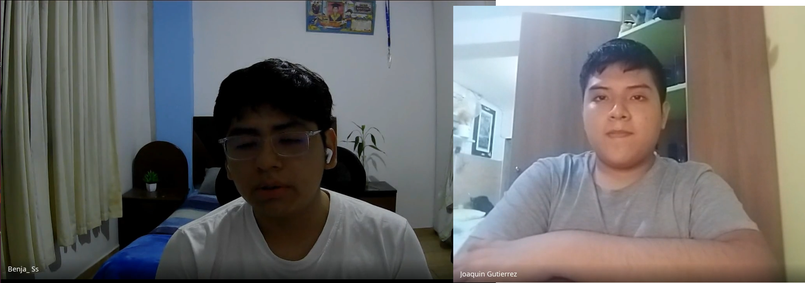 |
| Link | https://lix.li/l3F5 |
| Timing donde inicia la entrevista | 4:54 min |
| Duración de la entrevista | 12:17 min |
| Resumen | El entrevistado es un joven agricultor de café de 21 años residente en Quillabamba, Cusco, que trabaja conjuntamente con su padre en una parcela familiar ubicada en Maranura y complementa sus ingresos haciendo servicio de mototaxi. A lo largo de la entrevista, manifiesta que enfrentan pérdidas agrícolas severas debido a sequías y plagas como la roya, las cuales calculan de forma empírica y volumétrica sin un registro detallado de costos operativos o de inversión en insumos. Revela además que los precios de venta son fijados arbitrariamente por acopiadores e intermediarios al carecer de certificaciones formales de calidad en origen, y que la obtención de créditos resulta lenta o condicionante. Frente a este panorama, muestra una alta receptividad para adoptar la plataforma Dymbia como un puente tecnológico generacional en apoyo a su padre, remarcando que la inestabilidad de la señal celular en el campo hace indispensable que la herramienta permita el registro de datos en modo fuera de línea para su posterior sincronización.  **Comportamiento y necesidades:** • **Gestión empírica y tradicional:** Coadministra la parcela con su padre estimando pérdidas únicamente por volumen de sacos cosechados, omitiendo costos operativos hundidos. • **Negociación y financiamiento:** Consulta precios en radio local o WhatsApp, dependiendo de créditos bancarios lentos o adelantos de intermediarios que imponen precios de venta desfavorables. • **Soporte técnico y calidad:** Requiere monitorear tempranamente sequías y enfermedades (roya) sin hardware costoso, además de un certificado digital de calidad para defender un precio justo ante el comprador. • **Registro fuera de línea:** Necesita registrar datos de campo sin depender de una conexión a internet activa o continua debido a la señal inestable.  **Tecnología, marcas y canales:** • **Dispositivos habituales:** Teléfono inteligente (Samsung Galaxy A14) valorando la autonomía de la batería para jornadas en campo. • **Navegación web:** Utiliza Google Chrome para realizar búsquedas de información agrícola, consultar precios, revisar condiciones climáticas y acceder a páginas o servicios digitales cuando dispone de conexión. • **Canales actuales:** WhatsApp para coordinaciones comerciales con fletes y compradores, Yape para pagos/cobros rápidos y redes sociales (Facebook e Instagram). • **Conectividad:** Cobertura móvil inestable e intermitente en la parcela (Claro y Bitel), con pérdida total de señal en quebradas, dependiendo de la sincronización nocturna al retornar a Quillabamba. • **Disposición tecnológica:** Alta apertura para adoptar la plataforma móvil y actuar como puente tecnológico generacional para su padre. |

| Entrevista #3 |  |
| :--- | :--- |
| Nombre | Marco Teodoro |
| Apellidos | Palomino Sánchez |
| Edad | 27 |
| Distrito | Andahuaylas - Apurímac |
| Evidencia | 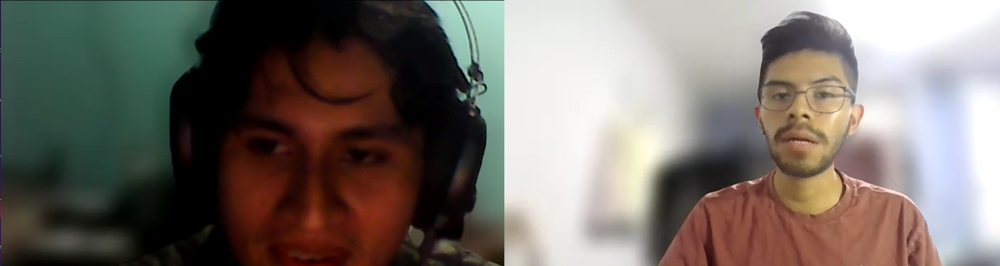 |
| Link | https://lix.li/l3F5 |
| Timing donde inicia la entrevista | 12:19 min |
| Duración de la entrevista | 19:42 min |
| Resumen | El entrevistado es Marco Teodoro Palomino Sánchez, un joven agricultor y gestor técnico de 27 años residente en Andahuaylas, Apurímac, que coadministra junto a su familia parcelas dedicadas exclusivamente al cultivo de papa en San Jerónimo y Kishuará. Durante la entrevista, señala que enfrentan pérdidas financieras severas causadas por heladas y plagas como la rancha, las cuales calcula rigurosamente mediante el registro digital de insumos, semillas y jornales para determinar el costo exacto por kilo. Manifiesta que busca defender el valor de sus sacos de papa apoyándose en costos reales y precios de referencia del mercado mayorista para negociar de manera equitativa frente a los acopiadores, financiándose mediante crédito agrícola formal.  **Comportamiento y necesidades:** • **Gestión y control de costos:** Coadministra las parcelas de papa llevando un registro digital de fertilizantes, semillas certificadas y jornales para calcular el costo real de producción por kilo y evitar ventas a pérdida. • **Negociación y financiamiento:** Consulta precios de referencia del Mercado Mayorista en Lima por internet/WhatsApp; se financia mediante crédito agrícola formal (Cajas Municipales, Agrobanco) o reinversión propia para no depender de acopiadores. • **Soporte técnico y prevención:** Requiere alertas climáticas tempranas (heladas) y monitoreo satelital de humedad y salud foliar (índice NDVI) para prevenir plagas como la rancha sin inversión en hardware costoso. • **Registro fuera de línea:** Necesita registrar labores e insumos en campo sin depender de conectividad continua a internet, sincronizando la información al retornar a Andahuaylas.  **Tecnología, marcas y canales:** • **Dispositivos habituales:** Teléfono inteligente de gama media (Xiaomi Redmi Note) valorando el rendimiento de la batería para jornadas en campo. • **Navegación web:** Emplea Google Chrome para consultar precios del mercado mayorista, buscar información técnica sobre cultivos y acceder a información meteorológica y financiera. • **Canales actuales:** WhatsApp para coordinaciones comerciales con fletes y acopiadores, banca móvil (Yape, BCP), redes sociales (Facebook) y aplicaciones meteorológicas. • **Conectividad:** Cobertura móvil inestable o nula en las parcelas de Kishuará (caídas a 3G o zonas sin cobertura), dependiendo de la sincronización nocturna al retornar a la ciudad. • **Disposición tecnológica:** Alta apertura para adoptar la plataforma móvil y actuar como puente tecnológico generacional para capacitar y apoyar a sus familiares mayores. |

**Segmento 2:  Productores organizados y directivos de cooperativas agrícolas**

| Entrevista #1 |  |
| :--- | :--- |
| Nombre | Alex |
| Apellidos | Nina Condori |
| Edad | 28 |
| Distrito | Ocongate - Cusco |
| Evidencia | 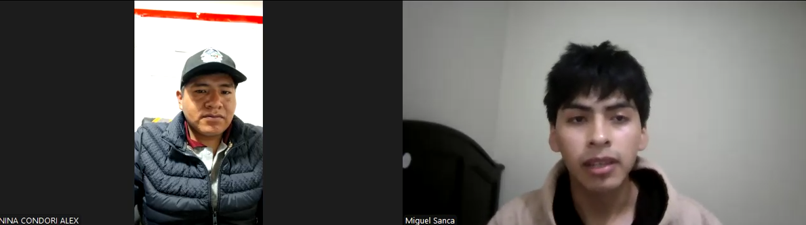 |
| Link | https://lix.li/l3F5 |
| Timing donde inicia la entrevista | 19:45 min |
| Duración de la entrevista | 26:03 min |
| Resumen | El entrevistado se desempeña como gerente de operaciones de productos agrícolas en un distrito de Cusco. Señaló que actualmente coordinan avisos y alertas mediante grupos de WhatsApp y radioemisoras provinciales, pero estas vías se ven severamente afectadas por factores climáticos, por lo que requieren canales más directos y estables. En la fase de acopio, aplican muestreos aleatorios y catación en laboratorio; bonifican económicamente los lotes que cumplen con altos estándares de calidad y penalizan castigando el precio a los lotes deficientes. Respecto a la adopción digital, indicó que la principal barrera es cultural y etaria, ya que la mayoría de los socios son adultos mayores habituados a registros en papel físico. En materia comercial y de exportación, afirmó no haber tenido rechazos físicos ni devoluciones de carga, aunque sí enfrentan trabas y observaciones administrativas con SUNAT y normativas internacionales de destino. Finalmente, expresó una alta disposición y necesidad de adoptar una plataforma digital móvil para agilizar los controles de calidad y reemplazar las libretas físicas, haciendo énfasis en brindar capacitación a los socios para garantizar su adopción.  **Comportamiento y necesidades:** • **Alertas climáticas directas:** Requiere un canal confiable para recibir avisos de heladas y sequías que no dependa de radioemisoras locales vulnerables al clima. • **Transparencia en el acopio:** Necesita digitalizar los muestreos de calidad (calibre y catación) para justificar de forma objetiva las bonificaciones o penalizaciones de pago. • **Facilidad de uso y capacitación:** Demanda una interfaz intuitiva con acompañamiento técnico para reducir la resistencia al cambio en productores habituados al papel.  **Tecnología, marcas y canales:** • **Canales actuales:** WhatsApp para coordinación virtual y radioemisoras provinciales para avisos masivos. • **Navegación web:** Utiliza Google Chrome para consultar información sobre normativas, certificaciones, temas comerciales, SUNAT y condiciones climáticas. • **Dispositivos habituales:** Teléfono inteligente (smartphone). • **Registro actual:** Notas y libretas físicas de campo por parte de los socios. • **Disposición tecnológica:** Alta apertura hacia una plataforma móvil que agilice los controles de calidad y simplifique las auditorías. |

| Entrevista #2 |  |
| :--- | :--- |
| Nombre | Caleb |
| Apellidos | Quispe |
| Edad | 27 |
| Distrito | Arequipa - San Martin |
| Evidencia | 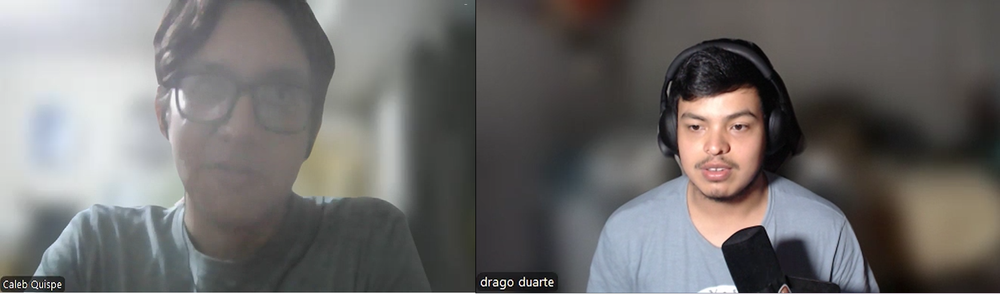 |
| Link | https://lix.li/l3F5 |
| Timing donde inicia la entrevista | 26:05 min |
| Duración de la entrevista | 29:46 min |
| Resumen | El entrevistado, se desempeña como gerente de una cooperativa agrícola en el distrito de San Martín de las Cumbres, Arequipa. Representa a 300 socios y tiene como prioridad asegurar su rentabilidad. Señaló que actualmente advierten sobre amenazas climáticas mediante grupos de WhatsApp, recurriendo a SMS, radio local y técnicos de campo para las zonas altas sin internet, aunque con el riesgo de que la alerta llegue tarde. Durante el acopio, bonifican económicamente por quintal a quienes superan estándares de calidad y penalizan a los deficientes pagándoles el precio mínimo del mercado convencional, lo que les hace perder los beneficios cooperativos. Respecto a la digitalización, indicó que la principal barrera es cultural, dado que la mayoría de los socios superan los 50 años, temen equivocarse en el celular y prefieren su cuaderno físico; a esto se suma la falta de conectividad en las chacras. En el ámbito comercial, cerca del 10% de sus ventas sufre castigos en el precio debido a cuadernos de field incompletos, lo que ocasiona la pérdida de sellos de certificación (como el Orgánico). Finalmente, expresó una total disposición para que la cooperativa asuma económicamente una plataforma tecnológica como gasto operativo, siempre que esta reduzca las semanas de papeleo previas a las auditorías y garantice la conservación de las primas económicas.  **Comportamiento y necesidades:** • **Alertas climáticas oportunas:** Requiere un sistema de comunicación que evite los retrasos actuales al notificar a las zonas más altas y desconectadas de internet. • **Protección de certificaciones:** Necesita asegurar que los datos de trazabilidad estén completos para mantener sellos orgánicos y evitar el castigo en el precio de sus lotes. • **Eficiencia administrativa:** Demanda reducir drásticamente las semanas de papeleo manual que actualmente exigen las auditorías. • **Accesibilidad e inclusión digital:** Necesita herramientas muy intuitivas que superen la desconfianza tecnológica de los productores mayores de 50 años y que puedan operar en fincas sin cobertura..  **Tecnología, marcas y canales:** • **Canales actuales:** WhatsApp, mensajes de texto (SMS), radio local en las madrugadas y visitas presenciales de técnicos de campo. • **Navegación web:** Emplea Google Chrome para revisar información vinculada con certificaciones, mercados, condiciones climáticas y requisitos administrativos de la cooperativa. • **Dispositivos habituales:** Teléfonos inteligentes (smartphones) en zonas conectadas y celulares básicos o radios en zonas remotas. • **Registro actual:** Cuadernos físicos de field y papeleo manual. • **Disposición tecnológica:** Muy alta y con respaldo de inversión; perciben la adopción de una plataforma como un gasto operativo justificable que "se paga solo" al salvar las primas de certificación y agilizar el trabajo. |

| Entrevista #3 |  |
| :--- | :--- |
| Nombre | Cristo Valentino |
| Apellidos | Aquise Chauca |
| Edad | 27 |
| Distrito | San Antonio - Cañete |
| Evidencia |  |
| Link | https://lix.li/l3F5 |
| Timing donde inicia la entrevista | 29:52 min |
| Duración de la entrevista | 34:07 min |
| Resumen | El participante es un socio de 27 años radicado en el distrito de San Antonio (Cañete) e integrado en una organización cooperativa. Indicó que la transmisión de advertencias por eventos climáticos adversos se efectúa a través de chats zonales en WhatsApp y contacto directo telefónico a representantes de sector, contrarrestando la deficiente cobertura en parcelas. Durante la etapa de recepción del grano, ejecutan pruebas técnicas para ajustar tarifas con castigos económicos ante excesos de humedad o fallas, e incentivos financieros respaldados por clientes internacionales para perfiles de taza destacados. Sobre el seguimiento del producto, reveló que un 10% de las cargas destinadas al mercado exterior experimentó demoras por vacíos de datos de origen. Catalogó el apego a cuadernos físicos como el obstáculo determinante para la migración digital, agravado por la edad avanzada de varios miembros. Por último, ratificó el compromiso financiero del gremio para costear un sistema digital siempre que simplifique los procesos de fiscalización y auditoría anual.  **Comportamiento y necesidades:** • **Flujo contingente de avisos:** Precisa un mecanismo ágil para distribuir alertas por inclemencias o plagas vía WhatsApp y contactos clave de zona, sorteando la falta de conectividad continua en los campos. • **Criterios objetivos en liquidaciones:** Busca respaldar las deducciones de precio por imperfecciones y los premios económicos mediante análisis de laboratorio al momento del pesaje. • **Agilización de certificaciones:** Requiere migrar los registros manuscritos a un formato digital para asegurar la trazabilidad comercial y aminorar la carga operativa durante las auditorías formales.  **Tecnología, marcas y canales:** • **Canales actuales:** Comunidades temáticas en WhatsApp divididas regionalmente y comunicaciones móviles directas con enlaces sectoriales. • **Navegación web:** Utiliza Google Chrome para consultar información comercial, requisitos de certificación, precios y documentación relacionada con la trazabilidad del producto. • **Dispositivos habituales:** Teléfono inteligente para comunicación, coordinación y acceso a información digital. • **Registro actual:** Inclinación hacia libretas de papel por arraigo cultural, sensación de resguardo físico y dificultades de adaptabilidad tecnológica en afiliados mayores. • **Disposición tecnológica:** Disposición favorable del grupo para asumir la suscripción de un software portátil si reduce el tiempo invertido en trámites de certificación. |

**Segmento 3: Ingenieros agrónomos y asesores técnicos de campo**

| Entrevista #1 |  |
| :--- | :--- |
| Nombre | Erly |
| Apellidos | Mapelli |
| Edad | 50 |
| Distrito | Pasco - Oxapampa |
| Evidencia | 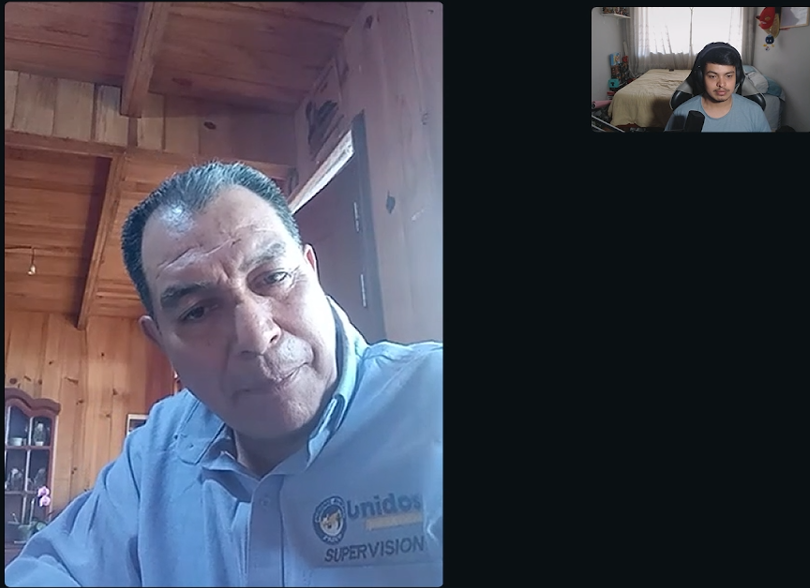 |
| Link | https://lix.li/l3F5 |
| Timing donde inicia la entrevista | 34:12 min |
| Duración de la entrevista | 47:06 min |
| Resumen | El entrevistado es un ingeniero agrónomo de Oxapampa (egresado de la UNDAC) con experiencia en asistencia técnica para cultivos perennes como café, palto y granadilla en zonas de selva central como Pozuzo. Destaca que la topografía abrupta, las quebradas y el clima lluvioso reducen la capacidad operativa real de un asesor a un rango de entre 15 y 25 productores mensuales para mantener visitas continuas (mínimo cada 30 días). Enfatiza la dificultad de erradicar el hábito empírico de fumigar por calendario sin presencia real de plagas, y señala que la evaluación de daños climáticos se realiza de forma manual y visual mediante recorridos en patrones (X, M, Z). Valora el uso de herramientas digitales básicas para coordinar y dosificar, destacando la georreferenciación vinculada al Padrón de Productores Agrarios (PPA).  **Comportamiento y necesidades:** • **Capacidad operativa condicionada:** La cobertura técnica efectiva cae a 15–25 productores al mes debido a caminatas de hasta 3 horas por quebradas y demoras por lluvias intensas. • **Justificación de impacto por contraste:** Demuestra el valor de su asesoría comparando visualmente parcelas de productores que acataron las pautas técnicas frente a los que no las aplicaron. • **Resistencia al cambio en fitosanidad:** Enfrenta la costumbre del productor de aplicar agroquímicos de forma fija por calendario (cada 8–10 días) sin leer etiquetas ni verificar síntomas previos. • **Evaluación visual de siniestros:** Requiere recorrer físicamente toda el área en patrones (X, M, Z) para estimar daños por heladas, lluvias o sequías según la etapa fenológica del cultivo.  **Tecnología, marcas y canales:** • **Dispositivos habituales:** Teléfono inteligente y computadora para comunicación, elaboración de tablas y gestión de información técnica. • **Canales y apps genéricas:** Emplea WhatsApp como canal primario de contacto directo con los agricultores que cuentan con señal o wifi en sus localidades. • **Navegación web:**Utiliza Google Chrome para consultar información técnica agrícola, acceder a plataformas institucionales y revisar información relacionada con el Padrón de Productores Agrarios (PPA). • **Herramientas de cálculo:** Inclinación hacia libretas de papel por arraigo cultural, sensación de resguardo físico y dificultades de adaptabilidad tecnológica en afiliados mayores. • **Sistemas de información geográfica:** Se apoya en Google Maps y en la georreferenciación de parcelas vinculada al PPA. • **Entorno de conectividad:** Cobertura de red presente en caseríos, pero nula o restringida en quebradas y áreas de tránsito a pie. |

| Entrevista #2 |  |
| :--- | :--- |
| Nombre | Eddy Alberto |
| Apellidos | Torres Martinez |
| Edad | 30 |
| Distrito | Mala - Cañete |
| Evidencia | 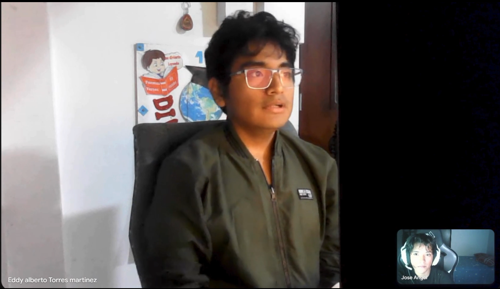 |
| Link | https://lix.li/l3F5 |
| Timing donde inicia la entrevista | 47:18 min |
| Duración de la entrevista | 51:52 min |
| Resumen | El entrevistado es un asesor técnico de 30 años radicado en el distrito de Mala (Cañete), perteneciente al segmento de ingenieros agrónomos y especialistas de campo. Explicó que el tope máximo de atención personalizada se sitúa entre 35 y 40 agricultores por mes debido a la dispersión geográfica y al diligenciamiento manual de informes. En su rutina diaria emplea herramientas genéricas desarticuladas como WhatsApp, planillas de Excel y marcaciones en Google Maps para rastrear predios. Manifestó que sustentar el retorno de inversión de la asistencia presencial ante las directivas resulta complejo, dependiendo de comparativas de rendimiento o evidencias fotográficas postratamiento. Destacó que el principal reto en campo radica en erradicar la sobreaplicación de insumos agroquímicos por parte del productor empírico. Finalmente, advirtió que las evaluaciones de siniestros climáticos se efectúan mediante inspecciones en zigzag totalmente subjetivas, lo que deriva en diagnósticos tardíos o imprecisos del daño radicular e hídrico.  **Comportamiento y necesidades:** • **Escalabilidad en asistencia de campo:** Requiere optimizar los tiempos de traslado y el llenado de fichas físicas para superar el umbral restrictivo de 35 a 40 productores monitoreados al mes. • **Justificación del impacto técnico:** Necesita reportar con métricas objetivas ante la gerencia que las asistencias preventivas protegen la productividad y no representan un gasto superfluo. • **Estandarización de diagnósticos de daño:** Demanda herramientas de medición precisa para erradicar la inspección visual en zigzag y detectar oportunamente el estrés hídrico subsuperficial.  **Tecnología, marcas y canales:** • **Dispositivos habituales:** Teléfono inteligente y computadora para el seguimiento de predios, comunicación con productores y consolidación de informes. • **Canales actuales:** Intercambio de fotografías por WhatsApp para consultas fitosanitarias y geolocalización puntual con Google Maps. • **Navegación web:** Emplea Google Chrome para buscar información técnica, consultar productos agrícolas, revisar documentación y acceder a plataformas relacionadas con su trabajo de campo. • **Registro actual y barreras:**Hojas de cálculo en Excel para consolidación administrativa y fichas manuscritas durante las inspecciones presenciales. • **Disposición tecnológica:** Elevado interés en adoptar soluciones de agricultura de precisión que unifiquen la gestión de datos y mitiguen la dosificación empírica de agroquímicos. |

| Entrevista #3 |  |
| :--- | :--- |
| Nombre | Jorge |
| Apellidos | Rodríguez Espinoza |
| Edad | 30 |
| Distrito | Piura |
| Evidencia | 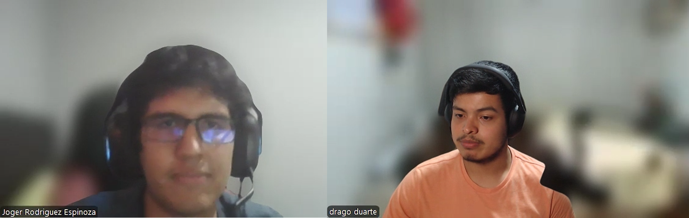 |
| Link | https://lix.li/l3F5 |
| Timing donde inicia la entrevista | 51:53 min |
| Duración de la entrevista | 56:29 min |
| Resumen | El entrevistado es un ingeniero agrónomo residente en Piura, de 30 años. A lo largo de la entrevista, manifiesta que mediante métodos tradicionales (libreta y camioneta) puede supervisar eficientemente a un máximo de 30 a 40 productores o 300 hectáreas, límite a partir del cual la prevención decae y el trabajo se vuelve reactivo. Para organizar su día a día y documentar sus visitas, utiliza herramientas genéricas como WhatsApp, Excel y Google Maps, aunque reconoce que la información resulta muy fragmentada. Revela además que cuantificar el rendimiento salvado tras una intervención es un reto constante que aborda mediante fotografías de "antes y después" y comparaciones con "lotes testigo" o históricos, asumiendo un margen de subjetividad. Destaca que la mayor dificultad con el agricultor empírico es erradicar la sobredosificación de agroquímicos y lograr el cumplimiento de los tiempos de carencia y uso de protección. Finalmente, evalúa los daños climáticos mediante muestreos físicos en zigzag, dependiendo fuertemente de su experiencia visual para estimar porcentajes de pérdida.  **Comportamiento y necesidades:** • **Gestión y control de cobertura:** Administra y limita su alcance a un máximo de 40 productores o 300 hectáreas para mantener la calidad preventiva de su asesoría, evitando que la saturación lo obligue a simplemente "apagar incendios". • **Demostración de resultados:** Necesita elaborar reportes visuales y comparativos (lote tratado vs. lote testigo o histórico) para sustentar ante la gerencia de la cooperativa el impacto real de sus visitas, buscando minimizar la subjetividad de sus estimaciones. • **Capacitación y corrección de hábitos:** Enfrenta el desafío constante de educar al agricultor empírico en la calibración precisa de equipos de fumigación, el respeto estricto de los periodos de carencia pre-cosecha y el uso de equipos de protección personal (EPP). • **Evaluación de campo y muestreo:** Requiere realizar recorridos presenciales estandarizados (en "X" o zigzag) para tomar muestras aleatorias y diagnosticar visualmente el estrés hídrico o daño foliar, dependiendo de su "ojo" y experiencia agronómica.  **Tecnología, marcas y canales:** • **Dispositivos y software habituales:** Uso intensivo de teléfono inteligente y computadora para combinar hojas de cálculo (Excel) en la gestión de cronogramas y software de mapeo (Google Maps/Earth) para ubicar los predios. • **Canales de comunicación:** WhatsApp es la herramienta central y más ágil de su día a día, utilizada para recibir alertas tempranas, fotos de hojas dañadas y audios con consultas directas de los productores. • **Gestión de datos fragmentada:** La dependencia de un ecosistema de aplicaciones genéricas no conectadas entre sí genera una necesidad subyacente de centralizar y estructurar la información técnica que actualmente se dispersa. • **Diagnóstico visual sin sensores:** A pesar del uso de herramientas digitales para la organización, la toma de datos biométricos en campo (grado de marchitamiento, caída de flores, cuajado) sigue siendo un proceso 100% analógico, visual y basado en la experiencia personal. |

### 2.2.3. Análisis de entrevistas

#### Segmento 1: Pequeños y medianos agricultores independientes de papa y café
Se analizaron tres entrevistas realizadas a jóvenes agricultores que participan activamente en la administración de parcelas familiares de papa y café. El análisis permitió identificar patrones relacionados con la gestión económica de la producción, la exposición a riesgos climáticos, la dependencia de intermediarios, las limitaciones de conectividad y la adopción de herramientas digitales.

#### Características

| Característica                                     | Mención |   %   | Evidencia                                                                                                                                                       |
|----------------------------------------------------|:-------:|:-----:|-----------------------------------------------------------------------------------------------------------------------------------------------------------------|
| Coadministración familiar de la parcela            |   3/3   | 100%  | Los entrevistados participan en la gestión agrícola junto con sus padres o familiares directos.                                                                 |
| Pérdidas por fenómenos climáticos y plagas         |   3/3   | 100%  | Reportan afectaciones por heladas, sequías, roya y rancha, dependiendo del cultivo y ubicación.                                                                 |
| Influencia de intermediarios en el precio de venta |   3/3   | 100%  | Los productores negocian con acopiadores que tienen una fuerte influencia sobre el precio final de la cosecha.                                                  |
| Conectividad móvil inestable o nula en campo       |   3/3   | 100%  | Existen caídas de señal, reducción a 3G/Edge o pérdida total de cobertura en parcelas y quebradas.                                                              |
| Uso de smartphones como herramienta principal      |   3/3   | 100%  | Utilizan teléfonos inteligentes de gama media, como Xiaomi Redmi Note y Samsung Galaxy A14.                                                                     |
| Uso de WhatsApp para coordinación comercial        |   3/3   | 100%  | Se emplea para coordinar con compradores, acopiadores, transporte y consultar información relacionada con precios.                                              |
| Uso de Google Chrome para consultas web            |   3/3   | 100%  | Se utiliza para consultar precios, información agrícola, condiciones climáticas y otros servicios digitales.                                                    |
| Uso de aplicaciones y servicios digitales          |   3/3   | 100%  | Emplean herramientas como Yape, BCP, Facebook, Instagram y aplicaciones meteorológicas.                                                                         |
| Necesidad de funcionamiento offline                |   3/3   | 100%  | Requieren registrar información en campo sin internet y sincronizarla posteriormente al recuperar cobertura.                                                    |
| Apertura hacia nuevas soluciones digitales         |   3/3   | 100%  | Los entrevistados muestran disposición para utilizar plataformas agrícolas móviles y apoyar a familiares mayores en su adopción.                                |
| Registro estructurado de costos                    |   2/3   | 66.7% | Dos entrevistados registran digitalmente fertilizantes, semillas y jornales; uno realiza estimaciones principalmente por volumen cosechado.                     |
| Uso de financiamiento agrícola formal              |   2/3   | 66.7% | Dos entrevistados mencionan directamente Agrobanco, Cajas Municipales o reinversión; el tercero enfrenta dificultades de acceso y también depende de adelantos. |
| Consulta de precios mayoristas por internet        |   2/3   | 66.7% | Dos entrevistados consultan precios de referencia del Mercado Mayorista de Lima mediante internet o WhatsApp.                                                   |

#### Insights

1. **El registro de costos fortalece la capacidad de negociación frente a intermediarios:**  
   Existe una diferencia entre los agricultores que calculan detalladamente sus costos de producción y quienes continúan estimando las pérdidas principalmente por cantidad de sacos obtenidos. Registrar fertilizantes, semillas, jornales y otros gastos permite conocer el costo real por kilo o quintal y establecer una referencia más sólida al momento de negociar con los acopiadores.

2. **La conectividad limitada convierte el funcionamiento offline en una necesidad:**  
   Los tres entrevistados enfrentan zonas con conexión inestable o inexistente durante las labores agrícolas. Por ello, una solución dirigida a este segmento debería permitir registrar costos, labores, incidencias y datos de producción sin conexión, conservando la información localmente hasta poder sincronizarla posteriormente.

3. **Existe una necesidad común de anticiparse a riesgos climáticos y fitosanitarios:**  
   Heladas, sequías, roya y rancha generan pérdidas importantes. Los productores muestran interés en recibir información preventiva y alertas desde el celular sin tener que invertir directamente en estaciones meteorológicas o sensores de campo costosos.

4. **Los agricultores jóvenes funcionan como puente tecnológico dentro de la familia:**  
   Los entrevistados utilizan smartphones, WhatsApp, servicios financieros digitales, redes sociales y navegación web mediante Google Chrome. Esta familiaridad tecnológica facilita que puedan adoptar nuevas herramientas y posteriormente apoyar a padres o familiares mayores en su utilización.

#### Segmento 2: Productores organizados y directivos de cooperativas agrícolas

Se analizaron tres entrevistas realizadas a representantes de organizaciones agrícolas, incluyendo gerentes, responsables operativos y socios cooperativistas. Se identificaron patrones relacionados con la comunicación de alertas, el control de calidad durante el acopio, la trazabilidad, las auditorías, las dificultades de digitalización y la disposición institucional para financiar soluciones tecnológicas.

#### Características

| Característica                                              | Mención |   %   | Evidencia                                                                                                                                   |
|-------------------------------------------------------------|:-------:|:-----:|---------------------------------------------------------------------------------------------------------------------------------------------|
| Gestión de acopio mediante premios y penalizaciones         |   3/3   |  100% | Los lotes con mejores parámetros de calidad reciben bonificaciones, mientras que aquellos deficientes reciben descuentos o menores precios. |
| Uso de WhatsApp como canal de coordinación                  |   3/3   |  100% | Los tres entrevistados utilizan grupos o comunidades de WhatsApp para coordinar y transmitir información.                                   |
| Uso de canales alternativos por falta de conectividad       |   3/3   |  100% | Se complementa WhatsApp con radio, SMS, llamadas telefónicas o comunicación mediante representantes de sector.                              |
| Problemas en la recepción oportuna de alertas               |   3/3   |  100% | Las condiciones climáticas y la falta de cobertura pueden retrasar o interrumpir la transmisión de información.                             |
| Dependencia de registros físicos                            |   3/3   |  100% | Los productores continúan utilizando cuadernos, notas y documentación física para registrar información agrícola.                           |
| Barrera cultural y generacional para la digitalización      |   3/3   |  100% | Existe resistencia al cambio entre socios de mayor edad acostumbrados al papel y con temor a equivocarse utilizando herramientas digitales. |
| Necesidad de mejorar trazabilidad y auditorías              |   3/3   |  100% | Los tres casos presentan dificultades administrativas, de certificación o trazabilidad relacionadas con los registros de producción.        |
| Disposición institucional para adoptar una plataforma       |   3/3   |  100% | Existe interés en implementar una solución que reduzca procesos manuales y mejore el control de información.                                |
| Uso habitual de smartphones                                 |   3/3   |  100% | El teléfono inteligente es el principal dispositivo digital empleado por responsables y socios con conectividad.                            |
| Uso de Google Chrome para consultas web                     |   3/3   |  100% | Se utiliza para consultar información relacionada con certificaciones, requisitos administrativos, mercados y condiciones climáticas.       |
| Uso de radio y comunicación telefónica como respaldo        |   3/3   |  100% | Se utilizan especialmente para zonas rurales con baja o nula conectividad.                                                                  |
| Impacto económico o comercial por problemas de trazabilidad |   2/3   | 66.7% | Un entrevistado reporta castigos cercanos al 10% de las ventas y otro demoras aproximadas en el 10% de cargas por vacíos de información.    |

#### Insights

1. **La trazabilidad incompleta puede generar consecuencias económicas y administrativas:**  
   Los registros físicos dificultan la consolidación de información requerida durante auditorías y procesos comerciales. En dos de las entrevistas se mencionan impactos cuantificables cercanos al 10%, ya sea mediante castigos sobre ventas o retrasos en cargas ocasionados por vacíos de información.

2. **Existe disposición de las cooperativas para financiar una solución digital:**  
   Los responsables entrevistados consideran justificable invertir en una plataforma si permite reducir trabajo administrativo, agilizar auditorías, proteger certificaciones y conservar beneficios económicos asociados a la calidad de la producción.

3. **La simplicidad de uso es determinante para lograr adopción:**  
   La resistencia tecnológica se concentra principalmente entre socios de mayor edad acostumbrados a los registros físicos. Una solución destinada a este segmento debe presentar procesos simples, comprensibles y acompañados de capacitación.

4. **La comunicación debe contemplar escenarios de baja conectividad:**  
   WhatsApp es el principal canal digital, pero no puede funcionar como único mecanismo de comunicación. Radio, SMS, llamadas y representantes locales continúan siendo necesarios cuando las parcelas se encuentran fuera de cobertura.

#### Segmento 3: Ingenieros agrónomos y asesores técnicos de campo

Se analizaron tres entrevistas realizadas a ingenieros agrónomos y asesores técnicos que trabajan en Oxapampa/Pozuzo, Mala/Cañete y Piura. El análisis permitió identificar limitaciones en la cantidad de productores que pueden supervisar, problemas derivados de los desplazamientos, fragmentación de herramientas digitales y una fuerte dependencia de evaluaciones visuales durante los diagnósticos agrícolas.

#### Características

| Característica                                                  | Mención |   %   | Evidencia                                                                                                                                                                                             |
|-----------------------------------------------------------------|:-------:|:-----:|-------------------------------------------------------------------------------------------------------------------------------------------------------------------------------------------------------|
| Capacidad limitada de productores supervisados                  |   3/3   | 100%  | La cobertura efectiva se encuentra entre 15–25 productores en zonas complejas y alrededor de 30–40 productores en otras zonas; un entrevistado menciona además un límite aproximado de 300 hectáreas. |
| Traslado y dispersión geográfica como limitante                 |   3/3   | 100%  | La distancia entre parcelas, quebradas, lluvias y desplazamientos prolongados reducen la capacidad de atención técnica.                                                                               |
| Uso conjunto de WhatsApp, Excel y Google Maps/Earth             |   3/3   | 100%  | Las tres entrevistas evidencian el uso de estas herramientas de manera independiente para comunicación, registros y localización.                                                                     |
| Fragmentación de la información digital                         |   3/3   | 100%  | La información queda distribuida entre mensajería, hojas de cálculo, mapas y registros manuales.                                                                                                      |
| Dificultad para demostrar objetivamente el impacto técnico      |   3/3   | 100%  | Se utilizan comparaciones visuales, fotografías, lotes tratados/testigo o antecedentes históricos para sustentar resultados.                                                                          |
| Problemas de sobredosificación y malas prácticas fitosanitarias |   3/3   | 100%  | Los agricultores pueden aplicar agroquímicos sin verificar correctamente presencia de plagas, dosis o periodos de carencia.                                                                           |
| Diagnóstico basado principalmente en observación visual         |   3/3   | 100%  | Utilizan recorridos en zigzag, X, M o Z y estimaciones visuales para determinar daños y pérdidas.                                                                                                     |
| Uso de cartografía y geolocalización digital                    |   3/3   | 100%  | Google Maps/Earth se utiliza para localizar parcelas y apoyar el seguimiento territorial.                                                                                                             |
| WhatsApp como principal canal de comunicación                   |   3/3   | 100%  | Reciben fotografías, audios, consultas y alertas directamente desde los productores.                                                                                                                  |
| Uso de Google Chrome para consultas profesionales               |   3/3   | 100%  | Se emplea para buscar información agronómica, consultar documentación técnica y acceder a plataformas digitales.                                                                                      |
| Uso de smartphone para actividades de campo                     |   3/3   | 100%  | Permite comunicación, fotografías, geolocalización y acceso a herramientas digitales.                                                                                                                 |
| Uso explícito de computadora                                    |   1/3   | 33.3% | Solo la tercera entrevista menciona expresamente el uso intensivo de teléfono inteligente y computadora.                                                                                              |

#### Insights

1. **La supervisión presencial establece un límite operativo para el asesor técnico:**  
   La capacidad de atención disminuye conforme aumentan las distancias y dificultades de acceso. En la selva central se reporta una cobertura aproximada de 15 a 25 productores mensuales, mientras que en otras zonas se mencionan límites cercanos a 30 o 40 productores y hasta aproximadamente 300 hectáreas. Al superar estos niveles, el trabajo preventivo comienza a convertirse en atención reactiva.

2. **La evaluación de daños presenta un alto componente de subjetividad:**  
   Los asesores realizan recorridos físicos en patrones como zigzag, X, M o Z y dependen de su experiencia visual para estimar daños por estrés hídrico, lluvias, sequías u otros factores. Del mismo modo, el impacto de una intervención suele demostrarse mediante fotografías o comparación con parcelas testigo.

3. **El principal problema tecnológico no es la ausencia de herramientas, sino su fragmentación:**  
   Los ingenieros agrónomos ya utilizan WhatsApp, Excel, Google Maps/Earth y navegación web mediante Google Chrome. Sin embargo, estas herramientas funcionan de forma separada. Las consultas llegan por WhatsApp, los cálculos se realizan en Excel y las parcelas se ubican mediante aplicaciones cartográficas, generando retrabajo y dispersión de información.

4. **Existe una oportunidad clara de centralizar la gestión técnica de campo:**  
   Una plataforma que integre ubicación de parcelas, historial de visitas, fotografías, recomendaciones, seguimiento de tratamientos y datos técnicos podría reducir la dependencia de registros dispersos y facilitar la generación de evidencia para productores y gerencias.

## 2.3. Needfinding

### 2.3.1. User Personas

A partir del análisis cualitativo y cuantitativo de las 9 entrevistas de campo realizadas a productores, dirigentes cooperativos y agrónomos, se construyeron tres arquetipos de usuario en UXPressia (disponibles en: https://uxpressia.com/w/v8FzI/t/eqZxS). Estos personajes consolidan las conductas, frustraciones y dinámicas de trabajo observadas en el sector agrario real, sirviendo como guía para el diseño funcional de la plataforma SumaqAgro y la startup Dymbia.

#### Segmento 1: Pequeños y medianos agricultores independientes
El arquetipo **Guillermo Cortés** representa al agricultor familiar de los valles interandinos y zonas de selva alta. Trabaja parcelas familiares de 1 a 5 hectáreas de papa y café junto a sus hijos. Maneja sus labores de memoria o en cuadernos de apuntes que frecuentemente se deterioran o pierden por la humedad del campo.

Guillermo no dispone de capital ni infraestructura para instalar sensores de humedad o estaciones meteorológicas en tierra. Además, trabaja la mayor parte del día en quebradas o laderas donde la señal celular (3G o Edge) se corta por completo. Esto lo deja desprotegido frente a eventos climáticos repentinos como heladas o ataques de roya y rancha, detectando el daño cuando ya es irreversible. Al momento de comercializar su cosecha, desconoce el costo real acumulado por saco o quintal (jornales, combustible, fertilizantes), viéndose forzado a aceptar los precios castigados y deducciones arbitrarias que imponen los acopiadores intermediarios.

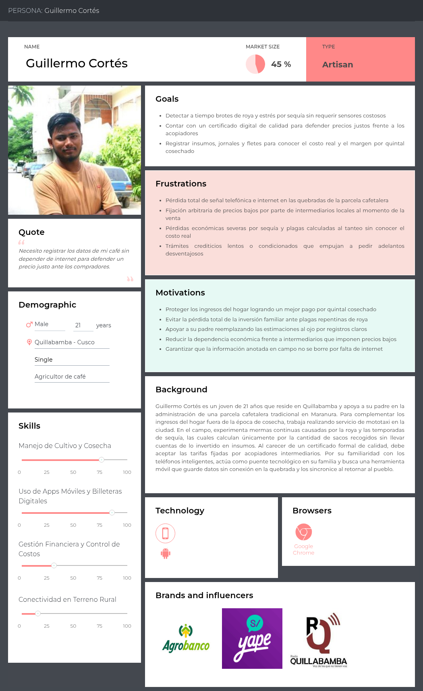

#### Segmento 2: Productores organizados y directivos de cooperativas/asociaciones

El arquetipo **Cristian Santana** refleja el perfil del gerente de operaciones o jefe de acopio cooperativo en zonas cafetaleras y paperas. Es responsable de recibir, pesar, catar y consolidar la producción de cientos de socios empadronados para cumplir con contratos comerciales en mercados mayoristas o de exportación.

El principal obstáculo de Cristian radica en la dependencia de las libretas de papel de los socios, la mayoría adultos mayores con alta resistencia a interfaces tecnológicas complejas. Esta falta de digitalización provoca que hasta un 10% de los lotes sufra demoras u observaciones en aduanas y auditorías de sellos de calidad (como orgánico o comercio justo) por vacíos en la trazabilidad de origen. Asimismo, los métodos manuales de liquidación en almacén generan desconfianza al aplicar bonificaciones o penalizaciones por calidad física y sensorial (calibres o puntaje de taza SCA).

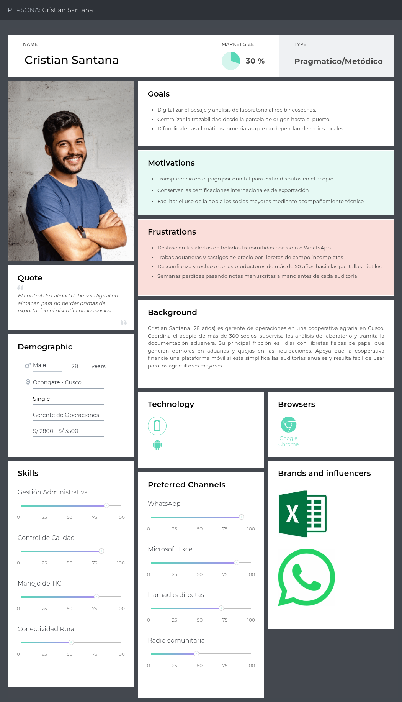

#### Segmento 3: Ingenieros agrónomos y asesores técnicos de campo

El arquetipo **Juan Antonio Morales** representa al profesional de extensión agrícola que asiste técnicamente a decenas de agricultores distribuidos en zonas geográficamente dispersas y de difícil acceso (caminatas de 2 a 3 horas entre predios).

La cobertura técnica de Juan Antonio está limitada a un máximo de 20 a 40 productores al mes. Esta restricción de tiempo lo obliga a realizar un trabajo netamente reactivo, acudiendo a las parcelas únicamente cuando la plaga o el estrés hídrico ya se manifestaron visualmente. Sus diagnósticos de daños por siniestros climáticos se basan en recorridos en zigzag altamente subjetivos ("al ojo"), y sus recomendaciones técnicas quedan dispersas en mensajes informales de WhatsApp o notas sueltas, dificultando demostrar con datos numéricos el retorno de inversión de sus visitas técnicas frente a la gerencia de la cooperativa.

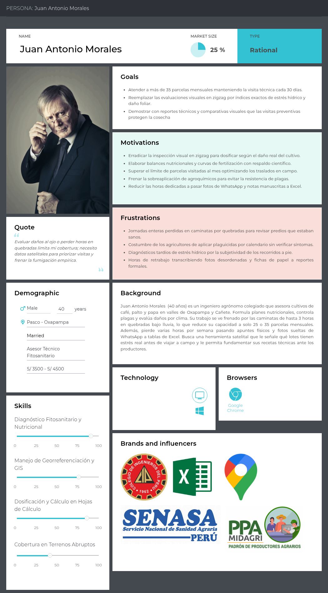

### 2.3.2. User Task Matrix

El **User Task Matrix** evalúa las tareas clave que realizan los tres arquetipos en la cadena de valor:
* **Segmento 1: Pequeños y medianos agricultores independientes de papa y café**, representado por **Guillermo Cortés** (Agricultor Independiente).
* **Segmento 2: Productores organizados y directivos de cooperativas agrícolas**, representado por **Cristian Santana** (Directivo de Cooperativa).
* **Segmento 3: Ingenieros agrónomos y asesores técnicos de campo**, representado por **Juan Antonio Morales** (Asesor Técnico).

| Tarea Identificada | Guillermo Cortés (Agricultor) Frecuencia \| Importancia | Cristian Santana (Directivo) Frecuencia \| Importancia | Juan Antonio Morales (Asesor) Frecuencia \| Importancia |
| :--- | :---: | :---: | :---: |
| **Inspección fitosanitaria del cultivo** | Often \| High | Rarely \| Low | Often \| High |
| **Registro de costos, jornales e insumos** | Sometimes \| High | Sometimes \| High | Rarely \| Low |
| **Monitoreo de alertas climáticas** | Often \| High | Often \| High | Sometimes \| High |
| **Aplicación de agroquímicos y fertilizantes** | Often \| High | Never \| Low | Sometimes \| High |
| **Evaluación de daños post-siniestro** | Sometimes \| High | Rarely \| Medium | Sometimes \| High |
| **Negociación de volúmenes y precios** | Sometimes \| High | Often \| High | Never \| Low |
| **Auditoría de cuadernos de campo (trazabilidad)** | Never \| Low | Often \| High | Sometimes \| High |
| **Control de calidad y catación en acopio** | Rarely \| Medium | Often \| High | Rarely \| Medium |
| **Georreferenciación y mapeo de parcelas** | Never \| Low | Sometimes \| High | Often \| High |
| **Planes de dosificación nutricional** | Rarely \| Low | Rarely \| Low | Often \| High |
| **Informes de visitas técnicas** | Never \| Low | Sometimes \| High | Often \| High |
| **Gestión de certificaciones (orgánica/origen)** | Never \| Low | Often \| High | Rarely \| Medium |

#### Análisis del Task Matrix

##### 1. Tareas Críticas (Mayor Frecuencia e Importancia)
* **Clima y prevención:** *Monitorear alertas climáticas* es la tarea con mayor peso transversal (**High** para todos, **Often** para Guillermo y Cristian), siendo vital para mitigar riesgos agronómicos y de abastecimiento.
* **Núcleo operativo de campo:** *Inspeccionar fitosanitariamente* y *aplicar insumos* lideran en Guillermo (**Often / High**) y Juan Antonio (**Often / High** en diagnóstico).
* **Gestión comercial y normativa:** *Negociar precios/volúmenes*, *auditar cuadernos de campo* y *gestionar certificaciones* son exclusivas de Cristian (**Often / High**).

##### 2. Principales Coincidencias
* **Monitoreo y respuesta a siniestros:** Alta relevancia compartida en clima y daños post-siniestro entre agricultor y asesor para replantear el manejo técnico.
* **Control de costos:** Tanto Guillermo como Cristian priorizan el registro financiero (**High**), aunque su ejecución es intermitente (**Sometimes**).
* **Trazabilidad y georreferenciación:** Cristian y Juan Antonio coinciden en la alta importancia de auditar lotes y parcelas (**High**) como requisito para certificar y formular planes.

##### 3. Principales Diferencias
* **Campo vs. Administración:** Guillermo ejecuta labores físicas directas (*Never / Low* para Cristian), mientras Cristian gestiona acopio, auditorías y certificaciones (*Never / Low* para Guillermo).
* **Prescripción técnica:** Juan Antonio formula recetas y dosificaciones nutricionales (**Often / High**), rol donde el agricultor y directivo solo actúan como receptores (*Rarely / Low*).
* **Comercialización:** Ausente en el asesor técnico (**Never / Low**), pero crítica y formal en la cooperativa (**Often / High**), frente a una negociación esporádica e individual en el agricultor independiente (**Sometimes / High**).
### 2.3.3. User Journey Mapping

Con el User Journey Map (disponible en: https://uxpressia.com/w/v8FzI/t/eqZxS) reconstruimos paso a paso lo que viven y sienten el administrador y la familia durante el proceso. Al hacer visibles sus principales dificultades y puntos de dolor, podemos dirigir nuestra solución tecnológica justo donde más se necesita, convirtiendo una mala experiencia en un proceso simple y eficiente.

#### Segmento 1: Pequeño agricultor independiente de café (Guillermo Cortés)

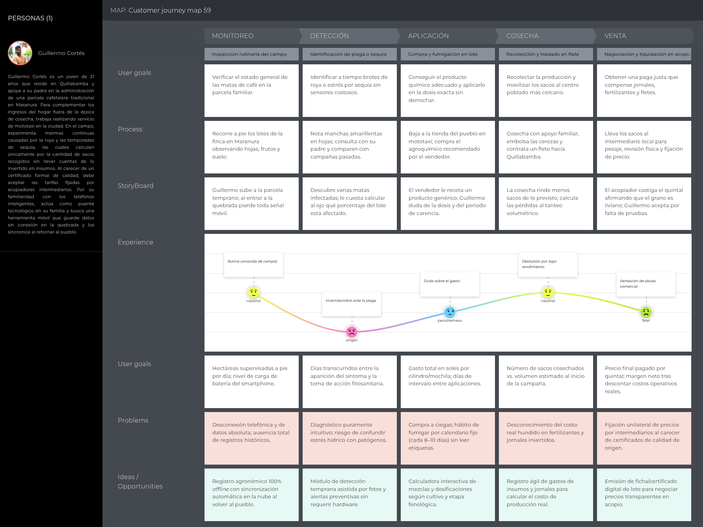

#### Segmento 2: Gerente de operaciones de cooperativa agraria (Cristian Santana)

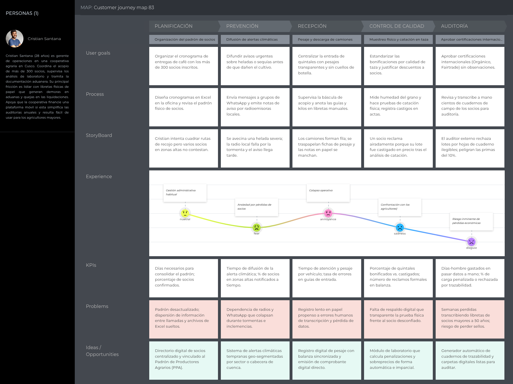

#### Segmento 3: Asesor técnico de campo (Juan Antonio Morales)

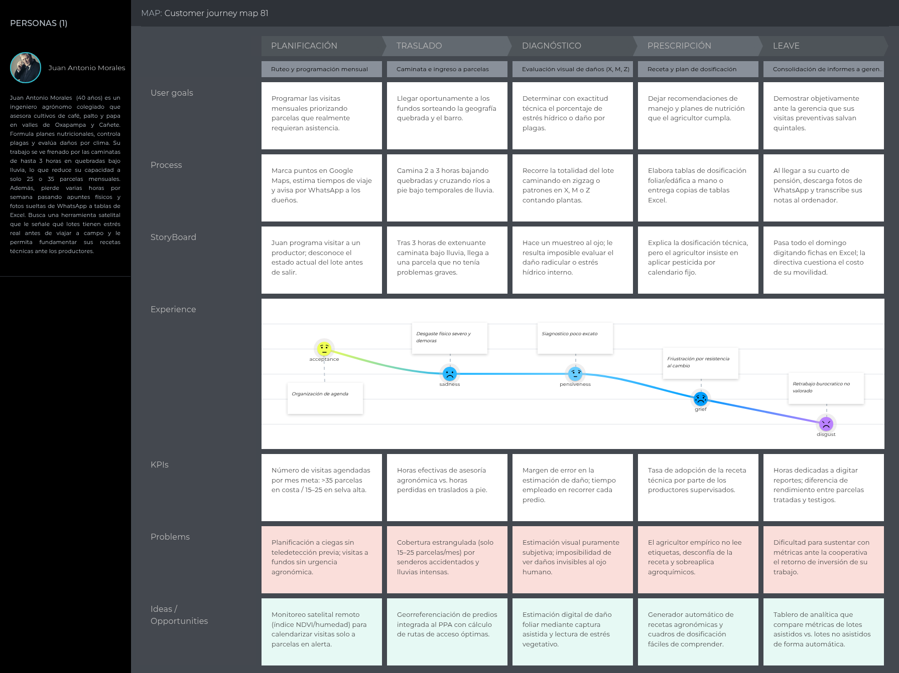

### 2.3.4. Empathy Mapping

Crear un producto con impacto real exige mirar más allá de las conductas visibles y conectar con el aspecto emocional del usuario. Mediante el mapa de empatía (disponible en: https://uxpressia.com/w/v8FzI/t/eqZxS), superamos la simple segmentación demográfica para comprender su contexto interno. Desglosar lo que administradores y familias perciben, expresan y experimentan en su día a día nos permite descubrir tanto sus temores como sus expectativas clave.
#### Segmento 1: Pequeño agricultor independiente de café (Guillermo Cortés)

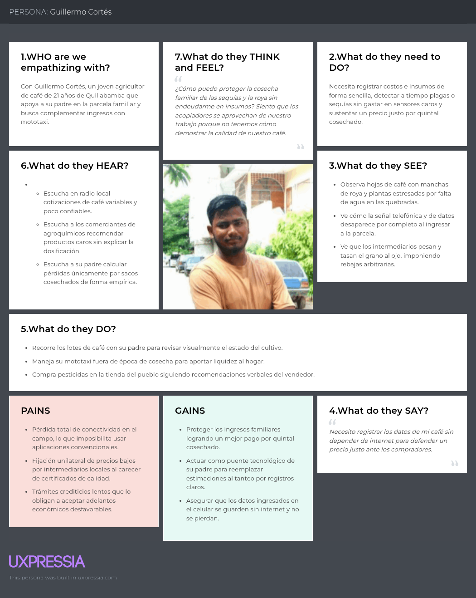

#### Segmento 2: Gerente de operaciones de cooperativa agraria (Cristian Santana)

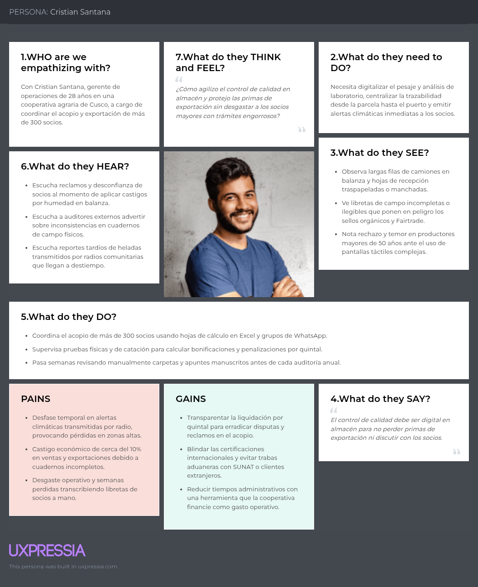

#### Segmento 3: Asesor técnico de campo (Juan Antonio Morales)

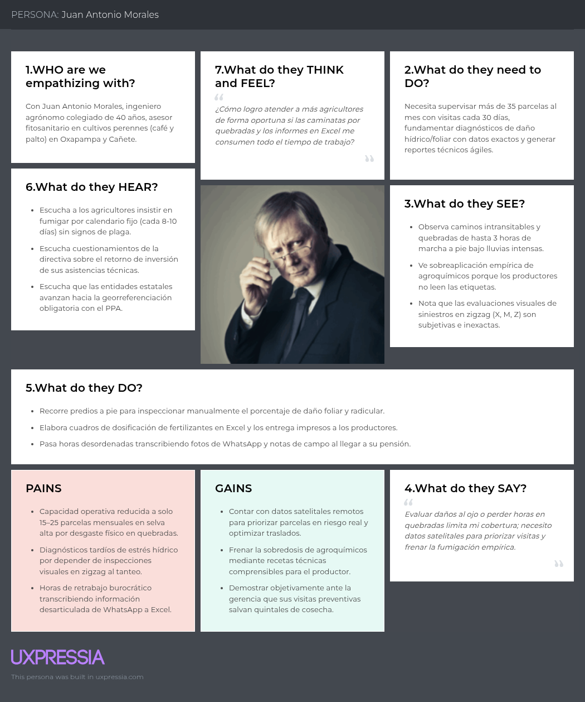

## 2.4. Big Picture Event Storming

En una sesión colaborativa sincrónica mediante la herramienta Miro, el equipo llevó a cabo el modelado del dominio de negocio a través de la técnica de Big Picture Event Storming, tomando como referencia las pautas de la guía metodológica (<https://bit.ly/bpes-guide>). Esta dinámica permitió explorar de forma visual e intuitiva el ciclo de vida productivo y comercial en las cadenas de papa andina y café de especialidad, identificando los eventos trascendentales del negocio, los cuellos de botella operativos y los hitos comerciales sin sesgos tempranos de desarrollo técnico.

### Exploración No Estructurada de Eventos (Domain Events)
El taller inició con una lluvia de ideas abierta en la que cada integrante aportó hechos consumados de relevancia agronómica, financiera y de certificación. Estos eventos se formularon estrictamente en tiempo pasado participio mediante notas adhesivas de color naranja, abarcando desde la delimitación del predio y el cálculo de índices satelitales, hasta la anotación diaria de jornales y la emisión de certificados de calidad:

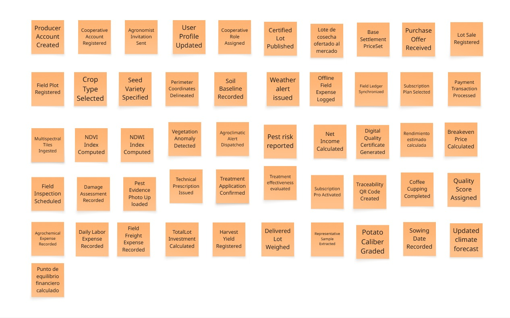

### Línea de Tiempo, Puntos de Dolor e Hitos del Negocio
Posteriormente, los eventos se organizaron en una secuencia cronológica de izquierda a derecha sobre una línea de tiempo continua. A partir de este ordenamiento, se superpusieron los puntos de dolor (*pain points*) identificados durante el Needfinding mediante notas moradas en rombo (resistencia cultural al celular, desconexión móvil en quebradas, registros en papel extraviados y castigos arbitrarios de precio). Asimismo, se establecieron líneas divisorias verticales para demarcar los eventos fundamentales (*pivotal points*) que delimitan las fases operativas de SumaqAgro:

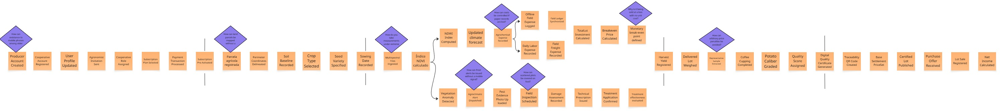

* **Enlace al tablero interactivo:** [Acceso al espacio de trabajo de Event Storming en Miro]([https://miro.com/app/board/uXjVHPEmUbl=/](https://miro.com/welcomeonboard/WG5aQ1R0dmR5b0xQWTI5TEZvaXplRmpPTUxmT2pmR1NNVXBVakcxRFI5Yk16dVY3TXpRc0RwbHVKNWFndGJvZDZkZXJrbkN4VFZQdzhHTjV6MWdBNUJtQnhYMVFmcjNLbkxyOWQwZlVuWHZ6UXVkOHlsNXRlcVBQd24wVS92ZWN3VHhHVHd5UWtSM1BidUtUYmxycDRnPT0hdjE=?share_link_id=946708686416))

## 2.5. Ubiquitous Language

Con el fin de garantizar una comunicación fluida, consistente y libre de ambigüedades entre los desarrolladores, los directivos de cooperativas, los ingenieros agrónomos y los productores agrícolas, se ha elaborado el siguiente glosario de términos del dominio del negocio. Estos conceptos definen la semántica compartida de SumaqAgro y deben utilizarse de manera coherente en las reuniones de trabajo, el diseño de interfaces de usuario y la lógica interna del sistema:

* **Field Plot (Parcela Agrícola):** Unidad territorial delimitada geográficamente mediante coordenadas perimetrales, destinada a la producción agraria y gestionada por un productor o socio cooperativo.
* **Agricultural Cooperative (Cooperativa Agraria):** Organización asociativa formal que agrupa a productores de café y papa para centralizar el acopio, la asistencia técnica y la comercialización mayorista.
* **Cooperative Member (Socio Cooperativo):** Productor empadronado formalmente en la cooperativa que accede a servicios de pesaje, secado, asistencia y liquidación comercial.
* **Technical Advisor (Asesor Técnico):** Profesional agrónomo responsable de diagnosticar el estado sanitario de las parcelas, formular recetas de fertilización y asistir en campo.
* **Sowing Date (Fecha de Siembra):** Momento temporal en el que se instala la semilla o plantón en el suelo, marcando el inicio del ciclo fenológico y el monitoreo satelital continuo.
* **Crop Variety (Variedad de Cultivo):** Clasificación botánica de la semilla (p. ej., variedades de papa como Canchán o Yungay; variedades de café como Caturra o Geisha) que define los requerimientos de manejo.
* **Vegetation Index - NDVI (Índice de Vegetación):** Indicador derivado de reflectancia satelital que evalúa el vigor fotosintético y la biomasa foliar del cultivo sin requerir sensores en tierra.
* **Water Index - NDWI (Índice de Humedad):** Parámetro satelital que mide el contenido hídrico foliar para advertir estrés por sequía antes de que existan daños visibles en el lote.
* **Agronomic Early Warning (Alerta Agroclimática):** Aviso prioritario emitido ante riesgos climáticos severos (heladas meteorológicas o sequías) o caídas anómalas en el vigor de la vegetación.
* **Technical Prescription (Receta Fitosanitaria):** Formulación técnica emitida por el asesor que prescribe el insumo, la dosis exacta y las pautas para controlar una deficiencia o plaga.
* **Daily Farm Labor - Jornal (Jornal Agrícola):** Unidad de remuneración correspondiente a una jornada diaria de trabajo manual en campo para labores de preparación, aporque o cosecha.
* **Agricultural Inputs (Insumos Agropecuarios):** Materiales directos (abonos, fertilizantes y protectores de cultivo) aplicados en la parcela para garantizar su desarrollo productivo.
* **Field Freight (Flete Rural):** Costo de transporte devengado por el traslado de insumos al fundo o el flete de la cosecha hacia el almacén o centro de acopio.
* **Unit Production Cost (Costo Unitario de Producción):** Resultado monetario de dividir los gastos operativos acumulados de campaña entre el volumen cosechado o proyectado (soles por quintal o tonelada).
* **Financial Breakeven Price (Punto de Equilibrio Financiero):** Precio mínimo de venta por unidad de comercialización necesario para cubrir la inversión del lote, evitando operar a pérdida.
* **Harvest Batch (Lote de Cosecha):** Volumen consolidado de producto recolectado en una misma parcela y campaña, acondicionado para pesaje y muestreo de calidad.
* **Potato Caliber (Calibre de Papa):** Clasificación por tamaño y diámetro del tubérculo según norma técnica oficial (Primera, Segunda y Tercera) para su destino comercial.
* **Cup Profile Scoring - SCA (Puntaje de Perfil de Taza):** Calificación sensorial sobre 100 puntos asignada en laboratorio de catación para medir la calidad de cafés de especialidad.
* **Digital Quality Certificate (Certificado Digital de Calidad):** Acreditación técnica no repudiable que valida los parámetros físicos, sensoriales y de procedencia del lote cosechado.
* **Cryptographic Traceability QR (Código QR de Trazabilidad):** Identificador visual impreso o adherido al lote que enlaza públicamente a la ficha técnica de origen, calidad y no deforestación.
* **Quality Premium Bonus (Bonificación por Calidad):** Sobreprecio o compensación económica adicional liquidada al agricultor por entregar cosechas que superan los estándares básicos de mercado.