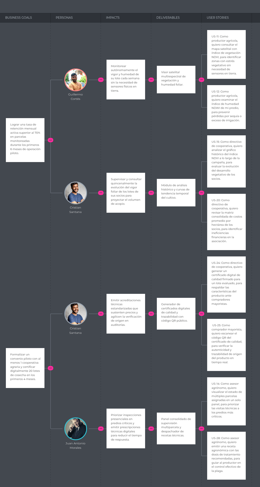

# Capítulo III: Requirements Specification

## 3.1. User Stories

Las Historias de Usuario (US) e Historias Técnicas (TS) de SumaqAgro siguen la estructura ágil «Como [actor], quiero [funcionalidad], para [beneficio]», equivalente al patrón ágil en inglés As a..., I want..., so that... (el documento se redacta en español; los identificadores US, TS y EPIC se mantienen en la convención del proyecto). Cada historia se valida mediante criterios de aceptación BDD en formato Gherkin (Dado que... / Cuando... / Entonces...). La especificación abarca los roles de visitante (landing page), productor agrícola (monitoreo GPS y costos), directivo de cooperativa (certificación de calidad), asesor agrónomo (asistencia técnica) y desarrollador (API RESTful en Spring Boot), cubriendo desde la captación pública hasta la operación agrícola y trazabilidad comercial.

### Resumen de Épicas y Bounded Contexts

| Epic ID | Nombre de la Épica | Bounded Context Asociado | Descripción / Alcance |
| :---: | :--- | :--- | :--- |
| **EPIC- 01** | Experiencia Web en la Landing Page | Landing Page & Public Onboarding Context | Sitio web público de la startup, propuesta de valor, equipo fundador, video demo, soluciones, planes de suscripción (Semilla, Cooperativa Pro, Asesor Técnico), selector de idioma (ES/EN), testimonios e impacto, y políticas legales. |
| **EPIC- 02** | Monitoreo Satelital de Cultivos | Satellite Crop Monitoring Context | Delimitación GPS de parcelas, generación de mapas multiespectrales NDVI, índice de humedad NDWI, alertas tempranas de estrés vegetal y panel consolidado para asesores agrónomos. |
| **EPIC- 03** | Gestión de Costos y Finanzas Agrícolas | Cost Accounting & Financial Context | Registro de insumos, pesticidas, fletes, jornales, cálculo automático de punto de equilibrio por saco/quintal, resumen por hectárea y exportación de reportes financieros. |
| **EPIC- 04** | Evaluación de Calidad y Certificación Digital | Quality Scoring & Certification Context | Clasificación por calibres de papa, protocolo de catación SCA para taza de café, generación de certificado digital PDF con firma de origen y código QR de validación pública. |
| **EPIC- 05** | Asistencia y Prescripción Agronómica | Agronomic Advisory Context | Diagnóstico fitosanitario remoto con evidencia fotográfica, emisión de recetas agronómicas digitales, calendario de visitas de campo y alertas regionales preventivas. |
| **EPIC- 06** | Infraestructura Core y Servicios RESTful | Core Infrastructure & Backend Context | Technical Stories para la API RESTful en Spring Boot, integración con API de AgroMonitoring, autenticación JWT, generador de PDF/QR y persistencia offline diferida. |

### Tabla Matriz de User Stories

| Epic / Story ID | Título | Descripción | Criterios de Aceptación (Gherkin) | Relacionado con (Epic ID) |
| :---: | :--- | :--- | :--- | :---: |
| **EPIC-01** | Experiencia Web en la Landing Page | Épica que agrupa las funcionalidades de navegación pública, información institucional, planes y presentación corporativa de SumaqAgro. | Cobertura completa de la experiencia de usuario visitante en el portal público de la startup Dymbia. | N/A |
| **US-01** | Presentación de la propuesta de valor | **Como** visitante, **quiero** conocer de entrada la propuesta de valor de SumaqAgro y la agricultura de precisión sin hardware, **para** entender cómo la plataforma ayuda a optimizar cultivos de papa y café. | **Escenario 1: Contenido principal disponible** • **Dado que** el visitante ingresa al sitio web de SumaqAgro • **Cuando** la página de inicio carga correctamente • **Entonces** el visitante puede visualizar el mensaje principal de la plataforma, una descripción del servicio y las opciones de navegación principal.  **Escenario 2: Servicio no disponible** • **Dado que** el servicio del sitio web no está disponible temporalmente • **Cuando** el visitante intenta acceder al portal • **Entonces** el sistema muestra un mensaje indicando la falla temporal y sugiere intentar nuevamente más tarde. | EPIC-01 |
| **US-02** | Navegación por secciones del sitio | **Como** visitante, **quiero** navegar fácilmente por las diferentes secciones de la landing page desde el menú principal, **para** acceder rápidamente a la información que me interesa sin tener que desplazarme manualmente por todo el sitio. | **Escenario 1: Navegación a una sección disponible** • **Dado que** el visitante se encuentra en la landing page • **Cuando** selecciona una sección del menú de navegación • **Entonces** el sistema desplaza la vista de forma fluida a la sección seleccionada del sitio web.  **Escenario 2: Menú accesible durante el desplazamiento** • **Dado que** el visitante se desplaza hacia abajo en la página • **Cuando** requiera cambiar de sección • **Entonces** la barra de navegación permanece accesible en la parte superior para facilitar la navegación continua. | EPIC-01 |
| **US-03** | Selección e intercambio de idioma | **Como** visitante, **quiero** cambiar el idioma del sitio web entre español e inglés, **para** visualizar el contenido en mi idioma de preferencia. | **Escenario 1: Cambio exitoso de idioma** • **Dado que** el visitante se encuentra en el sitio web en idioma español • **Cuando** selecciona la opción de idioma inglés en el encabezado • **Entonces** el sistema actualiza inmediatamente los textos de la interfaz al idioma seleccionado.  **Escenario 2: Persistencia de la preferencia de idioma** • **Dado que** el visitante ha seleccionado un idioma de preferencia • **Cuando** navegue entre diferentes secciones o vuelva a ingresar al sitio • **Entonces** la plataforma mantiene la configuración de idioma previamente elegida. | EPIC-01 |
| **US-04** | Presentación de la startup y equipo fundador | **Como** visitante, **quiero** conocer la historia de la startup Dymbia y los perfiles de sus fundadores, **para** generar confianza sobre el equipo profesional detrás del proyecto. | **Escenario 1: Visualización del equipo fundador** • **Dado que** el visitante navega a la sección "Sobre Nosotros" • **Cuando** la sección se despliegue en pantalla • **Entonces** el sistema presenta la información institucional de la startup Dymbia y las fichas profesionales de los 5 integrantes del equipo fundador. | EPIC-01 |
| **US-05** | Demostración del producto mediante video | **Como** visitante, **quiero** reproducir el video de demostración de SumaqAgro, **para** visualizar el funcionamiento práctico del software en campo. | **Escenario 1: Reproducción exitosa del video demo** • **Dado que** el visitante se ubica en la sección de demostración del producto • **Cuando** active la reproducción del video demo • **Entonces** el sistema inicia la reproducción del reproductor multimedia con controles de audio y pantalla completa. | EPIC-01 |
| **US-06** | Consulta de módulos y soluciones tecnológicas | **Como** visitante, **quiero** explorar las soluciones clave que ofrece el proyecto (monitoreo satelital, gestión de costos y certificación), **para** entender los módulos funcionales del sistema. | **Escenario 1: Exploración de soluciones técnicas** • **Dado que** el visitante se encuentra en la sección de soluciones • **Cuando** revise las tarjetas descriptivas de características • **Entonces** el sistema despliega el detalle de funcionalidades de agricultura satelital, control financiero y certificación de calidad. | EPIC-01 |
| **US-07** | Consulta de planes de suscripción y facturación | **Como** visitante, **quiero** explorar los planes de suscripción (Semilla, Cooperativa Pro, Asesor Técnico) y sus opciones de facturación (mensual/anual), **para** seleccionar la alternativa económica adecuada a la escala de mi organización. | **Escenario 1: Alternancia entre facturación mensual y anual** • **Dado que** el visitante visualiza la tabla de precios • **Cuando** active el conmutador de facturación anual • **Entonces** el sistema actualiza las tarifas reflejando el descuento de 2 meses y destaca el plan Cooperativa Pro como la opción recomendada.  **Escenario 2: Visualización de características por plan** • **Dado que** el visitante evalúa las opciones de planes • **Cuando** revise el detalle de un plan específico • **Entonces** el sistema muestra los límites de parcelas/productores y herramientas incluidas. | EPIC-01 |
| **US-08** | Visualización de métricas de impacto y testimonios | **Como** visitante, **quiero** conocer indicadores de impacto real y reseñas de otros usuarios, **para** validar los resultados obtenidos por agricultores y cooperativas que usan la plataforma. | **Escenario 1: Consulta de indicadores y opiniones** • **Dado que** el visitante navega a la sección de impacto y testimonios • **Cuando** examine los bloques de contenido • **Entonces** el sistema presenta las métricas de reducción de mermas y los testimonios validados de productores agrícolas. | EPIC-01 |
| **US-09** | Consulta de términos de servicio y políticas legales | **Como** visitante, **quiero** consultar los Términos de Servicio y la Política de Privacidad de la plataforma, **para** conocer los aspectos legales y la confidencialidad en el tratamiento de los datos agrícolas. | **Escenario 1: Acceso a documentos legales desde el pie de página** • **Dado que** el visitante se encuentra en el pie de página (Footer) • **Cuando** seleccione el enlace de Términos de Servicio o Política de Privacidad • **Entonces** el sistema despliega el documento legal correspondiente detallando las cláusulas de uso y protección de datos. | EPIC-01 |
| **EPIC-02** | Monitoreo Satelital de Cultivos | Épica que agrupa las funcionalidades de delimitación de parcelas por GPS y procesamiento de mapas satelitales multiespectrales. | Módulo core de agricultura de precisión sin hardware para cultivos de papa y café. | N/A |
| **US-10** | Registro y delimitación GPS de parcelas | **Como** productor agrícola, **quiero** delimitar el polígono de mi parcela mediante coordenadas GPS, **para** habilitar el seguimiento satelital de mi cultivo. | **Escenario 1: Registro exitoso de polígono** • **Dado que** el productor ingresa las coordenadas GPS de los vértices de su fundo • **Cuando** confirme la delimitación de la parcela • **Entonces** el sistema calcula el área en hectáreas y guarda la parcela para monitoreo satelital. | EPIC-02 |
| **US-11** | Visualización de mapa multiespectral NDVI | **Como** productor agrícola, **quiero** consultar el mapa satelital con índice de vegetación NDVI, **para** identificar zonas con estrés vegetativo sin necesidad de sensores en tierra. | **Escenario 1: Generación de mapa de vegetación** • **Dado que** la parcela cuenta con coordenadas GPS válidas • **Cuando** el usuario consulte la capa NDVI del ciclo actual • **Entonces** el sistema despliega el mapa coloreado según la escala de salud vegetal. | EPIC-02 |
| **US-12** | Monitoreo de índice de humedad en suelo (NDWI) | **Como** productor agrícola, **quiero** examinar el índice de humedad NDWI de mi predio, **para** prevenir pérdidas por sequía o exceso de irrigación. | **Escenario 1: Consulta de estrés hídrico** • **Dado que** existen capturas satelitales procesadas • **Cuando** el usuario seleccione el mapa de humedad • **Entonces** el sistema muestra los niveles de agua retenida en el follaje y suelo. | EPIC-02 |
| **US-13** | Recepción de alertas por estrés vegetativo o hídrico | **Como** productor agrícola, **quiero** recibir alertas automáticas cuando se detecte una caída en los índices NDVI/NDWI, **para** tomar acciones correctivas inmediatas. | **Escenario 1: Despacho de alerta preventiva** • **Dado que** el procesamiento satelital detecta una anomalía mayor al 15% en la salud del cultivo • **Cuando** se actualicen los datos del satélite • **Entonces** el sistema genera una alerta preventiva notificando la zona afectada. | EPIC-02 |
| **US-14** | Panel consolidado de predios para asesores | **Como** asesor agrónomo, **quiero** visualizar el estado de múltiples parcelas asignadas en un solo panel, **para** priorizar las visitas técnicas a los predios más críticos. | **Escenario 1: Vista general de parcelas supervisadas** • **Dado que** el asesor técnico tiene parcelas vinculadas a su cuenta • **Cuando** acceda al panel de supervisión • **Entonces** el sistema muestra el listado ordenado por nivel de riesgo fitosanitario e índice NDVI. | EPIC-02 |
| **US-15** | Análisis de series temporales de salud del cultivo | **Como** directivo de cooperativa, **quiero** analizar el gráfico histórico del índice NDVI a lo largo de la campaña, **para** evaluar la evolución del desarrollo vegetativo de los socios. | **Escenario 1: Generación de gráfico de tendencia histórica** • **Dado que** existen lecturas satelitales de varios meses • **Cuando** el directivo seleccione un rango de fechas • **Entonces** el sistema genera una curva de tendencia mostrando la evolución del cultivo. | EPIC-02 |
| **EPIC-03** | Gestión de Costos y Finanzas Agrícolas | Épica enfocada en el registro de egresos operativos y el cálculo automático del punto de equilibrio financiero por lote. | Módulo de contabilidad agrícola adaptado a la economía rural. | N/A |
| **US-16** | Registro de gastos en insumos y fertilizantes | **Como** productor agrícola, **quiero** anotar los costos de compra de semillas, fertilizantes y pesticidas por parcela, **para** llevar un control ordenado de mi inversión. | **Escenario 1: Registro de compra de insumos** • **Dado que** el productor ingresa el concepto, cantidad y monto gastado • **Cuando** guarde el registro en la bitácora • **Entonces** el sistema suma el gasto a la categoría de insumos de la parcela correspondiente. | EPIC-03 |
| **US-17** | Registro de jornales y mano de obra agrícola | **Como** productor agrícola, **quiero** registrar los pagos realizados por concepto de jornales en labores de siembra, deshierbe y cosecha, **para** contabilizar el costo total de mano de obra. | **Escenario 1: Anotación de costo por jornada** • **Dado que** el productor ingresa el número de peones y el pago por día • **Cuando** confirme la entrada de datos • **Entonces** el sistema calcula el subtotal de mano de obra acumulada en la campaña. | EPIC-03 |
| **US-18** | Cálculo automático del punto de equilibrio financiero | **Como** productor agrícola, **quiero** conocer el precio mínimo de venta por saco de papa o quintal de café para cubrir mis costos, **para** negociar un precio justo en el mercado. | **Escenario 1: Determinación de precio mínimo de venta** • **Dado que** se han registrado los costos de producción y la estimación de rendimiento en cosecha • **Cuando** el usuario solicite el cálculo financiero • **Entonces** el sistema determina automáticamente el punto de equilibrio por unidad comercializable. | EPIC-03 |
| **US-19** | Registro de costos de transporte y flete | **Como** productor agrícola, **quiero** ingresar los gastos de traslado y flete de la cosecha hacia el centro de acopio, **para** incluir el costo logístico en el margen de utilidad. | **Escenario 1: Inclusión de gastos logísticos** • **Dado que** el productor registra el comprobante de transporte • **Cuando** confirme el monto • **Entonces** el sistema actualiza el costo total de distribución de la cosecha. | EPIC-03 |
| **US-20** | Consolidado de costos de producción por hectárea | **Como** directivo de cooperativa, **quiero** revisar la matriz consolidada de costos promedio por hectárea de los socios, **para** identificar ineficiencias financieras en la asociación. | **Escenario 1: Consulta de matriz comparativa de costos** • **Dado que** los socios han registrado sus bitácoras de campo • **Cuando** el directivo ingrese al reporte consolidado • **Entonces** el sistema muestra la comparativa de inversión por hectárea entre parcelas. | EPIC-03 |
| **US-21** | Exportación de reportes financieros de campaña | **Como** directivo de cooperativa, **quiero** exportar el resumen financiero de la campaña agrícola en formato estructurado, **para** presentar los resultados en asambleas generales. | **Escenario 1: Exportación exitosa de datos contables** • **Dado que** la campaña agrícola ha sido cerrada • **Cuando** el usuario solicite la descarga del reporte • **Entonces** el sistema genera un archivo descargable con el balance detallado de egresos e ingresos. | EPIC-03 |
| **EPIC-04** | Evaluación de Calidad y Certificación Digital | Épica que abarca la clasificación cualitativa de cosechas y la emisión de certificados de origen y calidad con código QR. | Módulo de valor agregado para diferenciación comercial de papa y café. | N/A |
| **US-22** | Registro de clasificación por calibres de papa | **Como** productor agrícola, **quiero** registrar la distribución porcentual de mi cosecha de papa según categorías de calibre (primera, segunda, tercera y chancho), **para** determinar la calidad comercial de mi lote. | **Escenario 1: Registro de distribución de calibres** • **Dado que** se completa el pesaje por lotes • **Cuando** el usuario ingrese los kilogramos por categoría • **Entonces** el sistema calcula el porcentaje de rendimiento comercial por calibre. | EPIC-04 |
| **US-23** | Registro de evaluación y perfil de taza SCA de café | **Como** directivo de cooperativa, **quiero** ingresar los puntajes del análisis sensorial de catación (acidez, cuerpo, aroma) bajo el estándar SCA, **para** certificar café de especialidad. | **Escenario 1: Clasificación de perfil de taza** • **Dado que** el catador de la cooperativa evalúa la muestra • **Cuando** registre la ficha de catación con puntaje mayor a 80 puntos • **Entonces** el sistema califica la muestra como café de especialidad y habilita la certificación. | EPIC-04 |
| **US-24** | Generación de certificado digital de calidad en PDF | **Como** directivo de cooperativa, **quiero** generar un certificado digital de calidad firmado para un lote evaluado, **para** respaldar las características del producto ante compradores mayoristas. | **Escenario 1: Emisión exitosa de certificado PDF** • **Dado que** el lote cumple con las evaluaciones físicas y organolépticas • **Cuando** el directivo ordene la emisión del certificado • **Entonces** el sistema crea un archivo PDF con la información del productor, coordenadas, score de calidad y firma digital. | EPIC-04 |
| **US-25** | Verificación pública mediante código QR | **Como** comprador mayorista, **quiero** escanear el código QR del certificado de calidad, **para** verificar la autenticidad y trazabilidad de origen del producto en tiempo real. | **Escenario 1: Consulta exitosa de trazabilidad pública** • **Dado que** el comprador escanea el código QR impreso en el saco o documento • **Cuando** acceda a la URL de validación pública • **Entonces** el sistema despliega la ficha pública confirmando la autenticidad del certificado y el mapa de origen del cultivo. | EPIC-04 |
| **US-26** | Historial de certificados emitidos por socio | **Como** directivo de cooperativa, **quiero** consultar el historial de certificados emitidos por cada socio agricultor, **para** mantener la trazabilidad de entregas históricas. | **Escenario 1: Búsqueda de certificados por socio** • **Dado que** se requiere auditar las entregas de un productor • **Cuando** el directivo filtre por el nombre o documento del socio • **Entonces** el sistema lista todos los certificados emitidos indicando volumen y puntaje obtenido. | EPIC-04 |
| **EPIC-05** | Asistencia y Prescripción Agronómica | Épica de soporte técnico remoto entre asesores agrónomos y agricultores para control de plagas y enfermedades. | Módulo de gestión del conocimiento fitosanitario en campo. | N/A |
| **US-27** | Carga de evidencias fotográficas de síntomas | **Como** productor agrícola, **quiero** adjuntar fotografías de hojas o plantas con síntomas de plagas, **para** solicitar un diagnóstico remoto a un asesor técnico. | **Escenario 1: Carga exitosa de fotografía de campo** • **Dado que** el productor detecta síntomas de enfermedad en su parcela • **Cuando** adjunte la fotografía indicando el lote afectado • **Entonces** el sistema registra la solicitud de inspección y notifica al asesor asignado. | EPIC-05 |
| **US-28** | Emisión y envío de prescripciones agronómicas | **Como** asesor agrónomo, **quiero** emitir una receta agronómica con las dosis de tratamiento recomendadas, **para** guiar al productor en el control efectivo de la plaga. | **Escenario 1: Envío de receta técnica** • **Dado que** el asesor analiza la evidencia e índices de la parcela • **Cuando** redacte la prescripción fitosanitaria • **Entonces** el sistema despacha la recomendación al canal del productor indicando dosis e ingrediente activo. | EPIC-05 |
| **US-29** | Agendamiento y seguimiento de visitas de campo | **Como** asesor agrónomo, **quiero** programar visitas de inspección técnica presencial en un calendario, **para** organizar mis desplazamientos entre fundos rurales. | **Escenario 1: Programación de visita técnica** • **Dado que** se requiere una inspección presencial en fundo • **Cuando** el asesor seleccione fecha y hora en su calendario • **Entonces** el sistema registra la cita de inspección y notifica al agricultor. | EPIC-05 |
| **US-30** | Registro de aplicación de tratamiento fitosanitario | **Como** productor agrícola, **quiero** confirmar la aplicación de la receta agronómica en mi parcela, **para** dejar constancia del cumplimiento del tratamiento. | **Escenario 1: Confirmación de aplicación de tratamiento** • **Dado que** el productor ha ejecutado la aplicación recomendada • **Cuando** marque la receta como aplicada • **Entonces** el sistema actualiza el estado de la incidencia a "En Seguimiento". | EPIC-05 |
| **US-31** | Despacho de alertas fitosanitarias regionales | **Como** asesor agrónomo, **quiero** emitir un boletín de alerta fitosanitaria a todos los productores de un valle agrícola, **para** prevenir la propagación de plagas epidémicas (como la roya o gorgojo). | **Escenario 1: Envío masivo de alerta regional** • **Dado que** se confirma un brote epidémico en la cuenca agrícola • **Cuando** el asesor emita una alerta preventiva regional • **Entonces** el sistema envía la notificación a todos los usuarios registrados en esa zona geográfica. | EPIC-05 |
| **EPIC-06** | Infraestructura Core y Servicios RESTful | Technical Stories para el desarrollo de la arquitectura distribuida del backend en Spring Boot, autenticación y servicios externos. | Módulo de ingeniería de software backend para desarrollo y pruebas. | N/A |
| **TS-01** | Integración con API externa de AgroMonitoring | **Como** developer, **quiero** implementar el cliente HTTP para consumir la API de AgroMonitoring en Spring Boot, **para** extraer los índices NDVI/NDWI y polígonos satelitales. | **Escenario 1: Respuesta exitosa del cliente satelital** • **Dado que** el cliente realiza una petición `GET /api/v1/crops/{cropId}/satellite-data` con un token JWT válido • **Cuando** el backend consuma el servicio externo de AgroMonitoring • **Entonces** la API responde con un código `200 OK` y el JSON estructurado con los índices satelitales.  **Escenario 2: Fallo o latencia del proveedor satelital** • **Dado que** la API externa de AgroMonitoring no responde en el tiempo límite (timeout) • **Cuando** se ejecute la llamada al servicio • **Entonces** la API retorna un código `502 Bad Gateway` con la estructura de error correspondiente. | EPIC-06 |
| **TS-02** | Servicio de autenticación JWT y Spring Security | **Como** developer, **quiero** implementar la arquitectura de seguridad basada en Spring Security y Tokens JWT, **para** proteger los endpoints de la API RESTful. | **Escenario 1: Autenticación exitosa y generación de token** • **Dado que** un usuario envía credenciales válidas a `POST /api/v1/auth/login` • **Cuando** el servidor valide las credenciales • **Entonces** la API responde con un código `200 OK` y retorna el Bearer Token JWT en el cuerpo de la respuesta.  **Escenario 2: Acceso no autorizado a endpoint protegido** • **Dado que** una solicitud carece del encabezado `Authorization` • **Cuando** intente acceder a un recurso protegido • **Entonces** el servidor bloquea la petición y responde con un código `401 Unauthorized`. | EPIC-06 |
| **TS-03** | Endpoint REST de cálculo de punto de equilibrio | **Como** developer, **quiero** exponer un endpoint REST `POST /api/v1/finances/break-even`, **para** procesar las operaciones matemáticas del punto de equilibrio financiero. | **Escenario 1: Procesamiento exitoso del cálculo financiero** • **Dado que** el cliente envía un JSON con los costos fijos, variables y rendimiento estimado • **Cuando** el controlador procese la solicitud • **Entonces** la API responde con un código `200 OK` y el valor del punto de equilibrio unitario. | EPIC-06 |
| **TS-04** | Endpoint REST para generación de PDF y código QR | **Como** developer, **quiero** desarrollar un servicio en Spring Boot para la compilación dinámica de documentos PDF y códigos QR, **para** soportar la emisión de certificados. | **Escenario 1: Generación exitosa del certificado en formato PDF** • **Dado que** se envía la petición `POST /api/v1/certificates/generate` con el ID del lote evaluado • **Cuando** el servicio procese la plantilla del documento • **Entonces** la API responde con un código `201 Created` y el stream de datos en formato PDF. | EPIC-06 |
| **TS-05** | Persistencia y sincronización offline diferida | **Como** developer, **quiero** implementar un mecanismo de caché en cliente y sincronización diferida en la API REST, **para** permitir el registro de bitácoras sin conectividad. | **Escenario 1: Sincronización exitosa de datos almacenados localmente** • **Dado que** el cliente envía un lote de registros diferidos almacenados sin conexión • **Cuando** se restablezca la conectividad e invoque `POST /api/v1/sync` • **Entonces** la API procesa los registros de forma secuencial y retorna un código `200 OK`. | EPIC-06 |
| **TS-06** | Documentación de API RESTful con OpenAPI y Swagger UI | **Como** developer, **quiero** integrar la biblioteca Springdoc OpenAPI en la aplicación, **para** disponer de la documentación interactiva Swagger UI de todos los endpoints. | **Escenario 1: Visualización de la interfaz Swagger UI** • **Dado que** la aplicación en Spring Boot se encuentra desplegada • **Cuando** el desarrollador acceda a la ruta `/swagger-ui.html` • **Entonces** el sistema despliega la documentación interactiva con la especificación de request/response de cada endpoint. | EPIC-06 |

---

## 3.2. Impact Mapping

En esta sección se explica y presenta el Impact Mapping desarrollado para el modelo de negocio digital de SumaqAgro mediante la herramienta UXPressia, articulando de forma deliberada los objetivos estratégicos de la startup con las fichas de los tres User Personas elaborados previamente y el catálogo de User Stories formalizadas en el sistema.

Con el propósito de orientar el desarrollo hacia resultados medibles y alcanzables durante las fases de validación y prototipo, se definieron dos Business Goals formulados bajo criterios SMART:

1. **Business Goal 1 (Retención de parcelas en campo):** Lograr una tasa de retención mensual activa superior al 70% en parcelas monitoreadas durante los primeros 6 meses de operación piloto.
2. **Business Goal 2 (Validación y certificación institucional):** Formalizar un convenio piloto con al menos 1 cooperativa agraria y certificar digitalmente 20 lotes de cosecha en los primeros 4 meses.

A partir de estas metas, se vincularon como Actors/Personas los arquetipos oficiales del proyecto: Guillermo Cortés (Segmento 1: Pequeños y medianos agricultores independientes), Cristian Santana (Segmento 2: Productores organizados y directivos de cooperativas/asociaciones) y Juan Antonio Morales (Segmento 3: Ingenieros agrónomos y asesores técnicos de campo). Para cada uno se determinaron los cambios de conducta esperados (Impacts), las capacidades provistas por la plataforma (Deliverables) y la derivación hacia sus correspondientes User Stories:

* **Para el Business Goal 1 (Retención de parcelas en campo):**
  * **Guillermo Cortés:** Se busca que monitoree de forma autónoma el vigor foliar y la humedad foliar de sus lotes cada semana sin depender de sensores físicos en tierra. Para propiciar este impacto, SumaqAgro provee un *Visor satelital multiespectral de vegetación y humedad foliar*, el cual se implementa a través de la historia **US-11** (*Como productor agrícola, quiero consultar el mapa satelital con índice de vegetación NDVI, para identificar zonas con estrés vegetativo sin necesidad de sensores en tierra*) y la historia **US-12** (*Como productor agrícola, quiero examinar el índice de humedad NDWI de mi predio, para prevenir pérdidas por sequía o exceso de irrigación*).
  * **Cristian Santana:** Se requiere que supervise quincenalmente la evolución del vigor foliar y los costos agregados de los socios para proyectar el acopio global de campaña. El entregable correspondiente es el *Módulo de análisis histórico y curvas de tendencia temporal del cultivo*, sustentado en la historia **US-15** (*Como directivo de cooperativa, quiero analizar el gráfico histórico del índice NDVI a lo largo de la campaña, para evaluar la evolución del desarrollo vegetativo de los socios*) y la historia **US-20** (*Como directivo de cooperativa, quiero revisar la matriz consolidada de costos promedio por hectárea de los socios, para identificar ineficiencias financieras en la asociación*).

* **Para el Business Goal 2 (Validación y certificación institucional):**
  * **Cristian Santana:** Se busca que emita acreditaciones técnicas estandarizadas para defender el precio de venta en origen y reducir las semanas de preparación en auditorías aduaneras y de sellos orgánicos. SumaqAgro habilita el *Generador de certificados digitales de calidad y trazabilidad con código QR público*, operativizado mediante la historia **US-24** (*Como directivo de cooperativa, quiero generar un certificado digital de calidad firmado para un lote evaluado, para respaldar las características del producto ante compradores mayoristas*) y la historia **US-25** (*Como comprador mayorista, quiero escanear el código QR del certificado de calidad, para verificar la autenticidad y trazabilidad de origen del producto en tiempo real*).
  * **Juan Antonio Morales:** Se requiere que priorice sus inspecciones presenciales en los fundos críticos y emita recetas técnicas digitales para reducir sus tiempos de traslado. Para habilitar este comportamiento, se entrega el *Panel consolidado de supervisión multiparcela y despachador de recetas técnicas*, concretado en la historia **US-14** (*Como asesor agrónomo, quiero visualizar el estado de múltiples parcelas asignadas en un solo panel, para priorizar las visitas técnicas a los predios más críticos*) y la historia **US-28** (*Como asesor agrónomo, quiero emitir una receta agronómica con las dosis de tratamiento recomendadas, para guiar al productor en el control efectivo de la plaga*).

A continuación, se presenta la evidencia gráfica del Impact Mapping exportado en alta resolución desde UXPressia:

## 3.3. Product Backlog