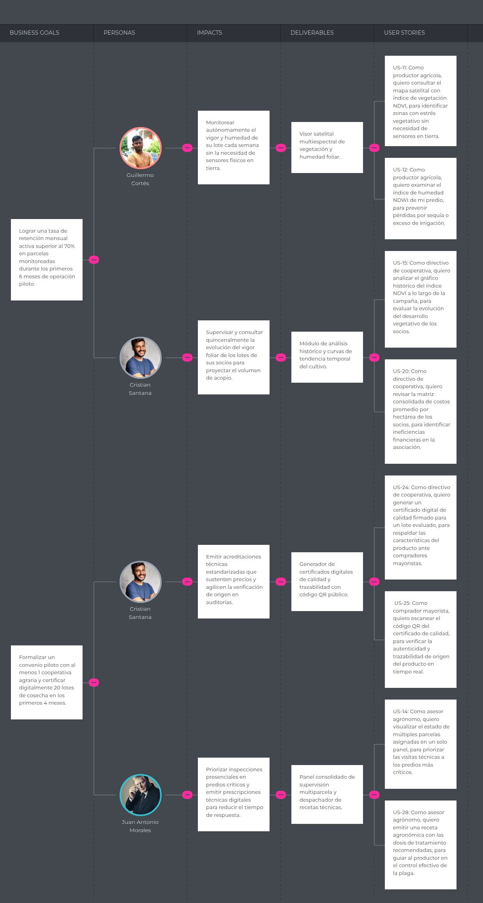
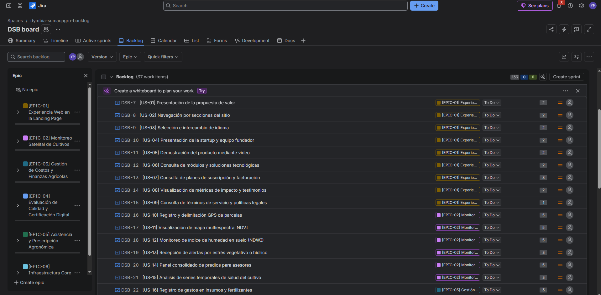

# Capítulo III: Requirements Specification

## 3.1. User Stories

Las Historias de Usuario (US) e Historias Técnicas (TS) de SumaqAgro siguen la estructura ágil «Como [actor], quiero [funcionalidad], para [beneficio]», equivalente al patrón ágil en inglés As a..., I want..., so that... (el documento se redacta en español; los identificadores US, TS y EPIC se mantienen en la convención del proyecto). Cada historia se valida mediante criterios de aceptación BDD en formato Gherkin (Dado que... / Cuando... / Entonces...). La especificación abarca los roles de visitante (landing page), productor agrícola (monitoreo GPS y costos), directivo de cooperativa (certificación de calidad), asesor agrónomo (asistencia técnica) y desarrollador (API RESTful en Spring Boot), cubriendo desde la captación pública hasta la operación agrícola y trazabilidad comercial.

| Epic / Story ID | Título | Descripción | Criterios de Aceptación (Gherkin)                                                                                                                                                                                                                                                                                                                                                                                                                                                                                                                                                                                                                                                                                                       | Relacionado con (Epic ID) |
|:---------------:| :--- | :--- |:----------------------------------------------------------------------------------------------------------------------------------------------------------------------------------------------------------------------------------------------------------------------------------------------------------------------------------------------------------------------------------------------------------------------------------------------------------------------------------------------------------------------------------------------------------------------------------------------------------------------------------------------------------------------------------------------------------------------------------------| :---: |
|   **EPIC-01**   | Experiencia Web en la Landing Page | Épica que agrupa las funcionalidades de navegación pública, información institucional, catálogo de soluciones, planes y presentación corporativa de SumaqAgro. | Cobertura completa de la experiencia de usuario visitante en el portal público de la startup Dymbia.                                                                                                                                                                                                                                                                                                                                                                                                                                                                                                                                                                                                                                    | N/A |
|    **US-01**    | Presentación de la propuesta de valor | **Como** visitante, **quiero** conocer de entrada la propuesta de valor de SumaqAgro y la agricultura de precisión sin hardware, **para** entender cómo la plataforma ayuda a optimizar cultivos de papa y café. | **Escenario 1: Contenido principal disponible**  • **Dado que** el visitante ingresa al sitio web de SumaqAgro  • **Cuando** la página de inicio carga correctamente  • **Entonces** el visitante puede visualizar el mensaje principal de la plataforma, una descripción del servicio y las opciones de navegación principal.   **Escenario 2: Servicio no disponible**  • **Dado que** el servicio del sitio web no está disponible temporalmente  • **Cuando** el visitante intenta acceder al portal  • **Entonces** el sistema muestra un mensaje indicando la falla temporal y sugiere intentar nuevamente más tarde.                                                                | EPIC-01 |
|    **US-02**    | Navegación por secciones del sitio | **Como** visitante, **quiero** navegar fácilmente por las diferentes secciones de la landing page desde el menú principal, **para** acceder rápidamente a la información que me interesa sin desplazarme manualmente. | **Escenario 1: Navegación a sección disponible**  • **Dado que** el visitante se encuentra en la landing page  • **Cuando** selecciona una sección del menú de navegación  • **Entonces** el sistema desplaza la vista de forma fluida a la sección seleccionada.   **Escenario 2: Menú accesible en desplazamiento**  • **Dado que** el visitante se desplaza hacia abajo en la página  • **Cuando** requiera cambiar de sección  • **Entonces** la barra de navegación permanece accesible en la parte superior para facilitar la navegación.                                                                                                                                            | EPIC-01 |
|    **US-03**    | Selección e intercambio de idioma | **Como** visitante, **quiero** cambiar el idioma del sitio web entre español e inglés, **para** visualizar el contenido en mi idioma de preferencia. | **Escenario 1: Cambio exitoso de idioma**  • **Dado que** el visitante se encuentra en el sitio web en idioma español  • **Cuando** selecciona la opción de idioma inglés en el encabezado  • **Entonces** el sistema actualiza inmediatamente los textos de la interfaz al idioma seleccionado.   **Escenario 2: Persistencia de la preferencia de idioma**  • **Dado que** el visitante ha seleccionado un idioma de preferencia  • **Cuando** navegue entre secciones o vuelva a ingresar al sitio  • **Entonces** la plataforma mantiene la configuración de idioma elegida.                                                                                                           | EPIC-01 |
|    **US-04**    | Presentación de la startup y equipo fundador | **Como** visitante, **quiero** conocer la historia de la startup Dymbia y los perfiles de sus fundadores, **para** generar confianza sobre el equipo profesional detrás del proyecto. | **Escenario 1: Visualización del equipo fundador**  • **Dado que** el visitante navega a la sección "Sobre Nosotros"  • **Cuando** la sección se despliegue en pantalla  • **Entonces** el sistema presenta la información institucional de Dymbia y las fichas profesionales de los 5 integrantes.   **Escenario 2: Enlace a perfiles profesionales**  • **Dado que** el visitante revisa la ficha de un fundador  • **Cuando** haga clic en el ícono de LinkedIn o GitHub  • **Entonces** el sistema abre el perfil profesional correspondiente en una nueva pestaña.                                                                                                                    | EPIC-01 |
|    **US-05**    | Demostración del producto mediante video | **Como** visitante, **quiero** reproducir el video de demostración de SumaqAgro, **para** visualizar el funcionamiento práctico del software en campo. | **Escenario 1: Reproducción exitosa del video demo**  • **Dado que** el visitante se ubica en la sección de demostración del producto  • **Cuando** active la reproducción del video demo  • **Entonces** el sistema inicia la reproducción con controles de audio y pantalla completa.   **Escenario 2: Carga diferida en conexiones lentas**  • **Dado que** el visitante cuenta con una velocidad de red limitada  • **Cuando** ingrese a la sección del video  • **Entonces** el sistema muestra una miniatura de vista previa optimizada antes de iniciar la transmisión.                                                                                                             | EPIC-01 |
|    **US-06**    | Consulta de módulos y soluciones tecnológicas | **Como** visitante, **quiero** explorar las soluciones clave que ofrece el proyecto (monitoreo satelital, gestión de costos y certificación), **para** entender los módulos funcionales del sistema. | **Escenario 1: Exploración de soluciones técnicas**  • **Dado que** el visitante se encuentra en la sección de soluciones  • **Cuando** revise las tarjetas descriptivas  • **Entonces** el sistema despliega el detalle de funcionalidades de agricultura satelital, control financiero y certificación de calidad.   **Escenario 2: Filtrado por público objetivo**  • **Dado que** el visitante explora las características tecnológicas  • **Cuando** seleccione la pestaña de su perfil (Productor, Cooperativa o Asesor)  • **Entonces** la interfaz destaca los módulos específicos diseñados para su segmento.                                                                     | EPIC-01 |
|    **US-07**    | Consulta de planes de suscripción y facturación | **Como** visitante, **quiero** explorar los planes de suscripción (Semilla, Cooperativa Pro, Asesor Técnico) y sus opciones de facturación, **para** seleccionar la alternativa económica adecuada. | **Escenario 1: Alternancia entre facturación mensual y anual**  • **Dado que** el visitante visualiza la tabla de precios  • **Cuando** active el conmutador de facturación anual  • **Entonces** el sistema actualiza las tarifas reflejando el descuento anual y destaca el plan recomendado.   **Escenario 2: Visualización de características por plan**  • **Dado que** el visitante evalúa las opciones de planes  • **Cuando** revise el detalle de un plan específico  • **Entonces** el sistema muestra los límites de parcelas y herramientas incluidas.                                                                                                                         | EPIC-01 |
|    **US-08**    | Visualización de métricas de impacto y testimonios | **Como** visitante, **quiero** conocer indicadores de impacto real y reseñas de otros usuarios, **para** validar los resultados obtenidos por agricultores y cooperativas. | **Escenario 1: Consulta de indicadores y opiniones**  • **Dado que** el visitante navega a la sección de impacto y testimonios  • **Cuando** examine los bloques de contenido  • **Entonces** el sistema presenta las métricas de reducción de mermas y los testimonios validados.   **Escenario 2: Navegación interactiva por testimonios**  • **Dado que** el visitante está en el carrusel de opiniones  • **Cuando** presione las flechas de navegación  • **Entonces** el sistema desliza suavemente hacia la siguiente tarjeta de testimonio.                                                                                                                                        | EPIC-01 |
|    **US-09**    | Consulta de términos de servicio y políticas legales | **Como** visitante, **quiero** consultar los Términos de Servicio y la Política de Privacidad, **para** conocer los aspectos legales y la confidencialidad en el tratamiento de los datos. | **Escenario 1: Acceso a documentos legales desde el pie de página**  • **Dado que** el visitante se encuentra en el pie de página (Footer)  • **Cuando** seleccione el enlace de Términos de Servicio o Política de Privacidad  • **Entonces** el sistema despliega el documento legal detallando las cláusulas de uso.   **Escenario 2: Cierre y retorno al sitio principal**  • **Dado que** el visitante está leyendo la ventana modal de políticas legales  • **Cuando** haga clic en el botón de cerrar o fuera del cuadro  • **Entonces** la modal se oculta retornando al punto exacto de la navegación anterior.                                                                   | EPIC-01 |
|   **EPIC-02**   | Autenticación y Seguridad de Accesos | Épica que agrupa las funcionalidades de registro de usuarios, inicio de sesión seguro, emisión de tokens JWT y recuperación de credenciales. | Módulo de gestión de identidades digitales, control de accesos y seguridad transaccional.                                                                                                                                                                                                                                                                                                                                                                                                                                                                                                                                                                                                                                               | N/A |
|    **US-10**    | Registro de usuario en la plataforma (Sign Up) | **Como** nuevo usuario del campo, **quiero** registrarme en SumaqAgro ingresando mis datos básicos y credenciales, **para** crear mi cuenta y acceder a las herramientas. | **Escenario 1: Registro exitoso de nuevo usuario**  • **Dado que** el usuario ingresa un correo no registrado y clave válida  • **Cuando** envíe el formulario de registro  • **Entonces** el sistema crea la cuenta activa y redirige al panel de bienvenida.   **Escenario 2: Intento de registro con correo duplicado**  • **Dado que** el usuario ingresa un correo que ya existe en el sistema  • **Cuando** confirme la creación de la cuenta  • **Entonces** el sistema bloquea el registro y muestra un mensaje indicando que el correo está en uso.                                                                                                                               | EPIC-02 |
|    **US-11**    | Inicio de sesión seguro (Sign In) | **Como** usuario registrado, **quiero** autenticarme con mi correo y contraseña, **para** obtener un token JWT de sesión y acceder a mi información. | **Escenario 1: Autenticación exitosa y emisión de token**  • **Dado que** el usuario ingresa credenciales correctas en el formulario  • **Cuando** presione el botón "Iniciar Sesión"  • **Entonces** el servidor valida los datos, emite un Bearer Token JWT y otorga acceso al dashboard.   **Escenario 2: Rechazo por credenciales incorrectas**  • **Dado que** el usuario ingresa una contraseña errónea  • **Cuando** intente autenticarse  • **Entonces** el sistema muestra una alerta de error 401 Unauthorized sin revelar cuál dato fue incorrecto.                                                                                                                             | EPIC-02 |
|    **US-12**    | Consulta de catálogo de planes durante Onboarding | **Como** usuario en proceso de registro, **quiero** visualizar los planes de suscripción disponibles, **para** seleccionar la modalidad que mejor se adapte a mi perfil. | **Escenario 1: Selección de plan en Onboarding**  • **Dado que** el usuario completa el primer paso del registro  • **Cuando** el sistema le presente la pantalla de selección de planes  • **Entonces** puede elegir entre el Plan Semilla, Cooperativa Pro o Asesor Técnico.   **Escenario 2: Asignación por defecto de Plan Semilla**  • **Dado que** el usuario omite la selección de un plan de pago  • **Cuando** finalice el registro  • **Entonces** el sistema asigna automáticamente el Plan Semilla Gratuito.                                                                                                                                                                   | EPIC-02 |
|    **US-13**    | Recuperación de contraseña olvidada | **Como** usuario registrado, **quiero** solicitar el restablecimiento de mi contraseña mediante mi correo, **para** recuperar el acceso a mi cuenta si la he olvidado. | **Escenario 1: Solicitud exitosa de restablecimiento**  • **Dado que** el usuario ingresa su correo registrado en la pantalla de recuperación  • **Cuando** solicite el enlace de restauración  • **Entonces** el sistema envía un correo con un token temporal de restablecimiento.   **Escenario 2: Token de restablecimiento expirado**  • **Dado que** el usuario hace clic en un enlace de restauración que superó las 24 horas  • **Cuando** el sistema valide el token  • **Entonces** muestra un aviso indicando que el enlace ha caducado y solicita generar uno nuevo.                                                                                                           | EPIC-02 |
|    **US-14**    | Cierre de sesión seguro (Sign Out) | **Como** usuario autenticado, **quiero** cerrar mi sesión activa, **para** proteger mi cuenta al finalizar el uso del dispositivo. | **Escenario 1: Cierre de sesión y destrucción de token**  • **Dado que** el usuario presiona la opción "Cerrar Sesión"  • **Cuando** se confirme la acción  • **Entonces** el sistema elimina el token JWT de la memoria del cliente y redirige al inicio.   **Escenario 2: Intento de navegación tras cerrar sesión**  • **Dado que** el usuario ha cerrado sesión exitosamente  • **Cuando** intente regresar mediante el botón de retroceso del navegador  • **Entonces** el guardián de rutas bloquea el acceso y solicita iniciar sesión nuevamente.                                                                                                                                  | EPIC-02 |
|    **US-15**    | Configuración de verificación de dos factores (2FA) | **Como** usuario de la plataforma, **quiero** activar la verificación de dos factores por SMS/App, **para** añadir un nivel extra de seguridad a mi cuenta. | **Escenario 1: Activación exitosa de 2FA**  • **Dado que** el usuario ingresa el código de verificación enviado a su celular  • **Cuando** confirme la vinculación  • **Entonces** el sistema activa el flag de 2FA en su perfil.   **Escenario 2: Ingreso de código 2FA incorrecto**  • **Dado que** el 2FA está activo y el usuario ingresa un código erróneo en el login  • **Cuando** valide la clave temporal  • **Entonces** el sistema deniega el acceso solicitando reingresar el código correcto.                                                                                                                                                                                 | EPIC-02 |
|   **EPIC-03**   | Perfiles y Gestión Organizacional | Épica que abarca la personalización de perfiles institucionales, registro de cooperativas, padrón de socios e invitación de asesores agrónomos. | Módulo de administración de perfiles, padrón gremial de productores e integración de equipos técnicos.                                                                                                                                                                                                                                                                                                                                                                                                                                                                                                                                                                                                                                  | N/A |
|    **US-16**    | Actualización de perfil y datos de contacto | **Como** usuario registrado, **quiero** editar mi nombre, teléfono rural y foto de perfil, **para** mantener mi información personal actualizada en la plataforma. | **Escenario 1: Edición exitosa de perfil**  • **Dado que** el usuario modifica su número de WhatsApp en la configuración  • **Cuando** guarde los cambios  • **Entonces** el sistema actualiza los datos en la base de datos y muestra una confirmación.   **Escenario 2: Formato de teléfono inválido**  • **Dado que** el usuario ingresa un número telefónico con caracteres no numéricos  • **Cuando** intente guardar el perfil  • **Entonces** el formulario resalta el campo en rojo indicando que debe contener solo dígitos.                                                                                                                                                      | EPIC-03 |
|    **US-17**    | Registro e institucionalización de Cooperativa | **Como** directivo agrícola, **quiero** registrar los datos institucionales de mi cooperativa (RUC, razón social, región), **para** gestionar formalmente a los socios. | **Escenario 1: Registro exitoso de cooperativa**  • **Dado que** el directivo ingresa un RUC de 11 dígitos válido y la razón social  • **Cuando** confirme el registro institucional  • **Entonces** el sistema crea el perfil organizacional y le otorga el rol de Administrador de Cooperativa.   **Escenario 2: RUC ya registrado previamente**  • **Dado que** se ingresa un RUC que pertenece a otra organización en el sistema  • **Cuando** intente completar el registro  • **Entonces** la plataforma notifica que la entidad ya se encuentra dada de alta.                                                                                                                       | EPIC-03 |
|    **US-18**    | Adición de socios al padrón de la cooperativa | **Como** directivo de cooperativa, **quiero** vincular a los productores agrícolas al padrón digital de mi asociación, **para** consolidar su gestión productiva. | **Escenario 1: Registro individual de nuevo socio**  • **Dado que** el directivo ingresa el DNI, nombre y comunidad del productor  • **Cuando** confirme la adición  • **Entonces** el sistema vincula al socio al padrón activo de la cooperativa.   **Escenario 2: Carga masiva de socios mediante lista Excel**  • **Dado que** el directivo adjunta una hoja de cálculo con la lista de productores  • **Cuando** procese la carga masiva  • **Entonces** el sistema crea los registros válidos y genera un reporte de los registros con errores.                                                                                                                                      | EPIC-03 |
|    **US-19**    | Invitación y alta de asesores agrónomos | **Como** directivo de cooperativa, **quiero** enviar invitaciones por correo/SMS a asesores agrónomos, **para** integrarlos al equipo técnico de supervisión. | **Escenario 1: Envío exitoso de invitación a agrónomo**  • **Dado que** el directivo ingresa el correo del ingeniero colegiado  • **Cuando** envíe la solicitud de vinculación  • **Entonces** el sistema despacha una invitación con un enlace único de aceptación.   **Escenario 2: Aceptación de invitación por el agrónomo**  • **Dado que** el agrónomo hace clic en el enlace de invitación recibido  • **Cuando** inicie sesión en la plataforma  • **Entonces** su cuenta queda habilitada con el rol de Asesor Técnico vinculado a la cooperativa.                                                                                                                                | EPIC-03 |
|    **US-20**    | Asignación de agrónomos a parcelas de socios | **Como** directivo de cooperativa, **quiero** asignar un asesor técnico a parcelas específicas de los socios, **para** que supervise directamente su estado fenológico. | **Escenario 1: Asignación correcta de parcelas a agrónomo**  • **Dado que** el directivo selecciona 5 parcelas de la lista de socios  • **Cuando** las vincule al perfil de un agrónomo específico  • **Entonces** el sistema habilita el acceso de supervisión de esas parcelas al asesor.   **Escenario 2: Desvinculación de agrónomo de parcela**  • **Dado que** se reasigna la supervisión técnica de una zona  • **Cuando** el directivo remueva la asignación previa  • **Entonces** la parcela deja de figurar en el panel de control de ese asesor.                                                                                                                               | EPIC-03 |
|    **US-21**    | Directorio consolidado de miembros y predios | **Como** directivo de cooperativa, **quiero** visualizar el directorio unificado de socios y parcelas registradas, **para** auditar el alcance de la organización. | **Escenario 1: Búsqueda y filtrado de socios**  • **Dado que** el directivo ingresa al directorio general  • **Cuando** filtre por comunidad o por nombre del socio  • **Entonces** el sistema muestra la lista tabulada con el número de hectáreas y parcelas asociadas.   **Escenario 2: Exportación de directorio a formato CSV**  • **Dado que** el directivo requiere la lista para una reunión institucional  • **Cuando** presione el botón "Exportar Padrón"  • **Entonces** la plataforma descarga un archivo CSV estructurado con la información.                                                                                                                                | EPIC-03 |
|   **EPIC-04**   | Suscripciones y Pasarela de Pagos | Épica que gestiona la activación comercial de planes, cobros mediante pasarela de pagos, cuotas de parcelas y cancelación de membresías. | Módulo de monetización SaaS, facturación recurrente y gestión de cuotas de servicio.                                                                                                                                                                                                                                                                                                                                                                                                                                                                                                                                                                                                                                                    | N/A |
|    **US-22**    | Asignación automática de Plan Semilla Gratuito | **Como** productor independiente, **quiero** contar con el Plan Semilla sin costo tras mi registro, **para** explorar las herramientas base del sistema sin compromiso. | **Escenario 1: Activación por defecto de Plan Semilla**  • **Dado que** un nuevo usuario completa su registro inicial  • **Cuando** ingrese al dashboard por primera vez  • **Entonces** el sistema asigna el Plan Semilla con cuota inicial de 1 parcela gratuita.   **Escenario 2: Intento de superar el límite del plan gratuito**  • **Dado que** el usuario del Plan Semilla ya tiene 1 parcela registrada  • **Cuando** intente registrar una segunda parcela  • **Entonces** el sistema bloquea el registro y despliega la opción de actualizar al plan de pago.                                                                                                                    | EPIC-04 |
|    **US-23**    | Selección de plan comercial de pago | **Como** usuario o directivo, **quiero** seleccionar el plan Cooperativa Pro o Asesor Técnico, **para** ampliar la cuota de parcelas y herramientas avanzadas. | **Escenario 1: Selección de plan para actualización**  • **Dado que** el usuario ingresa al panel de suscripción  • **Cuando** elija el plan Cooperativa Pro en modalidad de cobro mensual  • **Entonces** la interfaz redirige a la pasarela de pagos mostrando el monto a facturar.   **Escenario 2: Aplicación de código de descuento promocional**  • **Dado que** el usuario ingresa un cupón promocional válido  • **Cuando** aplique el código  • **Entonces** el sistema deduce el porcentaje de descuento sobre la tarifa final.                                                                                                                                                  | EPIC-04 |
|    **US-24**    | Procesamiento de pago seguro con tarjeta | **Como** cliente de la plataforma, **quiero** realizar el pago de mi suscripción mediante tarjeta de débito/crédito, **para** activar el servicio inmediatamente. | **Escenario 1: Transacción de pago aprobada**  • **Dado que** el cliente ingresa datos válidos de su tarjeta en la pasarela Niubiz/Stripe  • **Cuando** procese la transacción  • **Entonces** la pasarela retorna un token de aprobación, el sistema emite el cobro y activa el plan.   **Escenario 2: Rechazo por fondos insuficientes**  • **Dado que** la tarjeta ingresada no cuenta con saldo suficiente  • **Cuando** se envíe la solicitud de cobro  • **Entonces** el sistema informa el rechazo de la transacción y no altera la membresía actual.                                                                                                                               | EPIC-04 |
|    **US-25**    | Activación de membresía y actualización de cuota | **Como** cliente abonado, **quiero** que el sistema habilite inmediatamente la cuota de hectáreas del plan pagado, **para** empezar a registrar parcelas comunitarias. | **Escenario 1: Extensión inmediata de límites tras pago**  • **Dado que** la transacción de pago se registra como "COMPLETED"  • **Cuando** el sistema procese el evento de cobro  • **Entonces** actualiza la cuota permitida de parcelas en la base de datos de forma automática.   **Escenario 2: Notificación de confirmación de suscripción**  • **Dado que** el plan de pago ha sido activado exitosamente  • **Cuando** se complete la operación  • **Entonces** el sistema envía un correo electrónico adjuntando la boleta/factura electrónica.                                                                                                                                   | EPIC-04 |
|    **US-26**    | Cancelación de suscripción activa | **Como** cliente de un plan de pago, **quiero** cancelar la renovación automática de mi suscripción, **para** evitar cobros futuros si decido no continuar. | **Escenario 1: Solicitud de cancelación de membresía**  • **Dado que** el cliente selecciona la opción "Cancelar Suscripción"  • **Cuando** confirme la cancelación voluntaria  • **Entonces** el sistema desactiva el cobro recurrente manteniendo el acceso hasta la fecha de vencimiento.   **Escenario 2: Retorno a límites del Plan Semilla al vencer**  • **Dado que** se cumple la fecha de vencimiento de un plan cancelado  • **Cuando** el cron de renovación se ejecute  • **Entonces** el sistema cambia el estado del cliente a Plan Semilla bloqueando la edición de predios excedentes.                                                                                     | EPIC-04 |
|    **US-27**    | Historial de facturación y descarga de comprobantes | **Como** cliente abonado, **quiero** consultar la lista de pagos realizados y descargar los recibos, **para** llevar la contabilidad administrativa de mi organización. | **Escenario 1: Consulta de pagos históricos**  • **Dado que** el cliente navega a la pestaña de facturación  • **Cuando** la vista cargue los registros  • **Entonces** despliega una tabla con las fechas, montos y tokens de transacción de cada cobro.   **Escenario 2: Descarga de recibo en PDF**  • **Dado que** el cliente ubica una transacción específica en la lista  • **Cuando** presione el ícono "Descargar Recibo"  • **Entonces** el sistema genera y descarga un comprobante en formato PDF.                                                                                                                                                                              | EPIC-04 |
|   **EPIC-05**   | Gestión de Parcelas, Campañas y Costos | Épica central que agrupa el catastro de parcelas por GPS, caracterización de suelo, registro de campañas y la bitácora financiera para cálculo del punto de equilibrio. | Módulo de catastro georreferenciado, seguimiento fenológico y contabilidad agrícola de campo.                                                                                                                                                                                                                                                                                                                                                                                                                                                                                                                                                                                                                                           | N/A |
|    **US-28**    | Registro y nombramiento de parcela | **Como** productor agrícola, **quiero** registrar una nueva parcela indicando su nombre y ubicación, **para** iniciar el expediente digital de mi fundo. | **Escenario 1: Registro inicial de datos de parcela**  • **Dado que** el productor ingresa el nombre "Fundo La Libertad" y la región  • **Cuando** guarde los datos preliminares  • **Entonces** el sistema crea el registro de la parcela en estado "Sin Polígono".   **Escenario 2: Validación de nombre obligatorio**  • **Dado que** el productor deja el campo de nombre en blanco  • **Cuando** intente avanzar  • **Entonces** el sistema resalta el campo indicando que el nombre del predio es requerido.                                                                                                                                                                         | EPIC-05 |
|    **US-29**    | Delimitación de polígono mediante coordenadas GPS | **Como** productor agrícola, **quiero** ingresar la secuencia de puntos GPS perimetrales de mi terreno, **para** que el sistema calcule el área exacta en hectáreas. | **Escenario 1: Cálculo automático de superficie**  • **Dado que** el productor ingresa 4 vértices GPS formando un polígono cerrado  • **Cuando** confirme los puntos perimetrales  • **Entonces** el algoritmo de Shoelace calcula el área en hectáreas y muestra la forma del terreno en el mapa.   **Escenario 2: Detección de polígono abierto o inválido**  • **Dado que** los puntos GPS ingresados se cruzan entre sí (autointersección)  • **Cuando** se intente procesar la geometría  • **Entonces** el sistema notifica que la geometría es inválida y solicita reordenar los vértices.                                                                                          | EPIC-05 |
|    **US-30**    | Vinculación y mapa interactivo de parcela | **Como** productor o asesor, **quiero** visualizar el polígono de mi parcela renderizado sobre un mapa satelital interactivo, **para** inspeccionar su ubicación geográfica. | **Escenario 1: Renderizado de parcela en mapa Leaflet**  • **Dado que** la parcela cuenta con coordenadas GPS válidas  • **When** el usuario abra el visor geográfico  • **Entonces** la plataforma centra la vista en el polígono con la capa de mapa satelital de fondo.   **Escenario 2: Ajuste interactivo de zoom al predio**  • **Dado que** el usuario tiene múltiples parcelas en su cuenta  • **Cuando** seleccione una parcela del listado lateral  • **Entonces** el mapa realiza un enfoque dinámico (*flyTo*) ajustando el encuadre al límite del terreno.                                                                                                                    | EPIC-05 |
|    **US-31**    | Registro de línea base de análisis de suelo | **Como** productor o agrónomo, **quiero** ingresar los datos de laboratorio del suelo (pH, textura, materia orgánica), **para** establecer las condiciones químicas iniciales del terreno. | **Escenario 1: Registro completo de análisis de suelo**  • **Dado que** el usuario ingresa pH 6.2, textura Franco-Arcillosa y 3.5% de materia orgánica  • **Cuando** guarde la ficha de suelo  • **Entonces** el sistema almacena la línea base y la vincula al historial permanente del predio.   **Escenario 2: Alerta por pH fuera del rango óptimo**  • **Dado que** el usuario ingresa un pH de 4.5 (muy ácido) para cultivo de papa  • **Cuando** se guarde el registro  • **Entonces** el sistema muestra una recomendación preventiva sobre necesidad de encalado.                                                                                                                 | EPIC-05 |
|    **US-32**    | Apertura de nueva campaña agrícola | **Como** productor agrícola, **quiero** crear una nueva campaña de cultivo asociando una fecha de siembra, **para** iniciar el seguimiento temporal de la producción. | **Escenario 1: Apertura exitosa de campaña**  • **Dado que** el productor selecciona la parcela y establece la fecha de siembra  • **Cuando** presione "Iniciar Campaña"  • **Entonces** el sistema genera una campaña en estado "EN_PROGRESO" y habilita la bitácora contable.   **Escenario 2: Restricción de múltiples campañas activas simultáneas**  • **Dado que** la parcela ya tiene una campaña activa en ejecución  • **Cuando** el usuario intente abrir otra campaña en el mismo lote  • **Entonces** el sistema advierte que debe cerrar la campaña previa antes de iniciar una nueva.                                                                                        | EPIC-05 |
|    **US-33**    | Seleccionar tipo de cultivo (Papa / Café) | **Como** productor agrícola, **quiero** especificar si la campaña es de Papa Andina o Café de Especialidad, **para** adaptar los algoritmos de monitoreo y calidad. | **Escenario 1: Configuración de campaña para Papa Andina**  • **Dado que** el productor elige "Papa Andina" como tipo de cultivo  • **Cuando** guarde la configuración  • **Entonces** el sistema habilita los campos de clasificación de calibres y parámetros de heladas.   **Escenario 2: Configuración de campaña para Café de Especialidad**  • **Dado que** el productor elige "Café de Especialidad"  • **Cuando** confirme la selección  • **Entonces** la plataforma activa los módulos de cata sensorial SCA y altitud m.s.n.m.                                                                                                                                                  | EPIC-05 |
|    **US-34**    | Especificación de variedad de semilla utilizada | **Como** productor agrícola, **quiero** registrar la variedad botánica de semilla sembrada (ej. Canchán, Yungay, Caturra, Typica), **para** caracterizar la genética del lote. | **Escenario 1: Selección de variedad desde catálogo**  • **Dado que** el usuario despliega la lista de variedades de papa/café  • **Cuando** seleccione "Canchán"  • **Entonces** el sistema guarda la variedad botánica en el expediente de la campaña.   **Escenario 2: Registro de variedad nativa personalizada**  • **Dado que** la variedad nativa no figura en el catálogo predeterminado  • **Cuando** el usuario elija "Otra" e ingrese "Papa Amarilla Tumbay"  • **Entonces** el sistema registra el nombre personalizado en la ficha de la campaña.                                                                                                                             | EPIC-05 |
|    **US-35**    | Cierre y congelamiento de campaña agrícola | **Como** productor o directivo, **quiero** dar por terminada la campaña agrícola tras la cosecha, **para** congelar los registros de costos y métricas. | **Escenario 1: Cierre formal de campaña cosechada**  • **Dado que** la recolección en campo ha concluido  • **Cuando** el usuario marque la campaña como "Cosechada"  • **Entonces** la plataforma cambia el estado a "FINALIZADA" impidiendo la edición de gastos pasados.   **Escenario 2: Archivo en historial de campañas**  • **Dado que** una campaña ha sido cerrada  • **Cuando** el usuario consulte la sección de historial  • **Entonces** el sistema muestra la campaña finalizada como lectura de auditoría.                                                                                                                                                                  | EPIC-05 |
|    **US-36**    | Apertura de libro financiero de campaña (`CampaignLedger`) | **Como** productor agrícola, **quiero** que se abra automáticamente una bitácora contable al iniciar la campaña, **para** registrar todos los costos operativos. | **Escenario 1: Inicialización de bitácora financiera vacía**  • **Dado que** se abre una nueva campaña agrícola  • **Cuando** se confirme la creación  • **Entonces** el sistema genera un `CampaignLedger` con saldo inicial de gasto en S/ 0.00.   **Escenario 2: Consulta del balance acumulado actual**  • **Dado que** la campaña tiene egresos registrados  • **Cuando** el usuario ingrese al módulo de finanzas  • **Entonces** la vista muestra el total invertido hasta la fecha categorizado por rubros.                                                                                                                                                                        | EPIC-05 |
|    **US-37**    | Registro de egresos en insumos y fertilizantes | **Como** productor agrícola, **quiero** anotar las compras de fertilizantes, semillas y pesticidas por parcela, **para** controlar la inversión en agroquímicos. | **Escenario 1: Anotación de compra de fertilizantes**  • **Dado que** el productor ingresa el producto "Urea", cantidad "2 sacos" y costo "S/ 340"  • **Cuando** guarde el asiento contable  • **Entonces** el sistema suma S/ 340 al rubro de agroquímicos y actualiza el costo acumulado.   **Escenario 2: Cálculo automático de total por precio unitario**  • **Dado que** el productor ingresa 3 litros de abono foliar a S/ 45 cada uno  • **Cuando** ingrese la cantidad y precio unitario  • **Entonces** la aplicación multiplica automáticamente los valores fijando S/ 135 como costo total.                                                                                    | EPIC-05 |
|    **US-38**    | Registro de egresos en jornales y mano de obra | **Como** productor agrícola, **quiero** registrar los pagos realizados por concepto de peones en labores de siembra, deshierbe o cosecha, **para** contabilizar la mano de obra. | **Escenario 1: Registro de gasto por jornada de trabajo**  • **Dado que** el productor ingresa 4 peones, 2 días de trabajo y S/ 50 por jornal diario  • **Cuando** confirme la entrada  • **Entonces** el sistema calcula S/ 400 y lo adiciona al subtotal de mano de obra de la campaña.   **Escenario 2: Especificación de tipo de labor de campo**  • **Dado que** el productor selecciona la actividad "Cosecha y Aporqué"  • **Cuando** guarde el registro de jornales  • **Entonces** el asiento queda etiquetado con la labor realizada para el análisis de costos.                                                                                                                 | EPIC-05 |
|    **US-39**    | Registro de egresos en transporte y flete rural | **Como** productor agrícola, **quiero** ingresar los gastos de traslado y flete de la cosecha hacia el acopio, **para** incluir la logística en el costo de producción. | **Escenario 1: Inclusión de comprobante de flete**  • **Dado que** el productor ingresa el monto de S/ 250 por el alquiler del camión de traslado  • **Cuando** confirme el gasto  • **Entonces** el sistema suma el costo logístico a la bitácora financiera de la campaña.   **Escenario 2: Asociación de destino de transporte**  • **Dado que** el productor registra el flete hacia "Centro de Acopio Central"  • **Cuando** guarde la información  • **Entonces** la plataforma almacena la ruta y el costo logístico asociado.                                                                                                                                                      | EPIC-05 |
|    **US-40**    | Estimación de rendimiento y cálculo de punto de equilibrio | **Como** productor agrícola, **quiero** conocer el precio mínimo de venta por saco/quintal necesario para cubrir mis costos, **para** negociar con margen de ganancia. | **Escenario 1: Cálculo automático de precio de equilibrio**  • **Dado que** el costo total acumulado es S/ 4,000 y el rendimiento estimado es 100 sacos de papa  • **Cuando** el usuario pida calcular el punto de equilibrio  • **Entonces** el sistema determina que el precio mínimo de venta es S/ 40.00 por saco.   **Escenario 2: Alerta por costo unitario elevado**  • **Dado que** la inversión por saco proyectada supera el promedio del mercado regional  • **Cuando** se efectúe el cálculo financiero  • **Entonces** la plataforma alerta que se requiere un rendimiento mayor para rentabilizar el lote.                                                                   | EPIC-05 |
|    **US-41**    | Exportación de reporte financiero de campaña | **Como** directivo o productor, **quiero** exportar el resumen financiero de la campaña en PDF/Excel, **para** presentar el balance económico en asambleas o bancos. | **Escenario 1: Descarga de balance contable en PDF**  • **Dado que** la campaña se encuentra activa o finalizada  • **Cuando** el usuario seleccione "Exportar Reporte Financiero"  • **Entonces** la aplicación genera un PDF con el desglose de egresos por rubro y el punto de equilibrio.   **Escenario 2: Estructura para auditoría de cooperativa**  • **Dado que** el reporte es generado desde la cuenta de una cooperativa  • **Cuando** se compile el archivo  • **Entonces** incluye el RUC, nombre de la asociación y sello de la campaña en el encabezado.                                                                                                                    | EPIC-05 |
|   **EPIC-06**   | Salud de Cultivos, Satelital y Prescripciones | Épica que agrupa la telemetría satelital (NDVI/NDWI), pronóstico climático, alertas por SMS/WhatsApp, reporte de plagas con foto y recetas agronómicas. | Módulo de agricultura de precisión satelital, gestión de emergencias agroclimáticas y asistencia técnica distribuida.                                                                                                                                                                                                                                                                                                                                                                                                                                                                                                                                                                                                                   | N/A |
|    **US-42**    | Programación de consulta de telemetría satelital | **Como** developer/sistema, **quiero** programar consultas automáticas a la API de AgroMonitoring, **para** solicitar nuevas baldosas satelitales cada vez que Sentinel-2 orbite. | **Escenario 1: Solicitud periódica de imágenes**  • **Dado que** se cumple el ciclo de 5 días de paso del satélite sobre la región  • **Cuando** el servicio en segundo plano se ejecute  • **Entonces** solicita las nuevas lecturas de reflectancia para todos los polígonos registrados.   **Escenario 2: Control de cuotas de llamadas a la API**  • **Dado que** la API externa limita el número de peticiones por minuto  • **Cuando** se procese un lote masivo de parcelas  • **Entonces** el backend distribuye las peticiones en cola sin sobrepasar el umbral.                                                                                                                  | EPIC-06 |
|    **US-43**    | Ingesta de imágenes satelitales y descarte por nubes | **Como** sistema, **quiero** evaluar el porcentaje de nubosidad de la baldosa satelital recibida, **para** descartar imágenes que obstaculicen la visión del cultivo. | **Escenario 1: Aceptación de imagen con baja nubosidad**  • **Dado que** la imagen satelital presenta una cobertura de nubes menor al 10%  • **Cuando** el backend procese la baldosa  • **Entonces** calcula los índices de vegetación y almacena la lectura en el historial.   **Escenario 2: Descarte automático por interferencia nubosa**  • **Dado que** la captura satelital tiene más del 50% de interferencia de nubes sobre la parcela  • **Cuando** el sistema evalúe la calidad de la imagen  • **Entonces** descarta la lectura de esa fecha e informa que se mantiene la última lectura clara.                                                                               | EPIC-06 |
|    **US-44**    | Visualización de mapas de calor NDVI y NDWI | **Como** productor o agrónomo, **quiero** examinar las capas satelitales de salud vegetal (NDVI) y humedad (NDWI), **para** detectar estrés foliar o hídrico. | **Escenario 1: Renderizado de mapa de vegetación NDVI**  • **Dado que** existen lecturas satelitales procesadas para el predio  • **Cuando** el usuario seleccione la capa NDVI  • **Entonces** la plataforma despliega el mapa coloreado en tonos verdes (saludable) y amarillos/rojos (estrés).   **Escenario 2: Alternancia a la capa de humedad NDWI**  • **Dado que** el usuario evalúa el estado de riego del terreno  • **Cuando** cambie la opción del visor a la capa NDWI  • **Entonces** la pantalla muestra la distribución de agua retenida en el follaje en tonos azules.                                                                                                    | EPIC-06 |
|    **US-45**    | Pronóstico agrometeorológico y heladas (SENAMHI) | **Como** productor agrícola, **quiero** consultar el pronóstico de temperatura y lluvias de mi zona, **para** anticiparme a heladas o sequías. | **Escenario 1: Consulta de temperatura mínima para prevención de heladas**  • **Dado que** el usuario ingresa a la pestaña de clima  • **Cuando** el sistema consulte los datos de la estación SENAMHI más cercana  • **Entonces** muestra la temperatura mínima proyectada para los próximos 3 días.   **Escenario 2: Advertencia gráfica por temperatura bajo cero**  • **Dado que** el pronóstico detecta una caída de temperatura por debajo de 0 °C  • **Cuando** se cargue la pantalla principal  • **Entonces** el sistema resalta un banner rojo de alerta máxima por riesgo inminente de helada.                                                                                  | EPIC-06 |
|    **US-46**    | Generación automática de alertas agroclimáticas | **Como** sistema, **quiero** disparar una alerta cuando el índice NDVI caiga más de un 15%, **para** notificar al productor sobre un posible ataque de plaga. | **Escenario 1: Detección automática de anomalía de vegetación**  • **Dado que** la nueva lectura NDVI muestra una caída drástica respecto a la semana anterior  • **Cuando** el motor de reglas evalúe el parámetro  • **Entonces** genera una alerta de tipo "Estrés Vegetativo Severo" asignada a la parcela.   **Escenario 2: Clasificación del nivel de severidad de la alerta**  • **Dado que** la anomalía detectada es menor al 5%  • **Cuando** se procese la lectura  • **Entonces** el sistema registra el aviso como severidad "Baja" sin activar notificaciones sonoras.                                                                                                       | EPIC-06 |
|    **US-47**    | Despacho de notificaciones por SMS y WhatsApp (Twilio) | **Como** productor en zona rural, **quiero** recibir alertas críticas de heladas o plagas directamente en mi WhatsApp o SMS, **para** enterarme sin tener internet. | **Escenario 1: Envío exitoso de alerta por SMS/WhatsApp**  • **Dado que** se genera una alerta de severidad "CRÍTICA" para el predio del agricultor  • **Cuando** la tarea de mensajería invoque la API de Twilio  • **Entonces** el sistema envía un mensaje de texto indicando la parcela y la acción recomendada.   **Escenario 2: Reintento por fallo de señal del destinatario**  • **Dado que** la entrega de la notificación falla por falta de cobertura móvil momentánea  • **Cuando** el servicio detecte el error de red  • **Entonces** programa hasta 3 reintentos automáticos durante las siguientes dos horas.                                                              | EPIC-06 |
|    **US-48**    | Carga de evidencias fotográficas de síntomas de plagas | **Como** productor agrícola, **quiero** tomar y subir fotografías de hojas o plantas enfermas, **para** solicitar un diagnóstico remoto a un asesor agrónomo. | **Escenario 1: Carga exitosa de foto de síntoma de campo**  • **Dado que** el productor detecta hojas con manchas rojas en su cultivo de café  • **Cuando** tome la fotografía desde la app y la adjunte indicando el lote  • **Entonces** el sistema crea un reporte fitosanitario e informa al asesor agrónomo asignado.   **Escenario 2: Compresión automática de imágenes en zona rural**  • **Dado que** el productor toma una fotografía de alta resolución en un celular  • **Cuando** adjunte el archivo con conexión móvil débil  • **Entonces** la aplicación comprime la imagen localmente antes de enviarla al servidor.                                                       | EPIC-06 |
|    **US-49**    | Bandeja de recepción de reportes de plagas para agrónomos | **Como** asesor agrónomo, **quiero** visualizar la bandeja de reportes fitosanitarios enviados por los agricultores, **para** diagnosticar rápidamente las afecciones. | **Escenario 1: Consulta de solicitudes de asistencia pendientes**  • **Dado que** el asesor ingresa a su panel de control técnico  • **Cuando** abra la bandeja de entrada  • **Entonces** el sistema despliega las solicitudes ordenadas por fecha y nivel de urgencia.   **Escenario 2: Visualización en detalle de la evidencia recibida**  • **Dado que** el asesor selecciona un reporte específico  • **Cuando** abra la ficha de consulta  • **Entonces** la interfaz muestra la fotografía de la planta, el mapa satelital del lote y los datos del productor.                                                                                                                     | EPIC-06 |
|    **US-50**    | Agendamiento y registro de inspecciones de campo | **Como** asesor agrónomo, **quiero** programar una visita presencial al fundo en mi calendario, **para** inspeccionar directamente la parcela afectada. | **Escenario 1: Programación de cita de inspección presencial**  • **Dado que** la afección requiere evaluación física en terreno  • **Cuando** el asesor elija fecha y hora en el calendario de visitas  • **Entonces** el sistema agenda la inspección y envía una notificación de confirmación al agricultor.   **Escenario 2: Notificación de recordatorio de visita**  • **Dado que** falta 1 día para la inspección de campo programada  • **Cuando** el cron del sistema se ejecute  • **Entonces** envía un recordatorio por SMS al productor indicando la llegada del agrónomo.                                                                                                    | EPIC-06 |
|    **US-51**    | Emisión y envío de prescripciones/recetas agronómicas | **Como** asesor agrónomo, **quiero** redactar una receta técnica indicando producto, dosis y modo de aplicación, **para** guiar al productor en el control de la plaga. | **Escenario 1: Emisión exitosa de receta fitosanitaria**  • **Dado que** el agrónomo evalúa la evidencia e identifica un ataque de Rancha/Roya  • **Cuando** redacte la prescripción especificando "Oxicloruro de Cobre - 250g/cilindro"  • **Entonces** el sistema despacha la receta al perfil del productor y la registra en el historial.   **Escenario 2: Impresión o descarga de la receta técnica**  • **Dado que** el productor requiere llevar la receta a la tienda de insumos  • **Cuando** seleccione "Descargar Receta"  • **Entonces** la plataforma genera una ficha en PDF con la firma y colegiatura del agrónomo.                                                        | EPIC-06 |
|    **US-52**    | Confirmación de aplicación de tratamiento fitosanitario | **Como** productor agrícola, **quiero** marcar en la app que he aplicado la receta agronómica en mi cultivo, **para** informarle al asesor que cumplí el tratamiento. | **Escenario 1: Registro de confirmación de aplicación**  • **Dado que** el productor ha aplicado la dosis prescrita en el fundo  • **Cuando** presione el botón "Marcar Tratamiento como Aplicado"  • **Entonces** el sistema cambia el estado del reporte a "En Seguimiento" y notifica al agrónomo.   **Escenario 2: Solicitud de reevaluación por persistencia de plaga**  • **Dado que** han pasado 5 días de la aplicación y los síntomas persisten  • **Cuando** el productor seleccione "Plaga Persiste"  • **Entonces** la aplicación reabre la solicitud fitosanitaria para un ajuste de dosis.                                                                                   | EPIC-06 |
|    **US-53**    | Emisión de boletines regionales de alerta epidémica | **Como** asesor agrónomo, **quiero** enviar un boletín de alerta a todos los productores de una cuenca o valle, **para** prevenir la propagación masiva de un brote de plaga. | **Escenario 1: Difusión masiva de alerta regional por valle**  • **Dado que** se confirma la presencia epidémica de Gorgojo de los Andes en la cuenca  • **Cuando** el asesor emita un boletín zonal seleccionando la región "Andahuaylas"  • **Entonces** el sistema despacha la alerta a todos los usuarios con parcelas en esa ubicación.   **Escenario 2: Visualización de alerta epidemiológica en la app**  • **Dado que** un agricultor pertenece al valle afectado por el boletín  • **Cuando** ingrese a la aplicación  • **Entonces** la pantalla muestra una tarjeta informativa destacando las medidas preventivas.                                                            | EPIC-06 |
|   **EPIC-07**   | Calificación, Certificación y Trazabilidad | Épica que abarca el acopio, pesaje, evaluación de calibres de papa, catación SCA de café, emisión de certificados PDF y verificación pública mediante código QR. | Módulo de evaluación de calidad en acopio, certificación digital inmutable y auditoría pública de trazabilidad.                                                                                                                                                                                                                                                                                                                                                                                                                                                                                                                                                                                                                         | N/A |
|    **US-54**    | Registro de lote de cosecha ingresado a acopio | **Como** directivo o encargado de acopio, **quiero** dar de alta un nuevo lote de cosecha recibido de un socio, **para** iniciar la evaluación de calidad comercial. | **Escenario 1: Registro de entrada de lote cosechado**  • **Dado que** el camión del socio llega al almacén de la cooperativa  • **Cuando** el encargado ingrese el código de lote, socio y fecha de recolección  • **Entonces** el sistema registra el lote en estado "Pendiente de Calificación".   **Escenario 2: Generación automática de código de lote único**  • **Dado que** se crea un nuevo registro de acopio  • **Cuando** se confirmen los datos del socio  • **Entonces** el sistema asigna un código correlativo único en formato "BATCH-2026-P01".                                                                                                                         | EPIC-07 |
|    **US-55**    | Pesaje oficial de entrega en balanza de acopio | **Como** encargado de acopio, **quiero** registrar los kilogramos netos pesados en la balanza para el lote, **para** fijar el volumen oficial recepcionado. | **Escenario 1: Registro de peso neto recibido**  • **Dado que** se realiza el pesaje del lote de cosecha en balanza  • **Cuando** el operario ingrese "1,250 kg" en el formulario de recepción  • **Entonces** la plataforma actualiza la masa neta total del lote de cosecha.   **Escenario 2: Descuento por tara de sacos o contenedores**  • **Dado que** la carga se entrega en 25 sacos de polipropileno  • **Cuando** el operario ingrese el peso bruto y la tara por saco  • **Entonces** el sistema calcula automáticamente el peso neto restando la masa del empaque.                                                                                                             | EPIC-07 |
|    **US-56**    | Extracción y registro de muestra representativa | **Como** calificador técnico, **quiero** registrar la toma de una muestra representativa de la cosecha, **para** someterla a los análisis físicos u organolépticos. | **Escenario 1: Asignación de muestra para análisis de laboratorio**  • **Dado que** se tiene un lote de 1,000 kg recepcionado  • **Cuando** el calificador tome una muestra de 5 kg y registre su identificador  • **Entonces** el sistema vincula la ficha de muestra con el lote de origen.   **Escenario 2: Validación de masa mínima de muestra**  • **Dado que** la norma exige una muestra mínima de 1 kg para catación de café  • **Cuando** el usuario intente ingresar una muestra de 200 gramos  • **Entonces** la aplicación alerta que la masa es insuficiente para la evaluación formal.                                                                                      | EPIC-07 |
|    **US-57**    | Graduación de calibres de papa (Norma MIDAGRI) | **Como** calificador técnico, **quiero** ingresar la clasificación por calibres de papa (Primera, Segunda, Tercera), **para** evaluar la calidad comercial del lote. | **Escenario 1: Registro de porcentaje por calibres de tubérculo**  • **Dado que** se completa la separación física de la muestra de papa  • **Cuando** el usuario ingrese 60% Primera, 30% Segunda y 10% Tercera/Chancho  • **Entonces** el sistema calcula el rendimiento comercial e indica si cumple el estándar comercial.   **Escenario 2: Alerta por exceso de tubérculos defectuosos**  • **Dado que** el porcentaje de papa con picadura de gorgojo supera el 15%  • **Cuando** se ingrese la evaluación  • **Entonces** el sistema clasifica el lote como "Calidad B - Requiere Selección Manual".                                                                                | EPIC-07 |
|    **US-58**    | Catación sensorial de café de especialidad (Estándar SCA) | **Como** catador certificado, **quiero** ingresar los puntajes de cata de café (aroma, sabor, acidez, cuerpo), **para** determinar el puntaje total en escala SCA. | **Escenario 1: Registro de ficha de cata para Café de Especialidad**  • **Dado que** el catador califica los atributos acumulando un total de 85.5 puntos SCA  • **Cuando** guarde la sesión de cata  • **Entonces** el sistema etiqueta el lote como "Café de Especialidad" y habilita la certificación.   **Escenario 2: Clasificación de café de descarte por defectos**  • **Dado que** el puntaje acumulado en cata es menor a 80 puntos o presenta fermento  • **Cuando** se confirme el resultado  • **Entonces** la plataforma califica el lote como "Café Comercial/Pasilla" restringiendo el sello de especialidad.                                                              | EPIC-07 |
|    **US-59**    | Asignación de score de calidad global del lote | **Como** directivo de cooperativa, **quiero** que el sistema asigne un score de calidad al lote evaluado, **para** categorizar el producto antes de su venta. | **Escenario 1: Asignación automática de categoría de calidad**  • **Dado que** el lote supera los análisis de laboratorio e inspección  • **Cuando** se concluya la evaluación técnica  • **Entonces** el sistema le asigna el nivel "Calidad Premium Gold" en la ficha oficial.   **Escenario 2: Consolidación de evaluación física y organoléptica**  • **Dado que** el lote cuenta con análisis de humedad y cata completados  • **When** el responsable abra el resumen de calidad  • **Entonces** la pantalla presenta la ficha integral de atributos aprobados.                                                                                                                      | EPIC-07 |
| **US-60** | Emisión de certificado digital de calidad en PDF | **Como**  directivo de cooperativa,  **quiero**  generar un certificado digital de calidad con hash SHA-256,  **para**  respaldar el valor del lote cosechado ante clientes y auditorías. | **Escenario 1: Generación exitosa de certificado firmado en PDF**   •  **Dado que**  el lote cumple con todos los criterios de calidad mínimos  •  **Cuando**  el directivo presione "Emitir Certificado Digital"  •  **Entonces**  la plataforma genera un documento PDF firmado digitalmente con un hash criptográfico único.    **Escenario 2: Registro inmutable de fecha de emisión y firmante**   •  **Dado que**  se emite el certificado digital para un lote de exportación  •  **Cuando**  se consulte el documento  •  **Entonces**  este muestra la fecha, hora exacta, nombre del responsable y marca de agua oficial.                                                        | EPIC-07 |
| **US-61** | Generación e impresión de código QR de trazabilidad | **Como**  directivo o encargado de almacén,  **quiero**  generar e imprimir el código QR del certificado de calidad,  **para**  adherirlo a los sacos o documentos del lote. | **Escenario 1: Renderizado de matriz de código QR pública**   •  **Dado que**  se ha emitido el certificado de calidad para un lote  •  **Cuando**  el usuario seleccione "Generar Código QR"  •  **Entonces**  la plataforma codifica la URL de verificación pública en una imagen QR descargable en PNG.    **Escenario 2: Impresión de etiquetas para empaque de transporte**   •  **Dado que**  se requiere etiquetar 50 sacos de acopio  •  **Cuando**  el operario seleccione "Imprimir Etiquetas de Lote"  •  **Entonces**  el sistema genera una plantilla lista para impresión con el código QR y lote.                                                                           | EPIC-07 |
| **US-62** | Verificación pública de trazabilidad por escaneo QR | **Como**  visitante público,  **quiero**  escanear el código QR impreso en la etiqueta o certificado con mi celular,  **para**  verificar la autenticidad, variedad y origen del producto en tiempo real. | **Escenario 1: Consulta exitosa de ficha pública de trazabilidad**   •  **Dado que**  el visitante público escanea el código QR impreso en el saco de café/papa  •  **Cuando**  acceda a la dirección URL de validación pública  •  **Entonces**  la página muestra el mapa de la parcela de origen, variedad, puntaje de calidad y firma digital.    **Escenario 2: Detección de certificado revocado o alterado**   •  **Dado que**  el código QR escaneado corresponde a un certificado que fue anulado  •  **Cuando**  el visitante abra el enlace de verificación  •  **Entonces**  la web muestra un aviso rojo de advertencia indicando que la acreditación no es válida.           | EPIC-07 |
| **EPIC-08** | Comercialización y Oferta de Cosechas | Épica que gestiona la publicación de ofertas comerciales de lotes certificados, registro de pedidos y liquidación garantizando la rentabilidad sobre costos. | Módulo de gestión comercial de cosechas, registro de ventas y liquidación con margen neto.                                                                                                                                                                                                                                                                                                                                                                                                                                                                                                                                                                                                                                              | N/A |
| **US-63** | Publicación de oferta comercial de lote certificado | **Como**  directivo o productor,  **quiero**  publicar la oferta de un lote certificado en el catálogo digital de SumaqAgro,  **para**  promocionar la cosecha disponible de los socios. | **Escenario 1: Publicación de oferta en vitrina comercial**   •  **Dado que**  el lote cuenta con certificado de calidad activo y punto de equilibrio calculado  •  **Cuando**  el usuario fije el precio pretendido y presione "Publicar Lote"  •  **Entonces**  el lote aparece disponible en el catálogo de ventas.    **Escenario 2: Control de precio base respecto al punto de equilibrio**   •  **Dado que**  el usuario ingresa un precio de venta menor al punto de equilibrio financiero  •  **Cuando**  intente publicar el lote  •  **Entonces**  la plataforma advierte que el precio propuesto no cubre los costos de producción.                                            | EPIC-08 |
| **US-64** | Gestión y filtrado de catálogo de ofertas de cosecha | **Como**  directivo de cooperativa,  **quiero**  gestionar y filtrar el catálogo de ofertas por variedad, puntaje SCA y calibres,  **para**  mantener actualizada la disponibilidad de cosechas. | **Escenario 1: Búsqueda de café con puntaje SCA mayor a 85**   •  **Dado que**  el directivo ingresa al catálogo comercial de la plataforma  •  **Cuando**  aplique el filtro "Café de Especialidad > 85 pts SCA"  •  **Entonces**  el sistema lista únicamente los lotes certificados que cumplen ese criterio.    **Escenario 2: Ordenamiento por volumen y precio pretendido**   •  **Dado que**  el directivo revisa las ofertas registradas  •  **Cuando**  ordene la lista por "Precio: Menor a Mayor"  •  **Entonces**  los lotes se reordenan según la tarifa base fijada por las cooperativas.                                                                                    | EPIC-08 |
| **US-65** | Registro y recepción de propuestas de compra | **Como**  directivo de cooperativa,  **quiero**  registrar las propuestas comerciales recibidas por un lote publicado,  **para**  evaluar la mejor alternativa de venta para la asociación. | **Escenario 1: Envío exitoso de propuesta de compra**   •  **Dado que**  un cliente transmite una propuesta por un lote de 50 quintales  •  **Cuando**  ingrese su oferta de "S/ 750 por quintal" y envíe la propuesta  •  **Entonces**  el sistema registra la oferta y notifica al vendedor para su evaluación.    **Escenario 2: Notificación de recepción de oferta al vendedor**   •  **Dado que**  se recibe una propuesta de compra externa por un lote  •  **Cuando**  la propuesta sea registrada en el servidor  •  **Entonces**  el directivo de la cooperativa recibe una alerta por correo y en la app con los datos de la oferta.                                            | EPIC-08 |
| **US-66** | Aceptación de oferta comercial y cálculo de margen neto | **Como**  directivo o productor,  **quiero**  aceptar la mejor oferta económica recibida,  **para**  que el sistema calcule automáticamente la ganancia neta obtenida. | **Escenario 1: Aceptación de oferta y cálculo de ganancia neta**   •  **Dado que**  la oferta recibida supera el precio base y el punto de equilibrio financiero  •  **Cuando**  el vendedor presione "Aceptar Oferta"  •  **Entonces**  la plataforma descuenta los costos del CampaignLedger y muestra el margen de ganancia neta.    **Escenario 2: Rechazo formal de postura comercial insuficiente**   •  **Dado que**  la propuesta económica ingresada no satisface las pretensiones  •  **Cuando**  el vendedor seleccione "Rechazar Oferta"  •  **Entonces**  la plataforma registra el rechazo liberando el lote para evaluar otras propuestas.                                  | EPIC-08 |
| **US-67** | Liquidación comercial de venta y comprobante de cierre | **Como**  directivo o productor,  **quiero**  generar el documento de liquidación comercial tras la venta,  **para**  cerrar la transacción y auditar el retorno de inversión. | **Escenario 1: Cierre transaccional de la venta de cosecha**   •  **Dado que**  la oferta comercial ha sido aceptada por ambas partes  •  **Cuando**  se ejecute la liquidación final  •  **Entonces**  el sistema transiciona el estado del lote a "LIQUIDADO" y retira la publicación del catálogo.    **Escenario 2: Emisión del acta de liquidación financiera en PDF**   •  **Dado que**  se concluye la liquidación comercial de la campaña  •  **Cuando**  el usuario solicite el comprobante de cierre  •  **Entonces**  la plataforma genera un informe PDF con el desglose de venta, costos acumulados y margen neto distribuible.                                               | EPIC-08 |
| **EPIC-09** | Infraestructura Core Backend (Technical Stories) | Technical Stories para el desarrollo de la arquitectura distribuida del backend en Spring Boot, seguridad, pasarelas y servicios externos. | Módulo de ingeniería de software backend, seguridad RESTful, persistencia y servicios de integración.                                                                                                                                                                                                                                                                                                                                                                                                                                                                                                                                                                                                                                   | N/A |
| **TS-01** | Integración con API externa de AgroMonitoring | **Como**  developer,  **quiero**  implementar el cliente HTTP en Spring Boot para consumir la API de AgroMonitoring,  **para**  extraer los índices NDVI/NDWI y baldosas satelitales. | **Escenario 1: Respuesta exitosa del cliente satelital**   •  **Dado que**  el cliente envía una petición GET a la API interna con un token validado  •  **Cuando**  el backend consuma el servicio externo de AgroMonitoring  •  **Entonces**  la API responde con un código 200 OK y el JSON con las lecturas multiespectrales.    **Escenario 2: Manejo de timeout o latencia del proveedor satelital**   •  **Dado que**  la API externa de AgroMonitoring no responde dentro del tiempo límite de 5 segundos  •  **Cuando**  se ejecute la llamada al servicio  •  **Entonces**  la API retorna un código 502 Bad Gateway con una estructura de error controlada.                     | EPIC-09 |
| **TS-02** | Servicio de autenticación JWT y Spring Security | **Como**  developer,  **quiero**  implementar la arquitectura de seguridad basada en Spring Security y Tokens JWT,  **para**  proteger los endpoints de la API RESTful. | **Escenario 1: Autenticación exitosa y generación de token**   •  **Dado que**  un usuario envía credenciales válidas a POST /api/v1/auth/login  •  **Cuando**  el servidor valide la autenticidad de la clave con BCrypt  •  **Entonces**  responde con un código 200 OK y retorna el Bearer Token JWT criptográfico.    **Escenario 2: Bloqueo de acceso no autorizado a recurso protegido**   •  **Dado que**  una petición HTTP carece del encabezado "Authorization: Bearer <token>"  •  **Cuando**  intente acceder a un endpoint restringido  •  **Entonces**  el filtro de Spring Security detiene la solicitud retornando un código 401 Unauthorized.                             | EPIC-09 |
| **TS-03** | Endpoint REST para cálculo de punto de equilibrio | **Como**  developer,  **quiero**  exponer el endpoint POST /api/v1/finances/break-even en Spring Boot,  **para**  procesar las operaciones matemáticas del punto de equilibrio financiero. | **Escenario 1: Procesamiento exitoso del cálculo financiero**   •  **Dado que**  el cliente envía un JSON con la sumatoria de egresos y el rendimiento en toneladas  •  **Cuando**  el controlador procese la solicitud  •  **Entonces**  la API responde con un código 200 OK y el valor exacto del precio mínimo por unidad.    **Escenario 2: Validación de datos de entrada nulos o negativos**   •  **Dado que**  el JSON de petición incluye un rendimiento cosechado igual a 0  •  **Cuando**  el servicio intente procesar la división matemática  •  **Entonces**  la API detiene la ejecución y responde con un código 400 Bad Request indicando el error.                       | EPIC-09 |
| **TS-04** | Endpoint REST para generación de PDF y código QR | **Como**  developer,  **quiero**  desarrollar un servicio en Spring Boot para la compilación de archivos PDF y matriz QR,  **para**  soportar la emisión de certificados. | **Escenario 1: Generación exitosa de PDF y matriz QR**   •  **Dado que**  se envía la petición POST /api/v1/certificates/generate con el ID del lote verificado  •  **Cuando**  el servicio procese la plantilla de documento e invoque la librería de QR  •  **Entonces**  la API responde con un código 201 Created adjuntando el stream de datos del PDF.    **Escenario 2: Codificación de URL de verificación en el QR**   •  **Dado que**  el servicio compila la matriz de puntos del código QR  •  **Cuando**  se inserte en la esquina inferior del documento  •  **Entonces**  encodéa la dirección pública HTTPS inmutable para la lectura desde celulares.                     | EPIC-09 |
| **TS-05** | Persistencia local y sincronización offline diferida | **Como**  developer,  **quiero**  implementar un mecanismo de almacenamiento local con IndexedDB/Dexie.js en la PWA,  **para**  permitir asientos contables sin internet. | **Escenario 1: Sincronización exitosa de lote de asientos diferidos**   •  **Dado que**  el cliente web almacena 5 compras registradas sin señal de red  •  **Cuando**  se restablezca la conectividad e invoque el endpoint POST /api/v1/finances/sync  •  **Entonces**  el backend procesa las transacciones en lote y responde con un código 200 OK.    **Escenario 2: Manejo de registros duplicados en sincronización**   •  **Dado que**  un registro del lote diferido ya existía en la base de datos del servidor  •  **Cuando**  se ejecute la sincronización en masa  •  **Entonces**  el backend detecta el identificador único UUID y omite el duplicado sin detener el resto. | EPIC-09 |
| **TS-06** | Documentación de API RESTful con OpenAPI y Swagger UI | **Como**  developer,  **quiero**  integrar la biblioteca Springdoc OpenAPI en la aplicación Spring Boot,  **para**  disponer de la interfaz interactiva Swagger UI. | **Escenario 1: Despliegue de la interfaz interactiva Swagger UI**   •  **Dado que**  la aplicación en Spring Boot se encuentra iniciada en el servidor  •  **Cuando**  el desarrollador navegue a la ruta /swagger-ui.html  •  **Entonces**  el sistema despliega la documentación interactiva con los esquemas de petición y respuesta.    **Escenario 2: Generación del esquema OpenAPI en formato JSON**   •  **Dado que**  se solicita el contrato técnico de la API para pruebas automatizadas  •  **Cuando**  se acceda a la ruta /v3/api-docs  •  **Entonces**  el servidor retorna la especificación completa del sistema en formato JSON.                                         | EPIC-09 |
| **TS-07** | Integración con pasarela de pagos Stripe/Niubiz | **Como**  developer,  **quiero**  implementar el adaptador de comunicación con la pasarela de pagos externa,  **para**  procesar las transacciones de tarjeta. | **Escenario 1: Confirmación de pago vía Webhook de pasarela**   •  **Dado que**  la pasarela externa procesa un cobro de tarjeta exitosamente  •  **Cuando**  la pasarela emita la notificación Webhook a /api/v1/payments/webhook  •  **Entonces**  el backend valida la firma del evento y actualiza el estado de la suscripción.    **Escenario 2: Rechazo por firma de Webhook no autorizada**   •  **Dado que**  se recibe una llamada Webhook con una firma secreta no coincidente  •  **When**  el adaptador valide el encabezado de seguridad  •  **Entonces**  rechaza la petición respondiendo con un código 403 Forbidden para prevenir fraudes.                                | EPIC-09 |
---

## 3.2. Impact Mapping

En esta sección se explica y presenta el Impact Mapping desarrollado para el modelo de negocio digital de **SumaqAgro** mediante la herramienta UXPressia, articulando de forma deliberada los objetivos estratégicos de la startup **Dymbia** con las fichas de los tres User Personas elaborados previamente y el catálogo unificado de **User Stories** formalizadas en el sistema (organizadas en los 6 Bounded Contexts de la arquitectura DDD). Con el propósito de orientar el desarrollo hacia resultados medibles y alcanzables durante las fases de validación y prototipo, se definieron dos Business Goals formulados bajo criterios SMART:

1. **Business Goal 1 (Retención de parcelas en campo):** Lograr una tasa de retención mensual activa superior al 70% en parcelas monitoreadas durante los primeros 6 meses de operación piloto.
2. **Business Goal 2 (Validación y certificación institucional):** Formalizar un convenio piloto con al menos 1 cooperativa agraria y certificar digitalmente 20 lotes de cosecha en los primeros 4 meses. A partir de estas metas, se vincularon como Actors/Personas los arquetipos oficiales del proyecto: **Guillermo Cortés** (Segmento 1: Pequeños y medianos agricultores independientes), **Cristian Santana** (Segmento 2: Productores organizados y directivos de cooperativas/asociaciones) y **Juan Antonio Morales** (Segmento 3: Ingenieros agrónomos y asesores técnicos de campo). Para cada uno se determinaron los cambios de conducta esperados (Impacts), las capacidades provistas por la plataforma (Deliverables) y la derivación hacia sus correspondientes User Stories:

---

###### Desglose de Relaciones del Impact Mapping

* **Para el Business Goal 1 (Retención de parcelas en campo):**
  * **Guillermo Cortés (Productor agrícola independiente):** Se busca que monitoree de forma autónoma el vigor foliar y el nivel de humedad de sus predios cada semana sin depender de sensores físicos en tierra. Para propiciar este impacto, SumaqAgro provee el *Visor satelital multiespectral de vegetación y humedad foliar* , el cual se implementa formalmente a través de la historia **US-44** ( *Como productor o agrónomo, quiero examinar las capas satelitales de salud vegetal (NDVI) y humedad (NDWI), para detectar estrés foliar o hídrico* ).
  * **Cristian Santana (Directivo de cooperativa):** Se requiere que supervise quincenalmente el padrón unificado de socios y los costos agregados de la campaña para proyectar el acopio global y detectar ineficiencias financieras. El entregable correspondiente es el *Módulo de consolidación de predios y matriz financiera de campaña* , sustentado en la historia **US-21** ( *Como directivo de cooperativa, quiero visualizar el directorio unificado de socios y parcelas registradas, para auditar el alcance de la organización* ) y en la historia **US-41** ( *Como directivo o productor, quiero exportar el resumen financiero de la campaña en PDF/Excel, para presentar el balance económico en asambleas o bancos* ).
* **Para el Business Goal 2 (Validación y certificación institucional):**
  * **Cristian Santana (Directivo de cooperativa):** Se busca que emita acreditaciones técnicas estandarizadas con firma digital para defender el precio de venta en origen ante clientes y auditorías para validar la trazabilidad del producto. SumaqAgro habilita el *Generador de certificados digitales de calidad y comprobantes con código QR de trazabilidad pública* , operativizado mediante la historia **US-60** ( *Como directivo de cooperativa, quiero generar un certificado digital de calidad con hash SHA-256, para respaldar el valor del lote cosechado ante clientes y auditorías* ) y la historia **US-62** ( *Como visitante público, quiero escanear el código QR del certificado con mi celular, para verificar la autenticidad, variedad y origen del producto en tiempo real* ).
  * **Juan Antonio Morales (Asesor agrónomo de campo):** Se requiere que priorice sus inspecciones presenciales en los fundos críticos y emita recetas técnicas digitales para reducir sus tiempos de traslado y agilizar el control fitosanitario. Para habilitar este comportamiento, se entrega la *Bandeja de recepción de incidencias fitosanitarias y el despachador de recetas agronómicas digitales* , concretado en la historia **US-49** ( *Como asesor agrónomo, quiero visualizar la bandeja de reportes fitosanitarios enviados por los agricultores, para diagnosticar rápidamente las afecciones* ) y en la historia **US-51** ( *Como asesor agrónomo, quiero redactar una receta técnica indicando producto, dosis y modo de aplicación, para guiar al productor en el control de la plaga* ).

A continuación, se presenta la evidencia gráfica del Impact Mapping exportado en alta resolución desde UXPressia:

## 3.3. Product Backlog

La tabla siguiente muestra el Product Backlog unificado de **SumaqAgro**, ordenado conforme a la estimación de esfuerzo y nivel de complejidad técnica (**Story Points de mayor a menor: 8, 5, 3, 2 y 1 en escala de Fibonacci**), priorizando en las primeras posiciones las funcionalidades operativas que constituyen el núcleo del sistema para el productor agrícola, directivos de cooperativa y asesores técnicos (monitoreo satelital, contabilidad de costos, certificación de calidad y prescripciones agronómicas), seguidas por los módulos de administración de perfiles y la experiencia web pública.

La columna de identificadores utiliza las nomenclaturas **US** (*User Story*) e **TS** (*Technical Story*) según la convención establecida en la sección 3.1, detallando la descripción de valor de negocio y el esfuerzo estimado adoptado por el equipo de la startup **Dymbia**.

**Enlace al Tablero del Product Backlog (Jira):** [Tablero Jira - SumaqAgro](https://sumaq-agro.atlassian.net/jira/software/c/projects/DSB/boards/2/backlog?epics=visible)

| Orden | Identificador | Título                                                     | Descripción                                                                                                                                                                                               | Story Points |
| ----- | ------------- | ---------------------------------------------------------- | --------------------------------------------------------------------------------------------------------------------------------------------------------------------------------------------------------- | ------------ |
| 1     | **TS-01**     | Integración con API externa de AgroMonitoring              | Como developer, quiero implementar el cliente HTTP en Spring Boot para consumir la API de AgroMonitoring, para extraer los índices NDVI/NDWI y baldosas satelitales.                                      | 8            |
| 2     | **TS-03**     | Endpoint REST para cálculo de punto de equilibrio          | Como developer, quiero exponer el endpoint POST /api/v1/finances/break-even en Spring Boot, para procesar las operaciones matemáticas del punto de equilibrio financiero.                                 | 8            |
| 3     | **TS-04**     | Endpoint REST para generación de PDF y código QR           | Como developer, quiero desarrollar un servicio en Spring Boot para la compilación de archivos PDF y matriz QR, para soportar la emisión de certificados.                                                  | 8            |
| 4     | **US-29**     | Delimitación de polígono mediante coordenadas GPS          | Como productor agrícola, quiero ingresar la secuencia de puntos GPS perimetrales de mi terreno, para que el sistema calcule el área exacta en hectáreas.                                                  | 8            |
| 5     | **US-40**     | Estimación de rendimiento y cálculo de punto de equilibrio | Como productor agrícola, quiero conocer el precio mínimo de venta por saco/quintal necesario para cubrir mis costos, para negociar con margen de ganancia.                                                | 8            |
| 6     | **US-44**     | Visualización de mapas de calor NDVI y NDWI                | Como productor o agrónomo, quiero examinar las capas satelitales de salud vegetal (NDVI) y humedad (NDWI), para detectar estrés foliar o hídrico.                                                         | 8            |
| 7     | **US-47**     | Despacho de notificaciones por SMS y WhatsApp (Twilio)     | Como productor en zona rural, quiero recibir alertas críticas de heladas o plagas directamente en mi WhatsApp o SMS, para enterarme sin tener internet.                                                   | 8            |
| 8     | **US-51**     | Emisión y envío de prescripciones/recetas agronómicas      | Como asesor agrónomo, quiero redactar una receta técnica indicando producto, dosis y modo de aplicación, para guiar al productor en el control de la plaga.                                               | 8            |
| 9     | **US-57**     | Graduación de calibres de papa (Norma MIDAGRI)             | Como calificador técnico, quiero ingresar la clasificación por calibres de papa (Primera, Segunda, Tercera), para evaluar la calidad comercial del lote.                                                  | 8            |
| 10    | **US-58**     | Catación sensorial de café de especialidad (Estándar SCA)  | Como catador certificado, quiero ingresar los puntajes de cata de café (aroma, sabor, acidez, cuerpo), para determinar el puntaje total en escala SCA.                                                    | 8            |
| 11    | **US-60**     | Emisión de certificado digital de calidad en PDF           | Como directivo de cooperativa, quiero generar un certificado digital de calidad con hash SHA-256, para respaldar el valor del lote cosechado ante clientes y auditorías.                                  | 8            |
| 12    | **US-62**     | Verificación pública de trazabilidad por escaneo QR        | Como visitante público, quiero escanear el código QR del certificado con mi celular, para verificar la autenticidad, variedad y origen del producto en tiempo real.                                       | 8            |
| 13    | **TS-02**     | Servicio de autenticación JWT y Spring Security            | Como developer, quiero implementar la arquitectura de seguridad basada en Spring Security y Tokens JWT, para proteger los endpoints de la API RESTful.                                                    | 8            |
| 14    | **TS-05**     | Persistencia local y sincronización offline diferida       | Como developer, quiero implementar un mecanismo de almacenamiento local con IndexedDB/Dexie.js en la PWA, para permitir asientos contables sin internet.                                                  | 8            |
| 15    | **TS-07**     | Integración con pasarela de pagos Stripe/Niubiz            | Como developer, quiero implementar el adaptador de comunicación con la pasarela de pagos externa, para procesar las transacciones de tarjeta.                                                             | 8            |
| 16    | **US-30**     | Vinculación y mapa interactivo de parcela                  | Como productor o asesor, quiero visualizar el polígono de mi parcela renderizado sobre un mapa satelital interactivo, para inspeccionar su ubicación geográfica.                                          | 5            |
| 17    | **US-36**     | Apertura de libro financiero de campaña (CampaignLedger)   | Como productor agrícola, quiero que se abra automáticamente una bitácora contable al iniciar la campaña, para registrar todos los costos operativos.                                                      | 5            |
| 18    | **US-42**     | Programación de consulta de telemetría satelital           | Como developer/sistema, quiero programar consultas automáticas a la API de AgroMonitoring, para solicitar nuevas baldosas satelitales cada vez que Sentinel-2 orbite.                                     | 5            |
| 19    | **US-43**     | Ingesta de imágenes satelitales y descarte por nubes       | Como sistema, quiero evaluar el porcentaje de nubosidad de la baldosa satelital recibida, para descartar imágenes que obstaculicen la visión del cultivo.                                                 | 5            |
| 20    | **US-45**     | Pronóstico agrometeorológico y heladas (SENAMHI)           | Como productor agrícola, quiero consultar el pronóstico de temperatura y lluvias de mi zona, para anticiparme a heladas o sequías.                                                                        | 5            |
| 21    | **US-46**     | Generación automática de alertas agroclimáticas            | Como sistema, quiero disparar una alerta cuando el índice NDVI caiga más de un 15%, para notificar al productor sobre un posible ataque de plaga.                                                         | 5            |
| 22    | **US-48**     | Carga de evidencias fotográficas de síntomas de plagas     | Como productor agrícola, quiero tomar y subir fotografías de hojas o plantas enfermas, para solicitar un diagnóstico remoto a un asesor agrónomo.                                                         | 5            |
| 23    | **US-53**     | Emisión de boletines regionales de alerta epidémica        | Como asesor agrónomo, quiero enviar un boletín de alerta a todos los productores de una cuenca o valle, para prevenir la propagación masiva de un brote de plaga.                                         | 5            |
| 24    | **US-59**     | Asignación de score de calidad global del lote             | Como directivo de cooperativa, quiero que el sistema asigne un score de calidad al lote evaluado, para categorizar el producto antes de su venta.                                                         | 5            |
| 25    | **US-61**     | Generación e impresión de código QR de trazabilidad        | Como directivo o encargado de almacén, quiero generar e imprimir el código QR del certificado de calidad, para adherirlo a los sacos o documentos del lote.                                               | 5            |
| 26    | **US-66**     | Aceptación de oferta comercial y cálculo de margen neto    | Como directivo o productor, quiero aceptar la mejor oferta económica recibida, para que el sistema calcule automáticamente la ganancia neta obtenida.                                                     | 5            |
| 27    | **US-67**     | Liquidación comercial de venta y comprobante de cierre     | Como directivo o productor, quiero generar el documento de liquidación comercial tras la venta, para cerrar la transacción y auditar el retorno de inversión.                                             | 5            |
| 28    | **TS-06**     | Documentación de API RESTful con OpenAPI y Swagger UI      | Como developer, quiero integrar la biblioteca Springdoc OpenAPI en la aplicación Spring Boot, para disponer de la interfaz interactiva Swagger UI.                                                        | 5            |
| 29    | **US-15**     | Configuración de verificación de dos factores (2FA)        | Como usuario de la plataforma, quiero activar la verificación de dos factores por SMS/App, para añadir un nivel extra de seguridad a mi cuenta.                                                           | 5            |
| 30    | **US-17**     | Registro e institucionalización de Cooperativa             | Como directivo agrícola, quiero registrar los datos institucionales de mi cooperativa (RUC, razón social, región), para gestionar formalmente a los socios.                                               | 5            |
| 31    | **US-18**     | Adición de socios al padrón de la cooperativa              | Como directivo de cooperativa, quiero vincular a los productores agrícolas al padrón digital de mi asociación, para consolidar su gestión productiva.                                                     | 5            |
| 32    | **US-20**     | Asignación de agrónomos a parcelas de socios               | Como directivo de cooperativa, quiero asignar un asesor técnico a parcelas específicas de los socios, para que supervise directamente su estado fenológico.                                               | 5            |
| 33    | **US-24**     | Procesamiento de pago seguro con tarjeta                   | Como cliente de la plataforma, quiero realizar el pago de mi suscripción mediante tarjeta de débito/crédito, para activar el servicio inmediatamente.                                                     | 5            |
| 34    | **US-31**     | Registro de línea base de análisis de suelo                | Como productor o agrónomo, quiero ingresar los datos de laboratorio del suelo (pH, textura, materia orgánica), para establecer las condiciones químicas iniciales del terreno.                            | 3            |
| 35    | **US-32**     | Apertura de nueva campaña agrícola                         | Como productor agrícola, quiero crear una nueva campaña de cultivo asociando una fecha de siembra, para iniciar el seguimiento temporal de la producción.                                                 | 3            |
| 36    | **US-33**     | Seleccionar tipo de cultivo (Papa / Café)                  | Como productor agrícola, quiero especificar si la campaña es de Papa Andina o Café de Especialidad, para adaptar los algoritmos de monitoreo y calidad.                                                   | 3            |
| 37    | **US-34**     | Especificación de variedad de semilla utilizada            | Como productor agrícola, quiero registrar la variedad botánica de semilla sembrada (ej. Canchán, Yungay, Caturra, Typica), para caracterizar la genética del lote.                                        | 3            |
| 38    | **US-35**     | Cierre y congelamiento de campaña agrícola                 | Como productor o directivo, quiero dar por terminada la campaña agrícola tras la cosecha, para congelar los registros de costos y métricas.                                                               | 3            |
| 39    | **US-37**     | Registro de egresos en insumos y fertilizantes             | Como productor agrícola, quiero anotar las compras de fertilizantes, semillas y pesticidas por parcela, para controlar la inversión en agroquímicos.                                                      | 3            |
| 40    | **US-38**     | Registro de egresos en jornales y mano de obra             | Como productor agrícola, quiero registrar los pagos realizados por concepto de peones en labores de siembra, deshierbe o cosecha, para contabilizar la mano de obra.                                      | 3            |
| 41    | **US-39**     | Registro de egresos en transporte y flete rural            | Como productor agrícola, quiero ingresar los gastos de traslado y flete de la cosecha hacia el acopio, para incluir la logística en el costo de producción.                                               | 3            |
| 42    | **US-41**     | Exportación de reporte financiero de campaña               | Como directivo o productor, quiero exportar el resumen financiero de la campaña en PDF/Excel, para presentar el balance económico en asambleas o bancos.                                                  | 3            |
| 43    | **US-49**     | Bandeja de recepción de reportes de plagas para agrónomos  | Como asesor agrónomo, quiero visualizar la bandeja de reportes fitosanitarios enviados por los agricultores, para diagnosticar rápidamente las afecciones.                                                | 3            |
| 44    | **US-50**     | Agendamiento y registro de inspecciones de campo           | Como asesor agrónomo, quiero programar una visita presencial al fundo en mi calendario, para inspeccionar directamente la parcela afectada.                                                               | 3            |
| 45    | **US-52**     | Confirmación de aplicación de tratamiento fitosanitario    | Como productor agrícola, quiero marcar en la app que he aplicado la receta agronómica en mi cultivo, para informarle al asesor que cumplí el tratamiento.                                                 | 3            |
| 46    | **US-54**     | Registro de lote de cosecha ingresado a acopio             | Como directivo o encargado de acopio, quiero dar de alta un nuevo lote de cosecha recibido de un socio, para iniciar la evaluación de calidad comercial.                                                  | 3            |
| 47    | **US-55**     | Pesaje oficial de entrega en balanza de acopio             | Como encargado de acopio, quiero registrar los kilogramos netos pesados en la balanza para el lote, para fijar el volumen oficial recepcionado.                                                           | 3            |
| 48    | **US-56**     | Extracción y registro de muestra representativa            | Como calificador técnico, quiero registrar la toma de una muestra representativa de la cosecha, para someterla a los análisis físicos u organolépticos.                                                   | 3            |
| 49    | **US-63**     | Publicación de lote certificado en catálogo comercial      | Como directivo o productor, quiero publicar mi lote certificado en la vitrina comercial de SumaqAgro, para ofrecerlo a empresas e intermediarios mayoristas.                                              | 3            |
| 50    | **US-64**     | Gestión y filtrado de catálogo de ofertas de cosecha       | Como directivo de cooperativa, quiero gestionar y filtrar el catálogo de ofertas por variedad, puntaje SCA y calibres, para mantener actualizada la disponibilidad de cosechas.                           | 3            |
| 51    | **US-65**     | Registro y recepción de propuestas de compra               | Como directivo de cooperativa, quiero registrar las propuestas comerciales recibidas por un lote publicado, para evaluar la mejor alternativa de venta para la asociación.                                | 3            |
| 52    | **US-07**     | Consulta de planes de suscripción y facturación            | Como visitante, quiero explorar los planes de suscripción (Semilla, Cooperativa Pro, Asesor Técnico) y sus opciones de facturación, para seleccionar la alternativa económica adecuada.                   | 3            |
| 53    | **US-10**     | Registro de usuario en la plataforma (Sign Up)             | Como nuevo usuario del campo, quiero registrarme en SumaqAgro ingresando mis datos básicos y credenciales, para crear mi cuenta y acceder a las herramientas.                                             | 3            |
| 54    | **US-11**     | Inicio de sesión seguro (Sign In)                          | Como usuario registrado, quiero autenticarme con mi correo y contraseña, para obtener un token JWT de sesión y acceder a mi información.                                                                  | 3            |
| 55    | **US-13**     | Recuperación de contraseña olvidada                        | Como usuario registrado, quiero solicitar el restablecimiento de mi contraseña mediante mi correo, para recuperar el acceso a mi cuenta si la he olvidado.                                                | 3            |
| 56    | **US-16**     | Actualización de perfil y datos de contacto                | Como usuario registrado, quiero editar mi nombre, teléfono rural y foto de perfil, para mantener mi información personal actualizada en la plataforma.                                                    | 3            |
| 57    | **US-19**     | Invitación y alta de asesores agrónomos                    | Como directivo de cooperativa, quiero enviar invitaciones por correo/SMS a asesores agrónomos, para integrarlos al equipo técnico de supervisión.                                                         | 3            |
| 58    | **US-21**     | Directorio consolidado de miembros y predios               | Como directivo de cooperativa, quiero visualizar el directorio unificado de socios y parcelas registradas, para auditar el alcance de la organización.                                                    | 3            |
| 59    | **US-23**     | Selección de plan comercial de pago                        | Como usuario o directivo, quiero seleccionar el plan Cooperativa Pro o Asesor Técnico, para ampliar la cuota de parcelas y herramientas avanzadas.                                                        | 3            |
| 60    | **US-25**     | Activación de membresía y actualización de cuota           | Como cliente abonado, quiero que el sistema habilite inmediatamente la cuota de hectáreas del plan pagado, para empezar a registrar parcelas comunitarias.                                                | 3            |
| 61    | **US-27**     | Historial de facturación y descarga de comprobantes        | Como cliente abonado, quiero consultar la lista de pagos realizados y descargar los recibos, para llevar la contabilidad administrativa de mi organización.                                               | 3            |
| 62    | **US-28**     | Registro y nombramiento de parcela                         | Como productor agrícola, quiero registrar una nueva parcela indicando su nombre y ubicación, para iniciar el expediente digital de mi fundo.                                                              | 3            |
| 63    | **US-12**     | Consulta de catálogo de planes durante Onboarding          | Como usuario en proceso de registro, quiero visualizar los planes de suscripción disponibles, para seleccionar la modalidad que mejor se adapte a mi perfil.                                              | 2            |
| 64    | **US-14**     | Cierre de sesión seguro (Sign Out)                         | Como usuario autenticado, quiero cerrar mi sesión activa, para proteger mi cuenta al finalizar el uso del dispositivo.                                                                                    | 2            |
| 65    | **US-22**     | Asignación automática de Plan Semilla Gratuito             | Como productor independiente, quiero contar con el Plan Semilla sin costo tras mi registro, para explorar las herramientas base del sistema sin compromiso.                                               | 2            |
| 66    | **US-26**     | Cancelación de suscripción activa                          | Como cliente de un plan de pago, quiero cancelar la renovación automática de mi suscripción, para evitar cobros futuros si decido no continuar.                                                           | 2            |
| 67    | **US-01**     | Presentación de la propuesta de valor                      | Como visitante, quiero conocer de entrada la propuesta de valor de SumaqAgro y la agricultura de precisión sin hardware, para entender cómo la plataforma ayuda a optimizar cultivos de papa y café.      | 2            |
| 68    | **US-02**     | Navegación por secciones del sitio                         | Como visitante, quiero navegar fácilmente por las diferentes secciones de la landing page desde el menú principal, para acceder rápidamente a la información que me interesa sin desplazarme manualmente. | 2            |
| 69    | **US-03**     | Selección e intercambio de idioma                          | Como visitante, quiero cambiar el idioma del sitio web entre español e inglés, para visualizar el contenido en mi idioma de preferencia.                                                                  | 2            |
| 70    | **US-04**     | Presentación de la startup y equipo fundador               | Como visitante, quiero conocer la historia de la startup Dymbia y los perfiles de sus fundadores, para generar confianza sobre el equipo profesional detrás del proyecto.                                 | 2            |
| 71    | **US-05**     | Demostración del producto mediante video                   | Como visitante, quiero reproducir el video de demostración de SumaqAgro, para visualizar el funcionamiento práctico del software en campo.                                                                | 2            |
| 72    | **US-06**     | Consulta de módulos y soluciones tecnológicas              | Como visitante, quiero explorar las soluciones clave que ofrece el proyecto (monitoreo satelital, gestión de costos y certificación), para entender los módulos funcionales del sistema.                  | 2            |
| 73    | **US-08**     | Visualización de métricas de impacto y testimonios         | Como visitante, quiero conocer indicadores de impacto real y reseñas de otros usuarios, para validar los resultados obtenidos por agricultores y cooperativas.                                            | 2            |
| 74    | **US-09**     | Consulta de términos de servicio y políticas legales       | Como visitante, quiero consultar los Términos de Servicio y la Política de Privacidad, para conocer los aspectos legales y la confidencialidad en el tratamiento de los datos.                            | 1            |

* **Total de Historias en el Product Backlog:** 74 Historias (67 User Stories + 7 Technical Stories)
* **Total de Esfuerzo Estimado:** 240 Story Points