# Capítulo IV: Product Design

## 4.1. Style Guidelines

### 4.1.1. General Style Guidelines
El diseño visual de la plataforma **SumaqAgro** se inclina hacia una estética moderna, limpia e intuitiva, en línea con nuestro compromiso de ofrecer soluciones agrotecnológicas que transmitan innovación, sostenibilidad, confianza y cercanía. Nuestro objetivo es crear una experiencia digital que sea tanto eficiente como cercana y profesional para los agricultores, cooperativas e ingenieros agrónomos.

En esta sección, detallaremos cada uno de los elementos visuales y de estilo que guían el desarrollo de la aplicación SumaqAgro, siempre siguiendo los principios de Diseño de Experiencia de Usuario (UX) e Interfaz de Usuario (UI) para garantizar la máxima usabilidad, legibilidad y accesibilidad (a11y).

**Branding**

El logo principal de **SumaqAgro**, un nombre que evoca la unión entre la naturaleza y la tecnología aplicada al sector agrícola. Nuestro propósito es ser un puente tecnológico para el campo, ofreciendo una solución integral de monitoreo satelital de precisión para agricultores, cooperativas e ingenieros agrónomos. El branding se enfoca en transmitir innovación, sostenibilidad, confianza y cercanía, valores esenciales para quienes buscan integrar la tecnología en el desarrollo del sector agrotecnológico.
 

  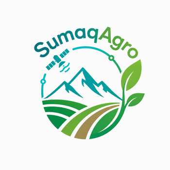

**Typography**

La identidad tipográfica de SumaqAgro utiliza fuentes sans-serif seleccionadas de Google Fonts, elegidas por su alta legibilidad, apariencia moderna y óptima compatibilidad con entornos digitales navegables. La combinación de **Poppins** como tipografía principal e **Inter** como tipografía secundaria permite establecer una jerarquía visual clara e intuitiva entre títulos, contenidos informativos y elementos de interfaz, garantizando el cumplimiento de los estándares de accesibilidad web (a11y).

**Fuente principal: Poppins**

Se utiliza principalmente en encabezados y títulos, aportando un estilo geométrico y contemporáneo que refuerza la identidad visual de SumaqAgro:
- **Títulos principales (H1 / Sección heading):** Poppins Bold, 40 px en versión de escritorio / 28 px en móvil (Ejemplo: “Cultiva con Información”).
- **Títulos de secciones (H2 / Sub-headings):** Poppins SemiBold, 32 px en escritorio / 24 px en móvil (Ejemplo: “Nuestro Impacto en el Campo”).
- **Títulos de tarjetas o bloques (H3):** Poppins Medium, 20 px.
- **Subtítulos internos (H4):** Poppins Medium o SemiBold, entre 18 px y 20 px según el contexto.

**Fuente secundaria: Inter**

Se utiliza en bloques de lectura, etiquetas, botones, formularios y componentes de la interfaz gráfica debido a su extraordinaria claridad y rendimiento de lectura en pantallas de diversas resoluciones:
- **Párrafos principales (Body 1):** Inter Regular, 16 px.
- **Textos secundarios, subtítulos y Footer (Body 2):** Inter Regular, 14 px.
- **Botones y llamadas a la acción (Button Text / CTA):** Inter SemiBold, 16 px.
- **Etiquetas de formularios o elementos de interfaz (Labels):** Inter Medium, 14 px.

  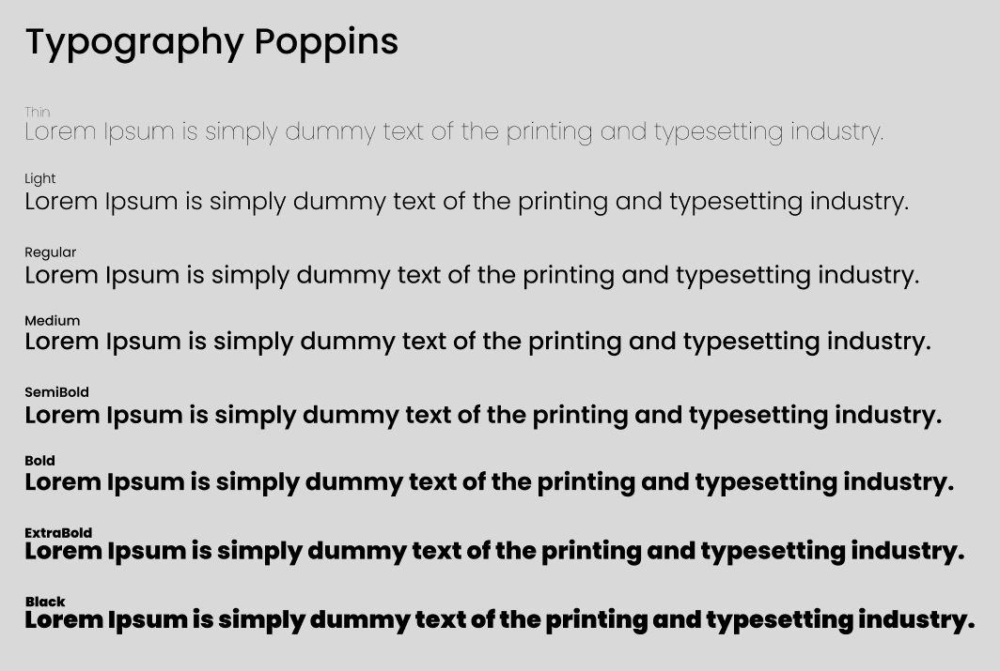
  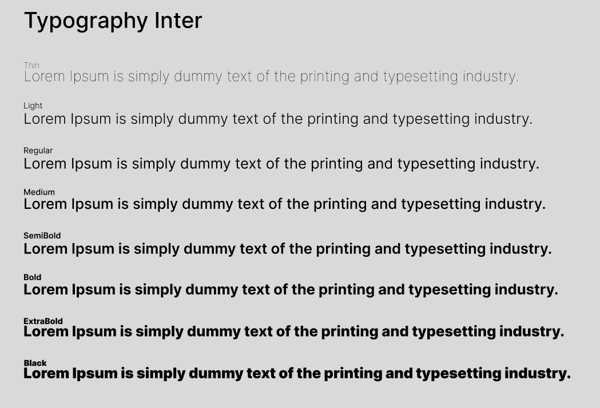

Esta combinación y jerarquía tipográfica permite mantener una experiencia de usuario consistente, altamente accesible, clara y profesional a través de los distintos dispositivos y secciones de la plataforma.

**Colors**

La interfaz web utilizará una paleta de colores basada principalmente en tonos **teal, verdes y neutros**, complementados con colores de estado para comunicar acciones, advertencias y errores.

- **Color primario:** se utilizarán tonos teal como color principal de identidad visual. Estos colores estarán presentes en elementos destacados de la interfaz, estados activos, componentes principales y elementos interactivos.

- **Color secundario:** los tonos verdes se emplearán como complemento del color principal, especialmente en botones, indicadores positivos, elementos relacionados con el estado de los cultivos y acciones secundarias.

- **Colores neutros:** se utilizarán tonos grises y blancos para mantener una interfaz limpia y facilitar la lectura del contenido. El fondo general de las vistas empleará tonos claros, mientras que componentes como el **sidebar utilizarán un fondo blanco** para diferenciar claramente la navegación del área principal de trabajo.

- **Superficies y tarjetas:** las tarjetas y contenedores de información utilizarán principalmente fondos blancos o tonos neutros claros. Algunos componentes importantes podrán utilizar fondos oscuros pertenecientes a la paleta principal para generar mayor jerarquía visual.

- **Navegación:** el menú lateral mantendrá una apariencia clara, utilizando fondo blanco y colores verdes o teal para identificar opciones seleccionadas, iconos y elementos interactivos.

- **Estados del sistema:** se utilizarán colores específicos para comunicar información importante:
  - **Rojo:** errores, acciones incorrectas o situaciones que requieren atención inmediata.
  - **Amarillo:** advertencias o situaciones que necesitan precaución.
  - **Verde:** estados correctos, disponibles, saludables o confirmaciones exitosas.

- **Contraste y legibilidad:** los colores oscuros serán utilizados principalmente para textos y elementos destacados, mientras que los tonos claros servirán como fondos y superficies, buscando mantener un contraste adecuado y una lectura sencilla en toda la aplicación.

  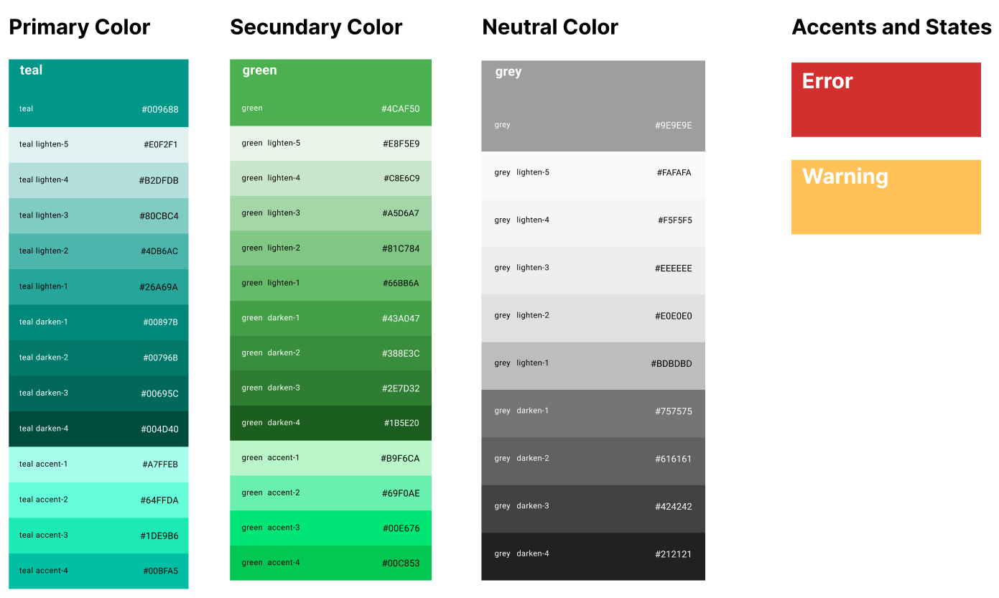

**Spacing**

SumaqAgro utiliza un sistema de espaciado basado en múltiplos de 8 px, permitiendo mantener una interfaz ordenada, consistente y fácil de adaptar a diferentes tamaños de pantalla. Este sistema se aplica en márgenes, paddings, separación entre componentes y distribución de contenido.

*   **4 px – Extra Small (XS):** Separaciones mínimas entre elementos relacionados, como iconos y texto.
*   **8 px – Small (S):** Espaciado interno pequeño, utilizado en botones, etiquetas y elementos compactos.
*   **16 px – Medium (M):** Espaciado estándar entre textos, campos de formulario y elementos dentro de una tarjeta.
*   **24 px – Large (L):** Separación entre grupos de contenido, tarjetas o bloques relacionados.
*   **32 px – Extra Large (XL):** Espaciado entre secciones internas o componentes principales.
*   **48 px – 2XL:** Utilizado para separar bloques importantes dentro de una misma sección.
*   **64 px – 3XL:** Recomendado para la separación vertical entre secciones principales de la página.
*   **80 px – 4XL:** Puede utilizarse en secciones amplias como Hero, Features o Call to Action en versión Desktop.

**Tono de Comunicación**

La voz y el tono de SumaqAgro están diseñados para ser tan claros, cercanos y confiables como nuestra plataforma. Nuestro objetivo es conectar con agricultores, cooperativas y profesionales del sector agrícola de manera empática, accesible y profesional.

* **Tono: Empático y cercano.** Buscamos reconocer y comprender las principales dificultades del trabajo agrícola, como heladas, sequías, plagas, estrés hídrico o la toma de decisiones basada en información limitada, transmitiendo comprensión y apoyo frente a estos desafíos.

* **Actitud: Profesional y confiable.** Explicamos conceptos técnicos —como el índice NDVI, monitoreo satelital o análisis de cultivos— de manera sencilla pero precisa, relacionándolos con beneficios concretos como la reducción de pérdidas, la optimización de recursos y la mejora de la productividad.

* **Lenguaje: Claro y directo.** Evitamos términos innecesariamente complejos y empleamos mensajes breves orientados a la acción. Las llamadas a la acción (CTAs) indican claramente lo que el usuario puede realizar mediante frases como “Registrar mi parcela”, “Ver estado del cultivo” o “Consultar alertas”.

* **Voz: Experta y facilitadora.** Posicionamos a SumaqAgro como una herramienta moderna para la transformación agrícola, manteniendo siempre una comunicación accesible que prioriza los beneficios prácticos que la plataforma ofrece en el día a día.

**Dimensiones del tono de voz**

Siguiendo las cuatro dimensiones del tono de voz, SumaqAgro se ubica de la siguiente manera:

* **Divertido / Serio → Serio.** Las decisiones del productor afectan su cosecha y sus ingresos, por lo que se evitan los chistes y el lenguaje informal en alertas, costos y recomendaciones.
* **Formal / Casual → Casual.** Se usa un trato cercano y en segunda persona (“Tu cultivo tiene buen vigor”, “¡Buen día, Guillermo!”), con frases cortas y sin tecnicismos innecesarios.
* **Respetuoso / Irreverente → Respetuoso.** Se reconoce el conocimiento y la experiencia del agricultor, y los mensajes de error explican cómo corregir el problema sin culpar al usuario.
* **Entusiasta / Sereno → Sereno.** Las alertas de helada o plaga se comunican con calma y con pasos claros a seguir; el entusiasmo se reserva para confirmar logros, como un registro exitoso o un cultivo en estado “Óptimo”.

Este enfoque comunicacional busca generar confianza y lealtad, asegurando a los productores y organizaciones agrícolas que cuentan con un aliado tecnológico claro y efectivo para optimizar la gestión de sus cultivos.

### 4.1.2. Web Style Guidelines

Esta sección define las pautas visuales, de maquetación y de componentes de interfaz para el desarrollo del sitio web estático (**Landing Page en HTML5/CSS3/JS**) y la aplicación web orientada a la gestión agrícola en **Angular**, utilizando **Angular Material** como biblioteca principal de componentes de UI.

El enfoque está centrado en garantizar una experiencia visual y de interacción consistente, accesible (**a11y**) y adaptable a cualquier dispositivo utilizado en campo u oficina.

### Responsive Design

La interfaz de **SumaqAgro** se adapta de forma fluida a las pantallas de teléfonos móviles, tabletas y computadoras de escritorio mediante un sistema de cuadrícula (*Grid System*) y puntos de interrupción (*breakpoints*) estandarizados:

- **Extra Small (xs ≤ 576px):** Smartphones en orientación vertical utilizados por agricultores en campo.

- **Small (sm 577px – 768px):** Tabletas y dispositivos móviles en orientación horizontal.

- **Medium (md 769px – 1024px):** Laptops y pantallas compactas de oficina cooperativa.

- **Large (lg > 1024px):** Monitores de escritorio para análisis detallado de mapas satelitales y reportes.

Para el **Landing Page**, la adaptabilidad se logra mediante *CSS Flexbox*, *CSS Grid* y *Media Queries* nativas.

Para la **Web Application en Angular**, la maquetación se gestiona mediante directivas de diseño responsivo y bibliotecas de componentes adaptables.

### Componentes y patrones compatibles

- **Navegación (*Navbar / Menu*):** En la aplicación web se utiliza `<mat-toolbar>` en combinación con `<mat-menu>` o `<mat-sidenav>` para la barra lateral responsiva, integrada con el módulo de enrutamiento mediante `routerLink`. En el Landing Page se emplea una barra superior fija (*sticky*) construida con elementos semánticos `<header>` y `<nav>`.

- **Tarjetas (*Cards*):** Implementación de `<mat-card>` para estructurar contenedores de información clave como el resumen de lotes, mapas de vigor foliar (*NDVI*), estados de alertas fitosanitarias y balances financieros de campaña.

- **Botones de acción:** Uso de variantes de Angular Material según la jerarquía del elemento:
  - `<button mat-raised-button>` para llamadas a la acción principales, como **“Registrar Parcela”** y **“Consultar al Asesor”**.
  - `<button mat-button>` para acciones secundarias.
  - `<button mat-icon-button>` para controles en visores de mapas satelitales.

- **Diálogos y Notificaciones:** Uso de `MatSnackBar` para la confirmación de registros de gastos o avisos preventivos, y `MatDialog` para el despliegue contextual de fichas técnicas de lotes, recetas fitosanitarias o vista previa de certificados de cosecha en PDF.

### Accesibilidad (a11y)

Con el fin de asegurar que la plataforma sea inclusiva para todos los perfiles de usuario, incluyendo agricultores, dirigentes de cooperativas y agrónomos, se consideran las siguientes pautas:

- **Soporte ARIA:** Integración explícita de atributos `aria-label`, `aria-expanded` y `aria-live` en componentes interactivos y dinámicos.

- **Navegación por teclado:** Compatibilidad completa de foco e interacción mediante secuencias de teclado estándar como `Tab`, `Enter`, `Space` y `Escape`.

- **Contraste y escalabilidad:** Cumplimiento de los niveles de contraste de color según la norma **WCAG 2.1 AA**, con un ratio mínimo de **4.5:1** para texto normal, y uso de unidades relativas como `rem` y `em` para garantizar el escalado de tipografías sin distorsión de la interfaz.

### 4.1.3. Mobile Style Guidelines

Esta sección define las pautas de la aplicación móvil de **SumaqAgro**, diseñada en Figma para Android (frame de 360 × 800 px) y pensada para el uso en campo con una sola mano. Hereda la identidad visual de las secciones anteriores. [Ver diseño en Figma](https://www.figma.com/design/ISAgMtqNOAucizqd3eXYzR/UI-DESIGN?node-id=898-10332).

**a) Patrones de navegación:** Se emplea una *Bottom Navigation Bar* fija con cinco destinos (Inicio, Monitoreo, Finanzas, Alertas y Perfil), con íconos y etiquetas visibles, complementada con un botón de acción flotante (*FAB*) para la acción principal de Finanzas (“Anotar gasto”). Las vistas de detalle y los formularios usan una flecha de retroceso en la barra superior.

**b) Componentes nativos:**
- Botones primarios rellenos en teal (`#00796B`) con texto blanco y ancho completo en formularios; botones secundarios con borde teal.
- Tarjetas (*cards*) de 16 px de radio para los indicadores clave, con la tarjeta de *Salud Foliar* en teal oscuro (`#004D40`) para dar jerarquía.
- *Bottom sheets* para selectores (*Cambiar Parcela*, *Enviar foto de plaga*) y modales o diálogos para confirmaciones (guardar gasto, finalizar plan, cerrar sesión).
- Chips de selección (*Insumos y Abono*, *Mano de Obra / Jornal*, *Flete*) y banners ámbar para avisos de sincronización pendiente.

**c) Tipografía:** Poppins para títulos y cifras clave (Display 32 px, H1 28 px, H2 24 px, H3 20 px) e Inter para texto e interfaz (cuerpo 16 px, texto secundario 14 px, etiquetas y *captions* 12 px).

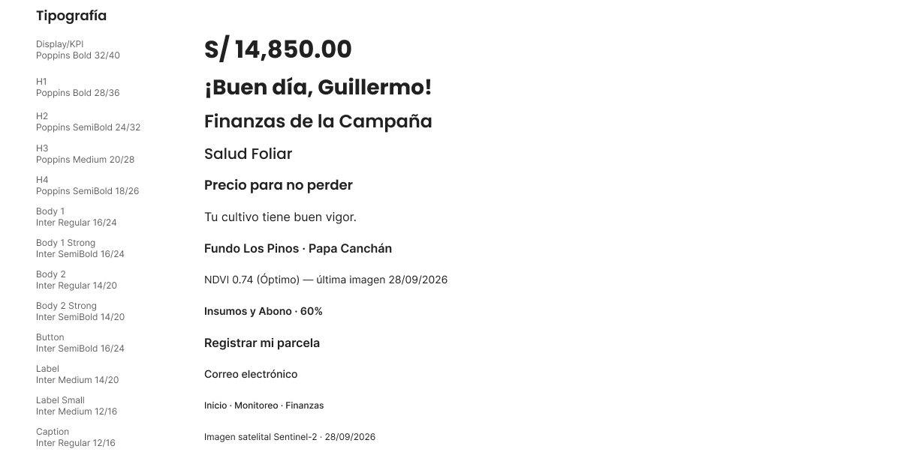

**d) Colores:** Escala Material en teal (primario), verde (confirmaciones y estado “Óptimo”) y grises (fondos y bordes); rojo `#D32F2F` para errores y alertas críticas y ámbar `#FFC107` para avisos. El texto blanco solo se usa sobre teal `#00796B` o más oscuro (contraste AA ≥ 4.5:1).

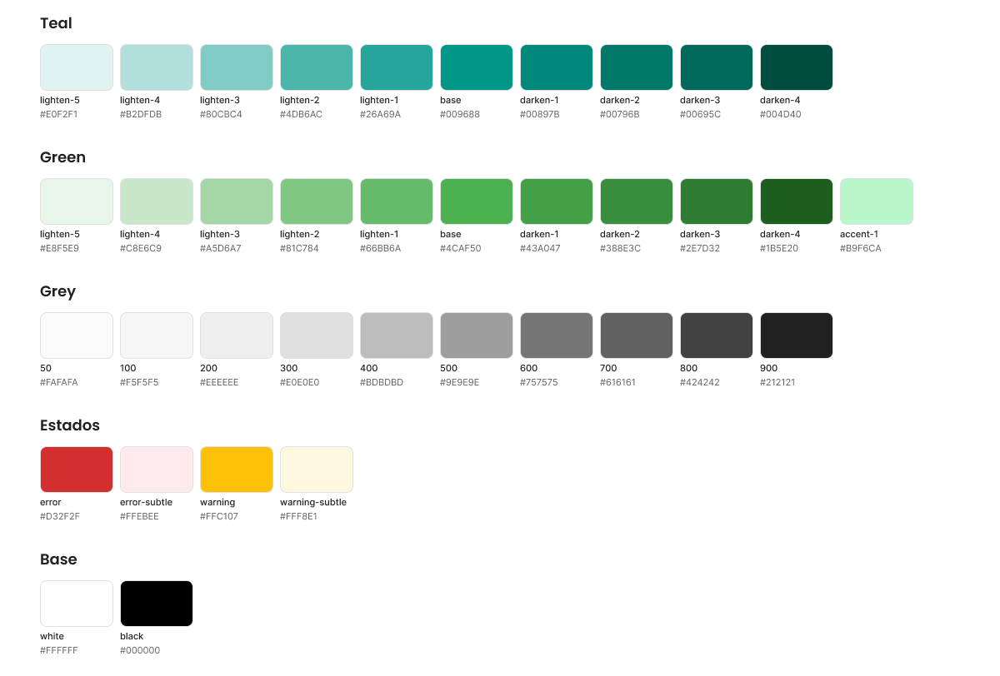

**e) Espaciado:** Base de 8 px (4, 8, 16, 24, 32 y 48 px), con márgenes laterales de 16 px y radios de 8, 12, 16 y 24 px.

**f) Gestos y accesibilidad:** Solo se usan toques simples (*tap*), sin gestos complejos. Las áreas táctiles son de al menos 48 × 48 px, y los estados se comunican con ícono y texto, no solo con color.

**g) Iconografía:** Se utilizan íconos *Material Symbols Rounded* de 24 × 24 px, siempre acompañados de una etiqueta.

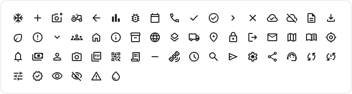

## 4.2. Information Architecture

### 4.2.1. Organization Systems

La organización jerárquica del Landing Page de "SumaqAgro" ha sido diseñada con el propósito de guiar al usuario de manera lógica y efectiva desde su primer contacto con la solución hasta su conversión en cliente. Esta estructura responde a principios de arquitectura de la información que priorizan la claridad, la relevancia y la progresión natural del contenido, permitiendo que los usuarios comprendan de inmediato el valor del producto, cómo funciona, sus beneficios, y los pasos para adquirirlo.

**Inicio**

- **Propósito**: Captar la atención del visitante con un mensaje claro y directo orientado al sector agrícola.

- **Contenido**: Propuesta de valor en el banner principal y llamadas a la acción directas.

**Información explicativa**

- **Nosotros:** Presentación del propósito de la plataforma y el equipo detrás de la solución.

- **¿A quién ayudamos?:** Segmentación explícita del valor para los tres públicos objetivo (agricultores independientes, líderes de cooperativas y asesores técnicos/agrónomos).

- **Soluciones y Características:** Detalle de las capacidades tecnológicas clave como monitoreo satelital (NDVI), contabilidad de costos, certificación digital y prescripciones con alertas.

- **Demo del Producto:** Video demostrativo sobre el funcionamiento en campo de la plataforma.

**Conversión y Validación**

- **Planes:** Detalle de las opciones de suscripción diseñadas para cada perfil (Plan Semilla, Cooperativa Pro y Plan Asesor Técnico).

- **Impacto y Testimonios:** Presentación de métricas de alcance y testimonios reales de clientes que validan la experiencia.

  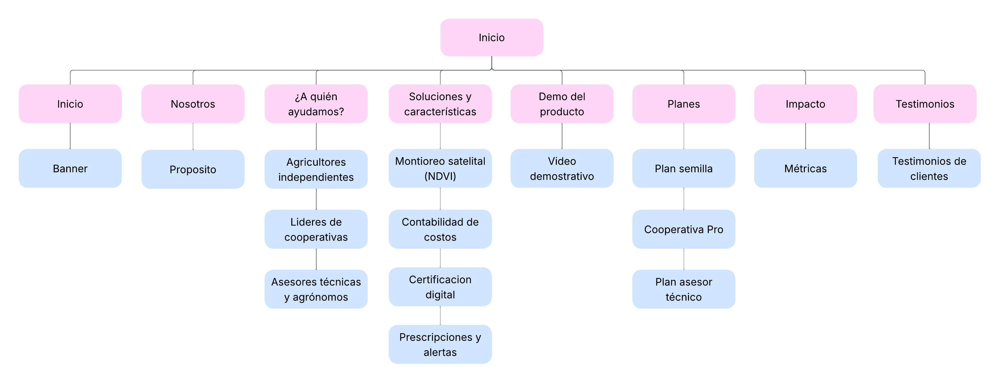

> 
Organización en el landing page

Además, la arquitectura jerárquica en la interfaz de la aplicación web de "SumaqAgro" ha sido diseñada para facilitar el acceso y gestión eficiente de las múltiples funcionalidades del sistema. Esta estructura permite una distribución lógica del contenido, reduciendo la carga cognitiva del usuario en campo y mejorando su capacidad para encontrar rápidamente las herramientas que necesita.

  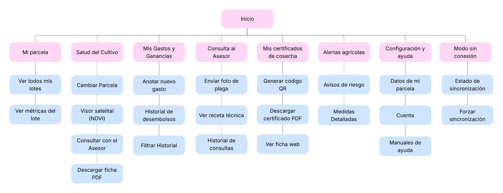

> 
Organización en la aplicación

**Pantalla de inicio (Mi Parcela)**

Una vista general tipo dashboard que presenta:

- Tarjetas resumen de vigor vegetal (NDVI), costos acumulados de la campaña y punto de equilibrio financiero.

- Avisos destacados de alertas fitosanitarias activas o riesgos climáticos.

- Accesos rápidos para explorar lotes y consultar datos clave de la parcela.

**Navegación principal**

Sistema jerárquico accesible desde un menú lateral con iconografía clara. Incluye las siguientes pestañas:

- Mi Parcela

- Salud del Cultivo

- Mis Gastos y Ganancias

- Consulta al Asesor

- Mis Certificados de Cosecha

- Alertas Agrícolas

- Configuración y Ayuda

- Modo Sin Conexión

**Filtrado y organización avanzada**

**a. Para Agricultores Independientes**

- **Filtros por:** Parcelas, lotes y capas satelitales (Vigor del Follaje / Humedad).

- **Funcionalidades destacadas:** Visor satelital (NDVI), registro de gastos y solicitudes de asistencia al asesor.

**b. Para Líderes de Cooperativas**

- **Filtros por:** Lotes comunitarios, categorías de gastos acumulados e historial de cosechas.

- **Funcionalidades destacadas:** Emisión de certificados de calidad con código QR, fichas PDF exportables y métricas de rendimiento por lote.

**c. Para Asesores Técnicos y Agrónomos**

- **Filtros por:** Parcelas asignadas, estado de consultas fitosanitarias y nivel de riesgo/alerta.

- **Funcionalidades destacadas:** Revisión de fotografías de plagas enviadas por agricultores, emisión de recetas técnicas y seguimiento de avisos de riesgo.

**Organización visual del contenido**

- **Jerárquica (*visual hierarchy*):** Se aplica en el Landing Page (de la propuesta de valor a los planes) y en los dashboards, donde el indicador más importante, como la salud foliar, se destaca sobre los demás y los detalles quedan en niveles inferiores.
- **Secuencial (*step-by-step*):** Se aplica en las tareas que se completan en pasos ordenados: el registro de cuenta, la recuperación de contraseña con código OTP, el registro de una parcela (mapa, datos del cultivo y confirmación) y el plan de acción de una alerta.
- **Matricial:** Se aplica en cuadrículas de tarjetas, como las parcelas registradas con sus cupos disponibles, los indicadores clave del dashboard y la comparación de planes de suscripción en el Landing Page.

**Esquemas de categorización del contenido**

- **Por tópicos:** Los módulos de la aplicación se agrupan por tema (Principal, Operación agrícola y Sistema), al igual que los gastos (Insumos y Abono, Mano de Obra y Flete) y las alertas (clima y fitosanitarias).
- **Cronológico:** El historial de gastos, las alertas, las consultas al asesor y los certificados se ordenan del más reciente al más antiguo.
- **Alfabético:** Se aplica en las listas de selección, como parcelas y cultivos, para encontrar un elemento sin esfuerzo.
- **Según audiencia:** Se desarrolla a continuación en *Segmentación por audiencia*.

**Segmentación por audiencia**

**a. Agricultores independientes**

- Enfoque en el control visual de la salud de sus cultivos, manejo contable sencillo de la campaña y prevención ante contingencias climáticas.

- Visualización rápida de métricas clave y acceso directo a canales de ayuda y soporte en campo.

**b. Líderes de cooperativas**

- Enfoque en la estandarización de la producción, respaldo técnico comercial de la cosecha colectiva y la gestión eficiente de costos.

- Herramientas para la generación de documentos oficiales con código QR que facilitan la venta transparente a acopiadores y compradores.

**c. Asesores técnicos y agrónomos**

- Enfoque en la asistencia técnica distribuida, optimización de visitas a terreno e intervención precisa ante plagas o heladas.

- Canal de comunicación directo para dictar diagnósticos, recomendar dosificación de insumos y mantener un historial clínico por cada parcela.
   
   
- 
### 4.2.2. Labeling Systems

El sistema de etiquetado de **SumaqAgro** ha sido diseñado para ser claro, directo y fácil de entender por agricultores, cooperativas y agrónomos, usando palabras clave con un número mínimo de términos sin perder precisión. Las etiquetas evitan tecnicismos innecesarios y buscan reducir la carga cognitiva del usuario en el campo.

### Principios

- **Consistencia:** Se usan las mismas etiquetas en botones, menús y mensajes relacionados. Por ejemplo: **“Ver todos mis lotes”**, **“Consultar con el Asesor”** y **“Descargar Ficha PDF”**.

- **Simplicidad:** Se evita el uso de jergas técnicas complejas, empleando términos agrícolas cotidianos. Ejemplos: **“Vigor del Follaje (NDVI)”**, **“Déficit de Humedad”** y **“Precio para no perder”**.

### Etiquetado en el Landing Page

- **Inicio:** Es la primera sección que el usuario ve al entrar. Presenta la propuesta de valor **“Cultiva con Información. Decide con Precisión”** y botones directos.

- **Nosotros:** Muestra el propósito de **SumaqAgro** y la presentación del equipo detrás de la plataforma.

- **¿A quién ayudamos?:** Segmenta la información para **“Agricultores independientes”**, **“Líderes de cooperativas”** y **“Asesores técnicos y agrónomos”**.

- **Soluciones y Características:** Presenta los módulos de **“Monitoreo satelital (NDVI)”**, **“Contabilidad de costos”**, **“Certificación digital”** y **“Prescripciones y alertas”**.

- **Demo del Producto:** Incluye la sección de **“Video demostrativo”** para conocer la plataforma en acción.

- **Planes:** Presenta las opciones de suscripción: **“Plan Semilla”**, **“Cooperativa Pro”** y **“Plan Asesor Técnico”**.

- **Impacto:** Muestra **“Métricas”** y datos estadísticos de alcance en hectáreas monitoreadas y rendimiento de cultivos.

- **Testimonios:** Muestra **“Testimonios de Clientes”** y opiniones de productores que validan el uso de la solución.

### Etiquetado en la Aplicación Web

- **Mi Parcela:** Vista principal del dashboard con métricas clave como **“Salud Foliar”**, **“Gasto Total”**, **“Precio para no perder”** y accesos a **“Ver todos mis lotes”**.

- **Salud del Cultivo:** Visor con mapas de **“Vigor del Follaje (NDVI)”**, **“Humedad del Suelo”** y opciones como **“Cambiar Parcela”**, **“Consultar con el Asesor”** y **“Descargar Ficha PDF”**.

- **Mis Gastos y Ganancias:** Sección financiera que etiqueta **“Finanzas de la Campaña”**, **“Anotar nuevo gasto”**, **“Historial de desembolsos”** y **“Filtrar Historial”**.

- **Consulta al Asesor:** Canal fitosanitario con etiquetas como **“Asistencia Fitosanitaria y Recetas”**, **“Enviar foto de plaga”**, **“Ver receta técnica”** e **“Historial de consultas”**.

- **Mis Certificados de Cosecha:** Módulo oficial con botones e indicadores como **“Generar código QR”**, **“Descargar certificado PDF”** y **“Ver ficha web”**.

- **Alertas Agrícolas:** Panel de notificaciones etiquetado con **“Avisos de riesgo”**, **“Boletín Fitosanitario”** y acciones como **“Medidas Detalladas”**.

- **Configuración y Ayuda:** Sección para gestionar **“Datos de mi parcela”**, **“Cuenta”**, **“Manuales de ayuda”** y el botón directo **“Llamar a Soporte SumaqAgro”**.

### Etiquetado en la Aplicación Móvil

La aplicación móvil mantiene las mismas etiquetas del Lenguaje Ubicuo, con textos más cortos para pantallas de 360 px:

- **Barra de navegación inferior:** **Inicio** (*Home*), **Monitoreo** (*Monitoring*), **Finanzas** (*Finances*), **Alertas** (*Alerts*) y **Perfil** (*Profile*).
- **Tarjetas del Inicio:** **Salud Foliar** (*Leaf Health*), **Gasto Total** (*Total Spend*) y **Precio para no perder** (*Break-even Price*).
- **Acciones principales:** **Anotar gasto** (*Log expense*), **Enviar foto de plaga** (*Send pest photo*) y **Registrar parcela** (*Register new plot*).
- **Estados:** **Conectado** (*Connected*), **Óptimo** (*Optimal*) y **pendientes** (*pending*) para los datos por sincronizar.

### 4.2.3. SEO Tags and Meta Tags

Con el objetivo de mejorar la visibilidad de "SumaqAgro" en los motores de búsqueda y facilitar su descubrimiento tanto por agricultores independientes, líderes de cooperativas y asesores técnicos agrónomos interesados en optimizar el rendimiento y la gestión de sus cultivos, se ha establecido una estrategia SEO que incluye el uso adecuado de etiquetas HTML para los principales elementos informativos del sitio web estático (Landing Page) y la aplicación web.

**Landing Page**

- **Title:**  
  `<title>SumaqAgro – Monitoreo Satelital y Gestión Agrícola de Precisión</title>`

Una frase concisa que refleja la propuesta de valor de la plataforma e integra palabras clave estratégicas como "monitoreo satelital", "gestión agrícola" y "precisión", términos frecuentemente utilizados por productores y profesionales del sector agrotecnológico al buscar soluciones digitales.

- **Meta Description:**  
  `<meta name="description" content="Plataforma de agrotecnología para el campo peruano. Optimiza el rendimiento de tus cultivos con mapas NDVI, control de costos por lote, trazabilidad con QR y alertas de riesgo fitosanitario.">`

Esta descripción sintetiza el propósito de la herramienta destacando sus beneficios diferenciadores (salud foliar NDVI, control financiero y certificación digital), incorporando términos de búsqueda de alta relevancia como “agrotecnología”, “alertas fitosanitarias” y “código QR”.

- **Meta Keywords:**  
  `<meta name="keywords" content="SumaqAgro, monitoreo satelital agrícola, índice NDVI, agricultura de precisión Perú, gestión de cooperativas agrícolas, control de gastos agrícolas, certificado QR cosecha, alertas fitosanitarias">`

Un conjunto seleccionado de palabras clave que abarca los perfiles de usuario objetivo (agricultores, cooperativas, agrónomos) y las funcionalidades centrales de la solución (NDVI, control de gastos, trazabilidad y alertas de riesgo).

- **Meta Author:**  
  `<meta name="author" content="Equipo de Open Source – Open Source Software">`

Identifica al equipo responsable del diseño, desarrollo y arquitectura de información del sitio web, reforzando la transparencia y la atribución del proyecto.

---

**Web Application – Dashboard Principal**

- **Title:**  
  `<title>Mi Parcela – SumaqAgro | Panel de Control y Monitoreo de Cultivos</title>`

Este título complementa la identidad de la plataforma con una llamada a la acción orientada a la gestión operativa, enfocándose en la centralización y monitoreo de predios agrícolas desde la vista principal de la aplicación.

- **Meta Description:**  
  `<meta name="description" content="Accede a tu panel principal en SumaqAgro. Visualiza el mapa de salud foliar (NDVI) de tus lotes, registra gastos de campaña, consulta el precio de equilibrio y gestiona solicitudes fitosanitarias con tu asesor técnico.">`

Redactado con un enfoque funcional y operativo que detalla las acciones inmediatas que el usuario puede realizar en la interfaz, destacando la interacción entre agricultor, agrónomo y datos geoespaciales.

- **Meta Keywords:**  
  `<meta name="keywords" content="dashboard agrícola, mi parcela, mapas NDVI, salud del cultivo, control de gastos agrícolas, recetas técnicas, alertas de riesgo, plataforma SumaqAgro">`

Palabras clave orientadas a la experiencia interna de la aplicación, utilizando términos específicos de uso continuo en la plataforma (ej. “dashboard agrícola”, “mapas NDVI”, “recetas técnicas”).

- **Meta Author:**  
  `<meta name="author" content="Equipo de Open Source – Open Source Software">`

Especifica el equipo de desarrollo web responsable del proyecto para asegurar la vigencia y atribución tecnológica de la aplicación.
 
 

### 4.2.4. Searching Systems

Dentro de la sección **Mi Parcela** de la aplicación web, el sistema de búsqueda está integrado de forma simple pero efectiva para que el usuario pueda localizar lotes, registros o métricas rápidamente. Se utiliza un campo de búsqueda principal centrado en la parte superior del encabezado del dashboard, acompañado de indicadores de estado de conexión y notificaciones.

Este campo permite buscar por nombre de parcela, tipo de cultivo o sector. Por ejemplo: **“Papa Canchán”** o **“Lote 2”**.

  

#### Búsqueda en la parcela

El sistema de búsqueda permite al usuario localizar información específica relacionada con sus parcelas de forma rápida. La búsqueda puede realizarse utilizando términos asociados al nombre del lote, cultivo, variedad o sector registrado dentro de la plataforma.

#### Filtros de Búsqueda

Al realizar una búsqueda, los usuarios pueden refinar los resultados mediante diferentes criterios que permiten adaptar la información mostrada según sus necesidades.

- **Categoría o Cultivo:** Permite filtrar la información según el tipo de producto agrícola, como papa, café, entre otros.

- **Salud Fitosanitaria / Vigor (NDVI):** Permite identificar lotes según su condición actual, diferenciando entre estado óptimo, alerta moderada o riesgo severo.

#### Resultados de Búsqueda

Los resultados se presentan mediante una estructura visual basada en tarjetas y mapas de calor, permitiendo al usuario identificar rápidamente la información más relevante de cada parcela.

Cada resultado puede incluir:

- **Nombre del lote o parcela.**
- **Tipo de cultivo y variedad.**
- **Índice NDVI de salud foliar.**
- **Costo acumulado de la campaña.**
- **Estado de alerta activa.**

Para facilitar la interpretación de la información, se utiliza una codificación visual mediante colores:

- **Verde:** Representa un estado saludable del cultivo y un nivel adecuado de vigor foliar.

- **Amarillo:** Representa una condición de alerta moderada que requiere seguimiento.

- **Rojo:** Representa una situación de riesgo alto o una posible alerta fitosanitaria.

#### Búsqueda Avanzada por Segmento

**SumaqAgro** adapta sus funciones de búsqueda y filtrado según las necesidades de los diferentes perfiles de usuario de la plataforma.

##### Agricultores Independientes

Los agricultores pueden realizar búsquedas rápidas de sus lotes individuales, consultar información asociada a cada parcela y filtrar sus registros de campaña.

Entre las principales opciones se encuentran:

- Búsqueda de lotes o parcelas.
- Filtrado de gastos por categoría.
- Consulta de mano de obra, fertilizantes e insumos.
- Consulta del historial de precios de equilibrio de los cultivos.

##### Líderes de Cooperativas

Los líderes de cooperativas disponen de herramientas de búsqueda orientadas a la gestión consolidada de socios y producción agrícola.

Entre las principales opciones se encuentran:

- Búsqueda y filtrado de socios de la cooperativa.
- Consulta de volúmenes de acopio por sector.
- Seguimiento de certificados de cosecha.
- Búsqueda mediante código QR o número de ficha.

##### Asesores Técnicos Agrónomos

Los asesores técnicos cuentan con funciones de búsqueda enfocadas en el seguimiento y supervisión de las parcelas asignadas.

Entre las principales opciones se encuentran:

- Filtrado de parcelas según nivel de urgencia.
- Filtrado según severidad del riesgo.
- Consulta del historial de diagnósticos.
- Consulta de recetas fitosanitarias emitidas por predio.

#### Búsqueda en la Aplicación Móvil

En la aplicación móvil la búsqueda se simplifica para el uso con una sola mano:

- **Barra de búsqueda** en la parte superior de las pantallas de Inicio y Finanzas (por ejemplo, "Buscar en mi parcela").
- **Chips de filtro** bajo la barra, como **Todos**, **Insumos**, **Mano de obra** y **Flete** en el historial de gastos.
- **Resultados en tarjetas** de una sola columna, con el estado indicado por color, ícono y texto.

### 4.2.5. Navigation Systems

La navegación en **SumaqAgro** está diseñada para facilitar el recorrido del usuario de manera clara y rápida. En la Landing Page se implementa una barra de navegación fija (header) en la parte superior que contiene el isotipo de la marca, enlaces directos a las secciones principales, botones de acción y selector de idioma. Estas secciones son:

- **Home:** Retorno a la sección principal de bienvenida.
- **About Us:** Información sobre la propuesta de valor y el equipo.
- **Solutions:** Explicación técnica del monitoreo satelital y gestión agrícola.
- **Plans:** Detalle de las suscripciones disponibles para el campo.
- **Impact:** Resultados y testimonios de uso en los cultivos.
- **Sign In / Register:** Botones de acceso y registro a la plataforma.
- **Selector de Idioma (EN):** Opción para cambiar la localización del sitio.

  

> 
Navegación del sitio web (Landing Page)

Además, en la aplicación web se implementa un menú lateral fijo (sidenav) organizado por categorías principales, el cual permite el acceso directo a las funcionalidades de gestión y monitoreo del sistema:

- **Principal:**
  - **Mi Parcela:** Vista del panel general del predio.
- **Operación agrícola:**
  - **Salud del Cultivo:** Visor con mapas de vigor foliar y métricas del predio.
  - **Mis Gastos y Ganancias:** Gestión contable e historial financiero de campaña.
  - **Consulta al Asesor:** Canal directo de atención fitosanitaria y recetas técnicas.
  - **Mis Certificados de Cosecha:** Emisión y consulta de certificados trazables con QR.
- **Sistema:**
  - **Alertas Agrícolas:** Centro de avisos de riesgo y boletín fitosanitario.
  - **Configuración y Ayuda:** Ajustes de la cuenta, datos de parcelas y soporte.
  - **Modo Sin Conexión:** Estado operativo para sincronización de datos en campo.
  - **Cerrar Sesión:** Salida segura de la plataforma.

Cada sección está representada con un ícono claro y una etiqueta visible, asegurando una navegación fluida e intuitiva dentro de la consola de trabajo.

  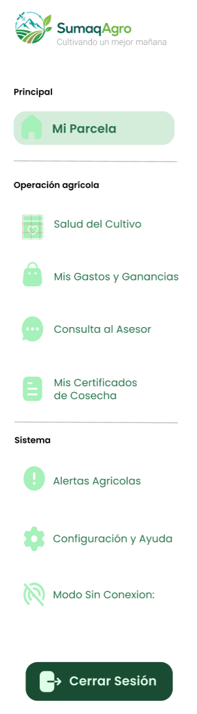

> 
Navegación de la aplicación web (Sidenav)

En la **aplicación móvil** el menú lateral se sustituye por una barra de navegación inferior (*Bottom Navigation Bar*) con cinco destinos fijos, ubicada en la zona del pulgar:

- **Inicio:** Panel de Mi Parcela con salud foliar, gasto total y precio para no perder.
- **Monitoreo:** Visor satelital con las capas de vigor foliar (NDVI) y humedad (NDWI).
- **Finanzas:** Gastos y ganancias de la campaña, con acceso al registro de un nuevo gasto.
- **Alertas:** Avisos de riesgo y plan de acción.
- **Perfil:** Configuración, ayuda, modo sin conexión y cierre de sesión.

Las vistas de detalle y los formularios se recorren con una flecha de retroceso en la barra superior, y las acciones frecuentes aparecen como accesos rápidos en el Inicio (*Consultar con el Asesor*, *Mis Certificados* y *Enviar foto de plaga*).

 

## 4.3. Landing Page UI Design
El landing page representa el primer punto de contacto entre los usuarios y la plataforma, por lo que su diseño debe comunicar de manera clara el propósito y los principales beneficios del servicio. En esta sección se presenta el diseño de la interfaz del landing page, considerando una organización visual atractiva, una navegación sencilla y elementos que faciliten la comprensión de la información y orienten al usuario hacia las acciones principales.

### 4.3.1. Landing Page Wireframe
### Desktop Web Browser
El wireframe del landing page de **SumaqAgro** muestra la estructura inicial de la página y la forma en que se organizan sus principales elementos antes de aplicar el diseño visual definitivo. Su propósito es definir una distribución ordenada y funcional que sirva como base para el desarrollo posterior de la interfaz.

**Nav y Hero**

La sección Hero de la Landing Page presenta en su cabecera superior (Navbar) el isotipo y nombre de marca a la izquierda, los enlaces de anclaje (*Inicio*, *Nosotros*, *Soluciones*, *Planes*, *Impacto*), los botones de acceso (*Iniciar sesión* y *Registrarse*) y el selector de internacionalización (*ES*); seguidamente, el área principal de impacto despliega el subtítulo en mayúsculas *«AGRICULTURA INTELIGENTE PARA UN MEJOR MAÑANA»*, el encabezado principal (H1) *«Cultiva con Información. Decide con Precisión»*, un párrafo descriptivo que sintetiza la transformación de datos satelitales para el monitoreo de cultivos, costos y valor de la producción, y dos llamados a la acción primarios representados por los botones *Explorar* y *Cómo funciona* sobre un fondo fotográfico agrícola de campo.

  

**About**

La sección **Nosotros** (*About Us*) presenta una distribución asimétrica compuesta por un bloque textual a la izquierda y un recurso gráfico a la derecha; el área informativa incluye el kicker superior en mayúsculas *«SOBRE SUMAQAGRO»*, el encabezado de sección (H2) *«Nosotros»*, el subtítulo destacado (H3) *«Democratizamos la agricultura de precisión en el Perú»* y un párrafo institucional que detalla la misión de reducir la brecha de tecnificación en las cuencas de papa y café mediante datos satelitales abiertos y herramientas accesibles de monitoreo, costeo y certificación; mientras que a la derecha se exhibe una composición fotográfica con esquinas redondeadas que muestra una parcela de cultivo tecnificado junto a una mano sosteniendo un smartphone con la interfaz móvil del sistema desplegada.

  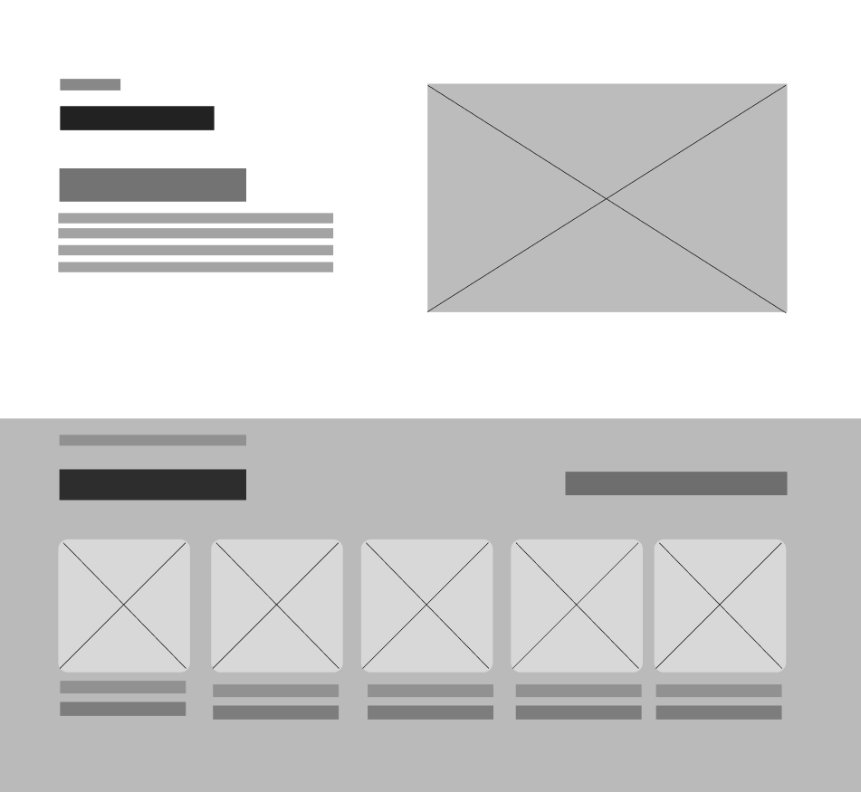

**Solutions**

La sección **¿A quién ayudamos?** organiza la propuesta de valor mediante tres tarjetas (*cards*) de autoselección por perfil orientadas a *Agricultores independientes*, *Líderes de cooperativas* y *Asesores técnicos y agrónomos*, detallando en cada una su enfoque productivo, una fotografía representativa de campo y un botón de llamado a la acción específico (*Registrar mi parcela*, *Gestionar cooperativa* y *Unirme como asesor*); inmediatamente después, la sección **Soluciones y Características** expone las cuatro capacidades tecnológicas clave del sistema mediante una grilla de tarjetas que describen el monitoreo satelital de vigor y humedad (*Satellite Monitoring of Vigor and Moisture*), la contabilidad de costos por lote (*Batch Cost Accounting*), la certificación digital de cosecha (*Digital Certification of Harvest Quality*) y el sistema de prescripciones agronómicas (*Agronomic Prescriptions and Alerts*), complementando cada bloque funcional con un indicador del impacto operativo directo que genera en campo.

  

**Video and Plans**

La sección **Conoce SumaqAgro en acción** presenta un contenedor central con fondo verde oscuro que alberga el reproductor del video demostrativo (*About-the-Product*) para evidenciar el funcionamiento en campo; inmediatamente después, la sección **Planes** (*Pricing*) introduce un conmutador de facturación mensual y anual (*«Ahorra 2 meses con el plan anual»*) junto a una grilla de tres tarjetas de suscripción que estructuran el modelo SaaS freemium y B2B: el **Plan Semilla** (S/ 0 para 1 parcela con NDVI básico y botón *«Empezar gratis»*), el **Plan Cooperativa Pro** (destacado con la etiqueta *«Más popular»* a S/ 189/mes para 50 productores con certificación de calidad y botón *«Suscribir cooperativa»*), y el **Plan Asesor Técnico** (S/ 89/mes para supervisar 20 fundos con recetas técnicas y botón *«Prueba de 14 días»*).

  

**Testimonials , Impact and Footer**

La sección **Impacto** y el cierre del Landing Page se estructuran en tres bloques consecutivos orientados a la credibilidad y la conversión: en primer lugar, el área de métricas cuantitativas presenta tres tarjetas superiores con indicadores clave de respaldo agrario (*333k+ Has. de papa*, *223k+ Familias cafeteras* y *>40% Sin cobertura técnica*), acompañadas en la parte inferior por el bloque testimonial *«Lo que dicen nuestros usuarios»* con tarjetas que incluyen avatar, calificación por estrellas y citas de validación de Juan Huamán (productor de papa) y Elena Vargas (cooperativa cafetalera); a continuación, se ubica el banner final de conversión (*Bottom CTA*) en verde oscuro con el titular *«Empieza a decidir con precisión hoy»*, un texto de apoyo y el botón principal de acción *Registrarse gratis*; finalmente, el pie de página (*Footer*) organiza sobre fondo oscuro el isotipo horizontal de SumaqAgro con su propuesta de valor a la izquierda, junto a una distribución de navegación en tres columnas de enlaces (*Products*, *Quick Links* y *Support*) para centralizar recursos, documentación y canales de soporte de la plataforma.

  

### Mobile Web Browser
Para garantizar una experiencia de usuario inclusiva y accesible, el diseño responsivo de la Landing Page de SumaqAgro se fundamenta en un sistema de rejilla fluido adaptado a dispositivos móviles (*Mobile Web Browser*), utilizando una retícula de 4 columnas y una escala de espaciado basada en múltiplos de 8 px.

En esta vista, los componentes de escritorio se reorganizan de manera progresiva en una sola columna (*single-column layout*), condensando la barra de navegación superior en un menú colapsable tipo hamburguesa (*nav-toggle*) y apilando los bloques informativos, tarjetas de segmentos, matrices de soluciones y llamados a la acción (CTAs) de forma lineal para facilitar el desplazamiento continuo (*scrolling*) y la interacción con una sola mano sin pérdida de contexto ni funcionalidad.

**Hero**

En la vista móvil, la cabecera superior compacta el menú de navegación horizontal bajo un botón tipo hamburguesa (`nav-toggle`) ubicado en el extremo superior derecho, manteniendo a la izquierda el isotipo circular y el nombre de marca SumaqAgro; inmediatamente abajo, el área principal apila el contenido verticalmente en una sola columna centrada de cuatro retículas, encabezada por el *kicker* introductorio en mayúsculas, el titular principal (H1) distribuido en dos líneas de alto impacto y un bloque de tres líneas de texto descriptivo con la propuesta de valor satelital; finalmente, la zona inferior de interacción organiza dos botones de llamado a la acción (CTAs) de ancho adaptativo dispuestos lado a lado en posición horizontal para facilitar el acceso táctil inmediato con una sola mano.

  

**About**

En la vista móvil (**Mobile Web Browser**) de las secciones institucionales, el contenido se reorganiza en una columna lineal: el bloque superior **Nosotros** (*About Us*) apila verticalmente el kicker, el encabezado principal, el subtítulo y el texto de la propuesta de valor junto al contenedor de la imagen representativa del cultivo tecnificado; inmediatamente abajo, la sección **Nuestro equipo** sitúa el titular y su párrafo descriptivo para dar paso a una disposición adaptada en dos columnas que agrupa las cinco tarjetas (*cards*) con fotografía, nombre de cada integrante y un icono de acción rápida en la esquina superior derecha, rematando con el último perfil centrado al pie para optimizar el espacio vertical en pantallas compactas.

  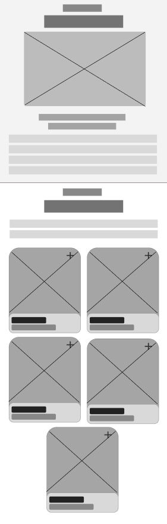

**Solutions**

En la vista móvil (**Mobile Web Browser**) de las secciones comerciales y funcionales, el contenido se adapta a una columna única vertical: en la parte superior, la sección **¿A quién ayudamos?** apila secuencialmente las tres tarjetas de autoselección por rol (*Agricultores independientes*, *Líderes de cooperativas* y *Asesores técnicos*), situando en cada una su icono, titular, descripción de enfoque, vista previa gráfica y el botón de acción (*CTA*) con ancho completo al pie para facilitar el toque con una sola mano; a continuación, la sección **Soluciones y Características** transforma la grilla de escritorio en un apilamiento lineal de cuatro tarjetas de funcionalidades (monitoreo satelital NDVI, costos por lote, certificación de calidad y prescripciones agronómicas), cada una con su barra decorativa superior, icono de módulo, título, párrafo descriptivo y una tarjeta inferior de impacto cuantificable orientada al valor en campo.

  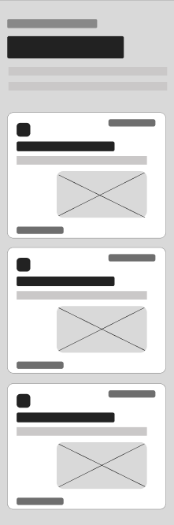

  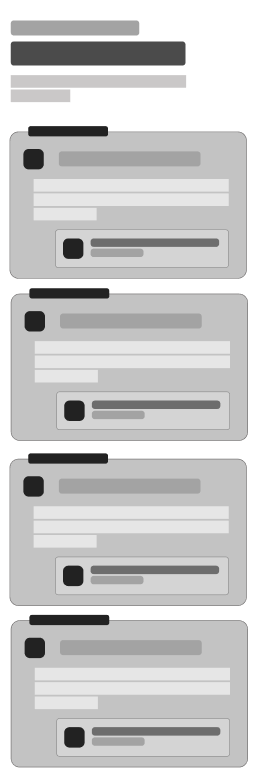

**Video and Plans**

En la vista móvil (**Mobile Web Browser**) de los bloques de demostración y monetización, la interfaz se compacta en una sola columna vertical: en la parte superior, la sección **Conoce SumaqAgro en acción** (*About-the-Product*) enmarca el contenedor del reproductor de video demostrativo centrado sobre un bloque de fondo verde oscuro (#233413) que incluye el botón de reproducción (*Play*) para evidenciar el funcionamiento en campo; inmediatamente después, la sección **Planes** (*Pricing*) sitúa el encabezado de sección, el texto descriptivo y un conmutador de facturación mensual/anual (*switch toggle*), dando paso al apilamiento secuencial de las tres tarjetas de suscripción (*Plan Semilla*, *Plan Cooperativa Pro* y *Plan Asesor Técnico*), donde cada una presenta su nombre de plan, tarifa destacada en Soles, resumen de características y su botón de llamado a la acción (*CTA*) en ancho completo al pie para una pulsación táctil accesible con una sola mano.

  

  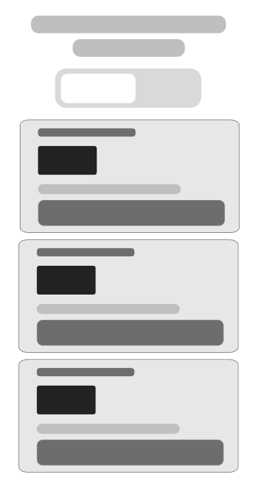

**Impact, Testimonials and Footer**

En la vista móvil (**Mobile Web Browser**) del cierre de la página, los componentes se reorganizan en una secuencia vertical de cuatro bloques lineales: en la parte superior, la sección **Impacto** apila las tres tarjetas de métricas agrarias (*333k+ Has. de papa*, *223k+ Familias cafeteras* y *>40% Sin cobertura técnica*); inmediatamente después, el bloque de testimonios (*«Lo que dicen nuestros usuarios»*) presenta de forma vertical las dos tarjetas de validación social con el avatar, nombre, rol y cita de cada usuario; a continuación, el banner final de conversión (*Bottom CTA*) condensa el titular, el texto de apoyo y el botón de acción *«Registrarse gratis»* adaptado a pantalla completa para facilitar la pulsación táctil con una sola mano; finalmente, el pie de página (*Footer*) sobre fondo oscuro (#031416) apila el isotipo de la marca, la descripción institucional y una botonera de enlaces sociales, rematando con tres columnas colapsadas verticalmente (*Products*, *Quick Links* y *Support*) que distribuyen el acceso a los recursos y enlaces ético-legales del sistema.

  

  

### 4.3.2. Landing Page Mock-up
El mock-up de la página de aterrizaje de Dymbia plasma la apariencia visual definitiva, integrando la paleta cromática, los estilos tipográficos, el material gráfico y la iconografía finales. De este modo, traslada de forma coherente la identidad visual de SumaqAgro a lo largo de cada uno de los bloques y componentes del sitio.

Hero — SumaqAgro

Presenta una barra de navegación con el logotipo de la marca, enlaces de sección y botones de acceso junto al selector de idioma. De fondo incorpora una fotografía panorámica de campos agrícolas en hileras bajo un cielo con degradado oscuro. El contenido central destaca el titular "Farm with Insight / Decide with Precision" en blanco y verde, un subtítulo sobre el monitoreo satelital de cultivos y costos, y dos botones de acción: el principal "Explore →" y el secundario "How it works?".

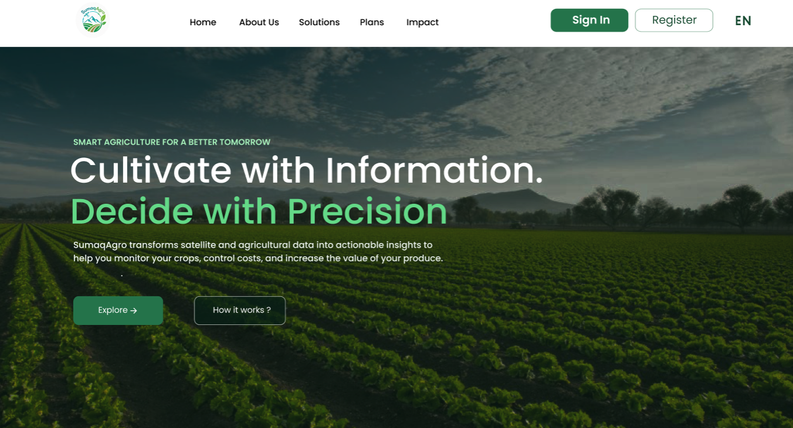

Who We Are — SumaqAgro

Presenta un diseño limpio sobre fondo blanco dividido en dos columnas. A la izquierda, incluye el antetítulo en verde "ABOUT SUMAQAGRO", el encabezado principal "Who We Are?" y el subtítulo "Democratizing precision agriculture in Peru", acompañados por un párrafo explicativo sobre el uso de imágenes satelitales libres para cerrar la brecha tecnológica en cultivos de papa y café sin sensores costosos. A la derecha, destaca una imagen de un campo con sistema de riego tecnificado y una mano sosteniendo un smartphone que visualiza las métricas y gráficos agronómicos de la plataforma.

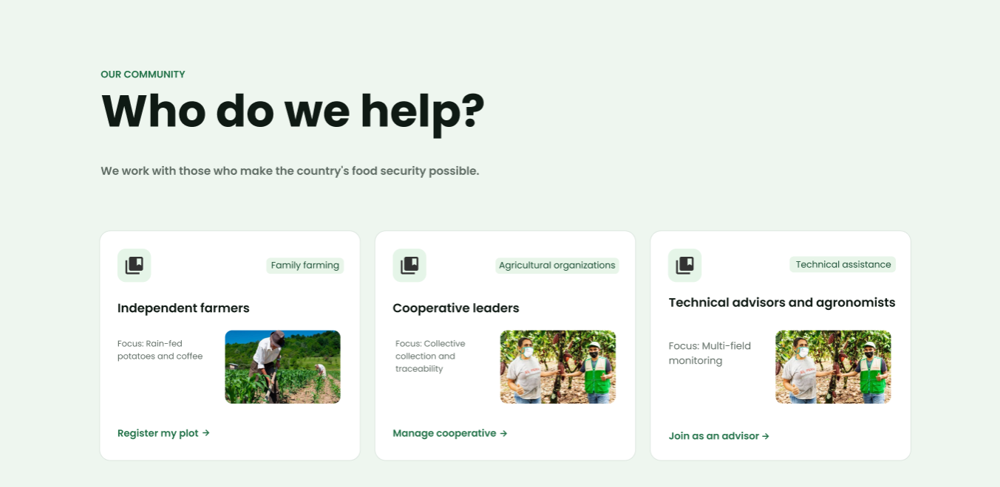

Our Team — SumaqAgro

Presenta un encabezado con el antetítulo en verde "THE PEOPLE BEHIND THE TECHNOLOGY", el título principal "Our Team" y una breve descripción sobre el compromiso de los integrantes con la agricultura de precisión en el Perú. En la parte inferior se organiza una cuadrícula horizontal de tarjetas con bordes redondeados sobre fondo blanco, mostrando las fotografías formales y los nombres completos de los cinco miembros del equipo de desarrollo: Benjamin Solorzano Sullca, Jose Carlos Vargas Enriquez, Drago Derick Duarte Ruffner, Yamil Jared Tejada Pumacayo y Miguel Sanca Condori.

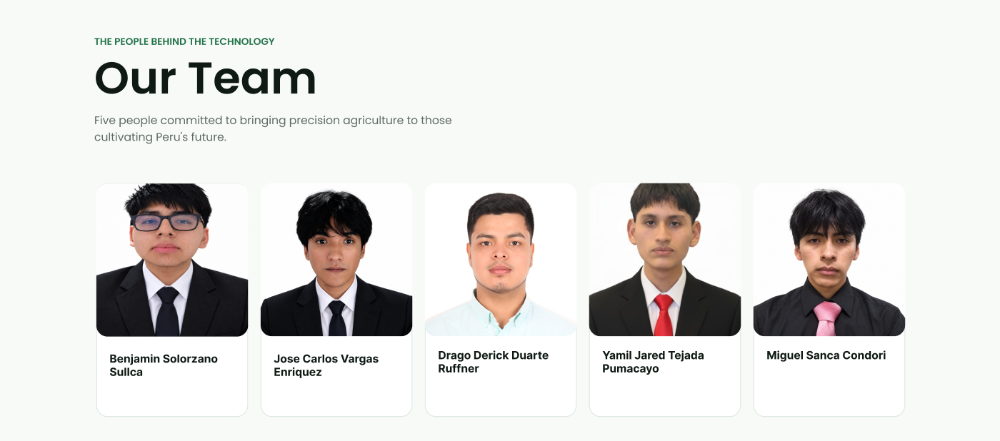

Who do we help? — SumaqAgro

Presenta el antetítulo en verde "OUR COMMUNITY", el encabezado principal "Who do we help?" y el mensaje de valor "We work with those who make the country's food security possible". En la zona inferior dispone tres tarjetas blancas con esquinas redondeadas orientadas a cada segmento clave: agricultores independientes , directivos de cooperativas , y asesores técnicos. Cada tarjeta integra un ícono representativo, un resumen de enfoque, una fotografía de campo alusiva y el enlace de acción "Join as an advisor →".

Solutions and Features — SumaqAgroPresenta

El encabezado "Solutions and Features" acompañado del lema de valor para la toma de decisiones en campo. En una cuadrícula de cuatro tarjetas blancas con acentos verdes, detalla sus módulos clave: monitoreo satelital de vigor y humedad, costeo por lote, certificación digital de cosecha y alertas agronómicas, destacando en cada una sus métricas de impacto operativo y económico.

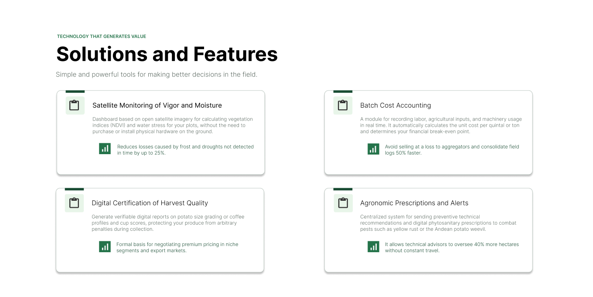

Product Demo — SumaqAgro

Presenta un fondo verde corporativo que enmarca el antetítulo "PRODUCT DEMO", el encabezado central "See SumaqAgro in action" y el subtítulo "Demo video". En la zona inferior destaca un reproductor de video de esquinas redondeadas sobre fondo gris claro con un botón central de reproducción (play) en verde brillante para visualizar la demostración interactiva de la plataforma.

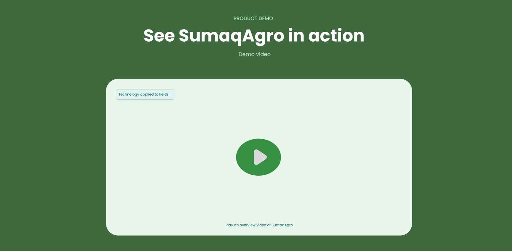

Plans — SumaqAgro

Presenta el titular "Choose the plan that fits your needs" sobre el antetítulo "PLANS" y un conmutador de facturación mensual o anual con descuento. En la zona inferior dispone tres tarjetas de suscripción adaptadas a cada perfil: Seed Plan (gratuito, para 1 parcela con NDVI básico y registro de labores), Pro Cooperative (S/189/mes, destacado como el más popular para 50 productores con certificación y exportación de reportes) y Technical Advisor Plan (S/89/mes, para 20 fincas supervisadas con NDVI avanzado y recomendaciones), cada una con su respectivo botón de acción directo.

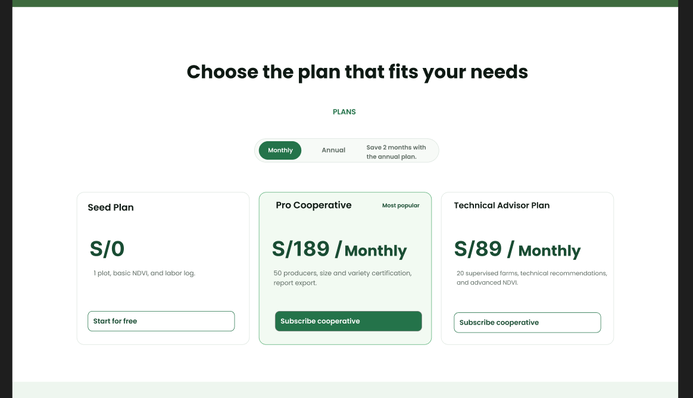

Impact — SumaqAgro

Presenta el antetítulo en verde "REAL RESULTS", el título principal "Impact" y una breve descripción sobre las métricas que respaldan el compromiso de la plataforma con la pequeña agricultura. A la derecha, distribuye tres tarjetas métricas blancas con íconos de usuario y barras de acento en verde: más de 333 mil hectáreas de papa, más de 223 mil familias cafetaleras  y más del 40% de reducción en la falta de cobertura técnica .

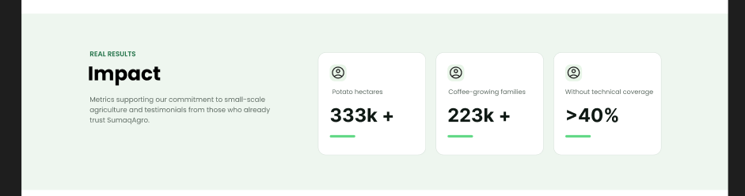

Testimonials y Footer — SumaqAgro

Presenta el bloque "What our users say ?" con dos tarjetas de testimonios de cinco estrellas de productores de papa y café. Le sigue una franja verde de llamado a la acción con el botón "Sign up for free" y un pie de página en fondo oscuro que agrupa el logotipo, enlaces a redes sociales, columnas de navegación (Products, Quick Links, Support) y los enlaces legales de privacidad y términos.

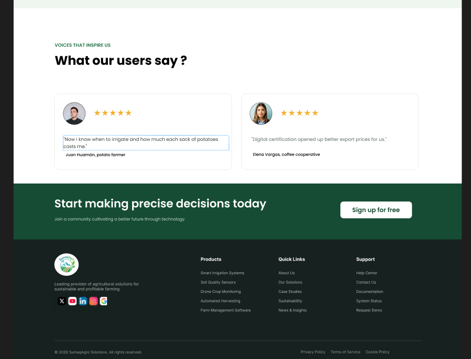

## 4.4. Web Applications UX/UI Design

Esta sección presenta y sustenta la arquitectura de interacción y el diseño visual de la plataforma SaaS de SumaqAgro, desarrollada por la startup Dymbia.
### 4.4.1. Web Applications Wireframes

### Desktop Web Browser

**Aplicación de Principios de Diseño y Arquitectura de Información:** Para la conceptualización de este Wireframe (*Desktop Web Browser*), nos centramos en una Arquitectura de Información basada en el patrón de escaneo en "F" (*F-Pattern*), disponiendo la barra lateral (*Sidebar*) a la izquierda para organizar jerárquicamente los módulos de operación agrícola y configuración del sistema sin perder el contexto de navegación, mientras que la cabecera superior centraliza la búsqueda rápida y los indicadores de estado global (conectividad, notificaciones y perfil). Aplicamos el principio de Región Común y Proximidad de la Gestalt agrupando los datos clave en tres tarjetas de indicadores (*KPI Cards*) de alto nivel para supervisar la salud foliar, el gasto acumulado y el punto de equilibrio financiero, conectándolos directamente con las representaciones analíticas inferiores (gráfico de evolución vegetal NDVI y distribución circular de costos). A nivel de diseño inclusivo y accesibilidad (*a11y*), garantizamos áreas táctiles mínimas de 48 px en los botones de acción rápida (*View Satellite Map*, *View My Expenses* y el CTA primario *View All My Lots*), reforzando una jerarquía visual clara mediante contenedores bien delimitados y contraste tipográfico que agilizan la lectura y toma de decisiones del productor en campo.

A continuación, se presentan los wireframes principales de la aplicación web correspondientes:

**My Plot**: en la vista inicial (*Dashboard*), la interfaz organiza la supervisión del cultivo mediante una fila de tres tarjetas métricas (*KPI Cards*) de alto nivel que sintetizan la salud foliar (NDVI), la inversión acumulada y el punto de equilibrio financiero, complementadas en la sección inferior por un gráfico de barras para la evolución temporal del vigor vegetal y un gráfico circular (*Donut Chart*) para el desglose porcentual de costos operativos. Seguidamente, el flujo de interacción transiciona hacia la vista de gestión de parcelas al interactuar con el llamado a la acción superior, donde el usuario accede a una retícula de administración con los cupos disponibles de su plan, permitiéndole supervisar el estado de sus lotes activos o incorporar un nuevo predio agrícola mediante un formulario asistido de georreferenciación y delimitación cartográfica por coordenadas GPS.

  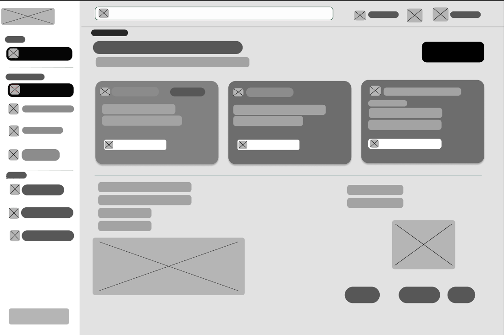
  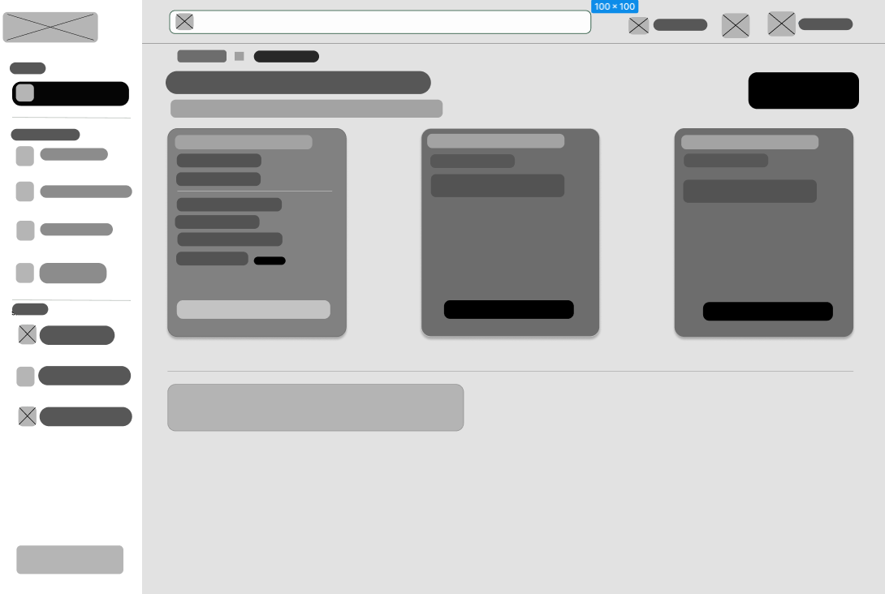
  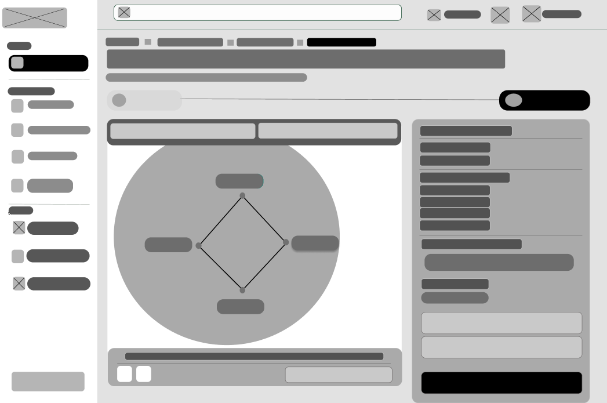
  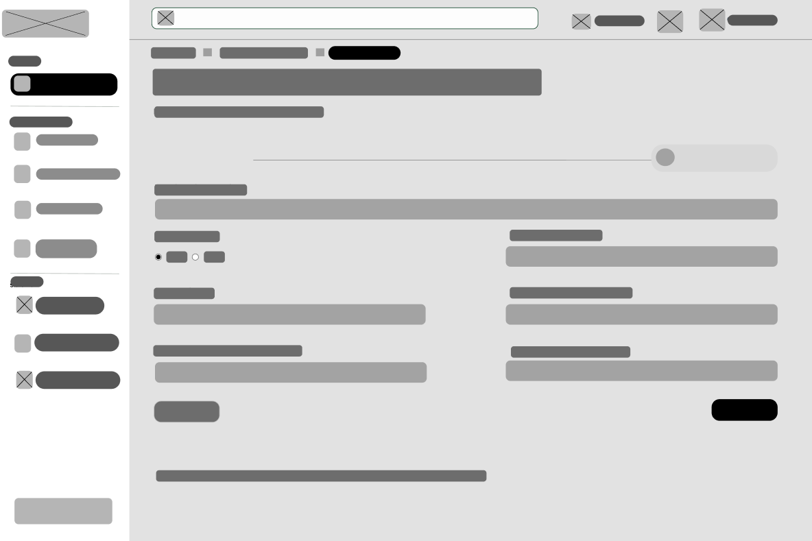
  

**Crop Health:** Esta vista centraliza la inspección agronómica y espacial del predio mediante un visor cartográfico interactivo que proyecta el polígono georreferenciado del lote junto con capas multiespectrales (NDVI para vigor vegetal y NDWI para humedad de suelo), complementado por un panel lateral de diagnóstico técnico preliminar y recomendaciones de manejo en campo; asimismo, la interfaz integra en su cabecera un selector conmutador de predios (*«Cambiar Parcela»*) que permite alternar fluidamente entre los diferentes terrenos registrados del productor sin perder el contexto operativo ni reiniciar los filtros de supervisión.

  

**My Expenses and Earnings:** Este módulo organiza la gestión financiera del predio mediante una fila superior de tres tarjetas métricas (*KPI Cards*) que sintetizan el gasto total acumulado, el volumen proyectado de cosecha y el precio de equilibrio calculado para evitar pérdidas comerciales, complementadas en la sección inferior por una tabla detallada de desembolsos con opciones de filtrado cronológico y por categoría (insumos, jornales y flete); asimismo, incorpora en su cabecera el botón de acción primario *«Anotar Nuevo Gasto»*, el cual despliega el formulario de registro ágil de costos diarios para asegurar que ningún egreso operativo quede fuera de la contabilidad de la campaña.

  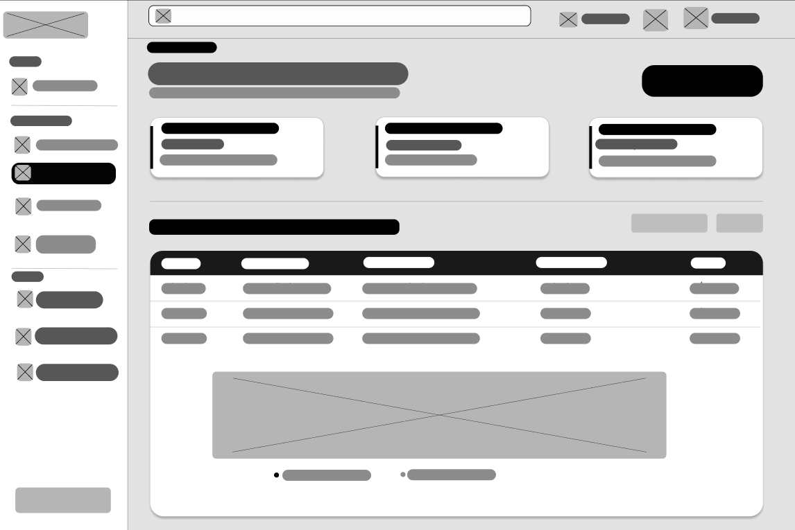

**Consult the Advisor:** La plataforma complementa la operación agrícola mediante la sección **Phytosanitary Assistance and Prescriptions**, la cual exhibe la prescripción técnica activa del agrónomo con su dosificación exacta y el historial cronológico de consultas, permitiendo reportar nuevas incidencias fitosanitarias mediante carga fotográfica; de manera complementaria, el módulo **My Harvest Certificates** organiza los expedientes de acreditación comercial del lote, reflejando el nombre del cultivo, el desglose de calibres de cosecha, el sello digital de respaldo cooperativo y el código QR de trazabilidad pública para respaldar el valor del producto ante intermediarios y compradores.

  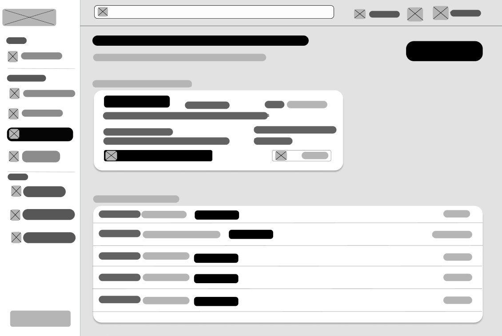
  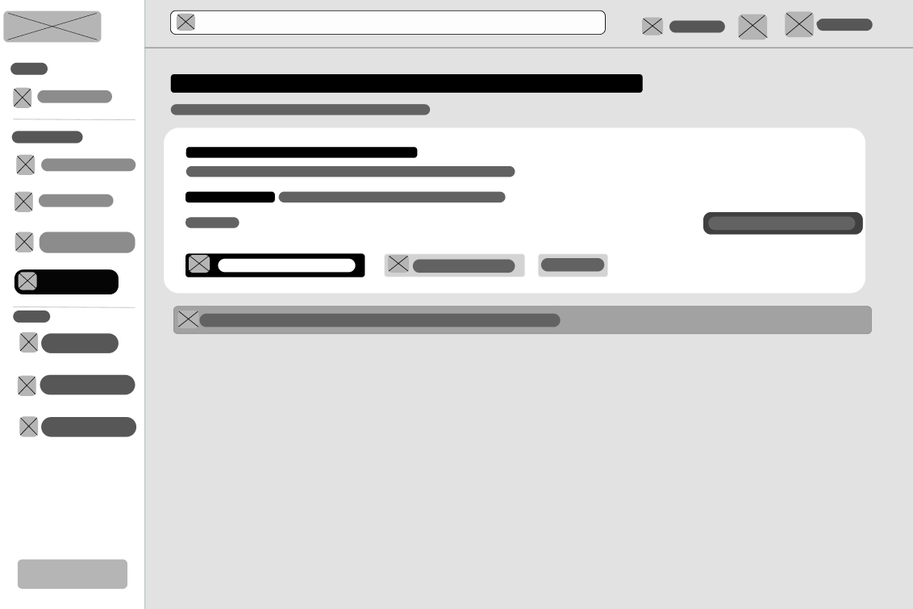

**Agricultural Alerts:** Este módulo centraliza la vigilancia agroclimática y sanitaria de las parcelas del productor (US-13, US-31), estructurándose a través de una secuencia de tarjetas informativas que detallan el incidente detectado (tales como caídas críticas de vigor foliar, estrés hídrico o riesgos de helada); cada reporte integra un panel de medidas técnicas detalladas, la cronología temporal de tareas requeridas para mitigar la anomalía y un indicador de plan de acción finalizado con confirmación de cumplimiento en campo, permitiendo auditar y cerrar el ciclo de contingencia del cultivo de manera ordenada y oportuna.

  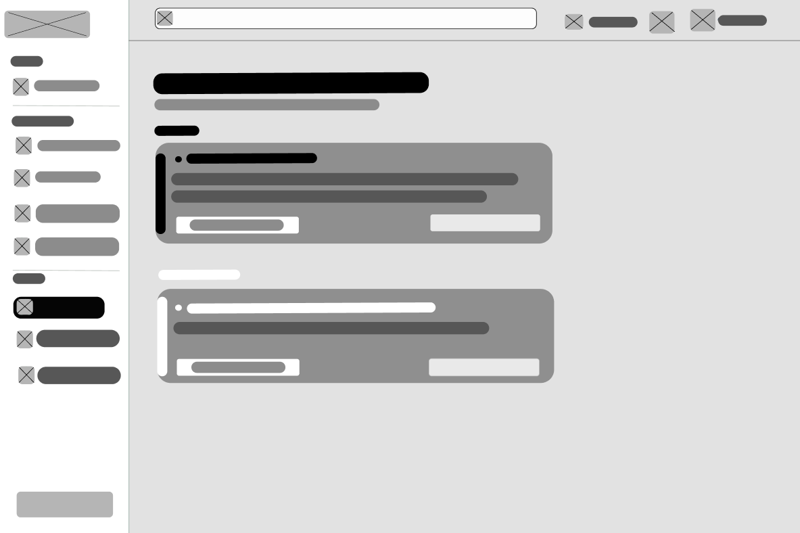
  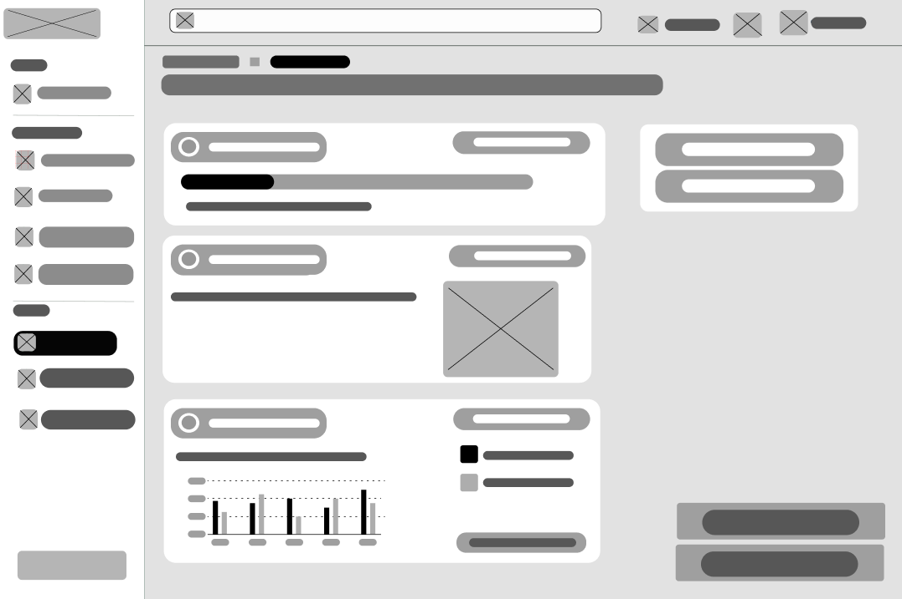
  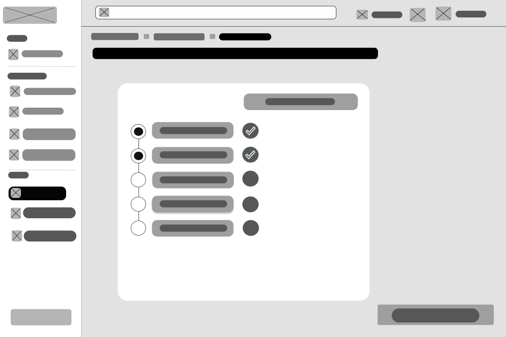
  

- **Settings and Help:** Esta vista técnica expone los parámetros operativos y de soporte del productor a través de un contenedor modal organizado en pestañas contextuales (*Tabs*), permitiendo la actualización de datos agronómicos del predio (nombre de la parcela, tipo de cultivo y área declarada), la gestión de información de contacto (teléfono y credenciales de acceso) y el acceso a manuales interactivos de usuario con línea directa de asistencia técnica; asimismo, el módulo integra la funcionalidad de **Offline Mode**, respaldada por la historia técnica TS-05, la cual permite al agricultor alternar conscientemente hacia un modo de trabajo en almacenamiento local para registrar labores e insumos en sectores profundos de la chacra donde la señal celular desaparece por completo, garantizando que los datos queden retenidos en la memoria del navegador y se sincronicen de manera diferida y automática una vez recuperada la cobertura de red.

  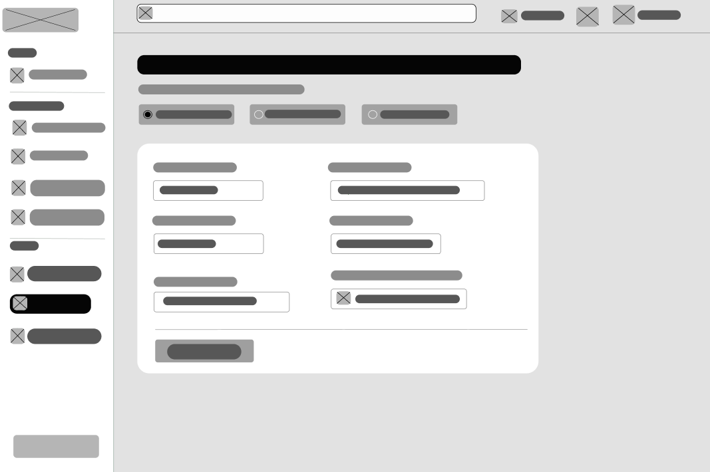
  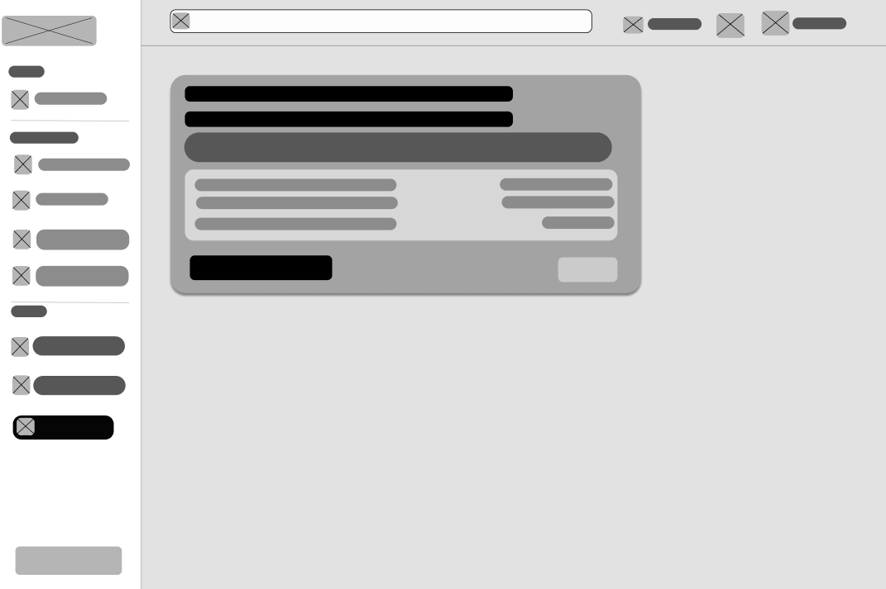

### Mobile Web Browser

**Aplicación de Principios de Diseño y Arquitectura de Información:** Los wireframes móviles adaptan los módulos de la aplicación de escritorio a una sola columna de 360 × 800 px, pensada para el uso con una mano en campo. El menú lateral se reemplaza por una barra de navegación inferior de cinco destinos, las tablas se convierten en listas y tarjetas, y los indicadores más importantes se ubican en el primer tercio de la pantalla. Los wireframes W-01 a W-07 cubren los flujos del productor.

##### W-01: Dashboard Principal ("Mi Parcela")
Vista central de mando con lectura rápida de los indicadores operativos de la campaña en curso (vigor vegetal, inversión acumulada y punto de equilibrio comercial).

##### W-02: Monitoreo Satelital y Visor Multiespectral
Visualizador georreferenciado que exhibe la reflectancia del predio mediante los índices multiespectrales NDVI y NDWI, permitiendo evaluar anomalías de vegetación y emitir solicitudes de asistencia fitosanitaria.

##### W-03: Resumen Financiero y Punto de Equilibrio de Campaña
Consolidado contable que clasifica los egresos en insumos, mano de obra y transporte, deduciendo el costo unitario de producción para respaldar negociaciones comerciales justas.

##### W-04: Centro de Alertas Agroclimáticas y Sanitarias
Bandeja cronológica y categorizada que despacha advertencias tempranas ante caídas súbitas en el verdor foliar, estrés por sequía o pronósticos meteorológicos adversos (heladas).

##### W-05: Bitácora de Registro Operativo en Campo
Formulario optimizado para el asiento ágil de jornales, compra de fertilizantes o fletes rurales sin requerir conexión continua a internet, almacenando la información localmente.

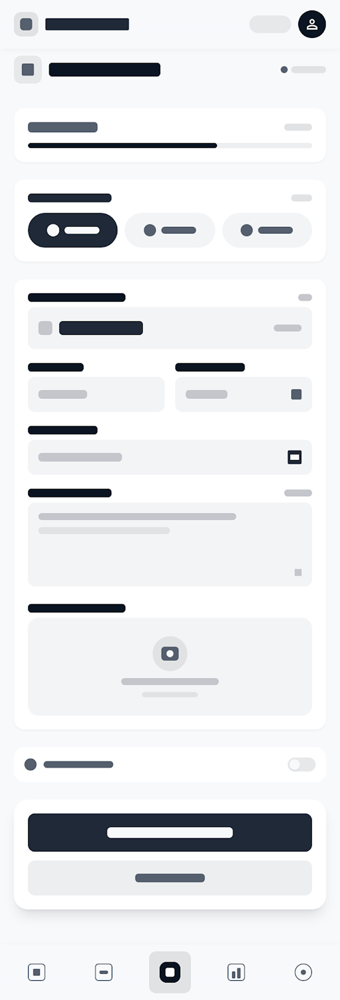

##### W-06: Acreditación de Calidad y Código QR de Trazabilidad
Ficha técnica del lote cosechado que centraliza las evaluaciones de calidad física/sensorial y genera un código QR criptográfico para validación inmediata por parte de compradores y acopiadores.

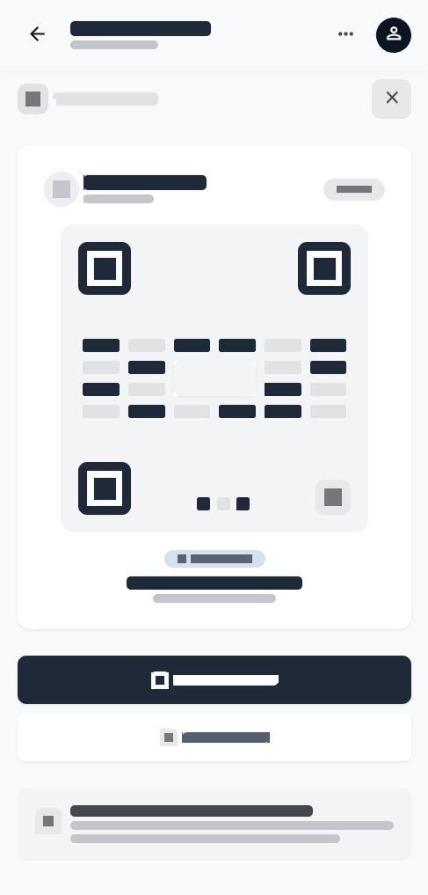

##### W-07: Autenticación, Registro y Onboarding de Usuario
Flujo de acceso e identificación institucional que permite a agricultores y asesores ingresar mediante credenciales seguras, seleccionando su rol y cooperativa de adscripción.

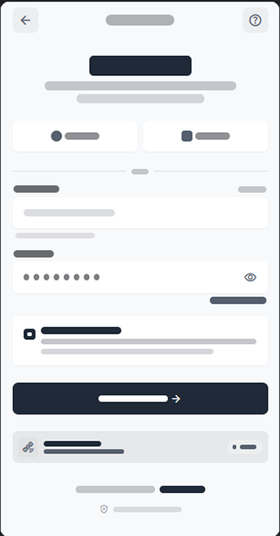

---

#### Sustento de Principios y Elementos de Diseño

* **Jerarquía Visual y Patrón de Escaneo Vertical:** Dado el factor de forma compacto de las pantallas móviles, se organizó la información bajo un patrón de lectura vertical estricto. Los indicadores de mayor impacto para la toma de decisiones inmediatas (estado NDVI, costos acumulados y nivel de alerta) ocupan tarjetas prominentes en el tercio superior de la pantalla, relegando las series temporales y desgloses detallados hacia la zona de desplazamiento (*scroll*).
* **Leyes de Proximidad y Región Común (Gestalt):** La interfaz utiliza contenedores modulares (*cards*) con bordes y espaciados homogéneos para vincular datos dependientes entre sí (por ejemplo, en el módulo financiero se asocia en una misma tarjeta el costo total invertido junto a los porcentajes de insumos y mano de obra).
* **Convenciones Móviles y Zona Ergonómica del Pulgar (*Thumb Zone*):** Se sustituyó el menú lateral de escritorio (*sidebar*) por una barra de navegación inferior (*Bottom Navigation Bar*) permanente de 5 accesos directos principales. Asimismo, en la vista contable se adoptó un botón flotante de acción destacada (*Floating Action Button - FAB*) situado en la esquina inferior derecha para agilizar el registro recurrente de gastos.
* **Contraste Tipográfico y Claridad Estructural:** A pesar de mantenerse en una escala de grises estricta para baja fidelidad, se establecieron diferencias marcadas de peso tipográfico (*Bold* para métricas cuantitativas e importes en soles, y *Regular* para etiquetas y leyendas descriptivas), garantizando un escaneo ágil bajo luz solar.

---

#### Aplicación de Principios de Diseño Inclusivo y Accesibilidad

* **Dimensionamiento de Áreas Táctiles (*Touch Targets*):** Conforme a las recomendaciones internacionales de accesibilidad móvil (WCAG / a11y), los botones de confirmación, campos de formulario y controles de navegación cuentan con dimensiones mínimas de 48 × 48 dp/px, evitando pulsaciones accidentales por parte de agricultores que operan el dispositivo con guantes o dedos fatigados por faenas de campo.
* **Reducción de la Sobrecarga Cognitiva:** Se eliminaron las tablas extensas de escritorio, reemplazándolas por listas condensadas y estados cualitativos claros ("Óptimo", "Bajo Control", "Alerta") que acompañan a las cifras científicas (como el valor numérico de NDVI), facilitando la interpretación técnica a productores de baja escolaridad.
* **Soporte de Arquitectura *Offline-First*:** Las pantallas de cabecera incorporan un indicador persistente de conectividad (*Connected / Offline Mode*). Esto brinda retroalimentación clara de que las anotaciones de jornales e insumos en la chacra se almacenan de forma local en la memoria del dispositivo y se transmitirán sin pérdida al recobrar cobertura celular.
* **Simplificación en la Entrada de Datos:** Los formularios de campo priorizan campos numéricos automáticos, menús desplegables preestablecidos y captura fotográfica de recibos, disminuyendo al mínimo la necesidad de redactar textos extensos sobre el teclado virtual.

---

#### Alineación con la Arquitectura de Información

* **Sistemas de Organización (*Organization Systems*):** La aplicación implementa una estructura organizativa jerárquica y funcional orientada a tareas de campo. La pantalla raíz expone el balance general de la campaña agrícola, desde la cual se puede profundizar hacia subniveles analíticos (visor espectral, historial de transacciones o catálogo de alertas).
* **Sistemas de Navegación (*Navigation Systems*):** Se articula una navegación global fija soportada en la *Bottom Navigation Bar* para conmutar entre los módulos principales (Inicio, Monitoreo, Finanzas, Alertas, Perfil), complementada con navegación jerárquica (flechas de retroceso en la barra superior *AppBar*) para regresar de formularios o vistas de detalle sin perder el estado previo.
* **Sistemas de Rotulado (*Labeling Systems*):** Las etiquetas adoptadas derivan del Glosario de Lenguaje Ubicuo formalizado para el proyecto ("Mi Parcela", "Salud Foliar", "Insumos", "Jornales", "Punto de Equilibrio", "Certificado QR"), empleando terminología precisa y familiar para la comunidad agrícola.
* **Sistemas de Búsqueda y Filtrado (*Searching Systems*):** Se integraron barras de búsqueda con autocompletado y selectores rápidos horizontales (*chips*) que permiten segmentar notificaciones y lotes históricos por fecha, nivel de riesgo o campaña fenológica activa.

### 4.4.2. Web Applications Wireflow Diagrams

Un **wireflow** o flujo de pantallas es una representación visual que conecta distintos wireframes para mostrar el recorrido que sigue el usuario dentro de una aplicación hasta alcanzar un objetivo específico. Su propósito es explicar cómo se relacionan las diferentes pantallas y qué acciones debe realizar el usuario durante el proceso.

Para construir un wireflow, primero se identifica el objetivo que el usuario desea lograr. Después, se establece la secuencia de tareas necesarias para completar dicho objetivo dentro de la aplicación. Finalmente, estas tareas se representan mediante las pantallas correspondientes y se conectan a través de las acciones disponibles en botones, enlaces u otros elementos interactivos del wireframe.

**User Goal 1:** Usuario desea registrarse en la aplicación

Flujo normal:

  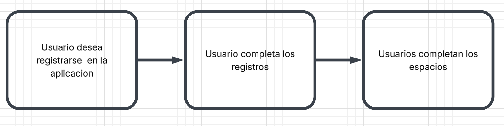

El flujo de interacción inicia en la pantalla principal de la aplicación cuando el usuario selecciona la opción de registrarse, lo que lo dirige a la vista del formulario donde debe elegir su rol correspondiente (Agricultor, Cooperativa o Asesor) y completar los campos obligatorios de datos personales, correo electrónico y contraseña; una vez validados los campos y enviado el registro, el sistema genera las credenciales de acceso y redirige automáticamente al usuario hacia el panel de bienvenida de su módulo

  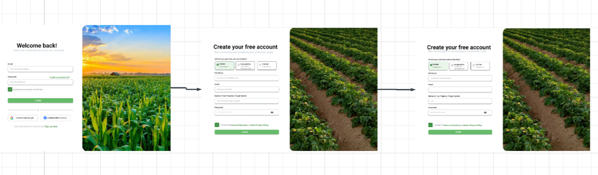

**User Goal 2:** Usuario desea ingresar con su cuenta en la aplicación

Flujo normal:

  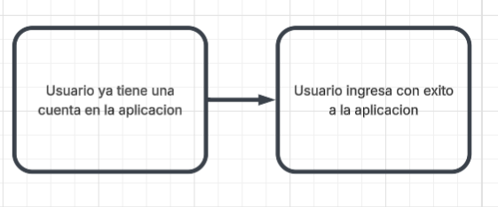

El flujo de interacción inicia cuando el usuario registrado accede a la pantalla de autenticación (/login) e ingresa sus credenciales de acceso (correo electrónico y contraseña); tras enviar el formulario, el sistema valida la información mediante el servicio de autenticación (TS-02), genera el token de sesión JWT y redirige automáticamente al usuario hacia el panel principal (dashboard) correspondiente a su rol dentro de la plataforma.

  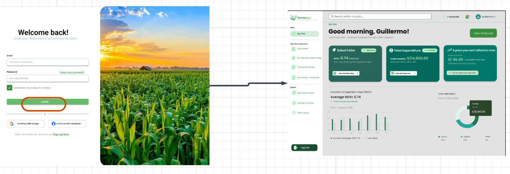

**User Goal 3:** Usuario desea cambiar su contraseña

Flujo normal:

  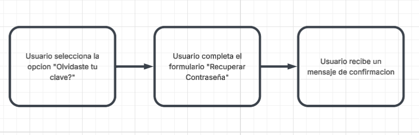

El flujo de interacción comienza en la pantalla de inicio de sesión cuando el usuario hace clic en el enlace «¿Olvidaste tu contraseña?» (/forgot-password), desplegando el formulario de recuperación donde ingresa su correo electrónico registrado y presiona el botón de envío; tras validar la existencia de la cuenta, el sistema transiciona la pantalla a un estado de confirmación visual mediante un mensaje informativo en pantalla y despacha un correo con el enlace y token temporal para el restablecimiento seguro de sus credenciales.

  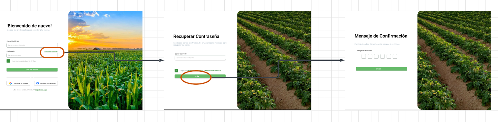

**User Goal 4:** Usuario desea revisar sus parcelas

Flujo normal:

  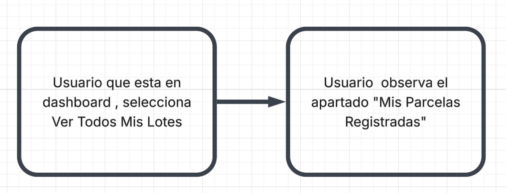

El flujo de interacción se inicia en el panel principal (dashboard) del agricultor, donde visualiza las tarjetas de métricas generales y pulsa el botón de acción rápida «Ver Todos Mis Lotes»; en respuesta a este evento, el sistema efectúa la transición hacia la vista de catálogo general «Mis Parcelas Registradas» (/parcels), renderizando el listado completo de predios georreferenciados mediante tarjetas informativas que exponen el nombre del fundo, el cultivo monitoreado, el área calculada y los accesos para inspeccionar la salud satelital.

  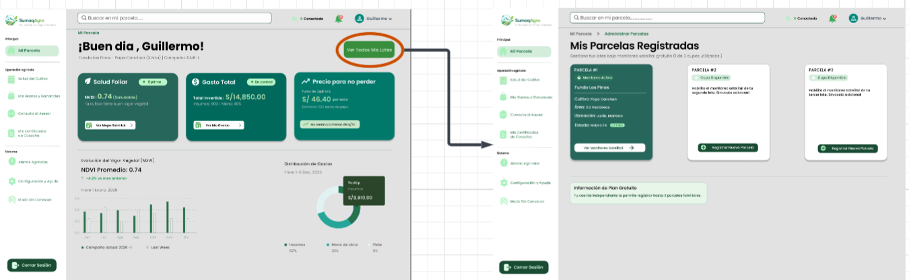

**User Goal 5:** Usuario desea revisar alertas agrícolas y finalizar su plan de acción

Flujo normal:

  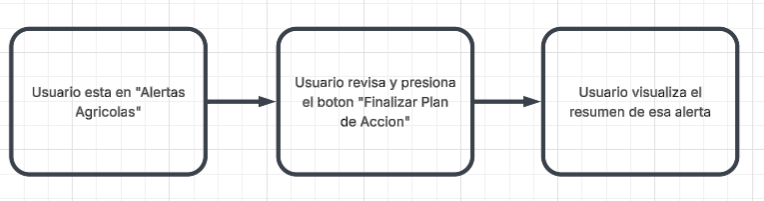

El flujo de interacción comienza en el módulo «Alertas Agrícolas» (Avisos y Riesgos Notificados), donde el usuario identifica un riesgo o aviso y hace clic en el botón «Medidas Detalladas»; esto lo redirige a la vista detallada del plan de acción donde revisa los indicadores y las recomendaciones sugeridas; tras ejecutar las tareas preventivas, presiona el botón «Finalizar Plan de Acción», lo que despliega una ventana modal con el informe de ejecución confirmado y un resumen visual del estado final de las medidas aplicadas.

  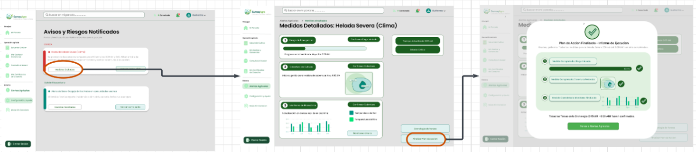

**User Goal 6:** Usuario desea registrar un gasto de campo en finanzas de la campaña

Flujo normal:

  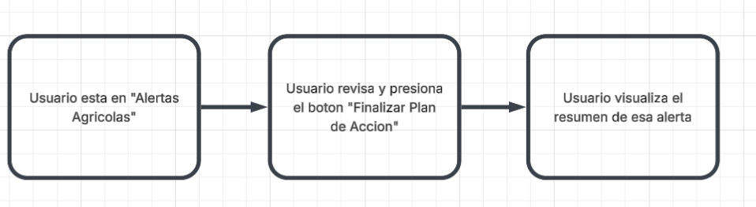

El flujo de interacción se inicia en el módulo «Finanzas de la Campaña» (Mis Gastos y Ganancias), donde el usuario hace clic en el botón de acción rápida «Añadir Nuevo Gasto»; tras este evento, el sistema lo redirige a la vista del formulario «Registrar Gasto de Campo» para seleccionar el tipo de costo operativo (Insumos y Abono, Mano de Obra o Flete), asignar la parcela correspondiente, ingresar el monto desembolsado y la fecha; finalmente, al pulsar el botón «Guardar Gasto», se procesa la información y se muestra una ventana modal de confirmación con el resumen del registro exitoso.

  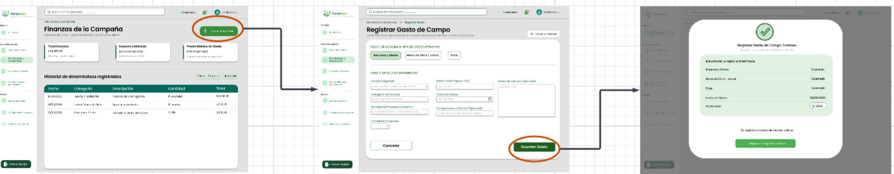

**User Goal 7:** Usuario desea enviar un reporte de plaga a su asesor

Flujo normal:

  

El flujo de interacción se inicia en la sección «Asistencia Fitosanitaria y Recetas» (Consulta al Asesor), donde el usuario presiona el botón de acción rápida «Enviar Foto de Plaga»; tras este evento, se despliega una ventana modal con el formulario «Enviar Reporte de Plaga» donde selecciona su parcela, adjunta la fotografía de la evidencia y añade observaciones opcionales; finalmente, al hacer clic en «Enviar Reporte», el sistema procesa la solicitud y muestra una pantalla modal de confirmación informando que el reporte fue enviado con éxito al ingeniero asignado.

  

**User Goal 8:** Usuario desea cambiar de parcela en el visor satelital multispectral

Flujo normal:

  

El flujo de interacción se inicia en el módulo «Visor Satelital Multispectral» (Salud del Cultivo), donde el usuario hace clic en el botón «Cambiar Parcela»; tras este evento, se despliega una ventana modal que muestra el listado de terrenos disponibles para que seleccione la parcela deseada; finalmente, el sistema solicita una confirmación mediante una ventana emergente y, al pulsar «Confirmar», la interfaz actualiza los datos e índices multiespectrales correspondientes al nuevo predio seleccionado.

  

### 4.4.3. Web Applications Mock-ups

En esta sección se presentan los mockups de la aplicación web de **SumaqAgro**, los cuales representan de manera visual y detallada las principales funcionalidades de la solución. Estos diseños fueron elaborados tomando como base los wireframes desarrollados previamente, permitiendo definir con mayor precisión la estructura, distribución de elementos, estilos visuales y flujo de interacción de la interfaz antes de su implementación final.

**Aplicación del Design System, principios de diseño e inclusión:** Los mock-ups aplican el Design System de la sección 4.1 (paleta teal/verde/neutros, tipografía Poppins e Inter, espaciado base 8 px y componentes de Angular Material). Se aplica jerarquía visual con tarjetas de indicadores (*KPI Cards*) y el principio de proximidad y región común de la Gestalt para agrupar datos relacionados. Los estados se comunican con color, ícono y texto, y se mantienen contrastes AA y áreas táctiles de al menos 48 px. La navegación lateral (*sidebar*) y las etiquetas siguen la arquitectura de información de la sección 4.2.

### Desktop Web Browser

### LOGIN / REGISTER

  
  

### MY PLOTS

  
  

### REGISTER A PLOT OF LAND

  
  
  

### FINANCES

  
  

### CONSULT

  
  
    

### AGRICULTURAL ALERTS

  
  
  
  

### SETTINGS

  
  
  

### MODE OFFLINE

  

### Mobile Web Browser

Los mock-ups de la aplicación móvil se elaboraron en Figma (página *Mobile*) sobre un frame Android de 360 × 800 px, a partir de los wireframes móviles y aplicando las Mobile Style Guidelines de la sección 4.1.3. A continuación se presentan las pantallas principales del productor.

[Ver página Mobile en Figma](https://www.figma.com/design/ISAgMtqNOAucizqd3eXYzR/UI-DESIGN?node-id=898-10332)

**Aplicación del Design System, principios de diseño e inclusión:** Se usa la misma paleta teal/verde, las tipografías Poppins e Inter y el espaciado base 8 px de la web. La jerarquía visual destaca la tarjeta de *Salud Foliar* en teal oscuro, seguida de *Gasto Total* y *Precio para no perder*. Las tarjetas agrupan los datos relacionados (proximidad y región común), la navegación inferior de cinco destinos queda en la zona del pulgar y las acciones principales usan botones de ancho completo. Para la inclusión se emplean áreas táctiles de 48 px, contraste AA, estados cualitativos junto a las cifras (por ejemplo "Optimal"), formularios con chips y foto de recibo en lugar de texto largo, y un indicador de conexión visible para el modo sin conexión. Las etiquetas respetan la arquitectura de información de la sección 4.2.

### LOGIN, REGISTER AND HOME


### MY PLOTS, REGISTER A PLOT AND MONITORING


### FINANCES


### AGRICULTURAL ALERTS


### ADVISOR AND HARVEST CERTIFICATES


### SETTINGS AND OFFLINE MODE


### 4.4.4. Web Applications User Flow Diagrams

En esta sección se presentan los diagramas de flujo de usuario (*User Flows*) de la aplicación web de la plataforma **SumaqAgro**. De acuerdo con las directrices metodológicas del proyecto, los User Flows derivan de los Wireflows preliminares y formalizan la experiencia de interacción integrando tanto los Mock-ups de alta fidelidad con sus elementos interactivos como los diagramas lógicos resumidos de navegación.

Para cada User Goal se modela la ruta de éxito principal (*happy path*) junto con las rutas alternas o de contingencia (*unhappy paths*), vinculándolas a los User Persona oficiales del sistema (Guillermo Cortés como productor independiente y Cristian Santana como gestor cooperativo).

---

#### User Flow 01 (UG-01): Registro y Creación de Nueva Cuenta de Usuario

* **User Goal:** Registrar una nueva cuenta de usuario en la plataforma seleccionando el rol correspondiente (productor independiente, directivo de cooperativa o asesor técnico) para acceder a los servicios de gestión agronómica.
* **User Persona:** Guillermo Cortés (Pequeño y Mediano Agricultor Independiente) / Cristian Santana (Directivo de Cooperativa).
* **Herramienta utilizada:** Figma / FigJam.

##### Mock-up Flow Diagram (Alta Fidelidad)

##### Resumed Flow Diagram (Flujo Lógico Resumido)

##### Explicación de flujos y condiciones
* **Happy Path (Ruta de éxito esperada):**
  1. El visitante accede a la pantalla de bienvenida (*Welcome back!*) y, al carecer de credenciales, pulsa el enlace interactivo *"Sign up here"* ubicado en el pie del formulario.
  2. La interfaz transiciona a la pantalla *Create your free account*, donde el usuario selecciona su rol funcional (`Farmer`), ingresa su nombre completo, correo electrónico, nombre de su predio o fundo y establece una contraseña segura de acceso.
  3. Marca la casilla de aceptación de los Términos de Servicio y Políticas de Privacidad y pulsa el botón principal de confirmación.
  4. El backend corrobora que los campos son válidos y que el correo no existe en el sistema, completando el registro y habilitando el ingreso a la aplicación web.
* **Unhappy Paths (Rutas alternativas y de excepción):**
  * *Validación sintáctica fallida:* Si el usuario omite campos requeridos, introduce un correo con formato no estándar o una contraseña menor a 8 caracteres, los campos se marcan en rojo con mensajes descriptivos impidiendo el avance del registro.
  * *Correo electrónico preexistente:* Si la dirección ingresada ya figura en el sistema, la interfaz muestra una alerta informando que el correo ya está en uso y sugiere iniciar sesión o restablecer la contraseña.
  * *Términos legales sin aceptar:* Si la casilla de términos y privacidad no es marcada, el botón de envío permanece inactivo o emite un aviso de obligatoriedad legal.

---

#### User Flow 02 (UG-02): Inicio de Sesión y Autenticación de Usuario

* **User Goal:** Iniciar sesión en la plataforma web mediante credenciales de acceso registradas para ingresar al panel de control agronómico y financiero.
* **User Persona:** Guillermo Cortés (Pequeño y Mediano Agricultor Independiente).
* **Herramienta utilizada:** Figma / FigJam.

##### Mock-up Flow Diagram (Alta Fidelidad)

##### Resumed Flow Diagram (Flujo Lógico Resumido)

##### Explicación de flujos y condiciones
* **Happy Path (Ruta de éxito esperada):**
  1. El agricultor se sitúa en la vista de acceso (*Welcome back!*), digita su correo electrónico institucional/personal y su contraseña registrada.
  2. De forma opcional, marca la opción *"Remember my session for 30 days"* para mantener activa su sesión y presiona el botón interactivo verde **"Login"**.
  3. El servicio de autenticación valida las credenciales contra la base de datos y genera el token Bearer JWT de autorización.
  4. El sistema redirige automáticamente al usuario a su panel de control personalizado (*Good morning, Guillermo!*), desplegando las métricas en tiempo real de Salud Foliar (NDVI 0.74), Gasto Total Invertido (S/ 14,850.00) y el Precio de equilibrio para no perder (S/ 46.40).
* **Unhappy Paths (Rutas alternativas y de excepción):**
  * *Credenciales no válidas:* Si el correo o la contraseña no coinciden con los registros del sistema, se despliega una notificación de error en color rojo (*"Usuario o contraseña incorrectos"*), manteniendo el correo ingresado pero vaciando el campo de clave para reintentar.
  * *Exceso de reintentos fallidos:* Si se ingresan contraseñas incorrectas de manera reiterada, la plataforma bloquea temporalmente el formulario por seguridad y recomienda utilizar el flujo de recuperación de clave.

---

#### User Flow 03 (UG-03): Recuperación y Restablecimiento de Contraseña

* **User Goal:** Recuperar el acceso a la cuenta del sistema mediante la solicitud y confirmación de un código numérico temporal enviado al correo electrónico registrado.
* **User Persona:** Guillermo Cortés (Pequeño y Mediano Agricultor Independiente).
* **Herramienta utilizada:** Figma / FigJam.

##### Mock-up Flow Diagram (Alta Fidelidad)

##### Resumed Flow Diagram (Flujo Lógico Resumido)

##### Explicación de flujos y condiciones
* **Happy Path (Ruta de éxito esperada):**
  1. Desde la pantalla de Login (*¡Bienvenido de nuevo!*), el usuario que ha olvidado sus credenciales presiona el enlace interactivo **"¿Olvidaste tu clave?"**.
  2. El sistema lo conduce al formulario *Recuperar Contraseña*, donde ingresa su dirección de correo electrónico registrada y presiona el botón **"Enviar"**.
  3. El sistema comprueba que el usuario existe, despacha un token OTP temporal de 6 dígitos al buzón y navega a la pantalla *Mensaje de Confirmación*.
  4. El agricultor revisa su bandeja de correo, digita los 6 dígitos en las casillas correspondientes y presiona confirmar; al ser validado con éxito, la plataforma le permite ingresar su nueva clave de acceso y reanudar sesión.
* **Unhappy Paths (Rutas alternativas y de excepción):**
  * *Correo electrónico no registrado:* Si el usuario introduce una dirección que no figura en la base de datos, el formulario permanece en la pantalla actual y despliega un mensaje de error indicando que no se encontró ninguna cuenta asociada.
  * *Código de verificación incorrecto o expirado:* Si el código ingresado no coincide con el token despachado o si supera el tiempo límite de vigencia (10 minutos), las casillas se resaltan con borde rojo y se habilita un enlace para solicitar un reenvío del código OTP.

---

#### User Flow 04 (UG-04): Consulta y Administración del Inventario de Parcelas Registradas

* **User Goal:** Consultar desde el Dashboard operativo la totalidad de parcelas agrícolas dadas de alta en el sistema para monitorear su estado y verificar los cupos disponibles de nuevos lotes.
* **User Persona:** Guillermo Cortés (Pequeño y Mediano Agricultor Independiente).
* **Herramienta utilizada:** Figma / FigJam.

##### Mock-up Flow Diagram (Alta Fidelidad)

##### Resumed Flow Diagram (Flujo Lógico Resumido)

##### Explicación de flujos y condiciones
* **Happy Path (Ruta de éxito esperada):**
  1. En el Dashboard principal (*¡Buen día, Guillermo!*), el productor examina los indicadores de su predio activo y pulsa el botón **"Ver Todos Mis Lotes"** en la cabecera superior.
  2. La aplicación abre la vista de administración *Mis Parcelas Registradas*, cargando el inventario de lotes bajo monitoreo satelital.
  3. El usuario observa la tarjeta de la *PARCELA #1* (Fundo Los Pinos, cultivo Papa Canchan, área de 3.5 ha y estado NDVI 0.74 Óptimo) con acceso a su visor satelital.
  4. Asimismo, el sistema muestra las tarjetas de la *PARCELA #2* y *PARCELA #3* identificadas como *Cupo Disponible*, acompañadas del botón interactivo **"Registrar Nueva Parcela"** dentro de los márgenes del plan gratuito activo.
* **Unhappy Paths (Rutas alternativas y de excepción):**
  * *Límite de cupos de parcelas alcanzado:* Si el usuario cuenta con los 3 lotes registrados y pulsa sobre agregar uno nuevo, el sistema no abre el catastro GPS; en su lugar, despliega un cuadro modal informando que ha copado el límite de su plan gratuito y ofrece un botón de actualización hacia el plan comercial.
  * *Ausencia total de registros (Empty State):* Si el agricultor aún no hubiera configurado su primer lote o hubiera borrado sus datos, la pantalla reemplaza las tarjetas activas por una guía informativa orientada al trazado inicial del polígono georreferenciado.

---

#### User Flow 05 (UG-05): Gestión y Ejecución de Medidas por Alerta Climática Crítica

* **User Goal:** Revisar una notificación de emergencia agroclimática (ej. Helada Severa), evaluar las medidas técnicas de contingencia requeridas y confirmar la culminación del plan de acción en campo.
* **User Persona:** Guillermo Cortés (Pequeño y Mediano Agricultor Independiente).
* **Herramienta utilizada:** Figma / FigJam.

##### Mock-up Flow Diagram (Alta Fidelidad)

##### Resumed Flow Diagram (Flujo Lógico Resumido)

##### Explicación de flujos y condiciones
* **Happy Path (Ruta de éxito esperada):**
  1. El productor ingresa al módulo de alertas desde el menú lateral (*Avisos y Riesgos Notificados*) y visualiza el banner crítico en rojo correspondiente a la **"Alerta de Helada Severa [Clima]"**.
  2. Hace clic sobre el botón **"Medidas Detalladas"**, navegando a la pantalla técnica *Medidas Detalladas: Helada Severa (Clima)*.
  3. En esta vista, el usuario examina las tres fases estructuradas: (1) Riego de Emergencia, (2) Cobertura de Cultivo y (3) Monitoreo de Microclima.
  4. Una vez implementadas las recomendaciones en su predio, pulsa el botón **"Finalizar Plan de Acción"** ubicado al final de la cronología.
  5. La interfaz superpone el modal *Plan de Acción Finalizado - Informe de Ejecución*, exhibiendo la barra de progreso al 100% y los tres checks de cumplimiento completados en verde.
  6. El agricultor presiona **"Volver a Alertas Agrícolas"**, regresando al panel donde el aviso pasa a estado de evento mitigado.
* **Unhappy Paths (Rutas alternativas y de excepción):**
  * *Intento de finalización prematura:* Si el agricultor pulsa "Finalizar Plan de Acción" sin haber marcado o registrado el cumplimiento de las labores de campo (como el riego de emergencia o la colocación de coberturas), el sistema despliega un mensaje modal de confirmación advirtiendo que aún existen labores críticas sin verificar antes de archivar la alerta.
  * *Pérdida de enlace al sincronizar:* Si el cierre de la alerta se efectúa en condiciones de baja señal móvil, la acción se registra en la memoria local (*IndexedDB*) y se programa para su envío diferido cuando el dispositivo restablezca la conectividad.

---

#### User Flow 06 (UG-06): Registro Contable de Costos Operativos de Campo

* **User Goal:** Registrar un desembolso económico en campo (compra de insumos/abonos, pago de jornales o transporte/flete) para mantener actualizado el historial de costos y recalcular el precio mínimo de venta de equilibrio.
* **User Persona:** Guillermo Cortés (Pequeño y Mediano Agricultor Independiente).
* **Herramienta utilizada:** Figma / FigJam.

##### Mock-up Flow Diagram (Alta Fidelidad)

##### Resumed Flow Diagram (Flujo Lógico Resumido)

##### Explicación de flujos y condiciones
* **Happy Path (Ruta de éxito esperada):**
  1. El agricultor navega a la sección *Finanzas de la Campaña* y presiona el botón interactivo **"+ Anotar Nuevo Gasto"** ubicado en la cabecera superior.
  2. La plataforma lo dirige al formulario estructurado *Registrar Gasto de Campo*:
  * **Paso 1:** Selecciona el tipo de costo operativo mediante chips de selección rápida (`Insumos y Abono`, `Mano de Obra / Jornal` o `Flete`).
  * **Paso 2:** Selecciona la parcela asignada (`Fundo Los Pinos`), digita el nombre del insumo o labor, especifica la cantidad, introduce el monto total pagado en soles (`S/ 1,240.00`), la fecha de desembolso y, de forma opcional, adjunta el número de comprobante o recibo y notas adicionales de campo.
  3. El usuario pulsa el botón **"Guardar Gasto"**. El sistema valida la integridad de los datos monetarios y registra el asiento en el backend transaccional.
  4. La aplicación superpone la ventana modal de confirmación *Registro Gasto de Campo Exitoso* con check circular verde, resumiendo el desglose: concepto guardado, fecha y monto final (`S/ 1,240.00`).
  5. Al hacer clic en **"Regresar a registrar gastos"** o volver al panel principal, el nuevo registro se incorpora a la tabla del *Historial de desembolsos registrados*, actualizando automáticamente el Total Gastado y recalculando el **Precio Mínimo de Venta** por saco para no incurrir en pérdidas comerciales.
* **Unhappy Paths (Rutas alternativas y de excepción):**
  * *Datos contables incompletos o no válidos:* Si el usuario omite seleccionar el tipo de costo, deja el monto vacío o ingresa una cifra numérica menor o igual a cero (`S/ 0.00`), la interfaz muestra alertas visuales de validación en rojo debajo de los campos afectados y deshabilita el envío hasta subsanar la entrada.
  * *Pérdida de conectividad en parcela (Offline-First):* Si el desembolso se anota directamente en campo sin cobertura 4G/WiFi, el *Service Worker* captura la transacción y persiste el registro en *IndexedDB*. La aplicación muestra un banner informativo indicando que el gasto se guardó en el dispositivo y se sincronizará con la base de datos central al detectar conexión, visualizándose temporalmente en el historial con un icono ámbar de sincronización pendiente.

---

#### User Flow 07 (UG-07): Envío de Reporte de Plaga al Asesor

* **User Goal:** Reportar una incidencia fitosanitaria con evidencia fotográfica para que el asesor técnico asignado emita un diagnóstico.
* **User Persona:** Guillermo Cortés (Pequeño y Mediano Agricultor Independiente).
* **Herramienta utilizada:** Figma / FigJam.

##### Mock-up Flow Diagram (Alta Fidelidad)

##### Resumed Flow Diagram (Flujo Lógico Resumido)

##### Explicación de flujos y condiciones
* **Happy Path (Ruta de éxito esperada):**
  1. En la sección *Consulta al Asesor* (*Asistencia Fitosanitaria y Recetas*), el productor presiona **"Enviar Foto de Plaga"**.
  2. Se despliega el formulario *Enviar Reporte de Plaga*, donde selecciona la parcela, adjunta la fotografía de la evidencia y agrega observaciones opcionales.
  3. Presiona **"Enviar Reporte"**; el sistema registra la consulta y muestra una confirmación de que el reporte fue enviado al ingeniero asignado.
* **Unhappy Paths (Rutas alternativas y de excepción):**
  * *Sin foto adjunta:* el formulario resalta el campo de evidencia y no permite el envío hasta adjuntar una imagen.
  * *Sin señal:* el reporte se guarda en el dispositivo, se muestra el estado "Reporte en cola" y se envía automáticamente al recuperar la conexión.

---

#### User Flow 08 (UG-08): Cambio de Parcela en el Visor Satelital Multiespectral

* **User Goal:** Alternar entre las parcelas registradas dentro del visor satelital para revisar los índices NDVI y NDWI de cada una.
* **User Persona:** Guillermo Cortés (Pequeño y Mediano Agricultor Independiente).
* **Herramienta utilizada:** Figma / FigJam.

##### Mock-up Flow Diagram (Alta Fidelidad)

##### Resumed Flow Diagram (Flujo Lógico Resumido)

##### Explicación de flujos y condiciones
* **Happy Path (Ruta de éxito esperada):**
  1. En el módulo *Salud del Cultivo* (visor satelital), el productor presiona **"Cambiar Parcela"**.
  2. El sistema muestra la lista de parcelas disponibles y el usuario selecciona la deseada.
  3. Se solicita una confirmación y, al pulsar **"Confirmar"**, el visor actualiza el polígono y los índices multiespectrales del nuevo predio.
* **Unhappy Paths (Rutas alternativas y de excepción):**
  * *Parcela sin imagen reciente (nubosidad):* el visor muestra un aviso indicando que no hay una imagen satelital utilizable para esa parcela.

## 4.5. Web Applications Prototyping

En esta sección se presentan y sustentan los prototipos interactivos de alta fidelidad (*high-fidelity*) desarrollados para la plataforma **SumaqAgro**, abarcando las experiencias de usuario para **Desktop Web Browser** y **Mobile Web Browser**. La interactividad simula las rutas principales (*happy paths*) y rutas alternativas formalizadas en los diagramas de flujos de usuario (*User Flow Diagrams*).

---

#### 1. Criterios para las Decisiones de Interacción

Las decisiones de interacción se fundamentan en los diferentes entornos de uso y perfiles operacionales de los tres segmentos de usuario de la plataforma:

* **Contexto de Uso Diferenciado:** La versión Desktop se diseñó para la gestión administrativa, auditoría y análisis en oficina (empleada por directivos de cooperativas y agrónomos frente a monitores estándar), mientras que la versión Mobile Web se optimizó para la operación táctil en campo bajo condiciones de alta luminosidad y conectividad intermitente (productores agrícolas y técnicos en terreno).
* **Tipos de Interacciones Seleccionadas:**
  * *En Desktop:* Se implementaron interacciones basadas en cursor (*hover states*, menús desplegables contextuales, tablas dinámicas y clics directos sobre gráficos multiespectrales), agilizando el acceso a herramientas de supervisión masiva.
  * *En Mobile:* Se restringieron los eventos a pulsaciones simples (*on tap*), evitando gestos complejos propensos a error en campo. Se incorporaron microinteracciones con retroalimentación visual inmediata (transiciones *Instant* y *Dissolve* de 200 ms) en selectores de lote, botones de acción flotante (FAB) y filtros rápidos (*chips*).
* **Simulación de Comportamiento Desconectado (*Offline-First*):** En la experiencia móvil, las interacciones en formularios de bitácora y egresos simulan la persistencia local inmediata mediante avisos de confirmación en pantalla, actualizando la cabecera con el estado de cola de sincronización diferida hasta simular la reconexión a la red.

---

#### 2. Relación con la Arquitectura de Información

La navegación interactiva traduce de manera directa las decisiones de Arquitectura de Información establecidas en el proyecto:

* **Sistema de Navegación (*Navigation System*):**
  * *Desktop:* Mantiene un menú lateral fijo (*sidebar*) con navegación jerárquica permanente, permitiendo alternar entre el catálogo de parcelas, módulo contable y reportes consolidados sin perder contexto de trabajo.
  * *Mobile:* La navegación global se traslada íntegramente a una barra inferior (*Bottom Navigation Bar*) con 5 destinos clave (Inicio, Monitoreo, Finanzas, Alertas y Perfil) dentro de la zona ergonómica del pulgar (*thumb zone*), combinada con navegación jerárquica mediante botones de retroceso en el *AppBar*.
* **Sistema de Organización (*Organization System*):** Ambas interfaces aplican una organización jerárquica orientada a tareas. El punto de entrada es un panel de control consolidado (*Dashboard* con indicadores de salud vegetal NDVI y costos), desde el cual las tarjetas (*cards*) funcionan como disparadores interactivos para profundizar en vistas de detalle analítico o formularios transaccionales.
* **Sistema de Rotulado (*Labeling System*):** La rotulación interactiva mantiene una correspondencia biunívoca con el Lenguaje Ubicuo del dominio ("Mi Parcela", "Salud Foliar", "Insumos", "Jornales", "Punto de Equilibrio", "Certificado QR"), garantizando que cada botón o enlace anticipe con exactitud el resultado de la acción.
* **Sistema de Búsqueda y Filtrado (*Searching System*):** Las vistas de alertas y bitácoras contables integran selectores horizontales (*chips*) e interacciones de filtrado instantáneo por severidad, fecha o campaña fenológica, reduciendo la fricción en la localización de anomalías agronómicas.

---

#### 3. Prototipo y Demostración en Video: Desktop Web Browser

* **Enlace al Prototipo Interactivo en Figma (Desktop):**  
  [Visualizar Prototipo Desktop SumaqAgro en Figma](https://www.figma.com/design/ISAgMtqNOAucizqd3eXYzR/UI-DESIGN?node-id=7-55&t=zJ6zOatR2rSsKo7x-1)

##### Demostración Audiovisual en Microsoft Stream (Desktop)

* **Plataforma de Alojamiento:** Microsoft Stream
* **Nombre del Video (Nomenclatura Oficial):** `upc-pre-202620-1asi0729-7742-dymbia-prototype-desktop-sprint-1.mp4`
* **Duración:** 04:15 minutos
* **Enlace de Reproducción:** [Reproducir Demostración Desktop en Microsoft Stream](https://goo.su/MEGQ9O9)


*Figura 4.5.1: Cuadro representativo de la sesión en video demostrando la navegación del prototipo Desktop en Microsoft Stream.*

---

#### 4. Prototipo y Demostración en Video: Mobile Web Browser

* **Enlace al Prototipo Interactivo en Figma (Mobile):**  
  [Visualizar Prototipo Mobile SumaqAgro en Figma](https://www.figma.com/design/ISAgMtqNOAucizqd3eXYzR/UI-DESIGN?node-id=7-56&t=zJ6zOatR2rSsKo7x-1)

* **Enlace al Prototipo Mobile (Android 360 × 800):**  
  [Visualizar Prototipo Mobile en Figma](https://www.figma.com/design/ISAgMtqNOAucizqd3eXYzR/UI-DESIGN?node-id=898-10332). Cada flujo de usuario (UG-01 a UG-08) se abre desde su punto de inicio (botón de reproducir) en el panel *Prototype*.

##### Demostración Audiovisual en Microsoft Stream (Mobile)

* **Plataforma de Alojamiento:** Microsoft Stream
* **Nombre del Video (Nomenclatura Oficial):** `upc-pre-202620-1asi0729-7742-dymbia-prototype-mobile-sprint-1.mp4`
* **Duración:** 04:30 minutos
* **Enlace de Reproducción:** [Reproducir Demostración Mobile en Microsoft Stream](https://goo.su/XRcWU)


---

## 4.6. Domain-Driven Software Architecture

En esta sección se traslada la comprensión del negocio obtenida en el Big Picture Event Storming hacia el diseño de arquitectura de software guiado por el dominio (Domain-Driven Design - DDD) y el modelo de abstracción y comunicación visual C4 Model en sus niveles de Contexto, Contenedores y Componentes. A través de esta aproximación arquitectónica, se divide el espacio del problema en Bounded Contexts independientes y de bajo acoplamiento, estableciendo sus agregados transaccionales (Aggregates), comandos, eventos de dominio, modelos de consulta (Read Models) y políticas de automatización reactivas. Asimismo, se formaliza la topología técnica y modular de la solución distribuida, articulando la aplicación web de cara al usuario, el servicio de backend RESTful en Spring Boot, la base de datos relacional y las interfaces de integración con servicios externos.

### 4.6.1. Design-Level Event Storming
El equipo llevó a cabo una sesión sincrónica de trabajo colaborativo en Miro siguiendo las pautas metodológicas de la guía Design-Level EventStorming (<https://bit.ly/dles-guide>). La dinámica se enfocó en profundizar y refinar el modelo general del dominio de las cadenas de café de especialidad y papa andina, definiendo las reglas de invariante transaccional y la mecánica de ejecución del sistema.

#### Proceso y Actividades Realizadas en el Taller

Durante la dinámica colaborativa, el equipo ejecutó las siguientes actividades de modelado:

* **Presentación y encuadre del dominio objetivo:** Revisión de las fronteras preliminares identificadas en la fase Big Picture para acotar los flujos de alta criticidad del negocio y delimitar el Core Domain de la plataforma SaaS.
* **Refinamiento de eventos de dominio (Domain Events - Naranja):** Formalización de los hechos inmutables de negocio ocurridos en cada fase operativa, expresados estrictamente en tiempo pasado participio.
* **Incorporación de desencadenantes (Commands - Azul y Policies - Morado):** Asociación de las intenciones operativas formuladas en imperativo con sus respectivos ejecutores (actores o eventos previos). Se establecieron políticas reactivas bajo la convención *Whenever [Domain Event] Then [Command]* para orquestar la consistencia eventual entre distintos contextos.
* **Integración de proyecciones y actores (Read Models - Verde):** Identificación de las vistas de datos, reportes y tableros que los usuarios requieren para tomar decisiones antes de ejecutar un comando.
* **Mapeo de sistemas externos (External Systems - Rosa):** Identificación de pasarelas y servicios satelitales o gubernamentales ajenos a la solución que interactúan como emisores o receptores de datos.
* **Definición de reglas de negocio e invariantes (Aggregates - Amarillo):** Agrupación de datos y comportamientos transaccionales atómicos bajo raíces de agregación (Aggregate Roots) para garantizar la consistencia del estado del sistema en todo momento.

---

#### Evidencia del Modelado en Miro
A continuación se presenta la vista general del tablero desarrollado en Miro, evidenciando los 10 pasos de la técnica Design-Level Event Storming y la organización de los elementos de modelado por colores y categorías.

#### Step 1: Unstructured Exploration


* En este paso se colocan los eventos de dominio del negocio sin un orden definido, escritos en inglés y en tiempo pasado. Son 67 eventos que van desde el registro del usuario hasta la certificación de la cosecha, por ejemplo *User Signed Up*, *Field Plot Registered*, *Frost Risk Detected* y *Quality Certificate Issued*. También aparecen algunos eventos de venta del lote, que quedan fuera del alcance del MVP.

#### Step 2: Timelines


* Los eventos se ordenan de izquierda a derecha según cómo ocurren en una campaña: registro del usuario, registro de la parcela, inicio de la campaña, monitoreo satelital, registro de gastos y certificación de la cosecha. En la fila principal está el camino feliz y debajo los escenarios alternativos, como *Subscription Cancelled*, *Cloudy Imagery Discarded* o *Frost Risk Detected*.

#### Step 3: Pain Points


* Los rombos morados marcan los puntos de dolor sobre la línea de tiempo. Son nueve preguntas que salieron de las entrevistas, por ejemplo cómo superar la resistencia de los adultos mayores al celular, cómo mapear parcelas sin un catastro formal, qué pasa si la parcela mide menos de 1 hectárea, cómo medir con nubosidad extrema, cómo emitir alertas de helada sin señal móvil y cómo controlar los costos si se pierden los registros en papel.

#### Step 4: Pivotal Points


* Las barras verticales marcan los eventos que cambian la etapa del negocio y dividen la línea de tiempo en seis secciones: registro, organizaciones y suscripciones; configuración de la parcela y la campaña; monitoreo del cultivo y alertas; asesoría agronómica; contabilidad de costos de campo; y calidad y certificación de la cosecha. Por ejemplo, *Subscription Activated* cierra el registro y *Crop Campaign Started* inicia el seguimiento del cultivo. La última sección, comercialización del lote, queda fuera del alcance del MVP.

#### Step 5: Commands


* Las notas azules son los comandos, escritos en imperativo, y cada uno está junto al evento que provoca y al actor que lo ejecuta. Por ejemplo, el agricultor ejecuta *Register Field Plot* y se produce *Field Plot Registered*, y el agrónomo ejecuta *Issue Technical Prescription* y se produce *Technical Prescription Issued*. Los actores son el visitante, el usuario registrado, el agricultor, el gerente de la cooperativa, el agrónomo, el calificador de calidad, el catador de café y el programador del sistema, que ejecuta tareas automáticas como *Fetch Satellite Imagery*.

#### Step 6: Policies


* Las notas moradas son las políticas: comandos que el sistema ejecuta solo cuando ocurre un evento, con la forma *Whenever [evento] Then [comando]*. Son once, por ejemplo: cuando un usuario se registra se le asigna el Plan Semilla, cuando se registra la fecha de siembra se programa el monitoreo satelital, cuando se detecta una anomalía de vegetación, estrés hídrico o riesgo de helada se emite una alerta agroclimática, y cuando se inicia una campaña se abre su libro de costos.

#### Step 7: Read Models


* Las notas verdes son los modelos de lectura, es decir, la información que el actor revisa antes de ejecutar un comando. Por ejemplo, el agricultor revisa *My Plots and Plan Quota* antes de registrar una parcela, el agrónomo revisa *Phytosanitary Diagnosis Inbox* antes de emitir una receta y el productor consulta el *Breakeven Report* para conocer su precio mínimo de venta. Estos modelos corresponden a las pantallas de la aplicación web.

#### Step 8: External Systems


* Las notas rosadas son los sistemas externos con los que se comunica la plataforma. Son tres: la API de AgroMonitoring, que entrega las imágenes satelitales de Sentinel-2 y Landsat-8, los índices NDVI y NDWI y el pronóstico del clima; la pasarela de pagos Niubiz, que confirma el pago de las suscripciones; y Twilio, que envía las alertas por SMS y WhatsApp.

#### Step 9: Aggregates


* Los rectángulos amarillos son los agregados, que agrupan los comandos y eventos que comparten las mismas reglas de negocio. Son 17, entre ellos *FieldPlot*, *CropCampaign*, *CampaignLedger*, *SatelliteObservation*, *PestReport* y *HarvestBatch*. Por ejemplo, *CropCampaign* no permite abrir una segunda campaña en la misma parcela mientras la anterior siga activa, y *CampaignLedger* no permite registrar gastos en una campaña cerrada.

#### Step 10: Bounded Contexts


* Los agregados que trabajan con la misma información y el mismo lenguaje se agrupan en seis bounded contexts: *Identity and Access Management*, *Profiles*, *Subscriptions and Payments*, *Field Management*, *Crop Health* y *Harvest Certification*. A estos se suma el contexto *Shared*, que no tiene eventos propios y reúne las clases base que usan todos los demás. Las flechas que cruzan de un contexto a otro son las políticas que los conectan; por ejemplo, cuando se registra la fecha de siembra en *Field Management*, *Crop Health* programa el monitoreo satelital de esa parcela.

* **Enlace interactivo al espacio de trabajo:** [Tablero de Event Storming en Miro](https://miro.com/welcomeonboard/WG5aQ1R0dmR5b0xQWTI5TEZvaXplRmpPTUxmT2pmR1NNVXBVakcxRFI5Yk16dVY3TXpRc0RwbHVKNWFndGJvZDZkZXJrbkN4VFZQdzhHTjV6MWdBNUJtQnhYMVFmcjNLbkxyOWQwZlVuWHVPRUdrWUJzeGVtb1g5cE9UeGFKdjJBd044SHFHaVlWYWk0d3NxeHNmeG9BPT0hdjE=?share_link_id=126689221129)

---

#### Alineación con Subdominios SaaS y Bounded Contexts

Considerando la estructura de subdominios recomendada para plataformas SaaS de servicios (gestión de identidades, suscripciones, recursos, ejecución de servicios y analítica) y adaptándola al *Ubiquitous Language* de la cadena de valor agroalimentaria, el dominio se estructuró en 6 Bounded Contexts y un contexto compartido (*Shared Kernel*):

**1. Identity and Access Management (IAM) Context (Generic Subdomain)**

* **Responsabilidad:** Registrar a los usuarios, autenticarlos mediante tokens JWT y controlar el acceso a la plataforma.
* **Agregado `User`:**
  * *Commands:* `SignUp`, `SignIn`.
  * *Events:* `UserSignedUp`, `UserSignedIn`.
  * *Read Models:* `PlansCatalog`.

**2. Profiles Context (Supporting Subdomain)**

* **Responsabilidad:** Gestionar los datos de contacto de cada usuario, el registro de las cooperativas con su padrón de socios y la asignación de agrónomos a las parcelas.
* **Agregado `Profile`:**
  * *Commands:* `UpdateProfile`.
  * *Events:* `ProfileUpdated`.
  * *Read Models:* `ProfileAndPreferences`.
* **Agregado `Cooperative`:**
  * *Commands:* `RegisterCooperative`, `AddCooperativeMember`, `InviteAgronomist`.
  * *Events:* `CooperativeRegistered`, `CooperativeMemberAdded`, `AgronomistInvited`.
  * *Read Models:* `MemberDirectory`.
* **Agregado `AgronomistAssignment`:**
  * *Commands:* `AssignAgronomistToPlot`.
  * *Events:* `AgronomistAssignedToPlot`.
  * *Read Models:* `MembersPlotsList`.

**3. Subscriptions and Payments Context (Generic Subdomain)**

* **Responsabilidad:** Controlar los planes de suscripción (Semilla, Cooperativa Pro y Asesor Técnico), el cobro mediante la pasarela de pagos y la cuota de parcelas que permite cada plan.
* **Agregado `Subscription`:**
  * *Commands:* `AssignSeedPlan`, `SelectSubscriptionPlan`, `SubmitPayment`, `ActivateSubscription`, `CancelSubscription`.
  * *Events:* `SeedPlanAssigned`, `SubscriptionPlanSelected`, `PaymentConfirmed`, `SubscriptionActivated`, `SubscriptionCancelled`.
  * *Read Models:* `PlansCatalog`, `BillingSummary`.
  * *External System:* Niubiz Payment Gateway.

**4. Field Management Context (Core Subdomain)**

* **Responsabilidad:** Registrar las parcelas con su polígono GPS, gestionar las campañas agrícolas y llevar el libro de costos de cada campaña (insumos, jornales y fletes) para calcular el punto de equilibrio. Los gastos también se pueden registrar sin conexión y se sincronizan después.
* **Agregado `FieldPlot`:**
  * *Commands:* `RegisterFieldPlot`, `DelineatePlotBoundary`, `LinkPlotPolygon`, `RecordSoilBaseline`.
  * *Events:* `FieldPlotRegistered`, `PlotBoundaryDelineated`, `PlotAreaCalculated`, `PlotPolygonLinked`, `SoilBaselineRecorded`.
  * *Read Models:* `MyPlotsAndPlanQuota`, `SatelliteMapAndCadastreViewer`.
  * *External System:* AgroMonitoring API (registro del polígono).
* **Agregado `CropCampaign`:**
  * *Commands:* `StartCropCampaign`, `SelectCropType`, `SpecifySeedVariety`, `RecordSowingDate`, `CloseCropCampaign`.
  * *Events:* `CropCampaignStarted`, `CropTypeSelected`, `SeedVarietySpecified`, `SowingDateRecorded`, `CropCampaignClosed`.
  * *Read Models:* `SeedVarietyCatalog`, `CampaignSummary`.
* **Agregado `CampaignLedger`:**
  * *Commands:* `OpenCampaignLedger`, `RecordInputExpense`, `RecordDailyLaborExpense`, `RecordFieldFreightExpense`, `SetExpectedYield`, `RecalculateBreakevenPrice`, `RecordActualYield`, `ExportCampaignCostReport`.
  * *Events:* `CampaignLedgerOpened`, `InputExpenseRecorded`, `DailyLaborExpenseRecorded`, `FieldFreightExpenseRecorded`, `ExpectedYieldSet`, `TotalInvestmentCalculated`, `BreakevenPriceCalculated`, `ActualYieldRecorded`, `CampaignCostReportExported`.
  * *Read Models:* `ExpenseHistory`, `BreakevenReport`, `CostPerHectareReport`.

**5. Crop Health Context (Core Subdomain)**

* **Responsabilidad:** Monitorear la salud del cultivo con imágenes satelitales (NDVI y NDWI) y el pronóstico del clima, emitir alertas ante anomalías, estrés hídrico o heladas, y gestionar la asesoría del agrónomo: reportes de plagas, visitas de campo y recetas técnicas.
* **Agregado `SatelliteObservation`:**
  * *Commands:* `ScheduleSatelliteMonitoring`, `FetchSatelliteImagery`, `RecordVegetationIndexes`.
  * *Events:* `SatelliteMonitoringScheduled`, `SatelliteImageryIngested`, `CloudyImageryDiscarded`, `NDVIIndexComputed`, `NDWIIndexComputed`, `VegetationAnomalyDetected`, `WaterStressDetected`.
  * *Read Models:* `LeafHealthDashboard`.
* **Agregado `ClimateForecast`:**
  * *Commands:* `FetchClimateForecast`.
  * *Events:* `ClimateForecastUpdated`, `FrostRiskDetected`.
* **Agregado `AgroclimaticAlert`:**
  * *Commands:* `RaiseAgroclimaticAlert`, `NotifyFarmerAndAgronomist`, `CompleteActionStep`, `CloseAlert`.
  * *Events:* `AgroclimaticAlertRaised`, `AlertNotificationSent`, `ActionStepCompleted`, `AlertMitigated`.
  * *Read Models:* `AlertDetailAndActionPlan`.
* **Agregado `RegionalBulletin`:**
  * *Commands:* `IssueRegionalBulletin`.
  * *Events:* `RegionalBulletinIssued`.
  * *Read Models:* `MultiPlotDashboardByUrgency`.
* **Agregado `PestReport`:**
  * *Commands:* `UploadPestEvidencePhoto`, `NotifyAssignedAgronomist`, `RecordDamageAssessment`.
  * *Events:* `PestEvidencePhotoUploaded`, `AgronomistNotified`, `DamageAssessmentRecorded`.
  * *Read Models:* `AdvisorConsultation`, `PhytosanitaryDiagnosisInbox`.
* **Agregado `FieldInspection`:**
  * *Commands:* `ScheduleFieldInspection`, `CompleteFieldInspection`.
  * *Events:* `FieldInspectionScheduled`, `FieldInspectionCompleted`.
  * *Read Models:* `VisitSchedule`.
* **Agregado `TechnicalPrescription`:**
  * *Commands:* `IssueTechnicalPrescription`, `ConfirmTreatmentApplication`, `ReportFoliageRecovery`, `EvaluateTreatmentEffectiveness`.
  * *Events:* `TechnicalPrescriptionIssued`, `TreatmentApplicationConfirmed`, `FoliageRecoveryReported`, `TreatmentEffectivenessEvaluated`.
  * *Read Models:* `MultispectralIndexDashboard`, `ActivePrescriptions`.
* *External Systems:* AgroMonitoring API (imágenes, índices y clima), Twilio SMS / WhatsApp Gateway.

**6. Harvest Certification Context (Core Subdomain)**

* **Responsabilidad:** Registrar los lotes de cosecha que llegan al acopio, calificar su calidad (calibres de papa según MIDAGRI y catación de café según SCA) y emitir certificados digitales con código QR que cualquier persona puede verificar.
* **Agregado `HarvestBatch`:**
  * *Commands:* `RegisterHarvestBatch`, `WeighDeliveredBatch`, `ExtractRepresentativeSample`, `GradePotatoCalibers`, `PerformCoffeeCupping`, `AssignQualityScore`.
  * *Events:* `HarvestBatchRegistered`, `DeliveredBatchWeighed`, `RepresentativeSampleExtracted`, `PotatoCalibersGraded`, `CoffeeCuppingCompleted`, `QualityScoreAssigned`.
  * *Read Models:* `MemberDirectory`, `HarvestGradingSheet`.
* **Agregado `QualityCertificate`:**
  * *Commands:* `IssueQualityCertificate`, `VerifyCertificate`.
  * *Events:* `QualityCertificateIssued`, `TraceabilityQRCodeCreated`, `CertificateVerified`.
  * *Read Models:* `CertificateAndQRCodePreview`, `PublicTraceabilityView`.

**7. Shared Context (Shared Kernel)**

* **Responsabilidad:** Reunir los elementos comunes que reutilizan todos los bounded contexts. No tiene comandos ni eventos de dominio propios.
* **Contenido:** clases base `AuditableAbstractAggregateRoot` y `AuditableModel`, los value objects `EmailAddress` y `Money`, la estrategia de nombres *snake_case* para la base de datos, el manejo global de excepciones, la configuración de OpenAPI, los mensajes i18n y el adaptador común de notificaciones.

#### Políticas de Automatización Reactivas (Policies)

La orquestación entre los contextos delimitados se rige por políticas eventuales bajo el estándar *Whenever [Domain Event] Then [Command]*:

* **P1:** `Whenever UserSignedUp Then AssignSeedPlan` (IAM → Subscriptions and Payments)
* **P2:** `Whenever PaymentConfirmed Then ActivateSubscription` (Subscriptions and Payments)
* **P3:** `Whenever PlotBoundaryDelineated Then LinkPlotPolygon` (Field Management)
* **P4:** `Whenever SowingDateRecorded Then ScheduleSatelliteMonitoring` (Field Management → Crop Health)
* **P5:** `Whenever VegetationAnomalyDetected, WaterStressDetected or FrostRiskDetected Then RaiseAgroclimaticAlert` (Crop Health)
* **P6:** `Whenever AgroclimaticAlertRaised Then NotifyFarmerAndAgronomist` (Crop Health)
* **P7:** `Whenever PestEvidencePhotoUploaded Then NotifyAssignedAgronomist` (Crop Health)
* **P8:** `Whenever CropCampaignStarted Then OpenCampaignLedger` (Field Management)
* **P9:** `Whenever InputExpenseRecorded, DailyLaborExpenseRecorded, FieldFreightExpenseRecorded or ExpectedYieldSet Then RecalculateBreakevenPrice` (Field Management)
* **P10:** `Whenever DeliveredBatchWeighed Then RecordActualYield` (Harvest Certification → Field Management)
* **P11:** `Whenever PotatoCalibersGraded or CoffeeCuppingCompleted Then AssignQualityScore` (Harvest Certification)

### 4.6.2. Software Architecture Context Diagram

En esta sección se presenta el Diagrama de Contexto del Sistema (Nivel 1 del modelo C4), el cual delimita las fronteras operativas y de software de la plataforma **SumaqAgro**, ubicándola como la solución central del ecosistema. A través de esta vista de alto nivel, se establecen los canales de comunicación y flujos de información que mantiene el sistema tanto con los distintos perfiles de usuario identificados en la investigación como con los servicios externos de terceros necesarios para la operación agrícola. Siguiendo los lineamientos de arquitectura y el enfoque *Diagram-as-Code* exigido para el proyecto, el modelado se desarrolló mediante la herramienta **Structurizr** a través de su especificación formal en Structurizr DSL.

**Herramienta utilizada:** Structurizr (*Diagrams as Code*, mediante Structurizr DSL).


#### Explicación del Diagrama de Contexto

El diagrama sitúa en el centro a **SumaqAgro Platform**, plataforma web distribuida orientada a la agricultura de precisión, el cálculo de costos operativos de campo y la certificación de calidad para las cadenas de café de especialidad y papa andina. A su alrededor se articulan las siguientes interacciones:

##### 1. Actores y Usuarios del Dominio
* **Agricultural Producer (Productor Agrícola):** Agricultor que accede mediante navegadores web o dispositivos móviles para registrar la delimitación geográfica de sus parcelas, monitorear el vigor foliar satelital (NDVI/NDWI) y registrar sus compras de insumos, jornales y fletes en la bitácora de costos.
* **Cooperative Manager (Directivo de Cooperativa):** Usuario administrativo que utiliza la plataforma desde terminales de escritorio para auditar el volumen de acopio de los socios, monitorear los balances financieros por hectárea y aprobar formalmente la emisión de los certificados de calidad de cosecha.
* **Technical Field Advisor (Asesor Técnico de Campo):** Ingeniero agrónomo que hace seguimiento a las alertas satelitales tempranas de estrés hídrico o plagas para priorizar sus visitas presenciales en parcelas críticas, emitiendo recetas agronómicas y dosis correctivas desde la aplicación.
* **Wholesale Buyer (Comprador Mayorista / Exportador):** Usuario comercial que interactúa con la plataforma de forma abierta y sin necesidad de credenciales, escaneando el código QR público de los sacos o lotes para verificar en línea la procedencia geográfica, la variedad botánica y el perfil de calidad certificado.

##### 2. Sistemas Externos e Integraciones
* **Sentinel-2 Open Access API (ESA):** Proveedor satelital que suministra de manera periódica baldosas ópticas multiespectrales. El sistema consume este servicio vía peticiones HTTPS/JSON para computar los índices biofísicos de reflectancia vegetal sin depender de sensores IoT instalados en campo.
* **SENAMHI Weather API:** Servicio meteorológico nacional consultado por HTTPS/JSON para sincronizar pronósticos climáticos y emitir advertencias tempranas ante eventos de heladas meteorológicas o sequías estacionales en los valles productivos.
* **Twilio SMS / WhatsApp Gateway:** Pasarela de mensajería externa utilizada por SumaqAgro para remitir notificaciones prioritarias y alertas agroclimáticas urgentes a productores ubicados en zonas rurales con baja cobertura móvil de datos.
* **Stripe / Niubiz Payment Gateway:** Pasarela de procesamiento de pagos electrónicos integrada mediante API REST (HTTPS/JSON) para la gestión y cobro transaccional de los planes de suscripción de cooperativas agrarias y asesores técnicos.
* **MIDAGRI PPA API:** Servicio gubernamental del Padrón de Productores Agrarios consumido mediante HTTPS/JSON para validar la titularidad catastral de predios y la condición formal de los socios agrícolas.
* **Public QR Verification Gateway:** Punto de acceso web público y liviano que resuelve las peticiones de validación iniciadas por los compradores mayoristas al escanear los códigos QR, certificando la autenticidad e inmutabilidad del lote evaluado.

---

### 4.6.3. Software Architecture Container Diagrams

En esta sección se presenta y describe el Diagrama de Contenedores (Nivel 2 del modelo C4) de la plataforma **SumaqAgro**, el cual profundiza en la frontera del sistema para exponer su arquitectura técnica distribuida. Este diagrama muestra las unidades de despliegue y ejecución independientes que componen la solución, la distribución de responsabilidades entre ellas, las principales decisiones de tecnología adoptadas y los protocolos de red empleados para la comunicación interna y con sistemas externos. El modelado fue estructurado y generado formalmente mediante la especificación DSL de la herramienta **Structurizr**.

**Herramienta utilizada:** Structurizr (*Diagrams as Code*, mediante Structurizr DSL).


#### Asignación de Responsabilidades y Decisiones Tecnológicas

La topología de ejecución del sistema está conformada por cuatro contenedores independientes:

* **Landing Page Container:**
  Sitio web público estático desarrollado con HTML5, CSS3 y JavaScript vanilla, alojado en un servicio cloud de distribución estática. Diseñado con una carga ligera para garantizar un rendimiento óptimo en terminales móviles bajo redes rurales 3G/4G. Su propósito es exponer la propuesta de valor del producto, presentar los planes de suscripción comercial (Semilla, Cooperativa Pro y Asesor Técnico) y canalizar prospectos comerciales hacia el backend mediante llamadas asíncronas HTTPS/JSON.

* **Web Application Container (Single Page Application - SPA):**
  Aplicación web cliente desarrollada sobre el framework Angular 18, utilizando TypeScript y la biblioteca Angular Material. Provee una interfaz reactiva y accesible tanto para productores de campo como para administradores de cooperativas e ingenieros agrónomos. Integra capacidades de almacenamiento local mediante *Service Workers* e *IndexedDB*, lo que permite soportar operaciones en modo desconectado (*offline-first*) para el registro de jornales, compras e insumos en predios rurales sin cobertura de datos móvil, sincronizando la información automáticamente contra la API REST al recuperar la conexión a internet. Asimismo, aloja el visor público interactivo que permite auditar las credenciales y trazabilidad de los lotes cuando un comprador escanea el código QR impreso.

* **RESTful API Backend Container:**
  Servidor de aplicaciones distribuido implementado en Java 21 utilizando el framework Spring Boot 3.x (Spring MVC, Spring Security y Spring Data JPA). Representa el núcleo transaccional del sistema y aloja la lógica de negocio basada en DDD para los 7 Bounded Contexts identificados. Sus responsabilidades abarcan la emisión y validación de tokens criptográficos JWT para el control de accesos, el cómputo de las matrices financieras de costo unitario y punto de equilibrio rural, el procesamiento de reflectancia satelital desacoplado y la exposición de endpoints documentados formalmente bajo OpenAPI 3.0 (Swagger UI).

* **Database Engine Container:**
  Motor relacional MySQL 8.0 configurado como la unidad de persistencia de datos. Almacena las tablas normalizadas del dominio asegurando transacciones atómicas bajo el estándar ACID, soporte de integridad referencial mediante claves foráneas y compatibilidad con tipos de datos espaciales para el resguardo de las geometrías perimetrales de las parcelas agrícolas.

#### Protocolos de Interoperabilidad y Comunicación

* **Acceso de Usuarios:** Los usuarios finales interactúan con los contenedores web (*Landing Page* y *Web Application*) mediante peticiones seguras sobre el protocolo HTTPS.
* **Cliente Web a Backend:** La Single Page Application consume la lógica de negocio y envía datos locales sincronizados mediante llamadas asíncronas RESTful sobre HTTPS, transmitiendo datos estructurados en formato JSON protegidos con tokens de autorización Bearer JWT.
* **Backend a Base de Datos:** Las operaciones transaccionales y de persistencia de los agregados se ejecutan directamente a través de una conexión TCP protegida sobre el puerto 3306 mediante el controlador JDBC de MySQL.
* **Backend a Servicios Externos:** Las consultas salientes hacia Sentinel-2 API, SENAMHI Weather API, Twilio Gateway, Stripe/Niubiz y MIDAGRI PPA se realizan mediante clientes HTTP desacoplados bajo peticiones seguras HTTPS/JSON.

---

### 4.6.4. Software Architecture Components Diagrams

En esta sección se presentan y explican los Diagramas de Componentes (Nivel 3 del modelo C4) correspondientes a cada uno de los contenedores de software ejecutables que integran la plataforma **SumaqAgro**: la **Landing Page**, la **Web Application (Single Page Application en Angular 18)** y el **RESTful API Backend (Spring Boot 3.x)**. A través de estos diagramas se detalla la descomposición estructural interna de cada unidad de despliegue, identificando la naturaleza de sus componentes, sus responsabilidades de negocio asignadas, los detalles de implementación tecnológica y sus flujos de interacción internos y externos. El modelado fue desarrollado en **Structurizr** siguiendo la especificación formal de Structurizr DSL.

**Herramienta utilizada:** Structurizr (*Diagrams as Code*, mediante Structurizr DSL).

---

#### 4.6.4.1. Landing Page Container Components Diagram

El contenedor de la Landing Page descompone la estructura del sitio web estático público, diseñado con una arquitectura liviana orientada a maximizar la velocidad de carga y la tasa de conversión en dispositivos móviles bajo redes rurales 3G/4G.


##### Desglose de Componentes de la Landing Page:
* **`Navigation & Hero Component`:** Bloque estructural desarrollado con HTML5 semántico y maquetado responsivo mediante CSS3 Flexbox. Administra la barra de navegación superior, la identidad visual corporativa de SumaqAgro, la propuesta de valor agroclimática orientada a café de especialidad y papa andina, y el llamado a la acción (CTA) que conduce al formulario de registro y demostración.
* **`Pricing & Plans Catalog Component`:** Componente visual maquetado mediante CSS3 Grid. Presenta la matriz comparativa de los planes de suscripción comercial SaaS: el plan *Semilla* (gratuito para pequeños productores familiares), el plan *Cooperativa Pro* (para gremios con monitoreo consolidado de socios) y el plan *Asesor Técnico* (para agrónomos independientes con carteras de clientes).
* **`Lead Capture Form Component`:** Módulo interactivo implementado en JavaScript vanilla. Intercepta los eventos de ingreso de datos para solicitudes de contacto y demostraciones técnicas, ejecutando validaciones sintácticas del lado del cliente (formato regex de correo electrónico, longitud de número celular y campos obligatorios) para prevenir envíos incompletos a la red.
* **`Landing HTTP Client`:** Componente de comunicación asíncrona construido sobre la API nativa `Fetch` de JavaScript. Serializa las entradas del formulario hacia una carga útil JSON y despacha la petición POST sobre HTTPS hacia el endpoint `/api/v1/users` del backend transaccional, administrando los estados visuales de confirmación o alerta ante incidencias de conectividad.

---

#### 4.6.4.2. Web Application Container Components Diagram (Angular SPA)

El contenedor de la aplicación cliente SPA, implementado sobre el framework **Angular 18**, descompone sus módulos para brindar una experiencia de usuario interactiva y garantizar la persistencia local de datos en campo mediante capacidades desconectadas (*offline-first*).


##### Desglose de Componentes de la Web Application:
* **`Auth & Role Guard`:** Guardia funcional de enrutamiento (`CanActivateFn`) de Angular. Intercepta la navegación hacia rutas protegidas comprobando la vigencia del token JWT almacenado en `sessionStorage`, aplicando el control de acceso basado en roles (RBAC) para productores, directivos y agrónomos.
* **`Plot Management View Component`:** Interfaz gráfica desarrollada con Angular Material y Formularios Reactivos (`ReactiveFormsModule`). Permite la georreferenciación de predios, la captura interactiva de vértices perimetrales GPS y el registro botánico y fenológico de las campañas agrícolas.
* **`Vegetation & Alerting View Component`:** Componente analítico que integra la biblioteca Leaflet.js con Angular. Renderiza capas de calor satelitales con series temporales de reflectancia foliar (NDVI y NDWI), canalizando el buzón de alertas agroclimáticas y recetas fitosanitarias emitidas por el extensionista.
* **`Field Cost Ledger View Component`:** Módulo de captura contable rural que provee formularios reactivos para el asiento inmediato de compras de fertilizantes, jornales diarios y fletes, alimentando los paneles de estimación de costos unitarios y punto de equilibrio.
* **`Harvest & Traceability View Component`:** Vistas de calificación física de calibres de tubérculo (norma técnica MIDAGRI) y protocolos de catación sensorial de café (estándar SCA). Incluye el visor público accesible mediante el escaneo del código QR para la auditoría de procedencia de los lotes.
* **`Client State & Offline Store`:** Capa de almacenamiento transaccional local implementada con *IndexedDB* (mediante Dexie.js) coordinada con estados reactivos basados en `BehaviorSubject` de RxJS. Retiene las operaciones efectuadas en parcelas sin señal de red celular y orquesta la sincronización automática diferida en lote al detectar conectividad a internet.
* **`Service Worker Cache Engine`:** Módulo de Progressive Web App provisto por `@angular/pwa`. Almacena en caché los artefactos estáticos compilados (HTML, CSS, JavaScript e iconografía vectorial), asegurando la operatividad continua de la interfaz web en entornos rurales sin conexión.
* **`REST API Client Service`:** Servicio Angular centralizado (`@Injectable`) que encapsula la comunicación HTTPS con el backend mediante `HttpClient`. Emplea un `HttpInterceptor` que inyecta automáticamente el encabezado `Authorization: Bearer <JWT>` en cada solicitud saliente y unifica la gestión de excepciones HTTP de red.

---

#### 4.6.4.3. RESTful API Backend Container Components Diagram (Spring Boot)

El contenedor transaccional de backend, desarrollado en **Java 21 con Spring Boot 3.x**, implementa una arquitectura en capas desacopladas orientada al dominio (*Layered Architecture / DDD*), gobernando las reglas de negocio de los 7 Bounded Contexts y agregados de la solución.


##### Desglose de Componentes del Backend por Capa Técnica:

* **Capa de Controladores REST (Inbound Controllers):**
  Controladores anotados con `@RestController` que exponen los endpoints del sistema sobre HTTPS/JSON, interceptan las peticiones desde el cliente Angular, validan los DTOs de entrada mediante Bean Validation (`@Valid`) y delegan la ejecución hacia los servicios de aplicación:
  * `IamController`: Expone `/api/v1/auth` y `/api/v1/users` para registro, inicio de sesión seguro, emisión de JWT y gestión de perfiles institucionales.
  * `SubscriptionController`: Expone `/api/v1/subscriptions` para consulta de membresías y confirmación transaccional de planes comerciales.
  * `PlotController`: Expone `/api/v1/plots` para catastro de coordenadas GPS, delimitación perimetral y calendarios de siembra.
  * `MonitoringController`: Expone `/api/v1/monitoring` para mapas multiespectrales, series NDVI/NDWI y recetas agronómicas.
  * `CostController`: Expone `/api/v1/finances` para la bitácora financiera, sincronización diferida de asientos y cálculo de punto de equilibrio.
  * `QualityController`: Expone `/api/v1/harvests` para pesaje de acopio, catación SCA, graduación de calibres y certificados.
  * `SettlementController`: Expone `/api/v1/settlements` para publicación comercial de lotes y liquidaciones de venta.

* **Capa de Servicios de Aplicación (Domain Application Services):**
  Servicios anotados con `@Service` que orquestan las transacciones atómicas, validan las reglas de invariante de cada Agregado y coordinan las llamadas hacia los adaptadores salientes:
  * `UserAccountService`: Administra el ciclo de vida del agregado `UserAccount`, gestionando el hashing seguro de claves y la asignación de permisos.
  * `SubscriptionService`: Gobierna el agregado `Subscription`, controlando la vigencia de membresías y cuotas de predios asignados.
  * `FieldPlotService`: Administra el agregado `FieldPlot`, validando que los polígonos perimetrales no presenten autointersecciones.
  * `VegetationAnalysisService`: Gestiona el agregado `VegetationAnalysis`, calculando algoritmos de reflectancia sobre bandas satelitales y despachando alertas preventivas de estrés foliar.
  * `LotFinancialLedgerService`: Orquesta el agregado `LotFinancialLedger`, calculando la sumatoria de egresos operativos para deducir el costo unitario de producción y el precio de equilibrio.
  * `HarvestBatchService`: Supervisa el agregado `HarvestBatch`, validando umbrales mínimos de calidad sensorial y física antes de autorizar la emisión de acreditaciones.
  * `CommercialSettlementService`: Gobierna el agregado `CommercialSettlement`, protegiendo que la postura comercial aceptada cubra el margen mínimo de ganancia sobre el costo acumulado.

* **Capa de Adaptadores de Infraestructura (Outbound Adapters):**
  Componentes de integración desacoplados anotados con `@Component` que encapsulan la comunicación técnica con plataformas externas o compilan artefactos binarios:
  * `StripeClientAdapter`: Consume mediante cliente REST la API de Stripe/Niubiz para la tokenización de cobros y facturación recurrente.
  * `MidagriClientAdapter`: Consulta el servicio gubernamental del Padrón de Productores Agrarios (PPA) para verificar la titularidad catastral.
  * `SatelliteClientAdapter`: Descarga baldosas ópticas multiespectrales (Bandas B4, B8 y B8A) desde la API abierta de Sentinel-2 (ESA).
  * `WeatherClientAdapter`: Consume los pronósticos agroclimáticos y alertas meteorológicas de SENAMHI.
  * `TwilioNotificationAdapter`: Invoca la API de Twilio para remitir notificaciones prioritarias de emergencia vía SMS y WhatsApp.
  * `PdfQrGeneratorAdapter`: Compila dinámicamente constancias técnicas en formato PDF y codifica el código QR de validación criptográfica pública.

* **Capa de Persistencia (Spring Data JPA Repositories):**
  Interfaces que extienden de `JpaRepository` para mapear los agregados hacia las tablas de la base de datos MySQL 8.0 vía JDBC sobre el puerto TCP 3306:
  * `UserAccountRepository`, `SubscriptionRepository`, `FieldPlotRepository`, `VegetationAnalysisRepository`, `CostLedgerRepository`, `HarvestBatchRepository` y `CommercialSettlementRepository`.

---

## 4.7. Software Object-Oriented Design

En esta sección bajamos el diseño de arquitectura a un nivel más concreto de implementación técnica, traduciendo lo definido en el Event Storming y los componentes de Spring Boot hacia diagramas de clases UML para cada Bounded Context. El objetivo es estructurar cómo se organizan internamente los paquetes, las entidades del dominio, las raíces de agregado (Aggregate Roots), los objetos de valor (Value Objects), los controladores REST, los servicios de aplicación y los repositorios de persistencia.

Para mantener una arquitectura limpia y desacoplada, el diseño sigue los principios SOLID y las convenciones de Domain-Driven Design (DDD). De esta forma aseguramos que la lógica del negocio permanezca independiente de la infraestructura web o de la base de datos, facilitando el mantenimiento y las pruebas unitarias del software.

---

### 4.7.1. Class Diagrams

En esta sección se presentan y explican en detalle los Diagramas de Clases de UML para cada uno de los Bounded Contexts que conforman el backend transaccional de la plataforma **SumaqAgro**. Cada modelo detalla los modificadores de acceso estandarizados (`-` para miembros privados, `+` para miembros públicos y `#` para miembros protegidos), los tipos de datos en atributos y parámetros, los valores de retorno en métodos, las cardinalidades en ambos extremos de cada asociación y la semántica formal de las relaciones (composición para fronteras de agregación, asociación calificada, dependencia `<<use>>` e implementación de interfaces).

---

#### 4.7.1.1. Identity & Access Management (IAM) Context Class Diagram

El Bounded Context de Identity & Access Management modela la gestión de identidades digitales, la autenticación sin estado mediante tokens criptográficos JWT y el control de accesos basado en roles institucionales (RBAC).


##### Desglose Estructural de Clases y Componentes:

* **`UserAccount` (Aggregate Root):**
  Constituye la raíz de consistencia transaccional del contexto, protegiendo las invariantes asociadas al ciclo de vida de la cuenta.
  * **Atributos privados:**
    * `- id: Long`: Identificador único secuencial de la entidad dentro de la base de datos.
    * `- fullName: String`: Nombre completo o razón social del titular registrado.
    * `- isActive: Boolean`: Bandera booleana que determina si la cuenta se encuentra habilitada para iniciar sesión.
    * `- registeredAt: LocalDateTime`: Marca temporal de auditoría que registra la fecha y hora de creación.
    * `- email: Email`: Objeto de valor que resguarda la dirección de correo validada.
    * `- password: PasswordHash`: Objeto de valor que almacena el hash criptográfico de la clave de acceso.
  * **Métodos públicos:**
    * `+ UserAccount(fullName: String, email: Email, password: PasswordHash)`: Constructor que inicializa una cuenta activa con fecha actual.
    * `+ activate(): void`: Cambia el estado de `isActive` a verdadero.
    * `+ deactivate(): void`: Inhabilita la cuenta para bloquear accesos transaccionales.
    * `+ assignRole(role: Role): void`: Vincula un nuevo rol institucional a la colección interna del usuario.
    * `+ removeRole(role: Role): void`: Remueve un rol previamente concedido garantizando que al menos quede un rol base.
    * `+ updateProfile(fullName: String): void`: Muta el nombre del titular previa validación de longitud.
    * `+ getId(): Long`, `+ getFullName(): String`, `+ getEmail(): Email`, `+ getRoles(): List<Role>`: Métodos de lectura de estado.

* **`Role` (Entity) y `RoleType` (Enumeration):**
  Representa el permiso concedido al usuario. `Role` contiene el atributo privado `- id: Long` y `- roleType: RoleType`. La enumeración `RoleType` tipifica estrictamente las etiquetas de autorización: `ROLE_PRODUCER` (productores familiares), `ROLE_COOPERATIVE` (directivos de acopio), `ROLE_AGRONOMIST` (asesores técnicos) y `ROLE_BUYER` (compradores mayoristas).

* **`Email` y `PasswordHash` (Value Objects):**
  * `Email`: Objeto inmutable con el atributo privado `- address: String`. Su constructor valida la conformidad con la expresión regular de correo electrónico estándar RFC 5322; expone `+ getAddress(): String` y sobrescribe `equals()` y `hashCode()`.
  * `PasswordHash`: Contiene `- hashValue: String`. Encapsula el algoritmo de derivación de claves BCrypt; expone `+ verifyPassword(plainTextPassword: String): Boolean` para comparar credenciales sin exponer la contraseña en texto plano y `+ getHashValue(): String`.

* **`UserAccountRepository` (Domain Repository Interface):**
  Interfaz que abstrae las operaciones de persistencia mediante Spring Data JPA. Define los contratos `+ findById(id: Long): Optional<UserAccount>`, `+ findByEmail(email: Email): Optional<UserAccount>`, `+ existsByEmail(email: Email): Boolean`, `+ save(user: UserAccount): UserAccount` y `+ delete(user: UserAccount): void`.

* **`UserAccountService` y `UserAccountServiceImpl` (Application Layer):**
  Define y ejecuta la orquestación de casos de uso de seguridad. `UserAccountServiceImpl` posee dependencias privadas hacia `UserAccountRepository` y `JwtTokenService`; implementa `+ registerProducer(cmd: RegisterProducerCommand): Long`, `+ registerCooperative(cmd: RegisterCooperativeCommand): Long`, `+ authenticate(cmd: SignInCommand): String` y `+ findById(id: Long): Optional<UserAccount>`.

* **`UserAccountResourceAssembler` (Assembler / Interface Layer):**
  Componente encargado de la transformación desacoplada entre las cargas útiles de la API y las entidades del dominio. Expone `+ toResourceFromEntity(entity: UserAccount): UserAccountResource` para serializar las respuestas HTTP y `+ toEntityFromResource(resource: SignUpProducerResource): UserAccount` para reconstruir la raíz de agregación.

* **`IamController` (REST Controller Interface Layer):**
  Punto de entrada HTTP expuesto bajo `/api/v1/auth` y `/api/v1/users`. Inyecta `UserAccountService` y `UserAccountResourceAssembler`, exponiendo `+ signUpProducer(resource: SignUpProducerResource): ResponseEntity<Long>`, `+ signUpCooperative(resource: SignUpCooperativeResource): ResponseEntity<Long>` y `+ signIn(resource: SignInResource): ResponseEntity<AuthenticatedUserResource>`.

##### Relaciones y Cardinalidades del Contexto:
* **Composición (`UserAccount` "1" *-- "1..*" `Role`):** Una cuenta de usuario es dueña del ciclo de vida de sus roles asignados; no pueden existir roles huérfanos sin una cuenta asociada. Un usuario posee como mínimo un rol (`1..*`).
* **Asociación dirigida (`Role` --> "1" `RoleType`):** Cada entidad `Role` referencia exactamente a un valor de la enumeración `RoleType`.
* **Composición (`UserAccount` *-- "1" `Email` y `PasswordHash`):** La identidad y la seguridad son parte constituyente e inseparable del agregado.
* **Dependencia de uso (`IamController` ..> `UserAccountService` y `UserAccountResourceAssembler`):** El controlador delega comandos hacia el servicio de aplicación y utiliza el ensamblador para mapear recursos externos.
* **Dependencia de uso y gestión (`UserAccountServiceImpl` ..> `UserAccount` y `UserAccountRepository`):** El servicio gestiona la mutación del agregado e interactúa con el repositorio para persistir los cambios vía JDBC.

---

#### 4.7.1.2. Subscriptions & Payments Context Class Diagram

Este contexto delimita el modelo de monetización SaaS, gobernando la activación comercial de planes, la cancelación de membresías, las cuotas de predios asignadas y la interoperabilidad con pasarelas de pago externas.


##### Desglose Estructural de Clases y Componentes:

* **`Subscription` (Aggregate Root):**
  Controla los límites y la vigencia comercial del acceso al servicio.
  * **Atributos privados:**
    * `- id: Long`: Identificador de la suscripción.
    * `- userId: Long`: Identificador del usuario o cooperativa titular (referencia por identidad hacia IAM).
    * `- planTier: PlanTier`: Categoría del plan contratado.
    * `- startDate: LocalDate`: Fecha inicial de vigencia.
    * `- endDate: LocalDate`: Fecha de vencimiento de la membresía.
    * `- isActive: Boolean`: Estado transaccional del servicio contratado.
    * `- maxAllowedPlots: Integer`: Cuota máxima permitida de parcelas registrables.
    * `- transactions: List<PaymentTransaction>`: Colección histórica de cobros asociados.
  * **Métodos públicos:**
    * `+ Subscription(userId: Long, planTier: PlanTier, months: Integer)`: Constructor que establece fechas y cuota base.
    * `+ activate(): void`: Habilita la suscripción tras la confirmación del pago.
    * `+ renew(months: Integer): void`: Extiende la fecha de término por el periodo pagado.
    * `+ cancel(): void`: Inhabilita la renovación automática y actualiza `isActive` a falso, emitiendo la cancelación del contrato.
    * `+ hasPlotQuotaAvailable(currentCount: Integer): Boolean`: Valida si el cliente aún puede registrar parcelas adicionales.

* **`PaymentTransaction` (Entity):**
  Registra cada evento de cobro monetario. Contiene `- id: Long`, `- externalTransactionId: String` (código devuelto por la pasarela), `- paymentDate: LocalDateTime`, `- amount: Money` y `- status: PaymentStatus`. Expone `+ markAsCompleted(): void` y `+ markAsFailed(reason: String): void`.

* **`Money` (Value Object):**
  Encapsula importes con precisión contable. Posee los atributos privados `- amount: BigDecimal` y `- currency: String`. Expone métodos inmutables como `+ add(other: Money): Money`, impidiendo operaciones aritméticas erróneas entre monedas distintas.

* **`PlanTier` y `PaymentStatus` (Enumerations):**
  * `PlanTier`: Define los niveles `FREE_SEED` (plan base individual), `COOPERATIVE_PRO` (gestión gremial multivariable) y `TECHNICAL_ADVISOR` (cartera agronómica).
  * `PaymentStatus`: Fases de cobro `PENDING`, `COMPLETED` y `FAILED`.

* **`StripeClientAssembler` (Infrastructure Layer):**
  Componente de infraestructura y enlace con la pasarela de pagos externa. Encapsula las credenciales y llamadas seguras HTTPS/JSON mediante `+ chargeCard(token: String, amount: Money): String` y `+ toPaymentTransaction(stripeResponse: String): PaymentTransaction` para transformar la respuesta sin procesar de la API en la entidad de cobro del dominio.

* **`SubscriptionRepository`, `SubscriptionService` y `SubscriptionController`:**
  El repositorio declara `+ findByUserId(userId: Long): Optional<Subscription>`. El servicio orquesta `+ selectPlan(cmd: SelectPlanCommand): Long`, `+ processPayment(cmd: ProcessPaymentCommand): Boolean` y `+ cancelSubscription(cmd: CancelSubscriptionCommand): void`. El controlador atiende peticiones REST bajo `/api/v1/subscriptions`, exponiendo `+ subscribe()`, `+ pay()` y `+ cancel(subscriptionId: Long): ResponseEntity<Void>`.

##### Relaciones y Cardinalidades del Contexto:
* **Composición (`Subscription` "1" *-- "0..*" `PaymentTransaction`):** Las transacciones financieras están subordinadas al contrato de suscripción.
* **Composición (`PaymentTransaction` *-- "1" `Money`):** El valor económico es intrínseco al comprobante de cobro.
* **Asociación dirigida hacia Enums:** `Subscription` apunta a `PlanTier` (`1`), y `PaymentTransaction` apunta a `PaymentStatus` (`1`).
* **Dependencias:** `SubscriptionController` consume `SubscriptionService`, el cual depende de `SubscriptionRepository` y de `StripeClientAssembler` para interactuar con la pasarela externa.

---

#### 4.7.1.3. Plot & Crop Management Context Class Diagram

Gestiona la delimitación espacial y catastral de predios agrícolas, los atributos físico-químicos del suelo y las campañas fenológicas de cultivo instaladas.


##### Desglose Estructural de Clases y Componentes:

* **`FieldPlot` (Aggregate Root):**
  Raíz de agregación que salvaguarda la integridad geográfica y el estado agronómico de la parcela.
  * **Atributos privados:**
    * `- id: Long`: Identificador único del predio.
    * `- producerId: Long`: Vínculo referencial hacia el productor titular en IAM.
    * `- plotName: String`: Nombre o denominación común del lote.
    * `- calculatedAreaHectares: Double`: Superficie calculada de forma computacional en hectáreas.
    * `- perimeter: PerimeterCoordinates`: Geometría vectorial cerrada del lote.
    * `- soil: SoilBaseline`: Caracterización inicial de suelo.
    * `- campaign: CropCampaign`: Campaña agrícola instalada en el terreno.
  * **Métodos públicos:**
    * `+ FieldPlot(producerId: Long, plotName: String, perimeter: PerimeterCoordinates)`: Inicializa la parcela validando topología.
    * `+ updatePerimeter(newPerimeter: PerimeterCoordinates): void`: Recalcula el área y reemplaza las coordenadas perimetrales.
    * `+ registerSoilAnalysis(soil: SoilBaseline): void`: Asocia los resultados de laboratorio del suelo.
    * `+ startCropCampaign(campaign: CropCampaign): void`: Asigna una nueva campaña fenológica de siembra.

* **`PerimeterCoordinates` y `GeoPoint` (Value Objects):**
  * `GeoPoint`: Encapsula un vértice geográfico mediante `- latitude: Double` y `- longitude: Double`, validando los rangos estándar de latitud (-90 a 90) y longitud (-180 a 180).
  * `PerimeterCoordinates`: Encapsula la lista privada `- points: List<GeoPoint>`. Su método `+ validatePolygonClosure(): Boolean` asegura que el vértice final coincida con el inicial, mientras que `+ computeAreaHectares(): Double` calcula el área utilizando el algoritmo de la fórmula de Shoelace proyectada.

* **`SoilBaseline` y `CropCampaign` (Entities):**
  * `SoilBaseline`: Contiene `- textureType: String`, `- phLevel: Double` y `- organicMatterPercentage: Double`.
  * `CropCampaign`: Modela la campaña fenológica instalada en la parcela. Contiene los atributos privados `- id: Long`, `- cropType: CropType` (`SPECIALTY_COFFEE` o `ANDEAN_POTATO`), `- seedVariety: String` (ej. Typica, Caturra, Canchán, Yungay) y `- sowingDate: LocalDate`. Expone los métodos `+ updateSeedVariety(variety: String): void` y `+ recordSowingDate(date: LocalDate): void`, soportando los eventos de siembra.

* **`MidagriClientAssembler` (Infrastructure Layer):**
  Componente de infraestructura que consulta el Padrón de Productores Agrarios (PPA). Expone `+ validateProducerCadastralId(producerDni: String, cadastralCode: String): Boolean` y `+ toProducerProfile(ppaApiResponse: String): Object` para traducir las respuestas del padrón gubernamental hacia el dominio.

##### Relaciones y Cardinalidades del Contexto:
* **Composición (`FieldPlot` "1" *-- "1" `PerimeterCoordinates`):** Toda parcela posee obligatoriamente una frontera geométrica.
* **Composición (`PerimeterCoordinates` "1" *-- "3..*" `GeoPoint`):** Un polígono válido requiere como mínimo tres vértices cerrados (`3..*`).
* **Composición (`FieldPlot` "1" *-- "1" `SoilBaseline` y `FieldPlot` "1" *-- "0..1" `CropCampaign`):** La línea base de suelo es obligatoria, mientras que la campaña es opcional según el ciclo productivo.
* **Dependencias:** `FieldPlotServiceImpl` orquesta el agregado utilizando `FieldPlotRepository` y valida la formalidad del predio mediante `MidagriClientAssembler`.

---

#### 4.7.1.4. Satellite Analytics & Alerting Context Class Diagram

Este contexto centraliza la captura de telemetría espectral provista por Sentinel-2, el cálculo de algoritmos biofísicos de salud vegetal y la emisión de diagnósticos y prescripciones técnicas.


##### Desglose Estructural de Clases y Componentes:

* **`VegetationAnalysis` (Aggregate Root):**
  Consolida el estado biofísico de un predio en un punto específico en el tiempo.
  * **Atributos privados:**
    * `- id: Long`: Identificador del registro analítico.
    * `- plotId: Long`: Parcela evaluada.
    * `- captureDate: LocalDate`: Fecha de adquisición de la baldosa satelital.
    * `- cloudCoveragePercentage: Double`: Porcentaje de cobertura nubosa detectado.
    * `- ndvi: NdviReading`: Valor computado del índice de vegetación normalizado.
    * `- ndwi: NdwiReading`: Valor computado del índice diferencial de agua.
    * `- alerts: List<AgroclimaticAlert>`: Alertas preventivas emitidas.
    * `- prescriptions: List<TechnicalPrescription>`: Recetas técnicas registradas por agrónomos.
  * **Métodos públicos:**
    * `+ evaluateVegetativeHealth(): void`: Compara los índices contra umbrales basales para detectar estrés biótico o abiótico.
    * `+ triggerAlert(alert: AgroclimaticAlert): void`: Anexa una advertencia ante caídas bruscas de reflectancia.
    * `+ addPrescription(rx: TechnicalPrescription): void`: Incorpora la prescripción correctiva del asesor técnico.

* **`NdviReading` y `NdwiReading` (Value Objects):**
  Encapsulan los índices matemáticos mediante `- value: Double`, validando en sus constructores que el valor numérico se sitúe estrictamente en el intervalo $[-1.0, 1.0]$. `NdviReading` provee `+ isStressAnomaly(): Boolean` (activo si el valor cae por debajo de 0.40 en etapas clave), y `NdwiReading` expone `+ isWaterDeficit(): Boolean`.

* **`AgroclimaticAlert` y `TechnicalPrescription` (Entities):**
  * `AgroclimaticAlert`: Modela eventos de riesgo; posee `- alertType: String`, `- severity: AlertSeverity` (`LOW`, `MEDIUM`, `CRITICAL`), `- message: String` y `- emittedAt: LocalDateTime`.
  * `TechnicalPrescription`: Receta de campo; posee `- advisorId: Long`, `- diagnosis: String`, `- correctiveTreatment: String`, `- dosage: String` y `- isApplied: Boolean`, exponiendo `+ markAsApplied(): void`.

* **Componentes de Integración y Transformación (`SatelliteClientAssembler`, `WeatherClientAssembler`, `TwilioNotificationAssembler`):**
  * `SatelliteClientAssembler`: Descarga bandas ópticas multiespectrales B4, B8 y B8A desde Sentinel-2 y ejecuta `+ toVegetationAnalysis(tileData: byte[]): VegetationAnalysis`.
  * `WeatherClientAssembler`: Consume alertas meteorológicas y heladas de SENAMHI, traduciéndolas mediante `+ toAgroclimaticAlert(rawWeatherAlert: String): AgroclimaticAlert`.
  * `TwilioNotificationAssembler`: Serializa la alerta en una carga útil de texto con `+ toSmsPayload(alert: AgroclimaticAlert): String` y despacha el mensaje SMS/WhatsApp a los productores.

##### Relaciones y Cardinalidades del Contexto:
* **Composición (`VegetationAnalysis` "1" *-- "1" `NdviReading` y `NdwiReading`):** Los índices satelitales son inseparables del informe espectral.
* **Composición (`VegetationAnalysis` "1" *-- "0..*" `AgroclimaticAlert` y `TechnicalPrescription`):** El análisis de una fecha puede generar múltiples alertas y albergar varias prescripciones correctivas.
* **Dependencias:** `VegetationAnalysisServiceImpl` consume los ensambladores satelitales, meteorológicos y de mensajería para orquestar la ingesta y respuesta agronómica.

---

#### 4.7.1.5. Field Cost Accounting Context Class Diagram

Modela la contabilidad analítica de costos agrícolas, soportando la sincronización de bitácoras sin conexión (*offline-first*) y el cálculo computacional del punto de equilibrio financiero.


##### Desglose Estructural de Clases y Componentes:

* **`LotFinancialLedger` (Aggregate Root):**
  Libro mayor contable que centraliza las inversiones operativas de una campaña productiva.
  * **Atributos privados:**
    * `- id: Long`: Identificador del libro financiero.
    * `- plotId: Long`: Parcela vinculada a la campaña.
    * `- campaignYear: Integer`: Año o ciclo agrícola correspondiente.
    * `- totalInvested: Money`: Inversión acumulada consolidada.
    * `- estimatedYieldUnits: Double`: Rendimiento estimado o real expresado en sacos o toneladas.
    * `- breakeven: BreakevenPrice`: Objeto de valor con el umbral financiero mínimo.
    * `- expenses: List<ExpenseEntry>`: Asientos contables individuales.
  * **Métodos públicos:**
    * `+ recordExpense(entry: ExpenseEntry): void`: Registra un gasto individual actualizando la sumatoria acumulada.
    * `+ syncOfflineBatch(entries: List<ExpenseEntry>): void`: Procesa asientos diferidos provenientes del almacenamiento local del cliente.
    * `+ consolidateFinances(finalYieldUnits: Double): void`: Cierra el ciclo contable calculando los costos unitarios definitivos.
    * `+ calculateBreakeven(): BreakevenPrice`: Ejecuta la fórmula financiera dividiendo el total invertido entre el volumen cosechado.

* **`ExpenseEntry` (Entity) y `ExpenseCategory` (Enumeration):**
  Modela cada egreso operativo. Contiene `- id: Long`, `- category: ExpenseCategory`, `- concept: String`, `- expenseDate: LocalDate`, `- amount: Money` y `- isOfflineSync: Boolean`. `ExpenseCategory` clasifica el gasto en `AGROCHEMICALS` (fertilizantes y plaguicidas), `LABOR_PAYROLL` (jornales de campo), `FREIGHT_TRANSPORT` (flete rural) o `MACHINERY_SERVICES` (alquiler de maquinaria).

* **`BreakevenPrice` (Value Object):**
  Almacena de forma inmutable el resultado del costeo financiero mediante `- unitCostPerBag: BigDecimal` y `- suggestedSalePrice: BigDecimal` (precio con margen de utilidad proyectado).

* **`ExpenseResourceAssembler` (Assembler / Interface Layer):**
  Transformador de presentación desacoplado. Expone `+ toResourceFromEntity(entity: ExpenseEntry): ExpenseResource` y `+ toEntityFromResource(resource: AddExpenseResource): ExpenseEntry` para evitar que las entidades contables internas queden expuestas directamente sobre la red HTTP.

* **`LotFinancialLedgerRepository`, `LotFinancialLedgerService` y `CostController`:**
  El repositorio permite la consulta mediante `+ findByPlotIdAndCampaignYear(plotId: Long, year: Integer)`. El servicio orquesta `+ recordExpense()`, `+ syncOfflineLedger()` y `+ computeBreakeven()`. El controlador REST expone los endpoints en `/api/v1/finances` e inyecta `ExpenseResourceAssembler`.

##### Relaciones y Cardinalidades del Contexto:
* **Composición (`LotFinancialLedger` "1" *-- "1..*" `ExpenseEntry`):** Un libro contable se compone necesariamente de uno o más asientos de egreso.
* **Composición (`LotFinancialLedger` *-- "1" `Money` y `0..1` `BreakevenPrice`):** El balance acumulado y el punto de equilibrio son partes integrales del estado del libro contable.
* **Asociación dirigida (`ExpenseEntry` --> "1" `ExpenseCategory`):** Todo asiento está unívocamente tipificado por una categoría operativa.
* **Dependencias:** `CostController` utiliza `LotFinancialLedgerService` y `ExpenseResourceAssembler` para procesar y presentar los asientos contables.

---

#### 4.7.1.6. Harvest Quality & Certification Context Class Diagram

Este contexto delimita el pesaje formal de acopio, la graduación física de tubérculos de papa, la catación organoléptica de café bajo normas internacionales y la emisión del certificado inmutable avalado con código QR.


##### Desglose Estructural de Clases y Componentes:

* **`HarvestBatch` (Aggregate Root):**
  Representa el lote material acopiado y sometido a verificación técnica.
  * **Atributos privados:**
    * `- id: Long`: Identificador del lote de cosecha.
    * `- plotId: Long`: Referencia al predio de procedencia.
    * `- harvestDate: LocalDate`: Fecha formal de recolección.
    * `- netWeightKg: Double`: Masa neta recepcionada en balanza.
    * `- cuppingSession: CoffeeCuppingSession`: Evaluación sensorial de café (si aplica).
    * `- caliberGrading: PotatoCaliberGrading`: Graduación morfométrica de papa (si aplica).
    * `- certificate: QualityCertificate`: Acreditación digital emitida.
  * **Métodos públicos:**
    * `+ recordDeliveryWeight(netWeightKg: Double): void`: Registra el pesaje oficial de entrega.
    * `+ gradeCoffee(cupping: CoffeeCuppingSession): void`: Asocia los puntajes de cata sensorial.
    * `+ gradePotato(caliber: PotatoCaliberGrading): void`: Asocia los calibres físicos clasificados.
    * `+ issueDigitalCertificate(cert: QualityCertificate): void`: Emite el certificado inmutable con firma digital.

* **`CoffeeCuppingSession` (Entity):**
  Modela el protocolo de catación según el estándar SCA. Contiene `- fragranceAroma: Double`, `- acidity: Double`, `- body: Double`, `- balance: Double` y `- overallScore: Double`. Expone `+ computeTotalScaScore(): Double` y `+ isSpecialtyCoffee(): Boolean` (válido si el puntaje final supera los 80 puntos SCA).

* **`PotatoCaliberGrading` (Entity) y `PotatoCaliberType` (Enumeration):**
  Evalúa el tubérculo según la norma técnica peruana del MIDAGRI. Posee `- caliberType: PotatoCaliberType` (`FIRST_CLASS`, `SECOND_CLASS`, `THIRD_CLASS`), `- sampleWeightGrams: Double` y `- commercialSuitability: Boolean`.

* **`QualityCertificate` (Value Object):**
  Encapsula la acreditación inmutable mediante `- certificateCode: String`, `- digitalSignatureHash: String` (código hash SHA-256 generado sobre los atributos del lote), `- publicVerificationUrl: String` y `- issuedAt: LocalDateTime`.

* **`PdfQrGeneratorAssembler` (Infrastructure Layer):**
  Componente encargado del ensamblado técnico de comprobantes. Ejecuta `+ generateQualityReportPdf(batch: HarvestBatch): byte[]` para compilar el reporte formal en PDF y `+ createQrCodePng(publicUrl: String): byte[]` para renderizar la matriz visual del código QR auditable.

##### Relaciones y Cardinalidades del Contexto:
* **Composición (`HarvestBatch` "1" *-- "0..1" `CoffeeCuppingSession` / `PotatoCaliberGrading`):** La evaluación técnica depende del tipo botánico del cultivo cosechado en la parcela.
* **Composición (`HarvestBatch` "1" *-- "0..1" `QualityCertificate`):** El certificado digital se expide únicamente tras concluir el pesaje y la calificación técnica.
* **Dependencias:** `HarvestBatchServiceImpl` orquesta el agregado y delega en `PdfQrGeneratorAssembler` la construcción de los artefactos visuales de verificación.

---

#### 4.7.1.7. Commercial Settlement Context Class Diagram

Gobierna la publicación en catálogo de los lotes certificados, la recepción de ofertas comerciales emitidas por compradores mayoristas y la liquidación transaccional asegurando el margen neto sobre el costo de producción.


##### Desglose Estructural de Clases y Componentes:

* **`CommercialSettlement` (Aggregate Root):**
  Controla el acuerdo comercial y la liquidación financiera de la venta.
  * **Atributos privados:**
    * `- id: Long`: Identificador de la negociación.
    * `- harvestBatchId: Long`: Referencia al lote certificado disponible.
    * `- baseNegotiationPrice: Money`: Precio de apertura establecido para la venta.
    * `- status: SettlementStatus`: Fase actual del ciclo de vida comercial.
    * `- acceptedOffer: PurchaseOffer`: Oferta comercial formalmente aceptada por el productor o directivo.
    * `- netMargin: NetMargin`: Margen de ganancia neta consolidado.
    * `- offers: List<PurchaseOffer>`: Lista de propuestas de compra recibidas.
  * **Métodos públicos:**
    * `+ publishLot(): void`: Transiciona el estado a publicado en el catálogo mayorista tras verificar el punto de equilibrio.
    * `+ receiveOffer(offer: PurchaseOffer): void`: Añade una propuesta de compra a la negociación.
    * `+ acceptOfferAndLiquidate(offerId: Long, productionCost: Money): void`: Acepta la oferta seleccionada, calcula el margen neto resultante y cambia el estado a liquidado (`LIQUIDATED`).

* **`PurchaseOffer` (Entity):**
  Propuesta económica vinculada al lote. Contiene `- id: Long`, `- buyerId: Long`, `- offeredPrice: Money`, `- offeredAt: LocalDateTime` y `- isAccepted: Boolean`. Expone `+ accept(): void` y `+ reject(): void`.

* **`SettlementStatus` (Enumeration) y `NetMargin` (Value Object):**
  * `SettlementStatus`: Máquina de estados de la venta: `DRAFT`, `PUBLISHED`, `OFFER_RECEIVED`, `ACCEPTED` y `LIQUIDATED`.
  * `NetMargin`: Objeto inmutable que almacena `- netProfitAmount: BigDecimal` y `- marginPercentage: Double`, garantizando que la liquidación visualice la rentabilidad final obtenida.

* **`SettlementResourceAssembler` (Assembler / Interface Layer):**
  Traduce las peticiones comerciales entre la web y el dominio. Implementa `+ toResourceFromEntity(entity: CommercialSettlement): SettlementResource` y `+ toEntityFromResource(resource: PublishLotResource): CommercialSettlement`.

* **`CommercialSettlementRepository`, `CommercialSettlementService` y `SettlementController`:**
  El repositorio declara `+ findByHarvestBatchId(batchId: Long): Optional<CommercialSettlement>`. El servicio orquesta `+ publishCertifiedLot(cmd: PublishLotCommand): Long`, `+ submitBidOffer()` y `+ settleCommercialSale()`. El controlador REST expone los endpoints bajo `/api/v1/settlements` e inyecta `SettlementResourceAssembler`.

##### Relaciones y Cardinalidades del Contexto:
* **Composición (`CommercialSettlement` "1" *-- "0..*" `PurchaseOffer`):** Un acuerdo comercial puede recibir múltiples ofertas mayoristas en competencia (`0..*`).
* **Composición (`CommercialSettlement` *-- "1" `Money` y `0..1` `NetMargin`):** El precio base y el margen neto final son parte constituyente del agregado.
* **Asociación dirigida (`CommercialSettlement` --> "1" `SettlementStatus`):** El ciclo de vida de la comercialización está regido por la enumeración de estados.
* **Dependencias:** `SettlementController` utiliza `CommercialSettlementService` y `SettlementResourceAssembler`, el cual opera sobre el agregado `CommercialSettlement` y persiste su estado mediante `CommercialSettlementRepository`.

---

## 4.8. Database Design

En esta sección se presenta el diseño lógico y físico de la base de datos relacional para la plataforma **SumaqAgro**. El diseño de persistencia se ha estructurado utilizando **MySQL 8.0** como motor gestor de base de datos (RDBMS), garantizando cumplimiento de propiedades ACID, integridad referencial inmutable y soporte de datos espaciales (GIS) para los polígonos perimetrales GPS de las parcelas agrícolas.

Para mantener una alineación estricta con la arquitectura de software basada en **Domain-Driven Design (DDD)** establecida en la sección 4.6 y los diagramas de clases orientados a objetos de la sección 4.7, el esquema de base de datos se encuentra completamente desacoplado y organizado por **Bounded Contexts**. Esta separación previene acoplamientos innecesarios entre dominios y facilita la evolución o eventual migración hacia una topología de microservicios con bases de datos independientes por servicio (*Database-per-Service Pattern*).

#### Convenciones de Nomenclatura y Estándares de Diseño

* **Idioma:** Todos los nombres de tablas, columnas, índices y restricciones se redactan estrictamente en **idioma inglés** (`lowercase`).
* **Formato de Nombres de Tablas:** Nombres en plural utilizando `snake_case` (ej. `users`, `field_plots`, `quality_certificates`).
* **Claves Primarias (Primary Keys - PK):** Identificador entero de 64 bits `id` de tipo `BIGINT AUTO_INCREMENT` en todas las tablas.
* **Claves Foráneas (Foreign Keys - FK):** Formato `<entity_singular>_id` vinculado explícitamente a la clave primaria de la tabla referenciada (ej. `user_id`, `field_plot_id`).
* **Auditoría y Trazabilidad:** Todas las tablas principales incluyen las columnas obligatorias de auditoría temporal:
  * `created_at`: `TIMESTAMP DEFAULT CURRENT_TIMESTAMP`
  * `updated_at`: `TIMESTAMP DEFAULT CURRENT_TIMESTAMP ON UPDATE CURRENT_TIMESTAMP`
* **Manejo de Estados:** Atributos de estado definidos mediante cadenas `VARCHAR` con restricciones `CHECK` o tipos enumerados implícitos en inglés (ej. `'ACTIVE'`, `'INACTIVE'`, `'PENDING'`, `'CERTIFIED'`).

---

### 4.8.1. Database Diagrams

En esta sección se define el diseño lógico y físico de la base de datos para la plataforma SumaqAgro de la startup Dymbia. Se utiliza MySQL 8.0 con el motor transaccional InnoDB, lo que garantiza transacciones seguras bajo estándares ACID, integridad referencial mediante claves foráneas y un manejo eficiente de accesos concurrentes.

Para mantener la coherencia con el diseño guiado por el dominio (DDD) de la sección 4.6 y las clases de la sección 4.7, el esquema se organizó por Bounded Contexts. Esta separación evita acoplamientos entre módulos del sistema y deja la base de datos lista para una futura división por servicios (Database-per-Service).

#### Principales Decisiones y Estándares de Persistencia

* **Herramientas Utilizadas:** El modelado entidad-relación (ERD) se realizó en **Hackolade Studio** siguiendo las herramientas autorizadas del curso. Para la administración, ejecución de scripts SQL y pruebas de persistencia se utilizó **DataGrip** conectado a una base de datos **MySQL 8.0**.
* **Convenciones de Nombres:** Las tablas, columnas y restricciones se definieron en inglés, en minúsculas y usando `snake_case` (por ejemplo, `field_plots`, `crop_campaigns`, `quality_certificates`), manteniendo consistencia con los nombres de las entidades en el backend.
* **Claves Primarias (PK):** Se utilizó un identificador subrogado `id` de tipo `BIGINT AUTO_INCREMENT` en todas las tablas para facilitar la indexación y optimizar las consultas en MySQL.
* **Claves Foráneas (FK) e Integridad:** Las relaciones usan el formato `<entidad>_id` vinculado con restricciones `FOREIGN KEY` explícitas. En tablas dependientes (como las coordenadas perimetrales de una parcela) se aplica `ON DELETE CASCADE` para evitar registros huérfanos.
* **Tipos de Datos y Precisión:**
  * **Montos contables y costos:** Se utiliza `DECIMAL(10,2)` para registrar precios, jornales, compras y liquidaciones sin errores de redondeo.
  * **Coordenadas GPS:** Se definieron como `DECIMAL(10,8)` para latitud y `DECIMAL(11,8)` para longitud, logrando precisión adecuada al trazar los polígonos de las parcelas.
  * **Índices satelitales:** Los valores de reflectancia foliar (NDVI y NDWI) usan `DECIMAL(5,4)`, cubriendo el rango de trabajo de -1.0000 a +1.0000.
* **Manejo de Estados:** Los estados de negocio se guardan como cadenas `VARCHAR(20)` asociadas a los enums del backend (como `'ACTIVE'`, `'IN_PROGRESS'`, `'PENDING'` o `'CERTIFIED'`).
* **Campos de Auditoría:** Las tablas principales incluyen las columnas `created_at` y `updated_at` de tipo `TIMESTAMP` para registrar automáticamente cuándo se crea o modifica cada fila.

---

#### 4.8.1.1. Identity & Access Management (IAM) Bounded Context Diagram

Este contexto delimita la persistencia de usuarios, perfiles institucionales, roles y credenciales para la autenticación y autorización segura basada en tokens JWT.


##### Especificación de Tablas y Relaciones

###### Tabla `users`
Almacena las cuentas de usuario registradas en la plataforma (productores, directivos de cooperativa, asesores agrónomos y administradores).

* **Columnas:**
  * `id`: `BIGINT AUTO_INCREMENT` **[PK]** - Identificador único del usuario.
  * `first_name`: `VARCHAR(100) NOT NULL` - Nombres del usuario.
  * `last_name`: `VARCHAR(100) NOT NULL` - Apellidos del usuario.
  * `email`: `VARCHAR(150) NOT NULL UNIQUE` - Correo electrónico de inicio de sesión.
  * `password_hash`: `VARCHAR(255) NOT NULL` - Contraseña encriptada con algoritmo BCrypt.
  * `phone_number`: `VARCHAR(20) NULL` - Número de teléfono o WhatsApp para notificaciones rural/SMS.
  * `status`: `VARCHAR(20) NOT NULL DEFAULT 'ACTIVE'` - Estado de la cuenta (`'ACTIVE'`, `'INACTIVE'`, `'BLOCKED'`).
  * `created_at`: `TIMESTAMP DEFAULT CURRENT_TIMESTAMP` - Fecha de registro.
  * `updated_at`: `TIMESTAMP DEFAULT CURRENT_TIMESTAMP ON UPDATE CURRENT_TIMESTAMP` - Fecha de última actualización.

###### Tabla `roles`
Catálogo de roles del sistema para el control de acceso basado en roles (RBAC).

* **Columnas:**
  * `id`: `BIGINT AUTO_INCREMENT` **[PK]** - Identificador del rol.
  * `name`: `VARCHAR(50) NOT NULL UNIQUE` - Nombre técnico del rol (`'ROLE_FARMER'`, `'ROLE_COOPERATIVE_DIRECTOR'`, `'ROLE_AGRONOMIST'`).
  * `description`: `VARCHAR(255) NULL` - Descripción funcional del rol.

###### Tabla `user_roles`
Tabla asociativa para la relación de muchos a muchos (N:M) entre usuarios y roles.

* **Columnas y Restricciones:**
  * `user_id`: `BIGINT NOT NULL` **[FK]** -> Referencia a `users(id)` ON DELETE CASCADE.
  * `role_id`: `BIGINT NOT NULL` **[FK]** -> Referencia a `roles(id)` ON DELETE CASCADE.
  * **Primary Key Compuesta:** `PRIMARY KEY (user_id, role_id)`

---

#### 4.8.1.2. Subscription & Billing Bounded Context Diagram

Gestiona los planes comerciales (Semilla, Cooperativa Pro, Asesor Técnico), el historial de suscripciones activas y las transacciones de pago con pasarelas externas.


##### Especificación de Tablas y Relaciones

###### Tabla `subscription_plans`
Catálogo de planes comerciales habilitados.

* **Columnas:**
  * `id`: `BIGINT AUTO_INCREMENT` **[PK]** - Identificador del plan.
  * `name`: `VARCHAR(50) NOT NULL UNIQUE` - Nombre del plan (`'SEED_FREE'`, `'COOPERATIVE_PRO'`, `'AGRONOMIST_TECH'`).
  * `price_monthly`: `DECIMAL(10,2) NOT NULL` - Tarifa mensual en Soles (PEN).
  * `max_plots_allowed`: `INT NOT NULL` - Límite máximo de parcelas georreferenciadas permitidas.
  * `max_hectares_allowed`: `DECIMAL(10,2) NOT NULL` - Límite de hectáreas acumuladas.

###### Tabla `subscriptions`
Registra la suscripción activa o histórica de un usuario/entidad.

* **Columnas:**
  * `id`: `BIGINT AUTO_INCREMENT` **[PK]** - Identificador de la suscripción.
  * `user_id`: `BIGINT NOT NULL` **[FK]** -> Referencia a `users(id)`.
  * `plan_id`: `BIGINT NOT NULL` **[FK]** -> Referencia a `subscription_plans(id)`.
  * `start_date`: `DATE NOT NULL` - Fecha de inicio.
  * `end_date`: `DATE NOT NULL` - Fecha de vencimiento.
  * `status`: `VARCHAR(20) NOT NULL DEFAULT 'ACTIVE'` - Estado (`'ACTIVE'`, `'EXPIRED'`, `'CANCELLED'`).

###### Tabla `payments`
Bitácora de cobros y facturación procesada mediante la pasarela de pagos.

* **Columnas:**
  * `id`: `BIGINT AUTO_INCREMENT` **[PK]** - Identificador del pago.
  * `subscription_id`: `BIGINT NOT NULL` **[FK]** -> Referencia a `subscriptions(id)`.
  * `amount`: `DECIMAL(10,2) NOT NULL` - Monto cobrado.
  * `transaction_token`: `VARCHAR(255) NOT NULL` - Token de transacción retornado por Stripe/Niubiz.
  * `payment_status`: `VARCHAR(20) NOT NULL` - Estado (`'COMPLETED'`, `'FAILED'`, `'REFUNDED'`).
  * `paid_at`: `TIMESTAMP DEFAULT CURRENT_TIMESTAMP` - Fecha y hora del pago.

---

#### 4.8.1.3. Plot & Crop Management Bounded Context Diagram

Modela las parcelas agrícolas georreferenciadas, los vértices de polígonos GPS y las campañas fenológicas de siembra.


##### Especificación de Tablas y Relaciones

###### Tabla `field_plots`
Almacena las parcelas registradas por los productores agrícolas.

* **Columnas:**
  * `id`: `BIGINT AUTO_INCREMENT` **[PK]** - Identificador de la parcela.
  * `user_id`: `BIGINT NOT NULL` **[FK]** -> Referencia a `users(id)` (Propietario del predio).
  * `plot_name`: `VARCHAR(100) NOT NULL` - Nombre o alias del fundo (ej. "Fundo La Libertad").
  * `crop_type`: `VARCHAR(50) NOT NULL` - Tipo de cultivo (`'POTATO'`, `'COFFEE'`).
  * `seed_variety`: `VARCHAR(100) NOT NULL` - Variedad botánica (ej. "Yungay", "Canchan", "Typica", "Geisha").
  * `total_area_hectares`: `DECIMAL(10,2) NOT NULL` - Área calculada del polígono en hectáreas.
  * `altitude_masl`: `INT NULL` - Altitud sobre el nivel del mar (m.s.n.m.).
  * `soil_ph`: `DECIMAL(4,2) NULL` - Valor de pH del suelo registrado en la línea base.
  * `status`: `VARCHAR(20) NOT NULL DEFAULT 'ACTIVE'` - Estado operacional.

###### Tabla `plot_coordinates`
Guarda la secuencia ordenada de coordenadas GPS (latitud y longitud) que forman el perímetro de la parcela (Relación 1:N con `field_plots`).

* **Columnas:**
  * `id`: `BIGINT AUTO_INCREMENT` **[PK]** - Identificador del punto GPS.
  * `field_plot_id`: `BIGINT NOT NULL` **[FK]** -> Referencia a `field_plots(id)` ON DELETE CASCADE.
  * `sequence_order`: `INT NOT NULL` - Orden consecutivo del vértice en el polígono (1, 2, 3...).
  * `latitude`: `DECIMAL(10,8) NOT NULL` - Latitud decimal GPS.
  * `longitude`: `DECIMAL(11,8) NOT NULL` - Longitud decimal GPS.

###### Tabla `crop_campaigns`
Registra las campañas fenológicas de cultivo por año/temporada.

* **Columnas:**
  * `id`: `BIGINT AUTO_INCREMENT` **[PK]** - Identificador de la campaña.
  * `field_plot_id`: `BIGINT NOT NULL` **[FK]** -> Referencia a `field_plots(id)`.
  * `campaign_name`: `VARCHAR(100) NOT NULL` - Nombre de la campaña (ej. "Campaña Chica 2026").
  * `sowing_date`: `DATE NOT NULL` - Fecha de siembra.
  * `estimated_harvest_date`: `DATE NOT NULL` - Fecha estimada de cosecha.
  * `status`: `VARCHAR(20) NOT NULL DEFAULT 'IN_PROGRESS'` - Estado (`'IN_PROGRESS'`, `'HARVESTED'`).

---

#### 4.8.1.4. Satellite Analytics & Alerting Bounded Context Diagram

Guarda los registros de reflectancia multiespectral (NDVI y NDWI) extraídos periódicamente de las baldosas de Sentinel-2, así como las alertas agroclimáticas y recetas fitosanitarias.


##### Especificación de Tablas y Relaciones

###### Tabla `satellite_readings`
Almacena el historial de índices multiespectrales procesados por fecha y parcela.

* **Columnas:**
  * `id`: `BIGINT AUTO_INCREMENT` **[PK]** - Identificador de la lectura.
  * `field_plot_id`: `BIGINT NOT NULL` **[FK]** -> Referencia a `field_plots(id)`.
  * `capture_date`: `DATE NOT NULL` - Fecha de la toma de imagen satelital por Sentinel-2.
  * `ndvi_score`: `DECIMAL(5,4) NOT NULL` - Índice de Vegetación de Diferencia Normalizada (-1.0000 a +1.0000).
  * `ndwi_score`: `DECIMAL(5,4) NOT NULL` - Índice de Humedad de Diferencia Normalizada.
  * `tile_image_url`: `VARCHAR(255) NULL` - URL de la baldosa o mapa de calor generado en color falso.
  * `anomaly_detected`: `BOOLEAN DEFAULT FALSE` - Flag que indica si el índice cayó por debajo del umbral mínimo.

###### Tabla `agroclimatic_alerts`
Boletines de alerta por heladas, sequías o ataques de plagas despachados a los productores.

* **Columnas:**
  * `id`: `BIGINT AUTO_INCREMENT` **[PK]** - Identificador de la alerta.
  * `field_plot_id`: `BIGINT NOT NULL` **[FK]** -> Referencia a `field_plots(id)`.
  * `alert_type`: `VARCHAR(50) NOT NULL` - Tipo (`'FROST_WARNING'`, `'WATER_STRESS'`, `'PEST_ANOMALY'`).
  * `severity`: `VARCHAR(20) NOT NULL` - Gravedad (`'LOW'`, `'MEDIUM'`, `'HIGH'`, `'CRITICAL'`).
  * `message`: `TEXT NOT NULL` - Descripción detallada del riesgo detectado.
  * `dispatched_at`: `TIMESTAMP DEFAULT CURRENT_TIMESTAMP` - Fecha de emisión.

###### Tabla `agronomic_prescriptions`
Recetas y prescripciones fitosanitarias emitidas por asesores agrónomos ante reportes de campo.

* **Columnas:**
  * `id`: `BIGINT AUTO_INCREMENT` **[PK]** - Identificador de la receta.
  * `field_plot_id`: `BIGINT NOT NULL` **[FK]** -> Referencia a `field_plots(id)`.
  * `agronomist_id`: `BIGINT NOT NULL` **[FK]** -> Referencia a `users(id)` (Asesor emisor).
  * `diagnosis`: `TEXT NOT NULL` - Diagnóstico de la afección o plaga.
  * `recommended_treatment`: `TEXT NOT NULL` - Dosis y producto fitosanitario recomendado.
  * `application_confirmed`: `BOOLEAN DEFAULT FALSE` - Confirmación del productor tras aplicar la receta.

---

#### 4.8.1.5. Field Cost Accounting Bounded Context Diagram

Contabilidad de costos operativos rurales con soporte de sincronización offline (compras de insumos, jornales y fletes), calculando el costo unitario total y el punto de equilibrio financiero.


##### Especificación de Tablas y Relaciones

###### Tabla `agrochemical_expenses`
Registro de compras de fertilizantes, abonos y plaguicidas por parcela/campaña.

* **Columnas:**
  * `id`: `BIGINT AUTO_INCREMENT` **[PK]** - Identificador del gasto.
  * `campaign_id`: `BIGINT NOT NULL` **[FK]** -> Referencia a `crop_campaigns(id)`.
  * `product_name`: `VARCHAR(100) NOT NULL` - Nombre del insumo/fertilizante.
  * `quantity`: `DECIMAL(10,2) NOT NULL` - Cantidad comprada.
  * `unit_of_measure`: `VARCHAR(20) NOT NULL` - Unidad (`'KG'`, `'LITER'`, `'SAC'`).
  * `unit_cost`: `DECIMAL(10,2) NOT NULL` - Precio unitario (PEN).
  * `total_cost`: `DECIMAL(10,2) NOT NULL` - Monto total del gasto.
  * `purchase_date`: `DATE NOT NULL` - Fecha de compra.

###### Tabla `labor_expenses`
Registro de pago de jornales a trabajadores agrícolas para labores de siembra, deshierbe o cosecha.

* **Columnas:**
  * `id`: `BIGINT AUTO_INCREMENT` **[PK]** - Identificador del gasto de mano de obra.
  * `campaign_id`: `BIGINT NOT NULL` **[FK]** -> Referencia a `crop_campaigns(id)`.
  * `activity_type`: `VARCHAR(100) NOT NULL` - Labor realizada (ej. "Deshierbe manual", "Cosecha").
  * `workers_count`: `INT NOT NULL` - Número de peones contratados.
  * `days_worked`: `DECIMAL(5,2) NOT NULL` - Número de días/jornales.
  * `cost_per_day`: `DECIMAL(10,2) NOT NULL` - Pago por jornal diario (PEN).
  * `total_cost`: `DECIMAL(10,2) NOT NULL` - Monto total de jornales.
  * `work_date`: `DATE NOT NULL` - Fecha del trabajo.

###### Tabla `freight_expenses`
Gastos de transporte y flete desde la parcela hacia el centro de acopio o almacén.

* **Columnas:**
  * `id`: `BIGINT AUTO_INCREMENT` **[PK]** - Identificador del flete.
  * `campaign_id`: `BIGINT NOT NULL` **[FK]** -> Referencia a `crop_campaigns(id)`.
  * `driver_name`: `VARCHAR(100) NULL` - Nombre del transportista/camionero.
  * `destination`: `VARCHAR(150) NOT NULL` - Almacén o destino del flete.
  * `total_cost`: `DECIMAL(10,2) NOT NULL` - Costo total del servicio de flete.
  * `freight_date`: `DATE NOT NULL` - Fecha del traslado.

###### Tabla `breakeven_calculations`
Módulo de consolidación financiera que determina la inversión total y el costo mínimo de venta por unidad.

* **Columnas:**
  * `id`: `BIGINT AUTO_INCREMENT` **[PK]** - Identificador del cálculo.
  * `campaign_id`: `BIGINT NOT NULL` **[FK]** -> Referencia a `crop_campaigns(id)` UNIQUE.
  * `total_agrochemical_cost`: `DECIMAL(10,2) NOT NULL` - Sumatoria de insumos.
  * `total_labor_cost`: `DECIMAL(10,2) NOT NULL` - Sumatoria de jornales.
  * `total_freight_cost`: `DECIMAL(10,2) NOT NULL` - Sumatoria de fletes.
  * `total_investment`: `DECIMAL(10,2) NOT NULL` - Inversión total de la campaña.
  * `estimated_yield_units`: `DECIMAL(10,2) NOT NULL` - Volumen cosechado estimado (en quintales/toneladas).
  * `breakeven_price_per_unit`: `DECIMAL(10,2) NOT NULL` - **Punto de equilibrio:** Precio mínimo de venta por unidad para no generar pérdidas.

---

#### 4.8.1.6. Harvest Quality & Certification Bounded Context Diagram

Modelado de la cosecha recolectada, evaluaciones de calidad física por calibres (papa según norma MIDAGRI) y análisis sensorial de taza (café según protocolo SCA), emitiendo certificados digitales con código QR de verificación pública.


##### Especificación de Tablas y Relaciones

###### Tabla `harvest_batches`
Registro de lotes de cosecha ingresados a almacén/cooperativa.

* **Columnas:**
  * `id`: `BIGINT AUTO_INCREMENT` **[PK]** - Identificador del lote cosechado.
  * `campaign_id`: `BIGINT NOT NULL` **[FK]** -> Referencia a `crop_campaigns(id)`.
  * `batch_code`: `VARCHAR(50) NOT NULL UNIQUE` - Código de lote asignado (ej. "BATCH-2026-P01").
  * `total_weight_kg`: `DECIMAL(10,2) NOT NULL` - Peso total cosechado en kilogramos.
  * `harvest_date`: `DATE NOT NULL` - Fecha de recolección.
  * `quality_status`: `VARCHAR(20) NOT NULL DEFAULT 'PENDING'` - Estado (`'PENDING'`, `'EVALUATED'`, `'CERTIFIED'`).

###### Tabla `potato_caliber_evaluations`
Clasificación de calibres de tubérculo para papa según estándar de pesaje/diámetro.

* **Columnas:**
  * `id`: `BIGINT AUTO_INCREMENT` **[PK]** - Identificador de la evaluación de papa.
  * `harvest_batch_id`: `BIGINT NOT NULL` **[FK]** -> Referencia a `harvest_batches(id)` UNIQUE.
  * `first_caliber_percentage`: `DECIMAL(5,2) NOT NULL` - Porcentaje de Papa Primera (>120g / >6cm).
  * `second_caliber_percentage`: `DECIMAL(5,2) NOT NULL` - Porcentaje de Papa Segunda (80g-120g).
  * `third_caliber_percentage`: `DECIMAL(5,2) NOT NULL` - Porcentaje de Papa Tercera/Chanchera (<80g).
  * `defective_percentage`: `DECIMAL(5,2) NOT NULL` - Porcentaje con daños mecánicos o plagas.

###### Tabla `coffee_cupping_evaluations`
Ficha de catación de café de especialidad según estándar SCA (Specialty Coffee Association).

* **Columnas:**
  * `id`: `BIGINT AUTO_INCREMENT` **[PK]** - Identificador de la catación.
  * `harvest_batch_id`: `BIGINT NOT NULL` **[FK]** -> Referencia a `harvest_batches(id)` UNIQUE.
  * `fragrance_aroma_score`: `DECIMAL(4,2) NOT NULL` - Puntaje de Fragancia/Aroma (0-10).
  * `flavor_score`: `DECIMAL(4,2) NOT NULL` - Puntaje de Sabor (0-10).
  * `acidity_score`: `DECIMAL(4,2) NOT NULL` - Puntaje de Acidez (0-10).
  * `body_score`: `DECIMAL(4,2) NOT NULL` - Puntaje de Cuerpo (0-10).
  * `overall_score`: `DECIMAL(4,2) NOT NULL` - Puntaje General del catador (0-10).
  * `total_sca_score`: `DECIMAL(5,2) NOT NULL` - **Puntaje Total Taza SCA** (ej. 85.50 pts -> Café de Especialidad).

###### Tabla `quality_certificates`
Certificados digitales emitidos con código QR y archivo PDF firmado.

* **Columnas:**
  * `id`: `BIGINT AUTO_INCREMENT` **[PK]** - Identificador del certificado.
  * `harvest_batch_id`: `BIGINT NOT NULL` **[FK]** -> Referencia a `harvest_batches(id)` UNIQUE.
  * `certificate_number`: `VARCHAR(100) NOT NULL UNIQUE` - Código único de certificado (ej. "CERT-SUMAQ-2026-8841").
  * `pdf_download_url`: `VARCHAR(255) NOT NULL` - Enlace de descarga del PDF generado.
  * `qr_verification_code`: `VARCHAR(255) NOT NULL UNIQUE` - Token encriptado codificado en el código QR para verificación pública.
  * `issued_at`: `TIMESTAMP DEFAULT CURRENT_TIMESTAMP` - Fecha y hora de emisión.

---

#### 4.8.1.7. Commercial Settlement Context Diagram

Gestión del catálogo de lotes certificados expuestos a compradores mayoristas, registro de ofertas comerciales y liquidación final de la transacción.


##### Especificación de Tablas y Relaciones

###### Tabla `certified_lot_publications`
Publicaciones de lotes de cosecha certificados disponibles para la venta.

* **Columnas:**
  * `id`: `BIGINT AUTO_INCREMENT` **[PK]** - Identificador de la publicación.
  * `quality_certificate_id`: `BIGINT NOT NULL` **[FK]** -> Referencia a `quality_certificates(id)` UNIQUE.
  * `asking_price_per_unit`: `DECIMAL(10,2) NOT NULL` - Precio base pretendido por quintal/tonelada.
  * `available_quantity`: `DECIMAL(10,2) NOT NULL` - Volumen disponible para venta.
  * `publication_status`: `VARCHAR(20) NOT NULL DEFAULT 'PUBLISHED'` - Estado (`'PUBLISHED'`, `'NEGOTIATING'`, `'SOLD'`).
  * `published_at`: `TIMESTAMP DEFAULT CURRENT_TIMESTAMP` - Fecha de publicación.

###### Tabla `purchase_offers`
Ofertas comerciales enviadas por compradores mayoristas o empresas exportadoras.

* **Columnas:**
  * `id`: `BIGINT AUTO_INCREMENT` **[PK]** - Identificador de la oferta.
  * `publication_id`: `BIGINT NOT NULL` **[FK]** -> Referencia a `certified_lot_publications(id)`.
  * `buyer_user_id`: `BIGINT NOT NULL` **[FK]** -> Referencia a `users(id)` (Comprador ofertante).
  * `offered_price_per_unit`: `DECIMAL(10,2) NOT NULL` - Precio por unidad ofertado.
  * `offered_total_amount`: `DECIMAL(10,2) NOT NULL` - Monto total de la oferta.
  * `offer_status`: `VARCHAR(20) NOT NULL DEFAULT 'PENDING'` - Estado (`'PENDING'`, `'ACCEPTED'`, `'REJECTED'`).
  * `offered_at`: `TIMESTAMP DEFAULT CURRENT_TIMESTAMP` - Fecha de recepción de la oferta.

###### Tabla `commercial_settlements`
Liquidación comercial final que cierra la venta y calcula la ganancia neta.

* **Columnas:**
  * `id`: `BIGINT AUTO_INCREMENT` **[PK]** - Identificador de la liquidación.
  * `purchase_offer_id`: `BIGINT NOT NULL` **[FK]** -> Referencia a `purchase_offers(id)` UNIQUE.
  * `agreed_total_sale`: `DECIMAL(10,2) NOT NULL` - Ingreso bruto total acordado por la venta.
  * `total_campaign_cost`: `DECIMAL(10,2) NOT NULL` - Costo total de inversión derivado del módulo financiero.
  * `net_profit_margin`: `DECIMAL(10,2) NOT NULL` - **Ganancia Neta Real:** (`agreed_total_sale - total_campaign_cost`).
  * `settlement_date`: `TIMESTAMP DEFAULT CURRENT_TIMESTAMP` - Fecha de cierre y liquidación.
